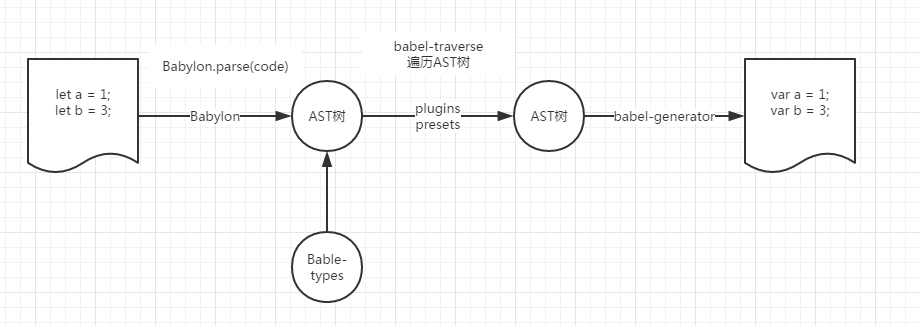
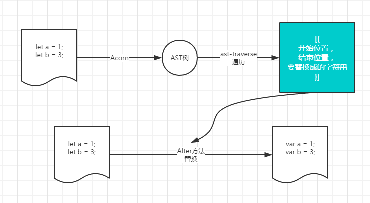
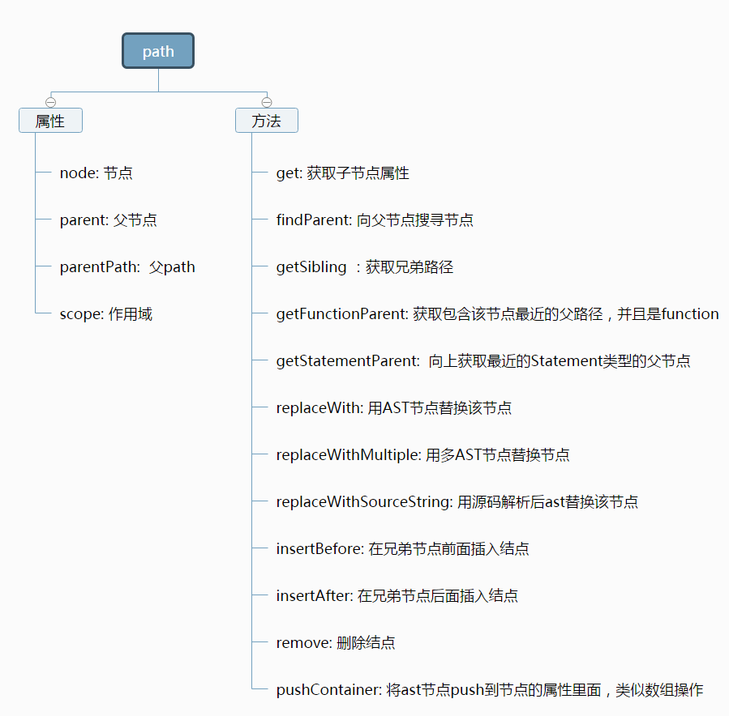

# babel

## 参考
- [babel-plugins-repository](https://github.com/babel/minify.git)
- [babel-handbook](https://github.com/jamiebuilds/babel-handbook/blob/master/translations/zh-Hans/plugin-handbook.md)
- [ast-tree字段参考](https://github.com/babel/babylon/blob/master/ast/spec.md)
- [alloyTeam出的babel总览](http://www.alloyteam.com/2017/04/analysis-of-babel-babel-overview/)
- https://github.com/babel/minify/packages/...

## 目录
<details>
<summary>展开更多</summary>

* [`babel起源`](#起源)
* [`babel流程`](#流程)
* [`babel组成`](#组成)
* [`acorn相关`](#acorn相关)
* [`babel6相关`](#babel6相关)
* [`babel7相关`](#babel7相关)
* [`babel-plugin学习`](#babel-plugin学习)
* [`babel-macro`](#babel-macro)
* [`babel-register`](#babel-register)

</details>

## 起源
* babel使用的引擎是babylon
* babylon是fork的acorn项目，
* acorn只提供基本的解析ast的能力，遍历还需要配套的acorn-travesal, 替换节点需要使用acorn-
* babel做了统一

---

## 流程


babel.transform(code, options) -> babel.traverse(ast, hooks) -> babel.generate(ast)

---

## 组成
* @babel/core：AST转换的核心
* @babel/cli：打包工具
* @babel/plugin*：Babel 插件机制，Babel基础功能不满足的时候,手动添加些
* @babel/preset-env：把许多 @babel/plugin 综合了下，减少配置
* @babel/polyfill：把浏览器某些不支持API，兼容性代码全部导入到项目,不管你是不是用到,缺点是代码体积特别大
* @babel/runtime：把你使用到的浏览器某些不支持API，按需导入,代码少

---

## acorn相关

### acorn流程



acorn.parse(code) -> ast-traverse(ast) -> alter(code, replacers)

### acorn VS babylon VS babel
[对比](./acorn.js)

---

## babel6相关

### babel.transform(code, opts)

1. babel-core/lib/api/node.js
```js
exports.transform = pipeline.transform.bind(pipeline);
```
2. babel-core/lib/transformation/pipeline.js
```js
Pipeline.prototype.transform = function transform(code, opts) {
  var file = new _file2.default(opts, this);
  return file.wrap(code, function () {
    file.addCode(code);
    file.parseCode(code);
    return file.transform();
  });
};
```
3. babel-core/lib/transformation/file/index.js
```js
function File(opts) {
  // 额外参数处理，plugins处理见[4]
  this.initOptions(opts);
  // ...
  this.buildPluginsForOptions(opts);
  // ...
  opts.presets.forEach((preset) => {
    this.buildPluginsForOptions(preset);
  });
};

File.prototype.buildPluginsForOptions = function buildPluginsForOptions(opts) {
  // ...
  var currentPluginPasses = [];
  opts.plugins.forEach((plugin) => {
    // ...
    // 这里相当于把所有plugins的处理（比如pre、post、visitor）归到临时队列
    // presets里的也是plugins，同样处理归到临时队列
    currentPluginPasses.push(pluginMainResolver.bind(this, pluginOptions));
  });
  // 临时队列push到plugins队列
  this.pluginPasses.push(currentPluginPasses);
};

File.prototype.addCode = function addCode(code) {
  code = (code || "") + "";
  code = this.parseInputSourceMap(code);
  this.code = code;
};

File.prototype.parseCode = function parseCode() {
  // this.parseShebang会把首行的#!xxxx提取出来，用于系统bash执行
  // 比如#!/bin/sh
  this.parseShebang();
  var ast = this.parse(this.code);
  this.addAst(ast);
};

File.prototype.parse = function parse(code) {
  // ...
  var ast = require("babylon").parse(code, this.opts.parserOpts || this.parserOpts);
  return ast;
};

File.prototype.transform = function transform() {
  for (var i = 0; i < this.pluginPasses.length; i++) {
    var pluginPasses = this.pluginPasses[i];
    // 提取所有plugins里的pre，依次触发
    // pre里的this指向当前plugin，第一个入参file指向当前transform的文件
    this.call("pre", pluginPasses);
    this.log.debug("Start transform traverse");

    var visitor = _babelTraverse2.default.visitors.merge(this.pluginVisitors[i], pluginPasses, this.opts.wrapPluginVisitorMethod);
    (0, _babelTraverse2.default)(this.ast, visitor, this.scope);

    this.log.debug("End transform traverse");
    // 提取所有plugins里的post，依次触发
    // post里的this指向当前plugin，第一个入参file指向当前transform的文件
    this.call("post", pluginPasses);
  }

  return this.generate();
};
```
4. babel-core/lib/transformation/file/options/option-manager.js
```js
OptionManager.normalisePlugins = function normalisePlugins(loc, dirname, plugins) {
  return plugins.map(function (val, i) {
    var plugin = void 0,
        options = void 0;

    if (!val) {
      throw new TypeError("Falsy value found in plugins");
    }

    if (Array.isArray(val)) {
      plugin = val[0];
      options = val[1];
    } else {
      plugin = val;
    }

    var alias = typeof plugin === "string" ? plugin : loc + "$" + i;
    // ...

    plugin = OptionManager.normalisePlugin(plugin, loc, i, alias);

    return [plugin, options];
  });
};

OptionManager.normalisePlugin = function normalisePlugin(plugin, loc, i, alias) {
  // ...
  plugin = OptionManager.memoisePluginContainer(plugin, loc, i, alias);
  // ...
};

OptionManager.memoisePluginContainer = function memoisePluginContainer(fn, loc, i, alias) {
  // ...
  if (typeof fn === "function") {
    // 这里的context拿的是babel-core/lib/api/node.js，所有返回值
    // context.type属性拿的是babel-types返回值
    obj = fn(context);
  }
  // ...
};
```

### babelTraverse(parent, opts, scope, state, parentPath)
1. babel-traverse/lib/index.js
```js
function traverse(parent, opts, scope, state, parentPath) {
  if (!parent) return;
  if (!opts) opts = {};

  if (!opts.noScope && !scope) {
    if (parent.type !== "Program" && parent.type !== "File") {
      throw new Error(messages.get("traverseNeedsParent", parent.type));
    }
  }

  visitors.explode(opts);

  traverse.node(parent, opts, scope, state, parentPath);
}

traverse.node = function (node, opts, scope, state, parentPath, skipKeys) {
  // ...
  const keys = t.VISITOR_KEYS[node.type];
  const context = new context2.default(scope, opts, state, parentPath);
  // ...
  keys.forEach((node, key) => {
    // ...
    // context见3
    if (context.visit(node, key)) return;
  });
};
```
2. babel-traverse/lib/visitors.js
```js
function explode(visitor) {
  // 1. hook名做split("|")，分别赋值原fns
  // 例：'Identifier|BinaryExpression': (path) { ... }
  // 转换成
  // Identifier(path) { ... }
  // BinaryExpression(path) { ... }

  // 2. 校验visitor类型、key是否该ignore，或是否在babel-types.TYPES里

  // 3. hook如果是function，转成 hookName: { enter: hookFn }

  // 4. 如果hook有enter或exit，但不是数组，转成 visitor[hookName].enter = [visitor[hookName].enter]

  // 5. 如果hookName属于virtualTypes（babel-traverse/lib/path/lib/virtual-types.js），将
  // virtualTypes[hookName]加入virtualTypes[hookName].types的hook处理队列中

  // 6. deprecratedKey检查
};
```
3. babel-traverse/lib/path/context.js
// hook的入参，比如path，state都会定义在这里
```js
function visit() {
  // ...各种黑名单、标记检测
  if (this.call("enter") || this.shouldSkip) {
    return this.shouldStop;
  }
  // ...
  _index2.default.node(this.node, this.opts, this.scope, this.state, this, this.skipKeys);
  this.call("exit");
  return this.shouldStop;
}

function call(key) {
  // ...找到hook
  const fn = this.opts[key];
  // ...
  if (this.shouldStop || this.shouldSkip || this.removed) return true;
  // ...hook的参数path就是context实例，参数state和this都指向实例的state
  return fn.call(this.state, this, this.state);
}
```
4. babel-types/lib/definitions/core.js和babel-types/lib/definitions/flow.js
hook都可以在这两个文件里查
5. @babel/core/node_modules/@babel/types/lib/index.d.ts
和 @babel/core/node_modules/@babel/types/lib/index.js
types可以在这两个文件里查

---

## babel7相关

### 文件<->方法变更
1. @babel/core（babel6的babel-core）
  * traverse（babel6的babel-traverse）
  * transform
  * transformSync
  * transformAsync
2. @babel/generator（babel6的babel-generator）
  * default
3. @babel/parser（babel6的babylon）
  * parse

### options
[参考](https://babeljs.io/docs/en/options)

#### 常用key
* ast：是否生成ast，默认false，返回null
* code：是否生成code，默认true
* envName：环境变量，默认process.env.BABEL_ENV || process.env.NODE_ENV || "development"
* sourceMap：
* babelrc：默认true
* configFile：默认path.resolve(opts.root, "babel.config.js")

---

## babel-plugin学习
这里记录下自己学习babel-plugin时碰到的各种情况

### 包含
- babel-preset-xxx
- babel-plugin-xxx

#### 区别-解析顺序
preset：倒序
plugin：正序

```js
{
  // ...
  
  // react -> es2015 -> ...
  preset: ['es2015', 'react'],

  // transform-react -> transfrom-async-function -> ...
  plugins: ['transform-react', 'transfrom-async-function'],
  // ...
}
```

### 常用方法

**babel.template**

```js
const template = require('@babel/template').default;
{
  // ...
  path.node.body.unshift(template(`var bb = require('./test');`)());
  // ...
}
 template
```

### hooks入参
1. path
2. types
3. options

### path
path是所有plugin-hook的第一个入参

#### 结构

**path**

- node
  * 表示当前ast节点的主体信息
  * 结构：
  ```js
  interface BaseNode {
    leadingComments: ReadonlyArray<Comment> | null;
    innerComments: ReadonlyArray<Comment> | null;
    trailingComments: ReadonlyArray<Comment> | null;
    start: number | null;
    end: number | null;
    loc: SourceLocation | null;
    type: Node["type"];
  }
  ```
  * 以上是基础字段，不同hook的path.node会有自己的扩展，
  不过都继承于此
- scope
  * 当前词法作用域
  * 结构：
  ```js
  {
    path: path,
    block: path.node,
    parentBlock: path.parent,
    parent: parentScope,
    bindings: [...],  // 列出当前作用域绑定的变量，用Object.keys看起来较方便
  }
  ```
- type
  * 词法类型

#### path常用方法
参考@babel/core/node_modules/@babel/traverse/lib/path/**.js

或参考



#### 用法
- path.get(key)
- path.isXXXX() or path.get(key).isXXXX()
- path.replaceWith(types.valueToNode(/**/))
- path.remove()
- path.insertAfter(nodes)
- path.parentPath.remove()
- path.get('body').unshiftContainer('body', types.expressionStatement(t.stringLiteral('before')))
- path.replaceWithSourceString：这个方法少用，会调用babylon.parse解析代码，应该在遍历外解析

### 常用词法类型hook

#### CallExpression
**作用**

捕获(对象)方法的调用

**参考**

[CallExpression](https://babeljs.io/docs/en/next/babel-types.html#callexpression)

**示例**
```js
aa();
aa.bb();
```

**常用字段**

* callee
  - 调用的方法名
  - path.get('callee').node.name
* arguments
  - 方法入参
  - ```js
    // 基本类型
    path.get('arguments').map(arg => arg.node.value)
    ```
  - ```js
    // 引用类型
    path.get('arguments').map(arg => arg.node.properties)
    ```

#### VariableDeclarator
**作用**

捕获赋值操作

**参考**

[VariableDeclarator](https://babeljs.io/docs/en/next/babel-types.html#variabledeclarator)

**示例**

```js
var _require = require('./test'),
  aaaa = _require.isPlainObject;

var test = require('./test');
```

**常用字段**

* init
  - 赋值语块
  - ```js
    path.get('init').get('callee')
    path.get('init').get('object')
    path.get('init').get('arguments')
    path.get('init').get('property')
    ```

#### ImportDeclaration
**作用**

捕获`import sth from url`

**参考**

[importdeclaration](https://babeljs.io/docs/en/next/babel-types.html#importdeclaration)

**示例**

```js
import { isPlainObject, isAa } from './test';
```

**常用字段**

* source
  - 引用路径
  - ```js
    path.get('source').node.value
    ```
* specifiers
  - 静态引入的变量(方法)名
  - ```js
    path.get('specifiers').map(specifier => 
      specifier.get('imported').node.name
    )
    ```

#### MemberExpression
**作用**

捕获短语取值和调用的方法名

**参考**

[memberexpression](https://babeljs.io/docs/en/next/babel-types.html#Memberexpression)

**示例**

```js
_require.isPlainObject

test.isPlainObject({})
```

**常用字段**

* object
  - 短语前置语
  - 比如上面的_require、test
* property
  - 短语后置语
  - 比如上面的isPlainObject

#### ExportNamedDeclaration
**作用**

捕获`export const xxx = xxx`

**参考**

[exportnameddeclaration](https://babeljs.io/docs/en/next/babel-types.html#exportnameddeclaration)

**示例**

```js
export const isPlainObject = function isPlainObject() {
  console.log(1);
};

export {
  v1,
  v1 as streamV1,
  v2 as streamV2,
};
```

**常用字段**

* declaration
  - 对应具体的export声明
  - ```js
    path.get('declaration').get('declarations').map(
      declare => declare.get('id').node.name
    )
    ```
* specifiers
  - 对应export结构体、重命名as
  - ```js
    path.node.specifiers.forEach((specifier) => {
      const key = specifier.local.name;
      const alias = specifier.exported.name;
    });
    ```  

#### FunctionDeclaration
**作用**

捕获函数声明

**参考**

[FunctionDeclaration](https://babeljs.io/docs/en/next/babel-types.html#functiondeclaration)

**示例**

```js
function test() {
  // ...
}
```

**常用字段**
* type
* id
  - 函数名
  - path.get('id').node.name

#### ImportSpecifier/ImportDefaultSpecifier/importNamespaceSpecifier
**作用**

捕获ImportDeclaration里的变量

**参考**

https://babeljs.io/docs/en/next/babel-types.html#importspecifier

**示例**

```js
// ImportDefaultSpecifier，捕获aa
import aa from '...';

// 捕获{ bb }
import { bb } from '...';

// 捕获{ cc as c }
import { cc as c } from '...';

// 捕获空
import './base';

// 捕获两种：
// 1. ImportDefaultSpecifier，捕获lodash2；
// 2. ImportSpecifier，捕获arrayEachRight
import lodash2, { arrayEachRight } from './base';

// ImportDefaultSpecifier，捕获base
import * as base from './base';
```

**常用字段**

* type
* source
  - 引用模块的路径相关信息
  - path.get('source').node.value
* specifiers
  - 引用模块的变量名或替换名信息
  - path.get('specifiers')
  - local
    + 引用模块里的变量名的替换名
    + path.get('specifiers').node.name
    + type=ImportDefaultSpecifier时，表示模块的默认输出
    + 比如例子中的aa,bb,c
  - imported
    + 引用模块的变量名
    + path.get('imported').node.name
    + type=ImportSpecifier时，才有
    + 比如例子中的bb,cc（aa没有，因为是ImportDefaultSpecifier，默认输出）

#### ForInStatement
**作用**
**参考**
**示例**
**常用字段**

* left
* right

### types
即babel-types，提供工具很多方法

### options
注入plugins是添加的参数，比如
```js
const { transformSync } = require('@babel/core');
transformSync(input, {
  /* 其他配置参数 */
  plugins: [
    ['./src/babel/babel-plugin-inline-env',
      /**
       * 这第二个参数就是options
       */
      {
        include: ['NODE_ENV'],
      }
    ],
  ],
});
```

---

## babel-macro
编译阶段预处理js逻辑（目前babel6支持使用）

- [git](https://github.com/kentcdodds/babel-plugin-macros)
- [参考](./babel-plugin-macro.js)

**注**
仅针对静态编译的内容

### 使用方法
1. 安装macros
```js
npm install --save-dev babel-plugin-macros

// 如果需要其他.macros，需要手动安装
// .macros可以参考[awesome-babel-macros](https://github.com/jgierer12/awesome-babel-macros)
npm install --save-dev ms.macro
```
2. 配置使用macros
```js
const { ast } = require('babel-core').transform(input, {
  // ...
  plugins: [
    // ...
    'macros',
  ],
});
```
3. 代码使用
```js
import ms from 'ms.macro';

const ONE_DAY = ms('1 day');
```
4. 编译后输出的内容
```js
var ONE_DAY = 86400000;
```

### 如何在babel7使用
- options新增参数`filename: 'unknown'`
  ```js
  const { transformSync } = require('@babel/core');
  const { ast } = transformSync(input, {
    // ...
    filename: 'unknown',
    plugins: [
      'macros',
    ],
  });
  ```
- @babel/template/lib/populate.js去掉metaData校验
  ```js
  function populatePlaceholders(metadata, replacements) {
    // ...
    // 这里循环校验去掉
    Object.keys(replacements).forEach(key => {
      if (!metadata.placeholderNames.has(key)) {
        throw new Error(`Unknown substitution "${key}" given`);
      }
    });
    // ...
  }
  ```

---

## babel-register


