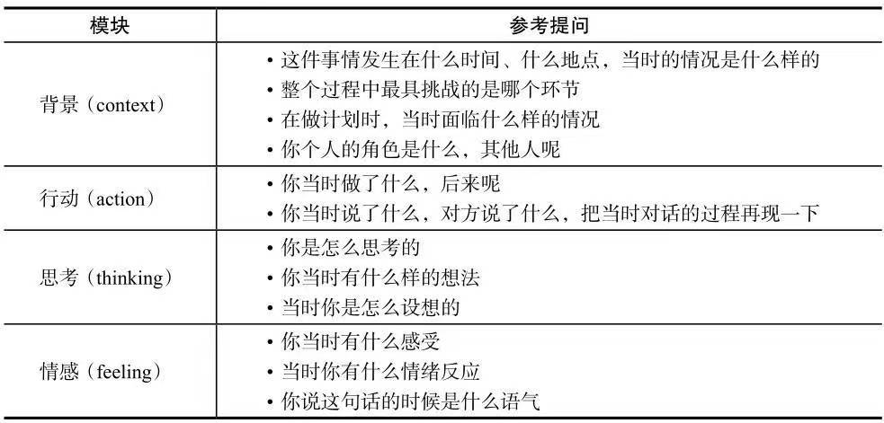

# 人才盘点

## 人才体系运作四要素

- 清晰的业务策略
- 开放的组织文化
- 高层的投入&承诺
- 人力资源的整合

投资回报率=净利润率×资产周转率
净利润率=净收入÷销售收入
资产周转率=销售收入÷资产

组织结构服从于商业战略

### 如何识别高潜人才

- 潜力因子：思维敏锐度、人际敏锐度、内部驱动力
- 合作性
- 敬业度

---

## 如何成为领导者

- 成就动机（亲力亲为）
- 权利动机（沉迷吹捧）
- 亲和动机（任人唯亲）

中层领导者：**具备**以上三种特质

高层领导者：**驾驭**成就、权利动机，低亲和动机

**具备vs驾驭**

驾驭能保证不偏向任何一方

### 道德

- 前世俗阶段：未达目的不择手段（只要不被发现就行）
- 世俗阶段：在法律&道德边缘游走，灰色地带
- 后世俗阶段：对于道德和正义有自己的理解

### 思维

- 分析思维：从不同维度思考问题（因果推断，以终为始）
- 归纳（概念）思维：能用人话把自己熟知的内容解释给外行人听
- 战略思维

#### 战略思维
​    1.由外而内的思考
​    2.知己知彼
​    3.目标-手段
​    4.顺势而为

### 人际能力
​    1.情绪自控，情绪对他人的影响
​    2.对他人处境的同理心
​    3.同理心:他人行为的动机，人格特质，价值观
​    4.时刻修正对他人的评价

### 成为领导者
​    1.自知（情绪，人格，价值观）
​    2.承担责任
​    3.对于未知是否乐观
​    4.总结失败

### 领导力模型
​    1.通用领导力
​    2.个性化价值观
​    3.通用管理技能

#### 通用管理技能
​    1.绩效
​    2.责任
​    3.标准化
​    4.时间
​    5.对标领先
​    6.成本
​    7.数据化

#### 通用领导力
​    1.管理个人30%: 深入反思，会学习
​    2.管理业务40%: 有远见，能平衡长短期目标，能把握机会
​    3.管理团队30%: 能发展他人，处理好人际关系

#### fact

---

## 如何识别人才

#### 动机测试

- 成就
- 权利
- 亲和

#### CPI潜力测试

- 思维潜力
- 人际潜力
- 成就动力

#### 领导风格

- 指令型
- 领跑型
- 亲和型
- 民主型
- 愿景型
- 教练型

---

## 如何盘点人才

### 人才盘点本质

​    1.业务负责人主推，hr提供支持
​    2.以公司利益为核心
​    3.需结合实际可投入资源（薪资）做针对性培养

### 如何做人才评估

1. 能力评价
2. 业绩评价
3. 潜力评价，个人发展计划

是否总是寻求挑战性工作？（成就动机）
●是否能快速胜任新岗位或者任务要求？（学习能力）
●是否总是有新点子，并主动分享？是否积极推动想法实现？（学习能力）
●是否能够一针见血地看透问题本质？（跨界思维）
●是否经常跳出画面看画、前瞻思考规划？（跨界思维）
●是否能够很好地控制自己的情绪？（人际影响）
●是否总能在工作中找到双赢的解决方法？（人际影响）

4. 优势项，待发展项
5. 离职风险
6. 对业务的影响，能否内部活水

---

## 如何培养继任者

### 管理者几个阶段

#### 1. 新任期（12个月）

- 价值观转变
- 人际关系培养

#### 2. 在岗期

- 做出成绩
- 具备当前的领导力素质

#### 3. 提升期

- 为下一阶段做准备

### 如何帮助人才成长

​    1.轮岗，做横向能力的培养
​    2.反馈，1.鼓励做的好的 2.提出效率更好的工作方式 3.用积极的语言 4.帮助提升绩效

### 轮岗关键点

->挑战 -> 支持 -> 评估->  （循环）

**挑战**：新领域、逆境

**支持**：解惑、互助

**评估**：各种外部数据、反馈

**关键点：鼓励冒险，允许犯错**

### 如何给他人反馈

- 用积极的言辞反馈
- 强化、鼓励有效的工作方式
- 针对问题指出更优解
- 确保已制定了合适的标准
- 和绩效挂钩

#### 发展型反馈

- 如何看待职业生涯
- 最大成就是什么
- 最大挑战
- 如何解决业务问题，完整流程

### 人才辅导

#### 1. 前期准备

- 人选的个人意愿
- 确认和发展目标间的差距

#### 2. 技能&绩效讨论

- 制定行动计划
- 激发人选意愿去弥补短板

#### 3. 持续跟进

- 定期检查进度

#### 个人素质冰山模型

> 依次深入

- 技能
- 知识
- 社会角色/价值观
- 自我意识
- 个性
- 动机

#### 70-20-10成长规律

**70**：来源实践

**20**：来源观察他人

**10**：来源培训

---

