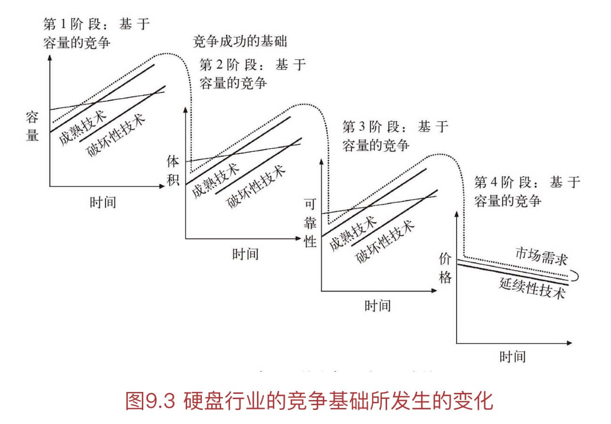

# 创新者的窘境

## 为什么龙头企业没有破坏性创新？

1. 产品线成熟，每条产品线的价值网络（利润率、客户量）是确定的，所以会偏向成熟产品的延续性创新
2. 上下游关系决定，下游缺少创新需求，上游缺少相应原材料供给

## 为什么新兴企业容易有破坏性创新？

- 该破坏性创新，可能在龙头企业内已研制成功，但是未推广
- 成熟的价值网络已被龙头企业霸占，不得不寻求新客户

## 创新成功需要什么？

- 资源
- 价值观和工作流程

## 用户关注点的变化

> 持续转移到尚未满足需求的属性上，因此竞争点也会随着时间推移而改变。
>
> 当产品特色和功能超出市场需求时，差异化也就失去了意义。

依次集中在几点：

1. 功能性
2. 可靠性
3. 便捷性
4. 价格

## 性能过度供给

简言之，提供的功能（从专业度、可用性等角度），远超市场主流所需，难免会给人以晦涩难用。