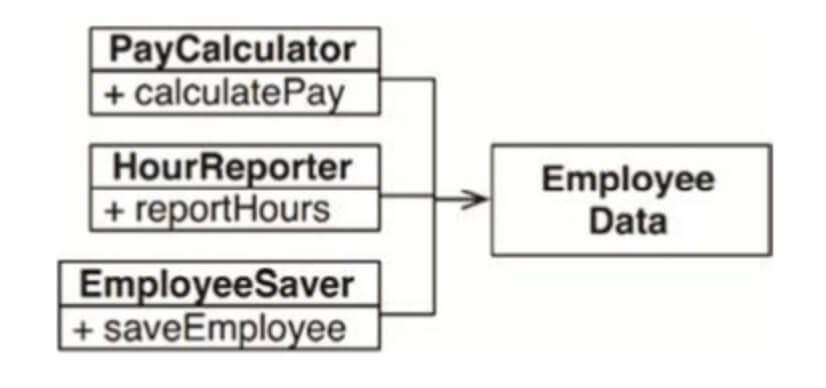
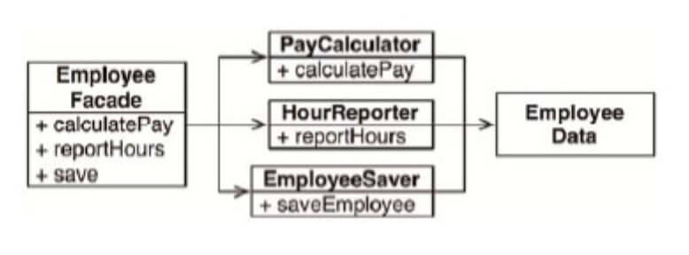
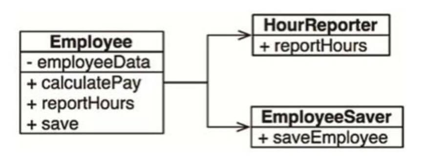
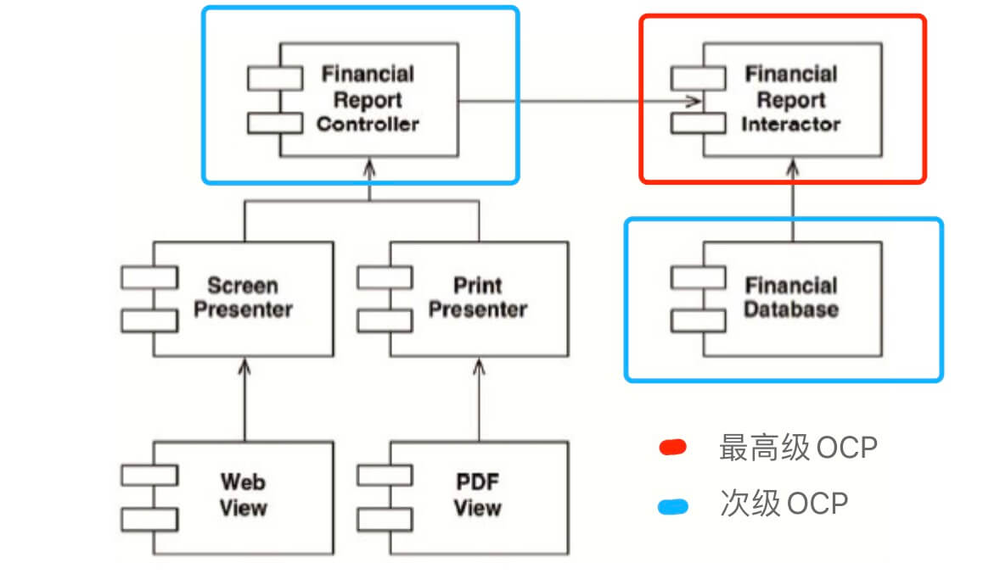
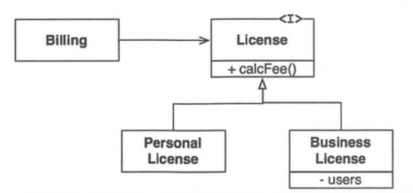
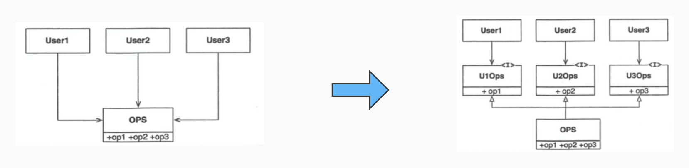
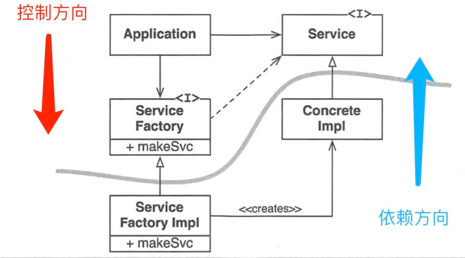

# 架构简介之道

## 目录

<details>
<summary>展开更多</summary>


* [`SRP 单一职责`](#SRP 单一职责)
* [`OCP 开闭原则`](#OCP 开闭原则)
* [`LSP 里式替换`](#LSP 里式替换)
* [`ISP 接口隔离`](#ISP 接口隔离)
* [`DIP 依赖反转`](#DIP 依赖反转)
* [`组件`](#组件)

</details>

## SRP 单一职责
> 模块只对某一类行为负责，参考react-hook

```js
import React, { useState } from 'react';

// 模块内部可以做很多事，但仅提供有限数据、方法给外部调用
const [count, setCount] = useState(0);

// 外部利用有限内容做自适应扩展
const add5 = () => setCount(count + 5);
const add10 = () => setCount(count + 10);
```

### 基础使用




### 加了胶水层



### 拆分具体行为



---

## OCP 开闭原则

> 高抽象程度 -> 易于扩展，拒绝修改，参考el-table -> smart-table -> easy-tablev2

- OCP是相对的、有层级的
- 次级OCP依赖高级OCP
- 高级OCP隐藏内部信息



---

## LSP 里式替换

> 就是继承，将条件判断拆分为多个同父的子类方法/对象，参考vueInstance.validate()



---

## ISP 接口隔离

> 精细化依赖解耦，参考SPA按页面级拆分构建，以微服务方式引入？



---

## DIP 依赖反转

> 功能衍生，更多应该基于抽象类创建实现类，
>
> 从而避免在调用时，写死容易变动代码（方法名、对象）



---

## 组件

### 组件聚合

- REP 发布/复用等同原则
- CCP 共同闭包原则
- CRP 共同复用原则

#### REP 发布/复用等同原则
> 复用的最小粒度是发布的最小粒度


