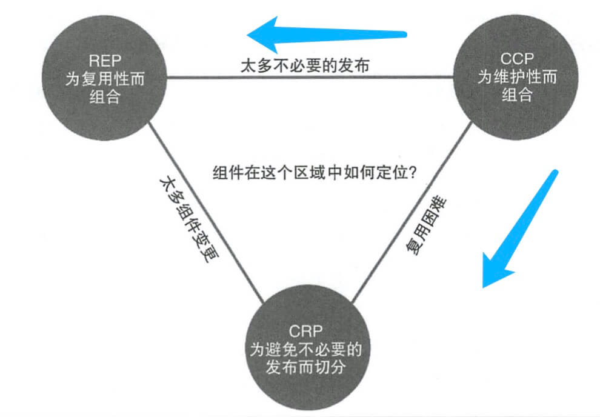
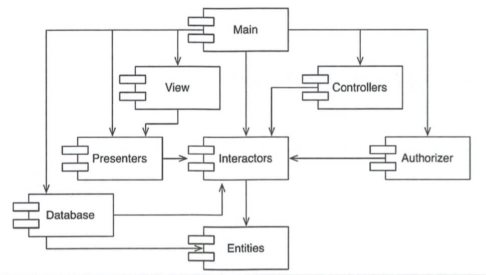
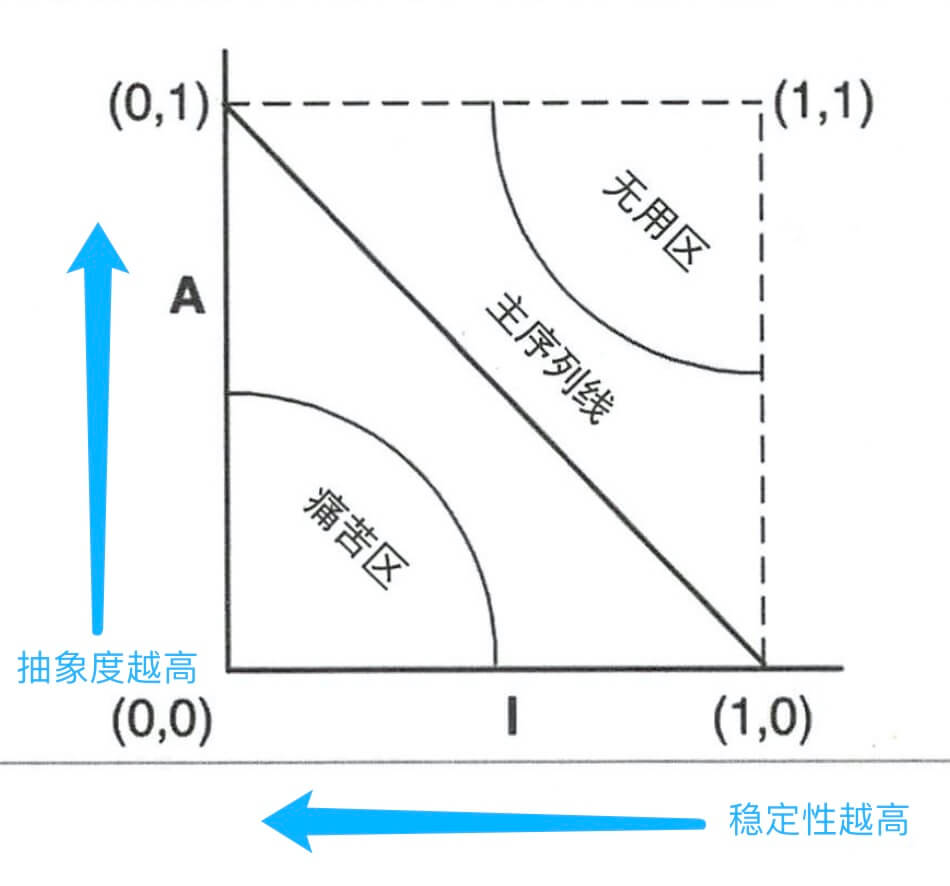
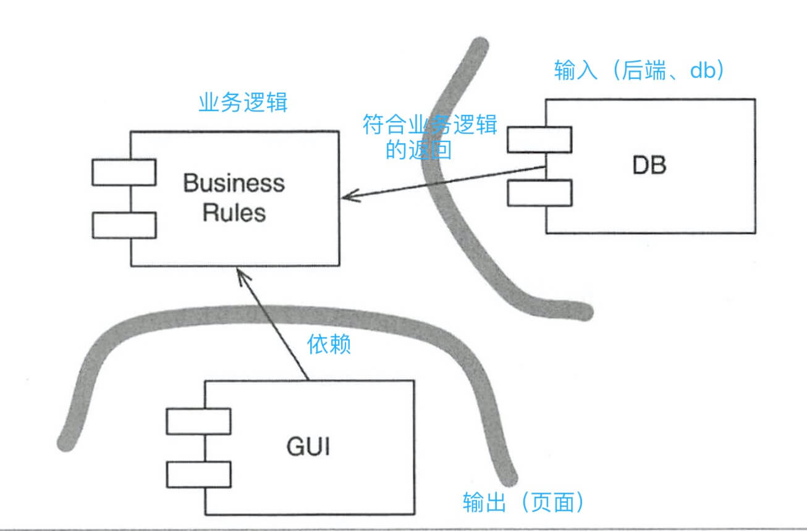
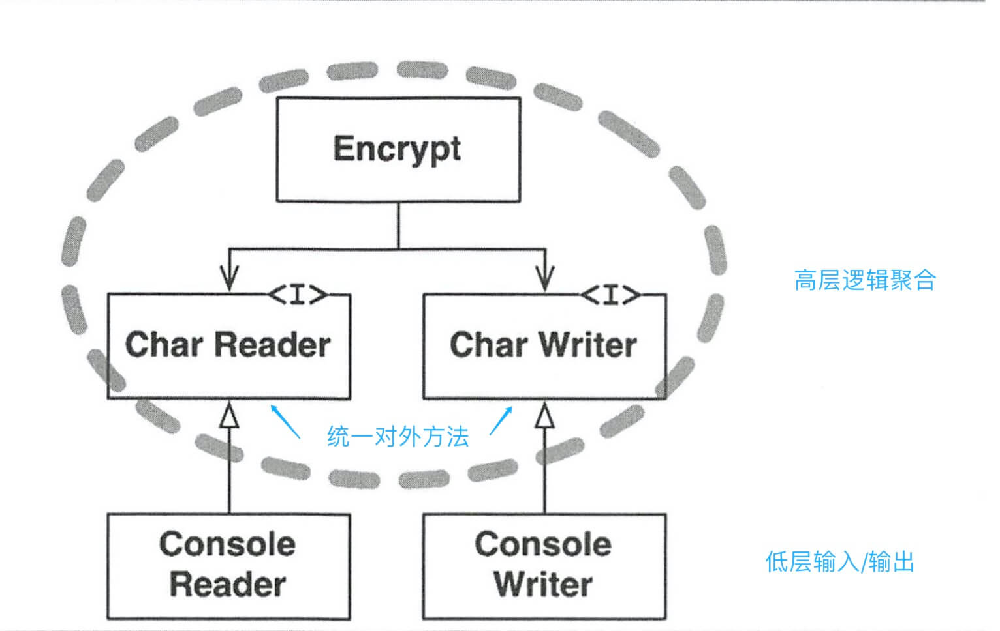
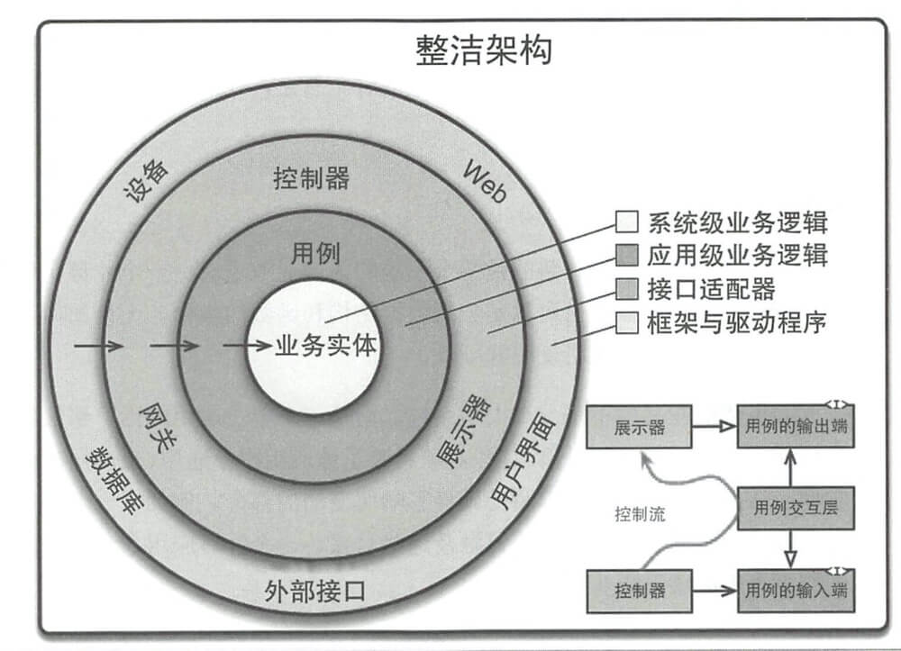
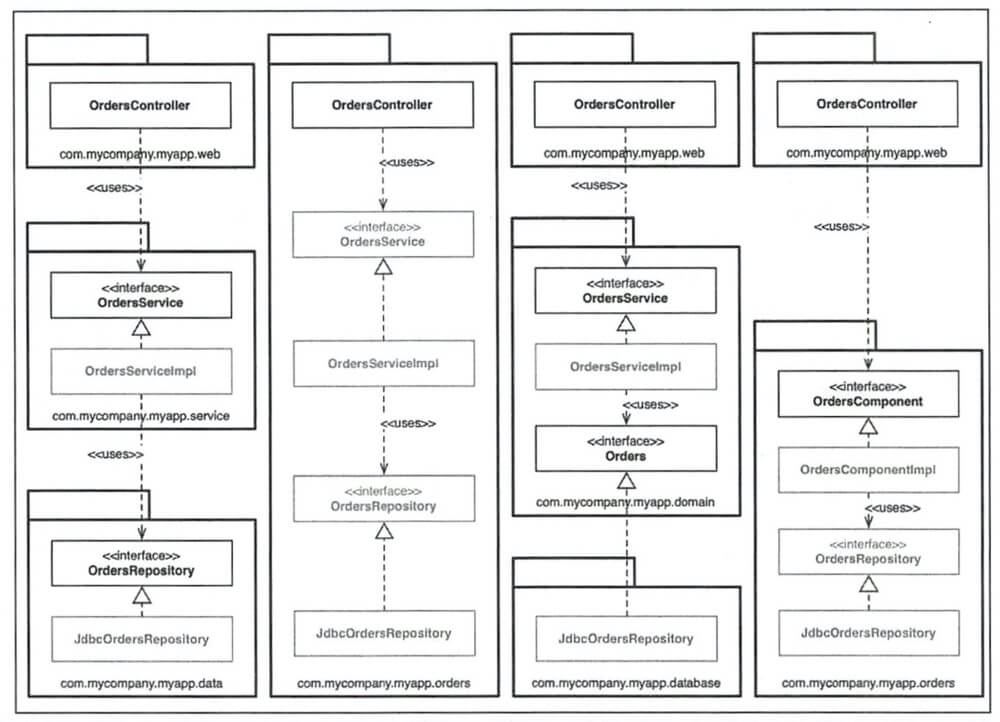

# 架构简介之道

[TOC]

## SRP 单一职责
> 模块只对某一类行为负责，参考react-hook

```js
import React, { useState } from 'react';

// 模块内部可以做很多事，但仅提供有限数据、方法给外部调用
const [count, setCount] = useState(0);

// 外部利用有限内容做自适应扩展
const add5 = () => setCount(count + 5);
const add10 = () => setCount(count + 10);
```

### 基础使用


### 加了胶水层


### 拆分具体行为


---

## OCP 开闭原则

> 高抽象程度 -> 易于扩展，拒绝修改，参考el-table -> smart-table -> easy-tablev2

- OCP是相对的、有层级的
- 次级OCP依赖高级OCP
- 高级OCP隐藏内部信息


---

## LSP 里式替换

> 就是继承，将条件判断拆分为多个同父的子类方法/对象，参考vueInstance.validate()


---

## ISP 接口隔离

> 精细化依赖解耦，参考SPA按页面级拆分构建，以微服务方式引入？


---

## DIP 依赖反转

> - 功能衍生，更多应该基于抽象类创建实现类
>- 避免在调用时，写死容易变动代码（方法名、对象）

如图，Application 调用抽象类 Service Factory，但执行的是实现类 Service Factory Impl，当然也可以是别的实现类，不过和 Application 无关。


---

## 组件

### 组件聚合



- REP 发布/复用等同原则
- CCP 共同闭包原则
- CRP 共同复用原则


#### REP 发布/复用等同原则
> 复用的最小粒度是发布的最小粒度 -> 微服务
>
> 组件中的类和模块是相互耦合的


#### CCP 共同闭包原则

> 一个组件不应该存在多个变更的原因（可尝试将组件拆成多个，使某类改动集中在一个组件）
>
> SRP的组件版


#### CRP 共同复用原则

> 组件中不应依赖不需要的东西
>
> ISP的普适版

---

### 组件耦合

#### ADP 无依赖环原则

> 模块间不存在循环依赖，而应非常明确，可反向追溯。




### SDP 稳定依赖原则

> 依赖关系必须不断指向更稳定（抽象）的方向。
>
> 如果依赖方不稳定，可以尝试将依赖部分解耦。

### SAP 稳定抽象原则

> 抽象程度和稳定程度呈正比。
>
> 如下图，主序列线为符合该原则的最佳模块设计。



---

## 软件架构

> 1. 自上而下思考：优先制定高层策略，而后再考虑具体实现，要明确两者间的边界
> 2. 推迟实现的决策：充分调研后，选择合适的技术方案

### 按层解耦

> **水平分层**：UI、业务独有逻辑、领域通用逻辑等
>
> **单元分层**：源码分层 --> 代码解耦、部署分层 --> 模块解耦 + 通信协议、服务分层 --> 微服务

### 边界划分

> **插件式架构**：保证各附属模块的可替换性




### 层次

> 高层组件不应含有任何低层逻辑，即低层都是高层的插件。




### 架构设计

> 架构设计应面向具体业务，和框架无关，框架只是一个“可选项”的工具。
>
> **可测试的**架构设计：和UI、接口无关，只测业务逻辑。




**【注】外层依赖内层，内层控制外层**


#### 业务实体

> 最为通用的业务逻辑（utils、common）

#### 用例

> 特定的业务逻辑（module/pageA/helper），依赖业务实体

#### 适配层

> router、store、request，依赖用例

#### 框架&页面

> Vue/react、lodash/echart/...、module/pageA，依赖适配层

#### 其他

>  视具体情况


### 谦卑对象模式

> 拆分**可测试内容**和**难测试内容**（专为单元测试服务）。
>
> 简化至极的难测试的内容统称为**谦卑对象**。


### 不完全边界

> 模块间交互可以用任意设计模式关联（门户、策略模式等，视情况而定），因此边界并不完全固定。

### main.ts

> 一种另类的插件，例如可以根据不同的运行环境，准备多个main.ts，分多个 entry 打包，引用对应所需的资源进行初始化。

### 测试边界

> 不要依赖于多变的东西。
>
> 比如UI改动往往会导致大量测试case失败，因此针对UI的测试是脆弱的。
>
> 必须将其和业务逻辑剥离，已达到部分可测试性。

---

## 实现细节

> 以下这些应不在初期考虑范畴，保证其可扩展。

- 数据存储（mysql、oracle等）
- 平台（web、GUI等）
- 框架（vue、react等）


### 四种代码结构



#### 1. 按层

> 经典的 JAVA mvc 模式，缺点是其实不止3层。


#### 2. 按功能

> 经典的领域驱动划分，围绕聚合根做扩展，优点是相关代码都聚合在一起，适合独立部署，缺点是视图 + 业务逻辑耦合。


#### 3. 按业务相关性

> 内 + 外分层
>
> 外部代码：UI、数据库、第三方库等对业务无感知的部分，仅依赖内部代码
>
> 内部代码：所有业务领域概念，仅被外部代码依赖


#### 4. 按组件

> 微（前端）服务架构，只对外暴露入口文件，所有功能（业务、持久化等）都合并为【组件】。
>
> 优点是使用方只关心入口文件，模块变更都集中在【组件】。

