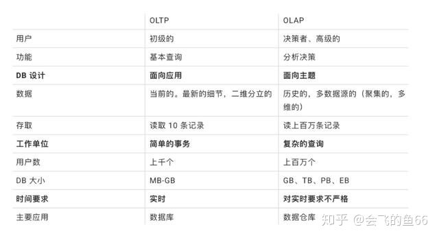
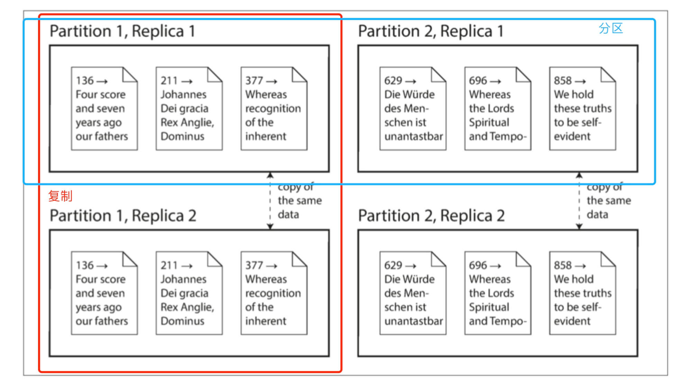
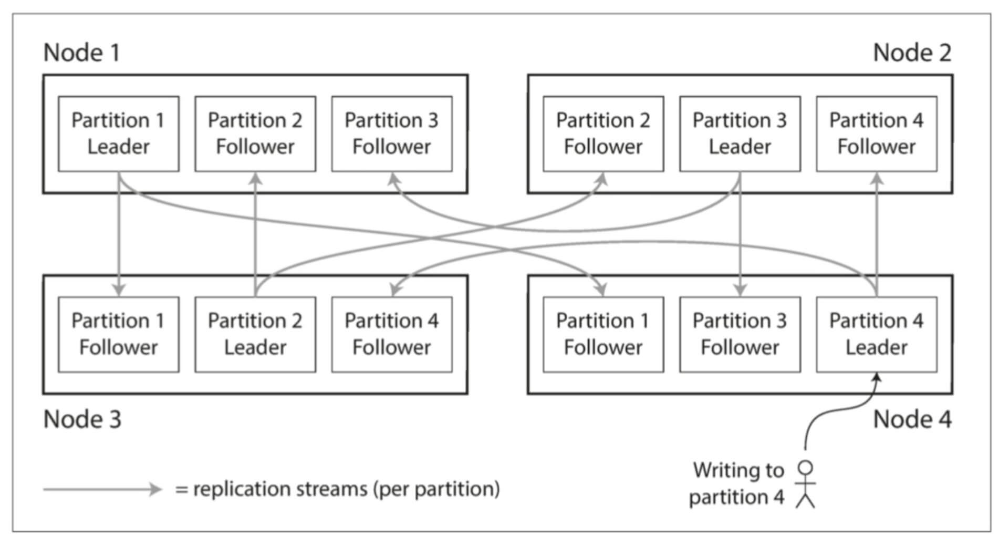
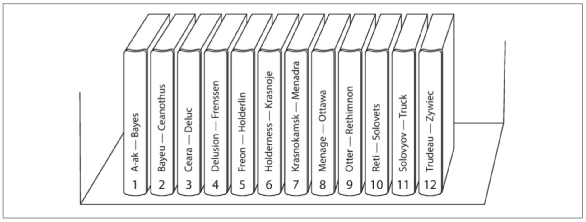
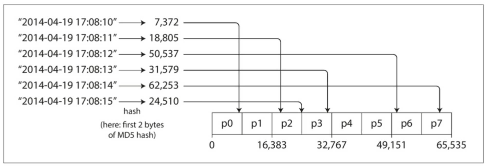
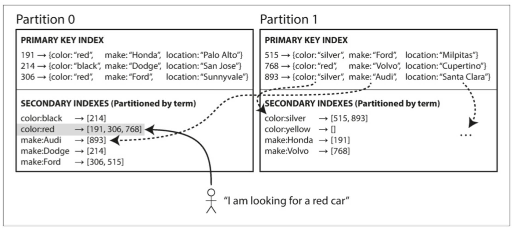
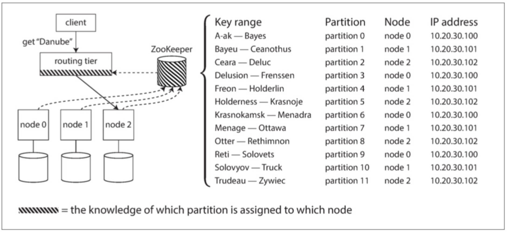

# 设计数据密集型应用


## 基本概念

### 事实表

> 即大宽表，上百列，几十亿条数据，列存储维表id


### 维表

> 和事实表的列对应，几十列，上百万条数据，主要存储维度详情


### 星型模式

> 事实表居中，对应周围维度表


### OLTP和OLAP

> 在线事务处理(**OLTP, OnLine Transaction Processing**)
>
> 在线分析处理(**OLAP, OnLine Analytice Processing**)




### 物化视图

> 1. 查询结果的非规范化副本，写入磁盘，由数据库自动完成
> 2. 会导致数据更新成本更高（原表 + 物化视图）

---

## 分布式

### 1. 复制




**变更复制算法**

- 单领导者
- 多领导者
- 无领导者


#### 1.1 主从关系-单领导者

> 领导者（主库master）仅负责写，写入后，通知从库更新数据
>
> 跟随者（从库slave）仅负责读

**特点：强一致性，弱容灾**


#### 1.2 同步复制vs异步复制

**同步复制**

优点：数据保证强一致性

缺点：一旦从库异常（奔溃、断网），主库将阻止所有写入直至从库恢复


**异步复制**

优点：从库异常，不影响主库写入

缺点：数据弱一致性


**半同步**

> 1个同步复制从库 + n个异步复制从库

优点：

- 至少能保证两个节点（主库、同步从库）拥有最新数据副本
- 如果同步从库异常，会自动使一个异步从库变同步


**全异步**

> 主流做法

优点：即使所有从库落后主库版本，主库都能正常写入


**从库失效**

追赶恢复，通过排查发生故障前最后一个事务，应用后续所有变更直至追上主库


**主库失效**

- 确认失效（定时检测心跳）
- 选举新主库（通常选具有最新副本的从库，减小损失）
- 重新配置以启用新主库（其他从库认同这个“新话事人”，包括失效的主库）


#### 1.3 语句复制vs行复制

- 通常情况，从库直接同步主库的语句（比如Insert、Update等）

- 有些场景会出现不确定写入（比如Now()、rand()、自增索引），数据库会改用行复制


#### 1.4 最终一致性

- **写后读**，用户可修改内容从主库读，其他从从库读
- 检测最晚更新时间，比如1分钟内，主库读，否则从库读
- 多数据中心，任何需要领导者提供的服务，都需经过其所在数据中心
- 多设备多网络环境（wifi、蜂窝）同账号，应该读同数据中心
- **单调读**，保证单个用户都从单个从库读数据，避免“时光倒流”（如果从库异常还是要降级）


#### 1.5 主从关系-多领导者

> 任意领导者接受写入后，同步数据更新给其他领导者，以及跟随者

- 多数据中心，多主库
- 如何处理写入冲突
- 如何保证从库一致性

**特点：弱一致性，强容灾**


**最后写入为准**

优点：每次写入附加时间戳，当并发写入时，最近一次生效，丢弃之前的，保证最终值的一致性

缺点：丢弃的值没有持久化；非并发写入也可能被丢弃


#### 1.6 主从关系-无领导者

> 节点接受任意写入，并支持任意读取

**特点：弱一致性，强容灾**


**版本向量**

> 每个数据库副本的版本号集合

客户端读取和写入，都携带版本向量，数据库可由此判断，是覆盖写入还是并发写入

---

### 2. 分区

> 大型数据库分解成小型数据库的方式


- 一个节点可以含多个分区
- 分区副本可以在多个节点上
- 领导者也可以是跟随者




#### 2.1 键值分区

**值范围分区**

> 比如最简单的按主键分区



**散列分区**

> 为每个分区指定散列范围，对写入数据的key做散列处理，并落到对应分区，最终达到数据的均匀分布（负载均衡）




#### 2.2 次级索引分区

> 将主键作为一级索引，配合另一列，排序后再分区（比如 a-f 放分区1，f-z 放分区2）。




#### 2.3 分区再平衡

> 当新增数据时，需要再平衡

**固定分区**

> 数据库拆为固定数量分区（比如1000），新增节点后，从老节点分别迁移若干分区过来达到平衡


**动态分区**

> 部分数据库支持，根据总数据量，自动设置分区


#### 2.4 服务发现

> 当节点->分区关系变化时，如何及时通知使用侧？
>
> 依赖于一个独立的协调服务（比如zk），协调服务维护节点->分区的映射关系，一旦发生变动，通知所有订阅者。



---

### 3. 事务

> 安全性保证-ACID
>
> - 原子性 - atomic
> - 一致性 - consistency
> - 隔离性 - isolation
> - 持久性 - durability

#### 3.1 原子性

> 精细化写入管理：发生错误时，能终止事务，并丢弃之前的写入。

#### 3.2 一致性

> 一致性不仅取决于数据库本身，建议忽略

#### 3.3 隔离性

> 每次执行的事务都是隔离的、依次执行（实际上会有并发的情况）；
>
> 事务要么能看到全部结果，要么看不到任何结果，中间过程应屏蔽。

#### 3.4 持久性

> 最终写入到硬盘，才算事务提交成功；不存在完美持久性，会有各种灾难，所以持久性是伪命题。

#### 3.5 隔离级别

> **脏读**：一个写入事务，还没提交或终止，其他事务已经能看到提交数据
>
> **脏写**：前后两次事务写入，后面那次写入，会覆盖之前尚未提交的值

**读已提交**

> 大多数据库默认的隔离级别

通过行锁（同时只有一个事务可以持有），防止脏写；

对于写入对象，数据库会同时记住旧值和当前写入的新值，若事务在进行中，则返回旧值，防止脏读；


**快照隔离（可重复读）**

> 比【读已提交】提高一级别，事务都从数据库一致快照读取（每个事务只能看到事务开始时的旧数据），
>
> 所以会出现多个版本的快照。

**读取偏差**：不同时间点看见数据库不同状态

所以问题来了，**索引怎么加？**

1. 索引指向所有版本，但是性能会受影响，因为需要过滤掉当前事务不可见的版本
2. **写时拷贝**，更新时不覆盖原本的B树，而是创建一个副本节点，该节点至树根都会级联更新，类似 [immer](../immer/README.md) 的选择性深拷贝


#### 3.6 防止更新丢失

> 并行事务写入，如果基于旧值做修改，会出现丢失情况。

**原子写**

> 通过排他锁实现，或保证所有原子操作在一个线程（可能吗？）

**显示加锁**

```sql
BEGIN TRANSACTION;
/* 某查询语句 */
SELECT xxx
/* 表示对该查询语句相关行加锁 */
FOR UPDATE;
```


**数据库自动检测丢失的更新**

> 可以通过快照检测隔离，mysql和innodb不支持。


**CAS-比较并设置**

> 实现各异，大致意思参考下面；
>
> 【前提】保证**读取不会从旧快照**读，否则无效。

```sql
UPDATE xx SET content = '新内容' WHERE id = xxx AND content = '旧内容';
```


#### 3.7 冲突解决

- 当数据具有可交换性（随机顺序更新，结果一致）时，合并&保留所有更新操作
- LWW（最后写入为准）也能解决，不过容易丢失更新


#### 3.8 写入偏差&幻读

**写入偏差**

> 多个事务并发更新多个对象，而这些对象的组合会作为事务的限制条件。

如何解决？

- 外键约束，涉及多个对象
- FOR UPDATE


**幻读**

> 一个事务的写入，改变另一个事务的查询结果


#### 3.9 可序列化

> 最强隔离级别，可防止任何并行事务导致的竞争结果，缺点是性能差。

几种方式：

- 真串行执行
- 两阶段锁（2PL）
- 乐观并发控制


**真串行执行**

- 事务运行速度很关键，否则拖慢后续事务
- 仅适合访问内存的场景（硬盘速度太慢）
- 吞吐量默认限制在单核cpu
- 可以用分区破解单核cpu的限制，但是事务的跨分区查询会慢很多

**两阶段锁**

> 典型的悲观锁，允许多事务同时读，但一旦发生写入，阻止其他事务的读写。
>
> 一阶段（事务执行时）：获取锁
>
> 二阶段（事务执行结束）：释放锁

缺点：

- 若出现事务堆积，会有不稳定延时
- 可能出现死锁（事务A等待事务B释放锁）

**乐观vs悲观并发控制**

乐观锁适合并发不多的场景，增大吞吐量（前提容量够）


**可序列化快照隔离（SSI）**

- 一个事务不阻塞另一事务
- 不局限于单核cpu吞吐

---

### 4. 分布式系统的问题

- 丢包
- 时间校准问题
- 故障如何降级

---

### 5. 一致性共识

#### 5.1 线性一致性

> 任何一次读取返回新值后，所有后续读取返回的也是新值，即新鲜度的保证。

表现类似只有一个数据副本，但却非一个，因为要考虑容灾，所以用到上面提到的【复制】

**单主复制**

> 可能线性一致（存在异步情况）

**共识算法**

> 线性一致

**多主复制**

> 非线性一致

**无主复制**

> 可能非线性一致


