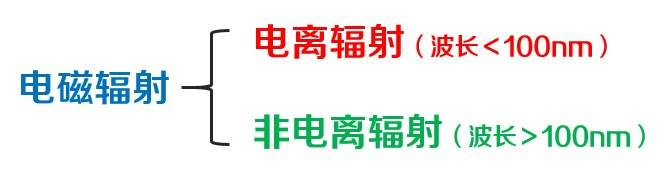
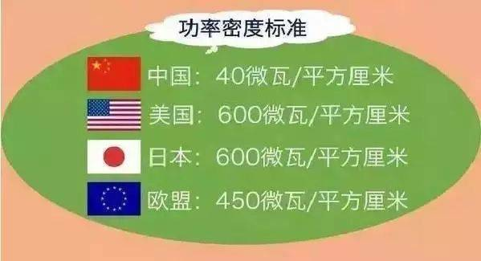
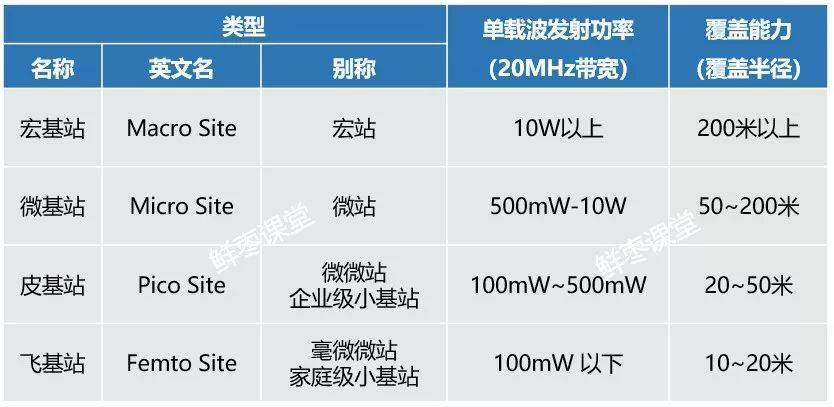

# 5G

- [5G网络的辐射](https://www.huxiu.com/article/295373.html)

## 光波和电波

电磁波的频率越高，它的能量就越大。换言之，它的辐射就越大。

由电磁波产生的辐射，就是电磁辐射。

**电磁辐射**

紫外线，就是电离辐射和非电离辐射的分界线

真正会对人体造成伤害的，是电离辐射

## 功率密度标准

地球上太阳光的辐射功率面密度大约是1000瓦特每平方米，也就是 10万 微瓦/平方厘米

我国标准中基站辐射的强度，是太阳光照射强度的2500分之一

相比基站来说，手机对人体的辐射其实更大

信号越弱，辐射反而越大，耗电量越大

## 基站功率

