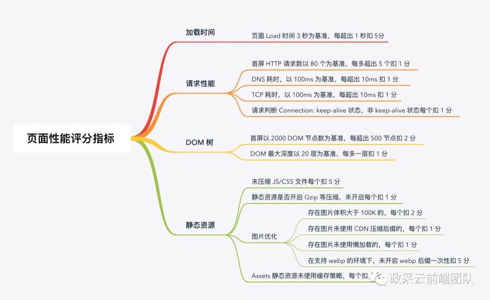
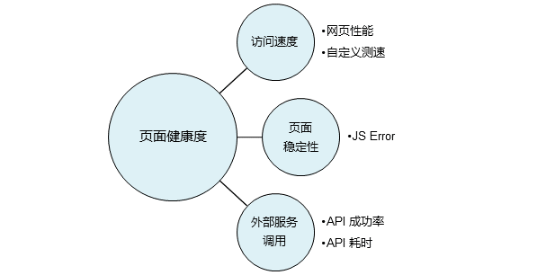

# APM

## 目录
<details>
<summary>展开更多</summary>

* [`背景`](#背景)
* [`业务现状`](#业务现状)
* [`解决价值`](#解决价值)
* [`监控流程`](#监控流程)
* [`整体流程`](#整体流程)
* [`埋点事件`](#埋点事件)
* [`埋点管理`](#埋点管理)
* [`性能指标`](#性能指标)
* [`性能优化方案`](#性能优化)
* [`业界产品`](#业界产品)
* [`设计`](#设计)
* [`设计思考`](#设计思考)

</details>

## 背景
>
> 应用性能管理（Application Performance Management）是一个比较新的网络管理方向，
>
> 主要指对企业的关键业务应用进行监测、优化，提高企业应用的可靠性和质量，保证用户得到良好的服务，降低IT总拥有成本(TCO)。
>
> 使用全业务链的敏捷APM监控，可使一个企业的关键业务应用的性能更强大，可以提高竞争力，并取得商业成功，
>
> 因此，加强应用性能管理（APM）可以产生巨大商业利益。

---

## 业务现状

---

## 解决价值

---

## 监控流程

| 事前 | 事中 | 事后 |
| -------- | -----: | :----: | 
| 设置预警 | 触发预警 | 完善预警 |
| 配置埋点 | 人工干预 | 完善埋点 |
|  |  | casestudy |

---

## 整体流程


### 业务整理


### 采集上报


### 加工存储


### 消费应用

---

## 埋点事件

### 业务埋点

#### 事件分类


#### 事件解释
| 类型 | 名称 | 解释 | 调用方式 |
| --------   | -----:   | -----:   | :----: | 
| AS | 应用启动 | 启动并加载第一个页面，或者从后台切回 | 静默 |
| AD | 应用退出 | 应用切换到退出后台，应用被Kill | 静默 |
| PV | 页面展现 | 页面/单页组件加载 | 静默 |
| PD | 页面关闭 | 页面/单页组件卸载 | 静默 |
| MV | 模块展示 | 模块首次展示 | 手动 |
| MC | 模块点击 | 模块首次点击 | 手动 |
| ORDER | 下单 | 下单按钮每次点击 | 手动 |
| PAY | 支付 | 支付按钮每次点击 | 手动 |
| custom | 自定义埋点 | 其他类型事件 | 手动 |

#### 代码示例

**APP**

```js
// 微信小程序
// 支付宝小程序
const WrapperApp = (params = {}) => {
  const { onLaunch, onHide } = params;
  if (typeof onLaunch === 'function') {
    params.onLaunch = function(options) {
      onLaunch.call(params, options);
      console.log('as');
    };
  } else {
    params.onLaunch = function(options) {
      console.log('as');
    };
  }

  if (typeof onHide === 'function') {
    params.onHide = function() {
      onHide.call(params);
      console.log('ad');
    };
  } else {
    params.onHide = function() {
      console.log('ad');
    };
  }
  return App(params);
};

// ...
WrapperApp({
  onLaunch(options) {
    console.log('as');
  },
  onHide() {
    console.log('ad');
  },
})
```

**PAGE**

```js
// 微信小程序
// 支付宝小程序
const WrapperPage = (params = {}) => {
  const { onLoad, onUnload } = params;
  if (typeof onLoad === 'function') {
    params.onLoad = function(options) {
      onLoad.call(params, options);
      console.log('pv');
    };
  } else {
    params.onLoad = function(options) {
      console.log('pv');
    };
  }

  if (typeof onUnload === 'function') {
    params.onUnload = function() {
      onUnload.call(params);
      console.log('pd');
    };
  } else {
    params.onUnload = function() {
      console.log('pd');
    };
  }
  return App(params);
};

// ...
WrapperPage({
  onLoad(options) {
    console.log('pv');
  },
  onUnload() {
    console.log('pd');
  },
})
```

### 性能埋点

#### 事件解释
| 类型 | 名称 | 解释 | 调用方式 |
| --------   | -----:   | -----:  | :----: | 
| FP | 首次绘制 | | 静默 |
| FCP | 首次内容绘制 | | 静默 |
| FMP | 首次有效绘制 | 主角元素呈现在屏幕上的时刻 | 静默 |
| TTI | 可交互时间 | 页面处于idle的时间 | 静默 |
| FPS | 画面每秒传输帧数 | | 静默 |

### 异常埋点

#### onerror

```js
// h5
window.addEventListener('error', (...args) => {
  console.log(args);
});

// 微信小程序
// 支付宝小程序
const WrapperApp = (params = {}) => {
  const { onError } = params;
  if (typeof onError === 'function') {
    params.onError = function(msg) {
      onError.call(params, msg);
      console.log(msg);
    };
  } else {
    params.onError = function(msg) {
      console.log(msg);
    };
  }
  return App(params);
};

// ...
WrapperApp({
  onError(msg) {
    console.log(msg);
  },
});
```

#### unhandledrejection
```js
// h5
window.addEventListener("unhandledrejection", function(e){
  e.preventDefault();
  console.log(e);
});
```

#### reject
```js
Promise.reject = function reject(output) {
  const oldReject = Promise.reject;
  try {
    oldReject(output);
  } catch(err) {
    // TODO 上报触发reject时的事件
  }
};
```

#### addEventListener
```js
// h5
const originAddEventListener = EventTarget.prototype.addEventListener;
EventTarget.prototype.addEventListener = function(type, listener, options) {
  const addStack = new Error(`Event (${type})`).stack;
  const wrappedListener = (...args) => {
    try {
      // 监听listener的异常
      return listener.apply(this, args);
    } catch(err) {
      // 手动扩展堆栈
      err.stack += '\n' + addStack;
      // throw的error是同域的，可被window.onerror捕获
      throw err;
    }
  };
  return originAddEventListener.call(this, type, wrappedListener, options);
}
```

#### custom
```js
try {
  // ...
} catch(err) {
 throw err;
}
```

---

## 性能指标
- [阿里云-arms](https://help.aliyun.com/document_detail/60288.html?spm=a2c4g.11186623.6.564.Kdg2bo#%E8%AE%BF%E9%97%AE%E9%80%9F%E5%BA%A6)
- [自动化 Web 性能优化分析方案](https://mp.weixin.qq.com/s/2CHA5ewWz_SIlBrdEuVv7w)
- [微信小程序评分细则](https://developers.weixin.qq.com/miniprogram/dev/framework/audits/scoring.html)
- [新一代性能指标](https://juejin.im/post/5ecc5521e51d45788e17dcc6)

### 评分细则


### 健康度


### 页面满意度
> 注：T = 2秒

性能指数 APDEX（全称 Application Performance Index）是一个国际通用的应用性能计算标准。该标准将用户对应用的体感定义为三个等级：

- 满意（0 ~ T）
- 可容忍（T ~ 4T）
- 不满意（大于 4T）

### 关键性能指标

> google提供了一个[web-vitals](https://www.npmjs.com/package/web-vitals)，可以快速测定部分性能指标

**首包时间**

responseStart - domainLookupStart

**首次渲染**

responseEnd - fetchStart

从请求开始到浏览器开始解析第一批 HTML 文档字节的时间差

**First Input Delay (FID)**

衡量可交互性，为了提供良好的用户体验，页面的`FID`应当小于 100毫秒

**Largest Contentful Paint (LCP)**

`LCP`应该在页面首次开始加载后的 2.5 秒内发生

**Cumulative Layout Shift (CLS)**

衡量视觉稳定性，为了提供良好的用户体验，页面的`CLS`应保持小于 0.1

**首次可交互**

domInteractive - fetchStart

浏览器完成所有 HTML 解析并且完成 DOM 构建，此时浏览器开始加载资源

**DOM Ready**

domContentLoadEventEnd - fetchStart

如果页面有同步执行的 JS，则同步 JS 执行时间 = ready - tti

**页面完全加载**

loadEventStart - fetchStart

= 首次渲染时间 + DOM 解析耗时 + 同步 JS 执行 + 资源加载耗时

### 区段耗时
- DNS查询
- TCP连接
- 请求响应
- 内容传输
- DOM解析
- 资源加载

**DNS查询**

domainLookupEnd - domainLookupStart

**TCP连接**

connectEnd - connectStart

**SSL 安全连接耗时**

connectEnd - secureConnectionStart

**Time to First Byte（TTFB）**

网络请求耗时

responseStart - requestStart

**数据传输耗时**

responseEnd - responseStart

**DOM解析**

domInteractive - responseEnd

**资源加载**

loadEventStart - domContentLoadedEventEnd

### dom层
- dom数
- dom最大层级

### 静态资源
- 资源压缩
- 开启gzip
- 图片优化（cdn、懒加载、webp、识别大体积图）
- 资源缓存

---

## 性能优化
- [京喜小程序优化指南](https://segmentfault.com/a/1190000022164644)

---

## 设计
> 参考[阿里云监控](https://arms.console.aliyun.com/retcode)

**总分类**

- 总览
- 页面性能
- 异常
- api请求
- 访问明细

### 总览
- pv/uv
- js错误
  * 错误数
  * 错误率
  * 错误数周同比
  * 错误率周同比
  * 环比新增错误种类
- 首屏渲染耗时/周同比
- api错误
  * 错误数
  * 错误率
  * 错误数周同比
  * 错误率周同比
  * 环比新增错误种类
- 资源错误
  * 错误数
  * 错误数周同比
  * 环比新增错误种类
- js错误趋势（x: 时间，y: 数量、率）
  * 错误数
  * 错误率
- api请求趋势（x: 时间，y: 数量、率）
  * 错误数
  * 成功数
  * 成功率
- 首次渲染耗时趋势
  * x: 时间
  * y: 耗时
- 资源错误趋势
  * link错误
  * script错误
  * img错误
  * object错误
- 分布
  * [地理](#地理)

### 页面性能
- 满意度
- 访问速度

#### 满意度
[参考](#页面满意度)

- 满意度趋势
  * x: 时间
  * y: 满意度指数/样本数
- 分布
  * [地理](#地理)
  * [终端](#终端)

#### 访问速度
- 加载详情
 * [关键性能](#关键性能指标)
 * [区段耗时](#区段耗时)
- 瀑布图
- 性能（时间）分布
  * x: 时间
  * y: 耗时
- 慢会话
- 分布
  * [地理](#地理)
  * [终端](#终端)
  * [网络](#网络)
  * [版本](#版本)

### 异常
- js异常
- 资源异常

#### js异常
- 数量、率、影响用户
- 趋势
  * x: 时间
  * y: 数量
- 页面错误率排行
- 错误数量排行
- 分布
  * 浏览器
  * 操作系统
  * 设备
  * 版本
  * [地理](#地理)

#### 资源异常
- link错误: <link>标签中引入的CSS文件加载错误
- script错误: <script>标签中引入的JS文件加载错误
- img错误: 标签中引入的图片文件加载错误
- object错误: <object>标签中引入的对象加载错误

### api请求
- api总览
- api详情

#### api总览
- 成功率趋势
  * x: 时间
  * y: 率
- 分布
  * [地理](#地理)
  * [终端](#终端)
  * [版本](#版本)
- 链路追踪
  * 成功排行
  * 失败排行

#### api详情
- 可选趋势（x: 时间，y: 率）
  * 成功率
  * 成功耗时
  * 失败耗时
  * 缓慢次数
  * 错误次数
- api调用列表

### 访问明细
- 全部日志
- js错误日志
- api日志
- 页面性能相关日志
- pv日志

### 维度
- 页面
- 地理
- 终端
- 网络
- 版本

#### 页面
- pv/uv
- js错误率趋势
  * x: 时间
  * y: 率
- js错误聚类（错误信息、错误数、影响用户数）
- api详情
- api链路追踪

#### 地理
- 中国
- 世界

#### 终端
- 浏览器
- 操作系统
- 设备
- 分辨率

#### 网络
- 运营商
- 网络制式

---

## 设计思考
> 具体问题具体分析 + 知行合一 + 抓主要矛盾

### js异常

#### 场景
- 开发阶段
- 上线灰度阶段
- 上线完成回归阶段

#### 侧重点

**开发阶段**

对异常明细更加关注，按页面分类即可轻松定位到问题根源

**上线灰度阶段**

- 对异常趋势（时间点）更加关注，需要清晰标识新增异常最优
- 这个阶段会大量用到辅助维度的筛选（运营商、网络环境、sdk版本、设备信息等），这样能快速缩小问题导致的根源

**上线完成回归阶段**

- 比较关注第三方变更（接口上线、区域网络、开关变动、底层容器发布新版）
- 这个阶段也会用到辅助维度，不过能标识出关键变更的时间点更重要

#### 问题处理流程
> 确保页面的单一职责

- 发现问题
- 定位问题
- 解决问题

**思考**

1. 面向什么样的场景
2. 通过什么方式
3. 提供什么样的解决方式
4. 帮助什么样的用户提供什么价值

### 网络请求
- 网络请求数
- 网络请求失败率
- 网络请求耗时

#### 异常类型
- 普遍&突发
- 个别&突发
- 普遍&微幅&趋势增长

---

## 业界产品
- [乐鹰](https://yueying.effirst.com/#/wbh5demo/h5/page/index)
- [frontJS](https://www.frontjs.com/app/0dbf0572d7a46fe5c1a2093a32ae6b9b/)
- [开源web-monitoring](https://hubing.online/#/sys/5ea50b485b0dd76c634b9cf7/resourceDetails)
