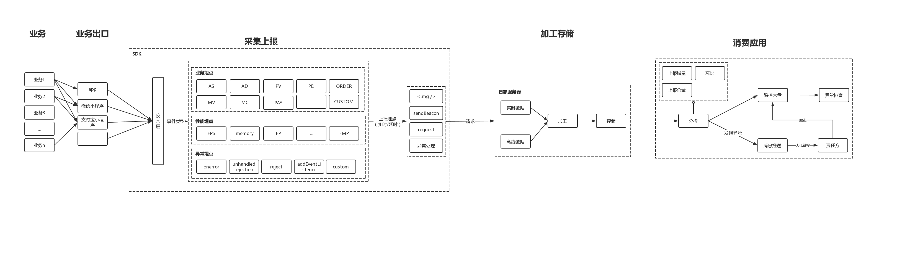
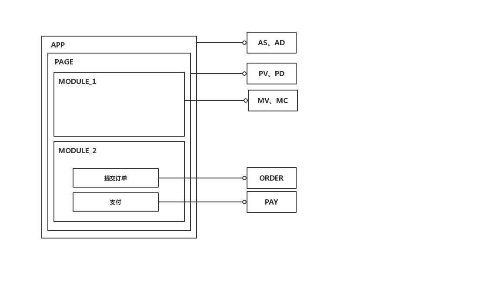

# APM

## 背景

## 目标

## 整体流程

## 埋点事件

### 业务埋点

#### 事件分类

#### 事件解释
| 类型 | 名称 | 解释 | 调用方式 |
| --------   | -----:   | -----:   | :----: | 
| AS | 应用启动 | 启动并加载第一个页面，或者从后台切回 | 静默 |
| AD | 应用退出 | 应用切换到退出后台，应用被Kill | 静默 |
| PV | 页面展现 | 页面/单页组件加载 | 静默 |
| PD | 页面关闭 | 页面/单页组件卸载 | 静默 |
| MV | 模块展示 | 模块首次展示 | 手动 |
| MC | 模块点击 | 模块首次点击 | 手动 |
| ORDER | 下单 | 下单按钮每次点击 | 手动 |
| PAY | 支付 | 支付按钮每次点击 | 手动 |
| custom | 自定义埋点 | 其他类型事件 | 手动 |

### 性能埋点

#### 事件解释
| 类型 | 名称 | 解释 | 调用方式 |
| --------   | -----:   | -----:  | :----: | 
| FP | 首次绘制 | | 静默 |
| FCP | 首次内容绘制 | | 静默 |
| FMP | 首次有效绘制 | 主角元素呈现在屏幕上的时刻 | 静默 |
| TTI | 可交互时间 | 页面处于idle的时间 | 静默 |
| FPS | 画面每秒传输帧数 | | 静默 |

### 异常埋点

## 埋点时机

