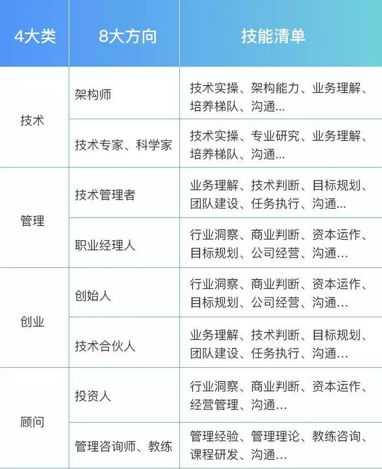
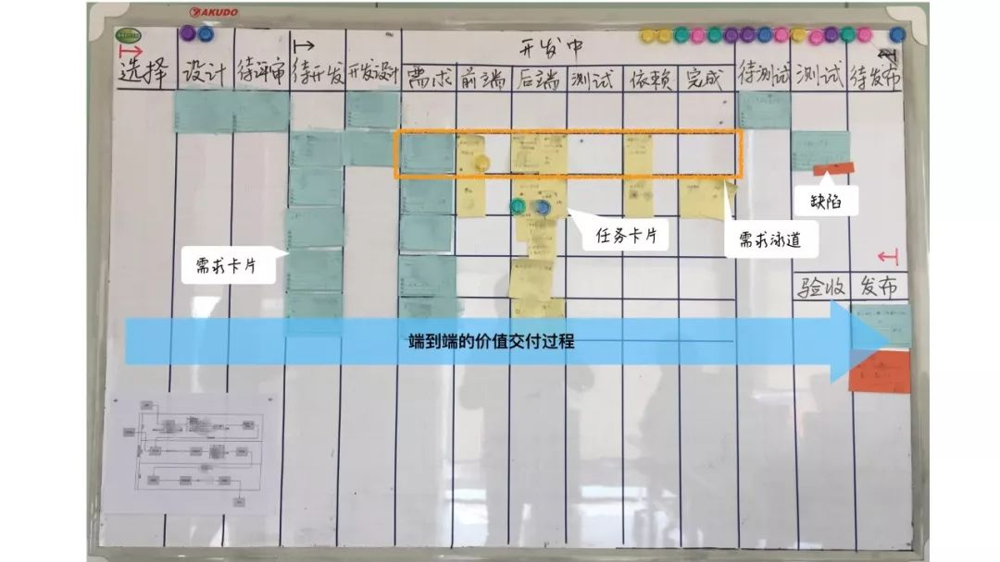
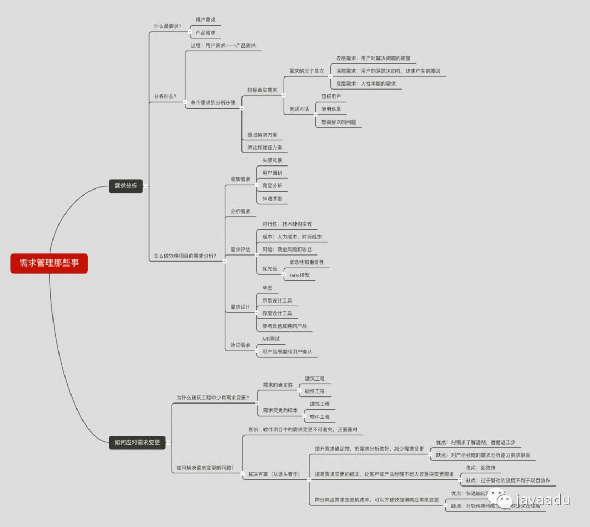
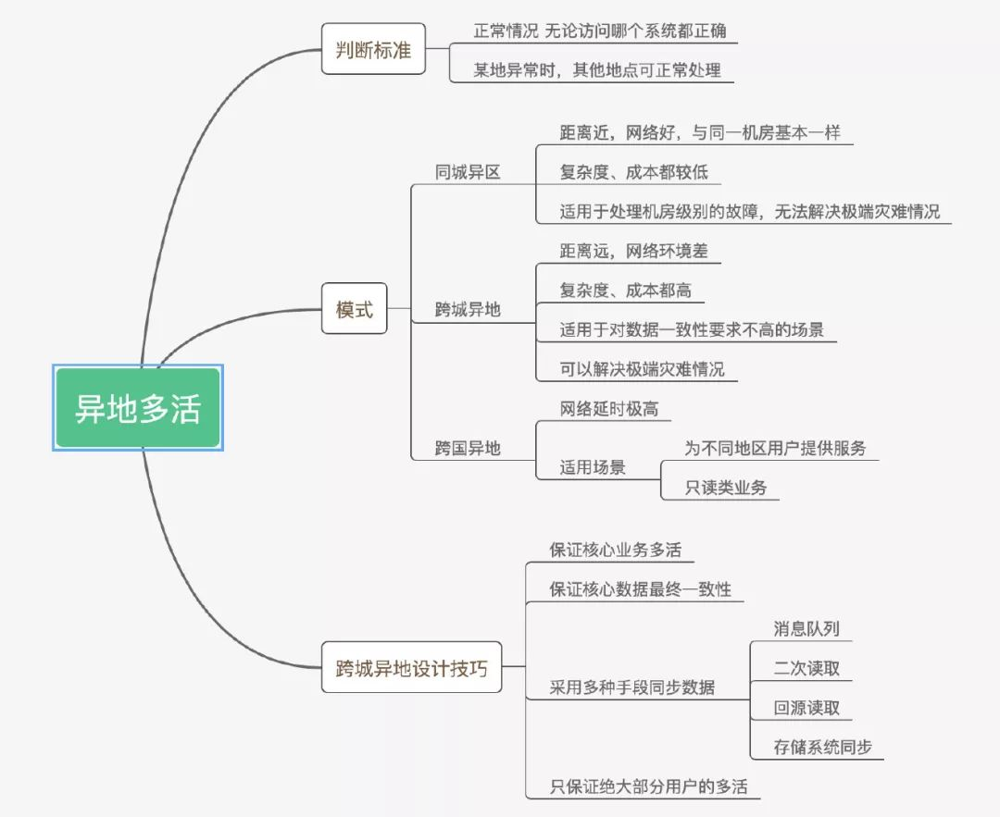

# 职业规划

## 参考
- [人性的弱点](http://www.cnblogs.com/hzg1981/p/5345495.html)
- [沟通相关书籍推荐](https://www.zhihu.com/question/20118643)
- [从点到面设计前端项目](https://yq.aliyun.com/articles/680238?utm_content=g_1000031626)
- [程序员成长之路](https://github.com/fouber/blog/blob/master/201805/01.md)
- [2019面试题](https://juejin.im/post/5c64d15d6fb9a049d37f9c20#heading-14)
- [JavaScript大型模块化项目如何管理依赖](https://zhuanlan.zhihu.com/p/38040253)
- [我在阿里云做前端](https://zhuanlan.zhihu.com/p/61127760)
- [中台微服务](https://www.infoq.cn/article/HNDtDuaIYsWUP-SGOPTK)
- [架构师能力模型](https://mp.weixin.qq.com/s?__biz=MzI0MTczNDgyOQ==&mid=2247484195&idx=1&sn=4023a1def4da46509a481b77e297e1f7&chksm=e90646e1de71cff786e0b7a3c6ce12074b1df0502a57a5553554b18fa91ab280160708d06e09&xtrack=1&scene=0&subscene=131&clicktime=1554469736&ascene=7&devicetype=android-28&version=2700033c&nettype=WIFI&abtest_cookie=BAABAAoACwASABMABQAjlx4AVpkeANCZHgDamR4A3JkeAAAA&lang=zh_CN&pass_ticket=AHr/9Slxa9wyQOBtmYsQinKiS+CRt/uP1tbENeGh5nL+qvkco8ifDo8OmS6Y/JS4&wx_header=1&utm_medium=hao.caibaojian.com&utm_source=hao.caibaojian.com)
- [技术主管之路](https://segmentfault.com/a/1190000018894283?utm_medium=hao.caibaojian.com&utm_source=hao.caibaojian.com&share_user=1030000000178452)

## 目录
<details>
<summary>展开更多</summary>

* [`发展方向`](#发展方向)
* [`开发流程`](#开发流程)
* [`流程看板`](#各端协调)
* [`架构设计`](#架构设计)
* [`项目设计`](#项目设计)
* [`团队规范`](#团队规范)
* [`言谈举止`](#言谈举止)
* [`表达观点`](#表达观点)
* [`前端集成解决方案`](#前端集成解决方案)
* [`前端框架对比`](#框架对比)
* [`技术选型`](#技术选型)
* [`依赖管理`](#依赖管理)
* [`无障碍`](#无障碍)
* [`设计模式`](#设计模式)
* [`快速开发`](#快速开发)
* [`产品相关`](#产品相关)
* [`视觉设计相关`](#视觉设计相关)
* [`后端相关`](#后端相关)
* [`ppt`](#ppt)

</details>

## 发展方向
- 
- [作为过来人，你有什么话想对后辈](https://www.zhihu.com/question/312019918)

### 专业技能
[前端团队产能](https://mp.weixin.qq.com/s?__biz=MzU1NjUxNTkxMg==&mid=2247483709&idx=1&sn=0555c95330ddfcd0c266caed7b94f1ce)
- 编码能力
- 工程能力
- 架构能力

### 成长之路
1. 一技之长。就是深耕你的专业技能，你的专业技术。
  * 栈内技术：js、缓存、渲染、用户体验
  * 栈外技术：cdn、服务端、运维、大数据、测试
  * 工程经验：技术水平的分水岭！！
    - 技术选型、架构设计
    - js/css模块化：cmd/amd/es6 module
    - 构建优化、定制规范、分治系统、性能优化、CI/CD、日志监控、系统测试
    - 组件化开发与资源管理：分治
  参考https://github.com/fouber/blog/issues/10，
  * 带人：疑问式引导
2. 独立做事。当你的一技之长达到一定深度的时候，需要开始思考如何独立做事。
  * 技术主管后考虑
3. 拥有事业。选择一份使命，带领团队实现它

---

## 开发流程
1. 评审阶段：产品召集前后端进行需求评审，前后端各自捋清楚自己的业务量以及联调之间工作量，从而进行开发时间评估。
2. 开发准备阶段：前后端一起商量需求中需要联调的部分，进行接口的口头协议交流。
3. 接口定义阶段：前后端中的一方根据之前的口头协议拟定出一份详细的接口，并书写API文档，完成后由另一方确认。有疑问的地方重新商量直至双方都没有问题。注意：第一份确认并书写好API的接口基本不会大改。
4. 开发阶段：双方根据协商出来的接口为基础进行开发，如在开发过程中发现需要新增或删除一些字段，重复步骤3。注意：前端在开发过程中记得跟进接口，mock数据进行本地测试。
5. 联调阶段：双方独自的工作完成，开始前后端联调，如在联调过程发现有疑问，重复步骤3，直至联调完成。
6. 提测阶段：将完成的需求提给测试人员，让其对该需求进行测试，如发现问题，及时通知开发并让其修改，直至需求没有bug。
7. 产品体验阶段：将完成的需求交给产品，让其体验，直至产品这边没有问题
8. 评审单发布阶段：前后端中的一人进行评审单的拟定，发送给对应的领导，表明需求发布的程序，包括影响到的页面及业务，发布的流程，发布的回滚方案等。
9. 发布阶段：前后端双方在保证步骤1-8都没有问题了，进行各自的代码发布，完成后由测试人员在线上进行相应的测试，如果有bug，重复步骤7和9，直至需求成功上线。


### 各端协调
- 

---

## 架构设计
参考[大型项目前端架构](https://juejin.im/post/5cea1f705188250640005472)

### 基建
- 代码仓库（自建gitlab）
- 版本管理（git-flow）
- 自动编译（jenkins/travis）
- 版本发布
  * 代码发到生产环节（外网可访问）
  * html引用资源更新成新版
- 统一脚手架
- node中间层
  * seo
  * 同构
- 埋点
  * 访问量
  * 异常
- 安全
  * xss
  * csrf
  * https
- eslint
- 灰度
  * 【1】1%；【2】5~10%；【3】30~50%；【4】全量推送（100%）
- 前后端分离
  * 小型项目：后端只提供接口和让某个url指向某个html，其他前端
  * 大型项目：html也由后端提供（便于注入参数、资源hash等）
- mock
  * request工具根据标识（比如url参数），分别请求线上接口或线下json
- 备份

### 应用层
- 单页VS多页
  * 大部分情况推荐多页
  * 多页便于维护、重构，入口控制
  * 加载白屏时间可能会比较长，框架资源可以单独、长期缓存
- 项目划分
  * 以应用（单个业务涉及到的前后端）为单位，分存不同代码仓库
- 基础库（UI、工具）建设
  * 团队人数较少（<10）时，直接用稳定的第三方库
  * 库建设后，有一定人力维护成本，要考虑
  * 好的基础库的标准
    + ts写
    + 可扩展
    + 详细文档
    + 视觉介入，交互统一
    + 版本隔离（小版本优化，大版本加新功能）
- 技术栈统一
  * 参考[技术选型](#技术选型)
- 浏览器兼容性
  * postcss
  * webpack部分loader
- 内容平台
  * 经验、博客分享
  * 迭代历史
  * 文化建设
- 权限管理平台
  * 权限时效性
  * 自动化
  * 清晰审批流程
- 登录系统
  * 单点登录
- cdn
- 负载均衡

---

## 项目设计

### 前期考虑
- 使用场景
  + 简单操作
  + 涉及底层修改
- 使用人群
  + 新手
  + 中间人群（着重考虑）
    * 可将新手培养成中间人群
    * 中间人群成长不受限，体验良好
  + 专家
- 关键点
  + 限制
    * 正向积极的约束
    * 引导用户完成，而非试错
  + 顺势
    * 预测用户行为
    * 避免用户误操作，或有一定提示
  + 人效比&收益
  + 数据敏感

### 设计文档
- 背景
- 目标
- 选型
- 系统总览（做的内容在系统中所处地位）
- 详细分层
- api设计
- 原型设计

#### api设计
- 容许多个实现
  * 底层实现细节不应该在入参上体现
- 统一Error code
- 更新操作指定更新的字段
  * ```js
  {
    // ...
    foo: {},
    updateFoo(newFoo, keys) {
      keys.forEach(key => (foo[key] = newFoo[key]));
    },
    // ...
  }
    ```

### 关键设计概念
* 可用性
  - api暴露
  - 同步/异步
  - 兼容性
  - 异常处理
  - 降级
  - 日志埋点
* 可扩展性
  - 代码维护：typescript、eslint、git-flow、code-review、版本控制
  - 功能封装/分层：底层通用方法、中间件、对外暴露的功能
* 安全性
  - 权限管理
  - 缓存读写
  - 用户输入/反馈
  - cookies


### UI工程要素
[UI工程要素](https://mp.weixin.qq.com/s?__biz=MzU0Nzk1MTg5OA==&mid=2247484673&idx=1&sn=2056a95b60b9bc3b4739afc353564f7b&chksm=fb47c174cc3048623148ece520a0bc2581b100d99ea97a780b66df16dc9c6937ee8bce2c2ee2&mpshare=1&scene=2&srcid=&from=timeline&ascene=2&devicetype=androi)

* 前后页面之间数据一致性
* 交互响应时间（<100ms），响应不同类型的输入
* 接口请求过程中如何响应，异步请求之间影响
* 页面跳转不丢失主要上下文
* 缓存过期，分页、排序
* 输出可预测
* 资源加载优先级
* 无障碍
* 国际化
* 代码容错
* 组件化分层

### 标准mvc结构
```text
project
  - pages
    - page1
      - controller
        - service
        - log
        - data-fomatter
        - ...
      - view
        - react
        - view
      - model
        - redux
        - ...
```
---

## 言谈举止

### 该避免的言辞
- 但是 -》做xxx的同时，可以xxx
- 我知道了 -》nb、thx
- 这行不通 -》分析这种做法和其他做法的差异，造成的结果
- 我错了，因为xxx等借口 -》认错
- 我不明白你说什么 -》（视情况）听完
- 直接说重点 -》（视情况）听完
- 我就这样，很直 -》

### 推销五步
[推销五步](https://mp.weixin.qq.com/s/WUyMo1BSh8Wflm0LQ3URsw)
1. 提出一个当今世界的变化趋势
  - 变化与要讲的东西有关
2. 提出会有赢家和输家
  - 不变则输
3. 描绘美好的未来
  - 有了XXX，就会XXX
4. 介绍克服困难、到达未来所需要的那个关键步骤
  - 对比传统和要推销的东西
5. 提出证据，你能让这一切变成现实

### 心态
- 和更优秀的人合作，承认优秀
- 一视同仁

---

## 表达观点

### 基本原则
- 改善的意见及时提出，不用事后诸葛亮
- 不要轻易打断别人说话
- 争论时旁观，平息时阐述
- 先复述对方的观点，再阐述自己的观点
- 高层的决策不要轻易反驳，只需陈述自己观点
- 阐述观点遵循PREP

### PREP法则
- Point: 先说结论，让人家第一时间清楚你的观点
- Reason: 再讲原因，最多三点
- Example: 举例子，事例和故事最能打动人
- Point: 重申自己的结论，突出自己的观点

---

## 前端集成解决方案

- [大型项目前端架构浅谈](https://juejin.im/post/5cea1f705188250640005472)
- [前端集成解决方案](https://github.com/fouber/blog/issues/1)

1. 开发规范
  * 开发、部署的目录规范
  * 编码规范
2. 模块化开发
  * require、define
  * js方面解决独立作用域、依赖管理、api暴露、按需加载与执行、安全合并等问题
  * css方面解决依赖管理、组件内部样式管理等问题
3. 组件化开发
4. 组件仓库
5. 性能优化
  * [参考](../js&browser/性能优化.md)
6. 项目部署
  * 静态资源缓存
  * cdn
  * 非覆盖式发布
7. 开发流程
  * 见[`开发流程`](#开发流程)
8. 开发工具
  * 构建与优化工具、开发-调试-部署等流程工具，以及组件库获取、提交等相关工具

---

## 框架对比

**首屏渲染**

vdom > angular-1.x > vue1.x

**少量更新**

vue1.x >> vdom + 优化 >  angular-1.x > vdom

**大量更新**

脏检查 + 优化 >= vue1.x > vdom >> mvvm

---

## 技术选型
[参考](https://insights.thoughtworks.cn/choosing-technology-guide/)

### 考量目标
* 目标产品
  - 生命周期（短、长）
  - 探索型or守成型
  - 主营产品or边缘产品
* 目标用户
  - 浏览器版本（同类产品对比or问卷or百度，分析各版本的价值）
  - 带宽
  - 可访问人群（普通人、视障）
  - 国际化
  - 访问频率
* 目标团队
  - 技术背景
  - 团队规模
  - 组织架构
  - 人员流动
  - https://insights.thoughtworks.cn/choosing-technology-guide/
* 目标技术
  - 明确的定位
  - 维护团队
  - 代码质量
  - 社区

### 团队技术栈
* 组件库统一（自建或第三方库）
* 像地图这些也要固定库和版本
* 高水平推荐react

---

## 依赖管理
大型前端项目可以使用npm模块的方式进行管理
1. 将本地目录安装成为local_module
```js
npm install ./path/to/module1
```
2. 安装后package.json变更
```json
{
  // ...
  "module1": "./path/to/module1",
}
```
3. local_module引用
```js
import module1 from 'module1'
// ...
```

---

## 无障碍
[无障碍](https://mp.weixin.qq.com/s?__biz=MzIwNjkwMTcyOQ==&mid=2247484738&idx=1&sn=c16f3abd28c8df97d534208cf2000e3f&chksm=971bddcca06c54da609dfc13d72ed265ecd51f6ff31ca1fc11fdc3c9452c5f2bfaa78fb15988&scene=27&ascene=0&devicetype=android-28&version=2700033b&nettype=)

---

## 快速开发
[vue企业级开发](https://mp.weixin.qq.com/s/g6D5b_YilzLeBH3pdjRnww)

---

## 设计模式
[设计模式](https://segmentfault.com/a/1190000018879929?utm_medium=hao.caibaojian.com&utm_source=hao.caibaojian.com&share_user=1030000000178452)

---

## 产品相关


---

## 视觉设计相关

### 四大设计原则

#### 对比度
- 颜色（深、浅）
- 字体大小（大小完全相同/大小完全不同）
  * 避免32px、36px这种放在一起
- 字体重量（重量完全相同/重量相当不同）
- 字体样式（结合不同）
  * 避免斜体 + 斜体

#### 一致性
确保类似的元素以类似的方式出现

主要是针对各个页面之间的协同风格

- 字体/字体
- 调色板/颜色的阴影
- 格
- 对准
- 装饰元素的风格

#### 减少视觉噪音
尽可能少的装饰元素

#### 空间
- 接近 =》相关性
- 有限空间不要放太多元素
- 重要的，优先放，或者占更多空间突出


---

## 后端相关


---

## ppt

### SCQA叙事模式
- S ：Situation(背景) 
- C ：Complication(冲突)
- Q ：Question(疑问)
- A ：Answer(解答)
