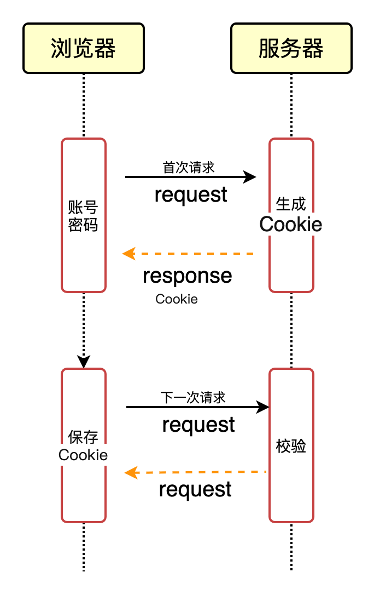
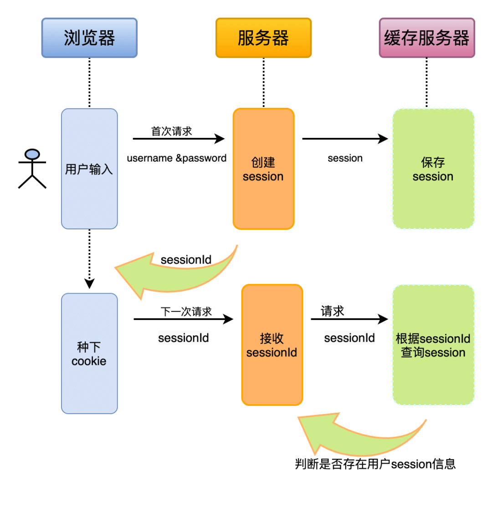
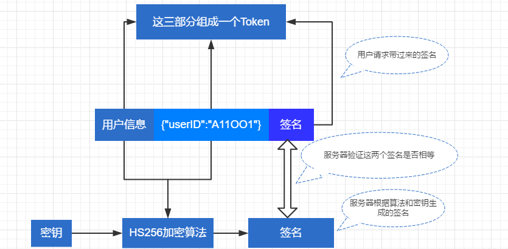

# sso

## 参考

- [CAS中央鉴权](https://mp.weixin.qq.com/s/-Yf6a58H7WDB1luOORhDJw)

## 几种方式

最简易 sso 方式：**浏览器 sessionId + 服务器 session**

由于服务器之间 session 没法共享，所以有问题。

考虑服务器集群时：**通过 redis/memcached 缓存 sessoin**

缓存服务器挂了，那数据都没了，所以有问题。

json web token模式：**浏览器存签名和登录信息 + 服务器校验秘钥**

- 服务器存储什么？服务器不存储登录信息，所以没了存储压力
- 对服务器的要求？服务端只负责校验签名（登录信息加密后比对），对算力要求降低很多
- 如何更新签名？每次比对通过后，生成新签名 set-cookie 给浏览器

