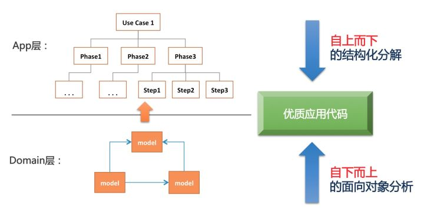

# toB&toC

## 如何做好toC

### 概述
1. 理解业务
2. 抽象与拆分
3. 代码实现

### 方法论


#### 自上而下的结构化分解
```
步骤1 -》步骤2 -》步骤3 -》步骤4 -》步骤5 -》... -》步骤n
```

**分解为**

```
阶段1 -》阶段2 -》阶段3
----------------------------
步骤1   |  步骤4   |   步骤n
步骤2   | 步骤5    |
步骤3   |
```

#### 自下而上的面向对象分析
```
if (!a) {
  // ...
}

if (b > 1) {
  // ...
}

if (c !== 2) {
  // ...
}
```

**抽象为**

```
if (model.isOpposite(a)) {
  // ...
}

if (model.gt(b, 1)) {
  // ...
}

if (model.isNot(c, 2)) {
  // ...
}
```

### 推荐
ddd

---

## 如何做好toB
[做To B，一定要避免的9类致命错误](https://mp.weixin.qq.com/s/G2BRzDjR4rpUkyyxR-hcRw)

### 获客难
- toB相对toC，获客周期长、成本高
- toB非常依赖持续性收入

### 忌主观臆测需求
- 不同于toC，toB需要花大量时间了解客户的刚需
- 不要“你觉得”

### 区分决策者和使用者
- 老板是决策者，要让他们肯定toB产品的价值
- 员工是使用者，要让他们用的爽
- 决策者和使用者利益冲突时，需要权衡倾向那边

### 用标准化产品满足碎片化需求
- 优先级：产品 > 服务 > 咨询
- 将用户的碎片化需求，抽象为通用需求，配合收费制
- 避免不断迎合用户需求，要做产品，非项目

### 价值敏感
- toB价值敏感（首先要能解决问题）
- toC价格敏感（首先要便宜）

### 大B还是小B
- 大B通常个性化需求很多，但是付费能力强（比如很多政府机构）
- 小B只需要通用功能即可，但是付费能力弱

### toB业务toC化
参见Zoom

