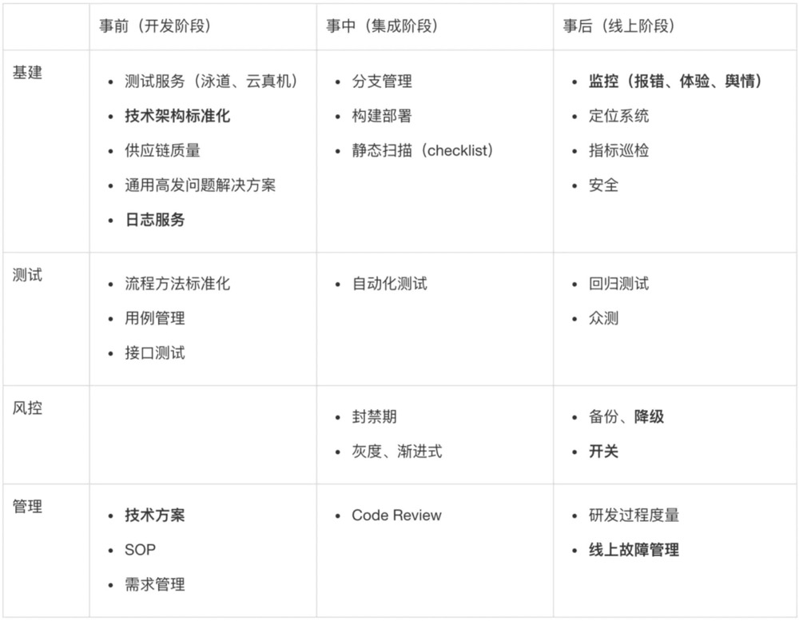

# 前端代码质量

## 参考
- [构建质量可信系统的 10 要素
](https://zhuanlan.zhihu.com/p/86097675)
- [js-canIUse](http://kangax.github.io/compat-table/es6/)

## 目录

展开更多

* [`架构`](#架构)
* [`工作流`](#工作流)
* [`组件封装`](#组件封装)
* [`质量保障`](#质量保障)

## 架构

### 设计原则
- 不多不少
- 演进（迭代）式
- 持续性

### 层次
> 符合**4c**原则

- 上下文（Context）
- 容器（Container）
- 组件或模块（Component）
- 代码（Code）

---

## 工作流

### 自动化
比如新人接受项目、团队，通过跑几个脚本就能实现：

- 开发系统初始化
- 开发环境搭建
- 线下/线上环境部署

### 可视化
如果做不到自动化，可以降级到可视化

### 规范
- commit hook
- commit message
- lint
- 命名规范等

---

## 组件封装
> 分为 1. 状态组件 2. 模板组件
> 
> 状态组件无模板，模板组件无状态
>
> 1. 从面向对象角度，封装为了隐藏代码细节
>
> 2. 从工程管理角度，封装为了能复用代码
>

**状态组件**: 模板尽量简单，由子组件和少量标签组成，侧重于给子组件传状态

**模板组件**: 侧重可扩展性和包容性，状态纯依赖外部

### 其他划分方式

**展示型组件**

- 类似纯函数（组件），包含模板，不保留状态
- 数据进，DOM出

**接入型组件**

- 负责接口交互，源数据处理，承载各种其他类型组件
- “单页面”可以理解为接入型组件

**交互型组件**

- 强调通用性和可复用
- ElementUI、easy-table

**功能型组件**

- 本身不涉及渲染，对功能的抽象，即高阶组件
- router-view、transition

### 关键点
- 可扩展性和包容性
- 文档说明
- 区域性

### 可扩展性和包容性
> 以一个泛用性很广的组件（比如各种胶水组件，像erchart封装、高德地图封装等）为例

**包容性**

很多的字段，应该由外部控制（比如 x，y 轴信息，饼图、柱状图、折线图等特殊字段），这样随着数据变更，可做无修改兼容；

**可扩展性**

对于那些变化有限的字段，做配置项传入

### 文档说明
**一般来讲，组件应该包含下面文件:**

- interface.ts: 对入参、出参、接口返回值等数据，可做说明，即使代码不用 ts 写
- README.md: 主要介绍下组件用法、注意事项、demo
- mock.ts: 各种 mock 数据
- enum.ts: 这个看情况，有就加
- Smart-组件.ts: 给组件用的辅助方法，业务方不应该调用
- helpers.ts: 数据格式化方法，格式化之后的数据应该能直接提供给组件使用

### 区域性
- 样式（scoped、全局）
- 组件实例化唯一标识

### 通用组件指南
1. 要易用 (至少让使用者能够简单方便的引入到程序当中）
2. 要稳定 (需要增加关键的测试）
3. 要灵活（关键参数可配置）
4. 要全面（日志、拦截器、监听器）
5. 要谨慎（要考虑多种情况）
6. 要易读（写的东西要能给别人讲清楚）

### 组件分层
**容器层**

> css，限定了容器承载内容的体量、宽高等样式

**容器功能层**

> js，整个容器的可交互（局部/全局）操作

**内容层**

> html，可容纳的元素

---

## 质量保障
[前端质量保障](https://juejin.im/post/6856375724979257352)

