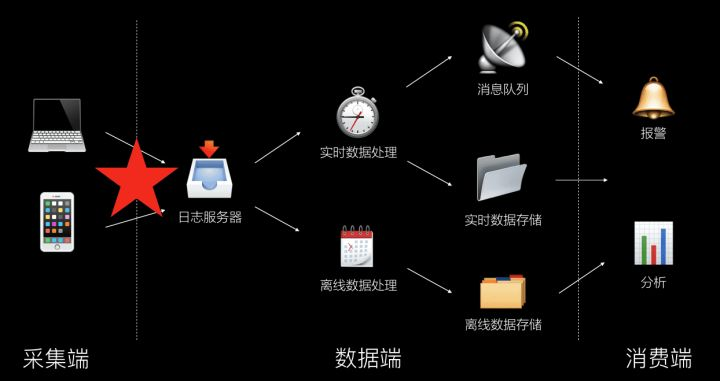
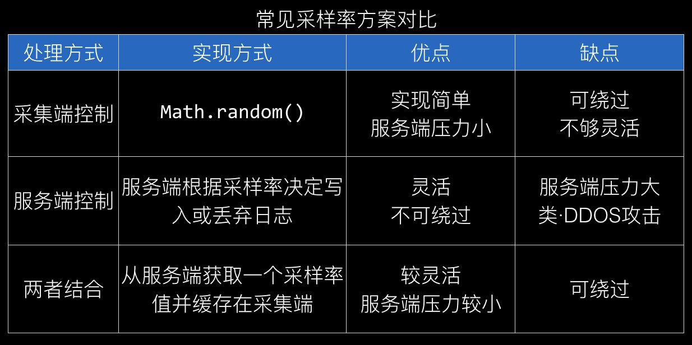
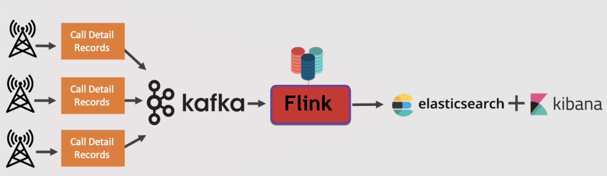

# 前端埋点和监控方案

[TOC]

## 参考
- [单页应用优雅的上报前端性能数据](https://github.com/forthealllight/blog/issues/38)
- [异常处理](https://zhuanlan.zhihu.com/p/51800345)
- [10分钟彻底搞懂前端页面性能监控](https://zhuanlan.zhihu.com/p/82981365?utm_source=wechat_timeline)
- [你不知道的 Web 前端监控](https://my.oschina.net/u/4088983/blog/4669899)
- [网易云音乐-前端性能监控方案](https://mp.weixin.qq.com/s/WOc0FynqoPH3OAQsZPtOZw)

---

## 监听url
```js
var _wr = function(type) {
   var orig = history[type];
   return function() {
       var rv = orig.apply(this, arguments);
      var e = new Event(type);
       e.arguments = arguments;
       window.dispatchEvent(e);
       return rv;
   };
};
 history.pushState = _wr('pushState');
 history.replaceState = _wr('replaceState');
```

---

## 上报方式
- (new Image()).src = '...'
- navigator.sendBeacon(url [, data]);
- ajax post
- [fetchLater](https://mp.weixin.qq.com/s/avfV9zBINnK8FCg_01A8oQ)

---

## 异常监控
- JS 语法错误、代码异常
- AJAX 请求异常
- 静态资源加载异常
- Promise 异常
- Iframe 异常
- 跨域 Script error
- 崩溃和卡顿

### 异常处理

#### 同步异常
window.onerror

- onerror返回true时，才不会向上抛异常（即不会再console里输出红字）
- onerror卸载js最前面，避免捕获不到部分错误
- onerror无法捕获语法错误

```js
window.onerror = function(message, source, lineno, colno, error) {
  // message：错误信息（字符串）。
  // source：发生错误的脚本URL（字符串）
  // lineno：发生错误的行号（数字）
  // colno：发生错误的列号（数字）
  // error：Error对象（对象）
  console.log('捕获到异常：',{message, source, lineno, colno, error});
};


// iframe
window.iframes[0].onerror = function() {};
```

**注：想去掉控制台异常提示，return true**

#### 资源异常
- 资源（如图片或脚本）加载失败，可用addEventListener捕获
- 不同浏览器捕获的错误信息不一致，需要兼容
- 注意避免重复addEventListener

```js
window.addEventListener('error', (error) => {
  console.log('捕获到异常：', error);
}, true);
```

#### 图片异常
```js
var allImgs = document.getElementsByTagName('img');
var loadedImgs = performance.getEntries().filter(i => i.initiatorType === 'img');
// 最后 allIms 和 loadedImgs 对比即可找出图片资源未加载项目
```

#### 异步异常
```js
window.addEventListener("unhandledrejection", function(e){
  e.preventDefault();
  console.log(e);
});


// test
Promise.reject('promise error');
```

**注：想去掉控制台异常提示，e.preventDefault()**

#### vue
```js
Vue.config.errorHandler = (err, vm, info) => {
  console.error('通过vue errorHandler捕获的错误');
  console.error(err);
  console.error(vm);
  console.error(info);
};
```

#### 跨域scriptError
改写EventTarget的原型

```js
const originAddEventListener = EventTarget.prototype.addEventListener;
EventTarget.prototype.addEventListener = function (type, listener, options) {
  const addStack = new Error(`Event (${type})`).stack;
  const wrappedListener = function (...args) {
    try {
      // 监听listener的异常
      return listener.apply(this, args);
    }
    catch (err) {
      // 手动扩展堆栈
      err.stack += '\n' + addStack;
      // throw的error是同域的，可被window.onerror捕获
      throw err;
    }
  }
  return originAddEventListener.call(this, type, wrappedListener, options);
}
```

#### 奔溃&卡顿
- load + beforeunload
- service worker
  * 生命周期比页面长
  * 有自己独立的工作线程
  * 网页用navigator.serviceWorker.controller.postMessage，上报异常

#### sourcemap
- 获取错误信息的关键字段（url、row、column）
- 通过.map文件匹配还原

---

## 网络请求监控

- 拦截XMLHttpRequest
- performance.getEntriesByType("resource")再找xmlhttprequest、fetch

---

## 资源监控

- performance.getEntriesByType("resource")再找script、css等

---

## 性能监控

- performance API

---

## 采集

### 对于跨域资源
[crossorigin](../fe-interview/src/common.md#crossorigin)
```html
<!-- 添加crossorigin -->
<!-- 当然服务端也要返回：Access-Control-Allow-Origin: * -->
<!-- 兼容性：ie9+、safari8+ -->
<script crossorigin src="..."></script>
```

### hack原生方法
```js
const prevSetTimeout = window.setTimeout;
window.setTimeout = function(callback, timeout) {
  const self = this;
  return prevSetTimeout(function() {
    try {
      callback.call(this);
    } catch (e) {
      // 捕获到详细的错误，在这里处理日志上报等了逻辑
      // ...
      throw e;
    }
  }, timeout);
} 
```

### 框架层面
react -> ErrorBoundary

---

## 数据处理

**数据架构**


**采集端**


**数据处理**



推荐日志服务进入数据处理流程之前进行采样率控制

- 日志写入成本低
- rotate 机制保证存储不会浪费
- 了解真实打点请求数据量
- 避免采集端绕过采样率限制

---

## 分析
- 爬虫
- 前端发版
- 后端异常

---

## 报警
- 周期性
- 季节性

---

## 重要事项

### 思考点
- SDK 如何方便的进行业务拓展和定制？
- SDK 在拓展新业务的时候，如何保证原有业务的正确性？
- SDK 如何实现异常隔离以及上报？
- SDK 如何实现服务端时间的校对？
- SDK 如何实现会话级别的错误上报去重？
- SDK 采用什么样的上报策略？
- 上报时机
- 平台数据如何进行 削峰限流
- 平台数据为什么需要 数据加工？
- 平台数据为什么需要 数据清洗、聚合？
- 平台数据如何进行 多维度追踪？
- 代码错误如何进行 源码映射
- 如何设计监控告警的维度？
- 行为轨迹
- 告警服务实现？


### 前端sdk

**分类**：h5、小程序、pc

**采集**：自动的-拦截原生方法（history.pushState/replaceState）、半自动（传框架router）、手动采集

**上报方式**：sendBeacon、ajax、img

**上报时机**：路由切换，单条/合并上报，requestIdleCallback、web worker

**优化**：采样率、网络异常怎么保证上报成功率


### 加工

- 数据采集：kafka
- 消费&实时计算：flink
- 实时&高效查询：es（适合多条件查询场景）
- 持久化存储：clickhouse


### 消费

拿数仓的数据，通过可视化报表展示给用户


### 告警

后端弄的