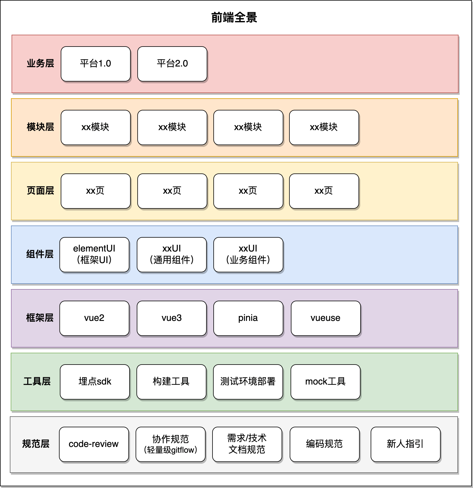
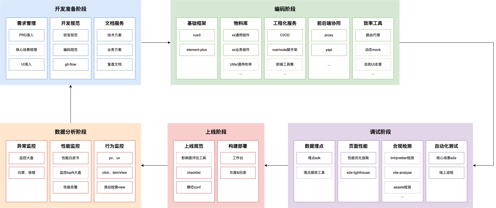

# 前端架构

## 参考

- [保证前端项目代码质量](https://zhuanlan.zhihu.com/p/82546272)
- [衡量前端工程质量](https://www.infoq.cn/article/FGrQeAw5mNKjWkxGV12U)
- [字节-现代web开发实践](https://mp.weixin.qq.com/s?__biz=MzkxNDIzNTg4MA==&mid=2247484407&idx=1&sn=c3706cdacefe4fd0ee372804ce53b4ce&scene=21#wechat_redirect)
- [空谈可抄前端架构](https://mp.weixin.qq.com/s/UetEZPco-dKDSwrtchVT7g)

---

[TOC]

---

## 架构

### 业务视角



### 开发视角



### 团队视角

- **必须有的-影响生存的**（做不好，这个领域就混不下去的）
- **应该有的-基础设施**（最基本的，必备的，行业常见的，完整的，专人负责的，到了某个阶段必须要有的基础设施）
- **慢慢会有的-日常沉淀**（提效的，通过长时间有意识积累出来的，偏最佳实践）
- **有了更好的-创新探索**（看起来可有可无，但是可以给业务带来巨大想象力的）

---

## 前端标准规范

- [编码规范](https://github.com/1024-lab/smart-admin/blob/master/%E4%BB%A3%E7%A0%81%E8%A7%84%E8%8C%83/Vue3%E8%A7%84%E8%8C%83%20V2.0.md)

### 编码规范

- js
- css
- html
- vue

### 协作规范

- git规范
- 提交规范（格式、工具、信息）

---

## 基建

- 自建Gitlab
- 版本管理
- 自动编译发布Jenkins
- 纯前端版本发布
- 统一脚手架
- Node中间层
- 埋点系统
- 监控和报警系统
- 安全管理
- Eslint
- sonarQube
- 灰度发布
- 前后端分离
- Mock
- 定期备份
- 组件预览
- 样式管理

### 样式管理

- UI库，自定义样式能收归为统一变量管理，比如能否轻松实现切换黑夜/白天模式
- 可参考[css变量替换](../less./README.md#css变量替换)

### 统一协作方式

- commit、code-review工具&机制

### 组件预览

- 项目中所有组件可以通过统一页面展示效果，也可以在页面上动态改变组件属性等

### sonarQube

**API**

```sh
# 请求语言接口
https://sonar.corp.xxx.com/api/languages/list
```

### 项目特色组件

个人理解，组件化以实用为主，以符合ui稿为准，不用以**绝对的通用性**为标准，

因为绝对的通用性，需要组件做到两点：

1. 功能极度完善（包含各种逻辑、各种视觉交互等 --> 参考element）
2. 功能极度抽象（不含任何逻辑，不含任何视觉，纯抽象类 --> 这和没封装的区别是什么？前端非后端，纯功能层面的抽象没用，视觉更重要）


**组件化的灵魂五问**

1. 架构设计的创新性
2. 组件拆分原则
3. 组件间通信方式
4. 防劣化措施
5. 项目效果


### 自动化测试

体系化管理：可视化平台 + 录制工具 + 本地sdk


---

## 长效维护

- 可扩展性：能够很方便、清晰的扩展一个页面、组件、模块
- 组件化：多个页面之间共用的大块代码可以独立成组件，多个页面、组件之间共用的小块代码可以独立成公共模块
- 可阅读性：阅读性良好（包括目录文件结构、代码结构），能够很快捷的找到某个页面、组件的文件，也能快捷的看出项目有哪些页面、组件
- 可移植性：能够轻松的对项目架构进行升级，或移植某些页面、组件、模块到其他项目
- 可重构性：对某个页面、组件、模块进行重构时，能够保证在重构之后功能不会改变、不会产生新 bug
- 开发友好：开发者在开发某一个功能时，能够有比较好的体验（不好的体验比如：多个文件相隔很远）
- 协作性：多人协作时，很少产生代码冲突、文件覆盖等问题
- 可交接性：当有人要离开项目时，交接给其他人是很方便的


### 组件化

**原则**

- 为了复用
- 为了维护
- 为了解耦


#### headless UI

> 组件逻辑的复用，UI层面的自定义，参考：[headless UI](https://mp.weixin.qq.com/s/1SlLWmZmQch0W3WSqlc4GA)。
>
> 优点：
>
> 1. 极致的抽象，行为的纯函数化，高度可扩展
> 2. 高度可维护性（可增量升级）
> 3. 单测友好
>
> 缺点：
>
> 1. 对开发者要求高
> 2. 使用成本高
>
> 

```vue
<template>
<section>
	<button @click="handleMinus">-</button>
  <input v-model="count" />
  <button @click="handleAdd">+</button>
</section>
</template>
<script setup lang="typescript">
import { useCounter } from '@/hooks/counter';
  
const { handleMinus, count, handleAdd } = useCounter(0);
</script>
```


---

## 如何着手治理

### 1. 了解业务

明确当前现状，梳理整体链路


### 2. 寻找方案

预估未来技术发展方向，调研业界可行方案or创新自己的方案


### 3. 评估方案

评估可行性、ROI，选出至少一个方案


### 4. demo开发

最快做出mvp版本方案


### 5. 方案设计

相关架构细节设计，与合作方深度确认


### 6. RFC评审

和项目成员沟通分工，保证方案顺利执行


### 7. 落到实处

推动项目进行，一定要承担一部分编码工作


### 8. 沉淀传承

沉淀文档、分享、文章


### 9. 不断演进

与时俱进，演进已有方案


---

## 各端差异

### C端

**特点**

- 流量 + 用户时长 = 下单量，通过不断拉新留存的手段吸引用户使用，同时给子产品带去流量
- 活动页：**快速开发 + 无维护成本**；流程页：**正常开发 + 长期维护**

**目标**

- 拉新留存（广告、动画、优惠券、转发）
- 用户时长++（用户行为采集）
- 裂变（子产品互联互通、复杂跳转）

**技术考虑点**

1. 稳定性（埋点监控、降级）
2. 用户体验（交互层面的酷炫）
3. 环境兼容性（h5、小程序不同版本）
4. 性能（首屏、交互）
5. 安全（防竞对爬取）

### B端

**特点**

- 有固定的用户群体，功能层面主要考虑流程的标准化和定制化，帮助用户切实提效
- 数据安全很重要，涉及到一查多的情况（个人查询大量内部数据或C端数据）
- 大部分场景：**偏快速开发 + 长期开发**

**目标**

- 流程稳定&标准化（帮助用户工作提效）
- 用户时长--（数据敏感、查询量大）
- 一站式（简明交互）

**技术考虑点**

1. 可扩展性和可维护性（模块化、工程化、微前端）
2. 性能（首屏、交互）
3. 安全（数据敏感）
4. 稳定性

