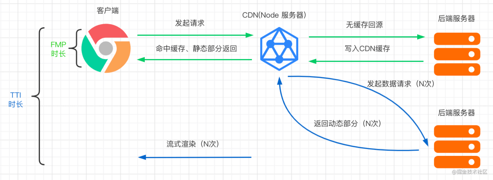

# 前端渲染历史

## 参考

- [历史](https://mp.weixin.qq.com/s/n7C-XCnmZ-Imx04FbV3zQg)

## 历史

### ssr

> 基于 php/jsp，全后端渲染

缺点：开发麻烦

### csr

> 基于 ajax，前端异步请求渲染

缺点：不利于seo

### ssr

> 基于 nodejs，全后端渲染

缺点：首次渲染耗时

### esr

> 前端（cdn缓存）渲染静态部分，动态发起多次请求，流式渲染。
>
> nodejs也能实现类似效果

#### ssg

> 静态站点生成（构建阶段即生成静态html，每次访问直接读取，通常用于活动页）