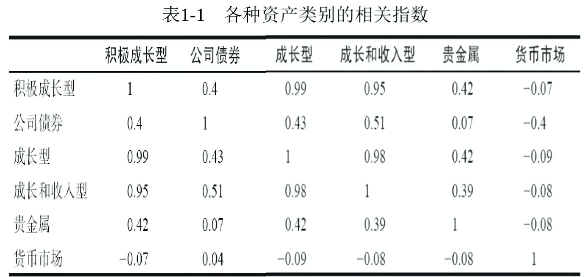
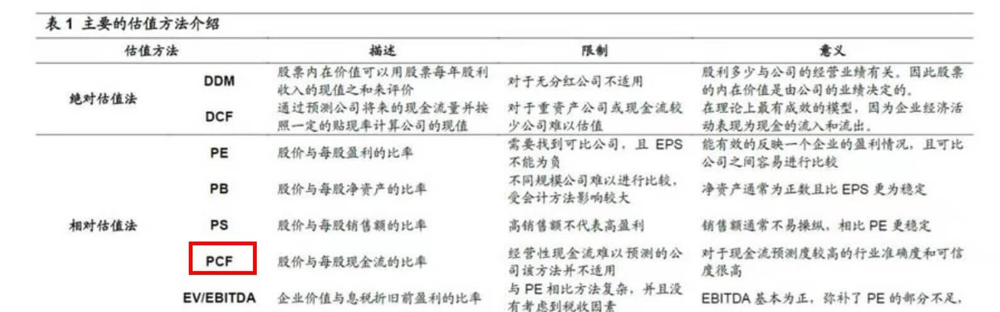
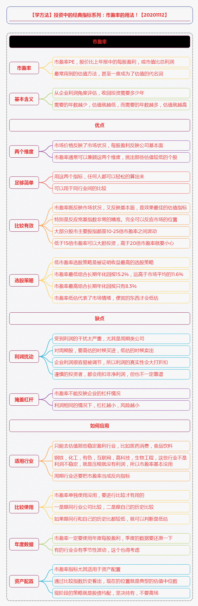
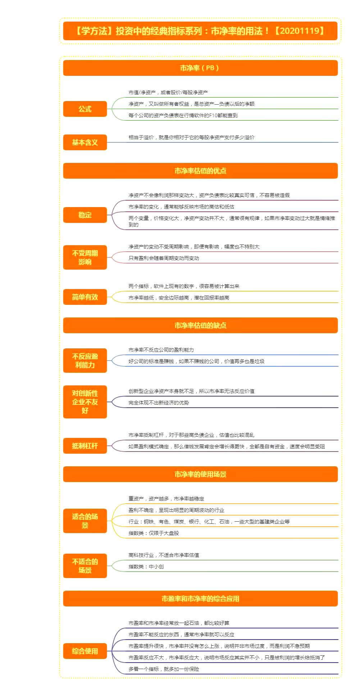
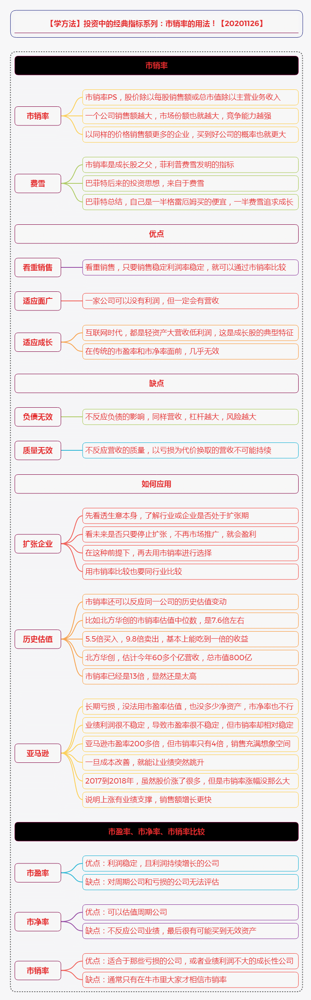
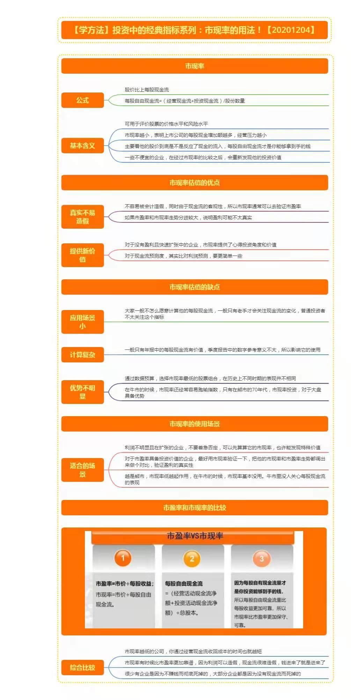
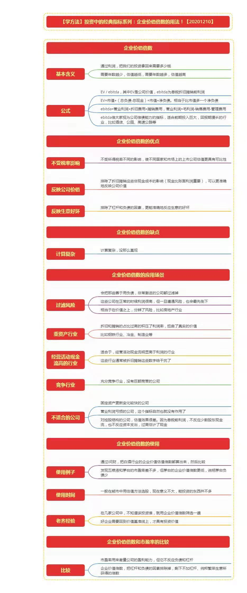
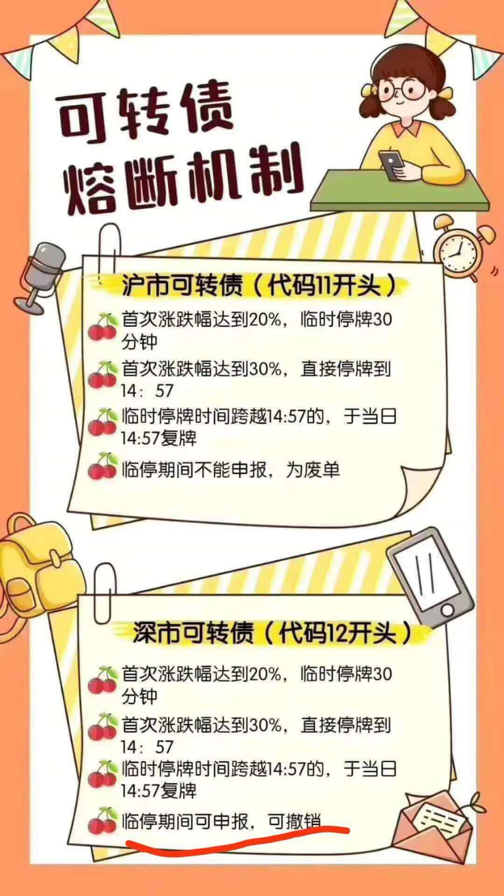

# 基金

**## 目录**

展开更多

* [`行业解析`](#行业解析)
* [`应知应会`](#应知应会)
* [`周期判断`](#周期判断)
* [`重要概念`](#重要概念)
* [`定投指南`](#定投指南)
* [`右侧追击`](#右侧追击)
* [`资产配置`](#资产配置)
* [`常用指标`](#常用指标)
* [`可转债`](#可转债)

## 基金分类

- 货币型
- 债券型
- 股票型
- 指数型

收益率递增，风险递增

---

## 行业解析

> 分两大类：成长（20%）和价值（80%）
>
> 创业板代表成长，沪深 300 代表价值

### 食品饮料+消费类

> 衣食住行，食品、饮料、家电、汽车、农业、医药保健等
>
> 代表公司：贵州茅台，五粮液，海天味业，伊利股份、格力电器、美的电器
>
> 
>
> 特点：
>
> 1. 长期持有，出现负面消息时时最佳投资时机
> 2. 不到牛市很难上涨，牛市后期持续上涨
> 3. 适用于PEG估值，市盈率要和增速对应

#### 白酒
- 总体消费降低
- 分化严重，即龙头暴涨，小厂衰弱

#### 啤酒

- 纯依靠事件驱动（赌运）
- 不能长期投资

#### 调味品
- 具有很强的市场定价权

#### 肉制品
- 周期性
- 与其投资肉制品加工（双汇），不如直接投资源头

#### 保健品
- 老龄化趋势严重，持续看好

#### 其他食品
- 需要考虑利润增速和市盈率，建议半年建仓

#### 医药生物

> 代表公司，中国医药，恒瑞医药，同仁堂，华东医药，云南白药，长春高新，华兰生物，爱尔眼科，通策医疗

- 弱周期，理论上长期持有收益好于消费类
- 周期走强时，医疗表现会较差
- 只能低吸，不要追高
- 被动型增长，没有大起伏
- 无法大幅跑赢指数

### 金融类

> 包括银行、券商等
>
> 特点：
>
> 1. 不到牛市很难上涨
> 2. 货币不宽松，金融很难动

#### 券商

- 不适合长期投资
- 熊市末期入场，或股灾之后入场
- 极强的反身性
- 估值高反而跌，估值低反而涨
- 券商业绩大涨，表示市场见顶；业绩暴跌表示市场见底

#### 银行

- 因为有股息率，所以买银行能赚钱，但是长期肯定跑不赢指数
- 波动性最低的行业，收益最低的行业
- 银行直接买个股，就这几个，不要买基金
- 见底标志：
  - 五大行（工农中建）达到0.7倍PB
  - 股息分红率全面超越国开债利率

#### 保险

- 可以左侧投资
- 股灾后入局，长期持有

### 周期型

> 包括钢铁、猪肉、煤炭、原油、化工、基建、新能源等
>
> 一个原则：逆向投资，都觉得便宜的时候才入场

#### 新能源

- 跑不赢指数
- 依赖基础金属价格
- 传统能源很贵时，新能源才有发展机会

#### 基建类

- 比指数收益低，风险高
- 跟强周期同步（PPI 回升 + 铜价回升），这时传统基建才会涨
- 买基建，不如买有色、创业板

#### 新基建类

- 可用有色、创业板代替

#### 科技类

- 普遍不行，跑不赢沪深 300、创业板
- 属于二级市场，只能挑一级市场的骨头

#### 半导体类

- 波动非常大
- 长期跑不赢指数

#### 布伦特原油

- 50 美元下可入
- 分三次买入，每月一次
- 别指望原油赚钱

### 汽车

- 消费+周期，要看乘用车销量的数据
- 在扩张期，通过PE估值，类似消费股，非扩张期，应该谨慎
- 对业绩增长要更加保守

### 房地产

- 业绩要滞后于楼市周期
- 更多看的是周期，至于估值并不重要

### 文化传媒

> 代表公司，东方财富，分众传媒，网宿科技，东方明珠，万达电影，华谊兄弟，光线传媒

- 周期不确定，不稳定
- 业绩增长靠外延并购
- 适合右侧投资，因为找不到估值底部

### 能源，钢铁，工程制造，机械制造

- 需要宏观强周期推动
- 看货币供应量和GDP

### 有色金属

- 强周期，不能长期投资，业绩最差时布局

### 环保、低碳、新能源行业

> 代表公司，上海环境，阳光电源，天顺风能，启迪桑德，伟星新材，亿纬锂能，隆基股份

- 根本做不大，只能抓政策的短期刺激
- 主要看经济周期，基建扩张时，大有可为
- 长期必亏

### 国防军工

> 代表公司，中国重工，航天电子，航发动力，中航飞机，卫士通，中国卫星

- 别投，跟世界融合的大趋势不符合
- 不适合长期投资，大牛市才有机会
- 到处推荐买军工基金时，说明牛市即将结束

### 贵金属

- 需要同时满足两个条件，才能投资：
  - 股市上行
  - 贵金属本身也要上涨

### 传统家电，家居，建材

- 兼顾房地产周期影响
- 同时也要用PEG进行估值

### 农业

- 最好远离
- cpi涨，农业未必涨，cpi不涨，必跌

### 电子、计算机

> 代表公司，海康威视，科大讯飞，恒生电子，大华股份，三安光电

- 靠业绩增速估值，利润不多
- 风险大，收益不及中证500+创业板

---

## 应知应会

### 通胀指数

> 通过 CPI（消费者价格指数）、PPI（生产者价格指数）换算

#### 分类

- 爬行通胀（每年物价上升比例在 1%-3%）
- 温和通胀（每年物价上升比例在 3%-6%）
- 严重通胀（每年物价上升比例在 6%-9%）
- 飞奔通胀（每年物价上升比例在 10%-50%）
- 恶性通胀（每年物价上升比例在 50% 以上）

### 好公司标准

1. 产品足够好，持续增长的（比如沃尔玛、腾讯、苹果）
2. 技术研发投入/产出比高的
3. 销售团队牛逼的
4. 高增长低利润的，或高利润率的
5. 公司是否具备提价的潜力（比如茅台、阿胶、云南白药、同仁堂）
6. 公司人事变动是否是稳定的
7. 公司内部团队意识是否强烈，内耗是否严重
8. 财务成本是否控制的好（比如利润上升，财务成本还能控制不增长的）
9. 总是增发股票的，都不是好公司
10. 公司管理层是否诚实（比如出现过做假账的，都不行）

### 股债均配方案

> 总份数 - 10
> 债券 - 5（广发纯债和新华纯债55开）
> 股票 - 5（上证50、沪深300、中证500、创业板、恒生指数55开）
>
> 每月增量资金也按上述方案投入，每年动态平衡一次

---

## 周期判断

### 阶段一衰退末期

**标志**

- 通胀下行
- 利率下行
- 大环境经济不好，股市跌入熊市

**应对**

- 多配债券
  + 长债优先
- 少配股票
  + 以股息率行业为主
  + 超配大盘股（上证 50、沪深 300、中证红利）
- 不配商品

### 阶段二复苏初期

**标志**

- 通胀到底
- 利率到底
- 债券走出牛市

**应对**

- 股债均配
  + 利率债、信用债均配，长债优先
  + 大小盘均配，少操作
- 不配商品

### 阶段三复苏末期

**标志**

- 通胀上升
- 利率由跌转升
- 股票明显右侧

**应对**

- 债 4 股 5 商品 1

+ 长短债均配
+ 股票增加周期和中小创比重（有色、创业板等）
+ 商品超配黄金，均配原油和其他商品

### 阶段四过热初期

**标志**

- 股票大涨
- 周期品大涨
- 利率提升
- 债券转熊

**应对**

- 债（货币基金）4 股 4 商品 2

+ 债券转货币基金，或者长债转短债
+ 股票加大原材料、能源股配置，随时止盈
+ 商品均配黄金、原油、其他商品

### 阶段五过热末期

**标志**

- 通胀高企
- PPI 明显上涨
- 大宗商品价格上涨
- 利率大幅上升、央行加息

**应对**

- 债（货币基金）6 股 2 商品 2

+ 继续增加货币基金、短债
+ 股票随时会转熊，预先转大消费股，比如白酒、医药（消费股会在牛市后见顶）
+ 如果做 A 股，随时止盈；如果做美股，全配黄金

### 阶段六衰退初期

**标志**

- 通胀下跌
- 经济减速下行
- 大宗商品暴跌
- 股市暴跌
- 债券熊市
- 利率见顶

**应对**

- 债（货币基金）8 股 2 商品 0

+ 债券利率见顶回落一段时间后，大量抄底吧
+ 股票只持有白酒、医药；一旦发现左侧行情或估值低位，开启 24 月定投
+ 黄金、原油通常有回落机会，可以少量（<10%）做空

### 宽货币

> 降利率，把钱堆在银行，利于债券

### 宽信用

> 让银行把钱发出去，利于股市

宽货币 -> 宽信用 -> 紧货币 -> 紧信用

---

## 重要概念

### 美林时钟

### 投资趋势

#### 分类
- 股票
- 商品
- 现金
- 债券

### 狗股理论

> 投资者每年年底从道琼斯工业平均指数成份股中找出10只 股息率 最高的股票，开年就买入；一年后再找出10只股息率最高的成分股，卖出手中不在名单中的股票，买入新上榜单的股票；然后每年年初年底都重复这一投资动作即可。

总结就是：熊市吃利息，牛市赚市值

A股的操作方式很简单，买入富国中证红利指数增强（100032）即可

---

## 定投指南

> 止盈不止损

**定投怎么开始**

1. 估值合理以下的左侧行情下开启
2. 投宽指（**上证50，沪深300，中证500，创业板**），债券只有右侧行情，只适合一把allin
3. 投资区间至少12-24个月

**定投止盈标准**

1. 年化20%（超过一年的情况）
2. 翻倍时强制止盈

**止盈线怎么算**

第一年 - 1.2
第二年 - 1.2 * 1.2
第三年 - 1.2 * 1.2 * 1.2
第四年 - 1.2 * 1.2 * 1.2 * 1.2（如果四年没等到止盈机会，就需要考虑降低止盈线）
第五年 - 1.2 * 1.2 * 1.2 * 1.2 * 1.2（翻倍就出来）

**止盈后处理**

1. 当前指数开始新一轮定投，此时持仓低，不用担心被套
2. 重新选低估值指数（左侧中位数以下），开始新一轮定投
3. 先转货币基金，等熟悉的指数低估值（左侧中位数以下），开始新一轮定投

**怎么选定投基金**

1. [好买](https://www.howbuy.com/fundtool/filter.htm)
2. 4433法则
   1. 第一个“4”：即过去一年基金收益排名在同类型基金前1/4
   2. 第二个“4”：即过去两年、三年、五年和今年以来基金收益在同类型基金前1/4
   3. 第三个“3”：即近六个月基金收益排名，这个可以放宽一些，在同类型基金前1/3就可以了
   4. 第四个“3”：即近三个月基金收益排名在同类型基金也要前1/3
3. 排除掉基金经理从业小于4年的、排除重仓过热行业
4. 半年内分3次建仓
5. 完事

---

## 右侧追击

> 针对券商，止损不止盈，除非超强趋势破掉，才能止损出场

- 资金分5份
- 每涨10%，追击一份，连涨连追
- 最新一次追击位下设8%的止损位，跌破直接清仓

**8%怎么来的？**

> 下跌8%，要用一个上涨10%才能弥补，所以下跌8%=上涨10%

---

## 资产配置

---

## 常用指标

### 市盈率-PE

### 市净率-PB

### 市销率-PS

### 市现率-PCF

### 企业价值倍数

---

## 可转债

