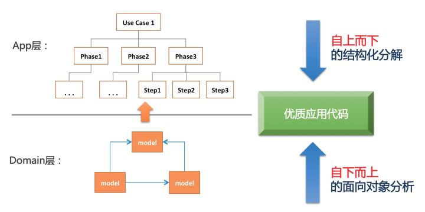

# 如何写好业务代码

## 概述
1. 理解业务
2. 抽象与拆分
3. 代码实现

---

## 方法论


### 自上而下的结构化分解
```
步骤1 -》步骤2 -》步骤3 -》步骤4 -》步骤5 -》... -》步骤n
```

**分解为**

```
阶段1 -》阶段2 -》阶段3
----------------------------
步骤1   |  步骤4   |   步骤n
步骤2   | 步骤5    |
步骤3   |
```

### 自下而上的面向对象分析
```
if (!a) {
  // ...
}

if (b > 1) {
  // ...
}

if (c !== 2) {
  // ...
}
```

**抽象为**

```
if (model.isOpposite(a)) {
  // ...
}

if (model.gt(b, 1)) {
  // ...
}

if (model.isNot(c, 2)) {
  // ...
}
```

---

## 推荐
ddd
