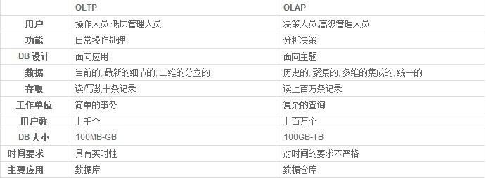
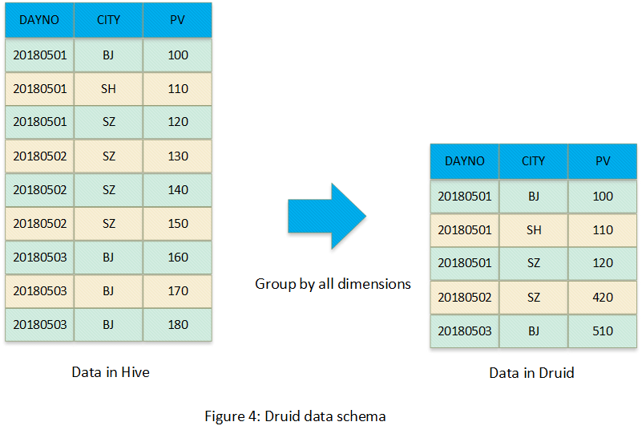
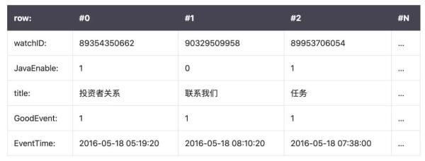
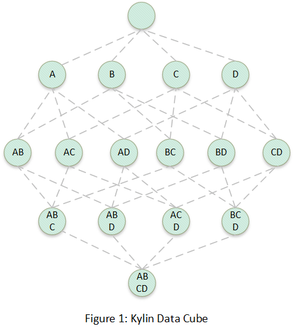
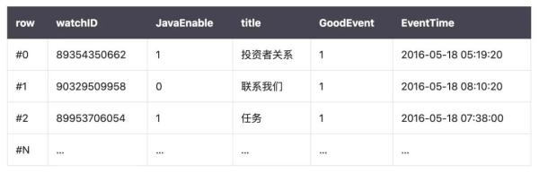

# 数据库对比

## OLTP和OLAP

---

## OLAP
> 聚合场景，查询效率排序：Kylin > Druid > ClickHouse

### druid

> 德鲁伊
> 1. 只适合聚合场景
> 2. 少量算子支持向量化
> 3. 预聚合方式是将所有维度进行Group-by

## clickhouse

> 1. 适合明细和聚合场景
> 2. 查询效率波动极大（当查询前缀元组能命中的时候效率最高，可是一旦不能命中，几乎会扫描整个表）
> 3. 支持向量化

## kylin

> 1. 只适合聚合场景
> 2. 查询效率波动极大
> 3. 不支持向量化
> 4. 预聚合方式是将二维表（Hive表）转换为Cube，然后将Cube存储到HBase表中，也就是两次转换

---

## OLTP

### mysql

---

