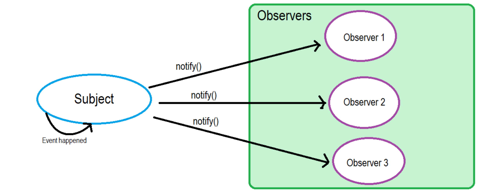
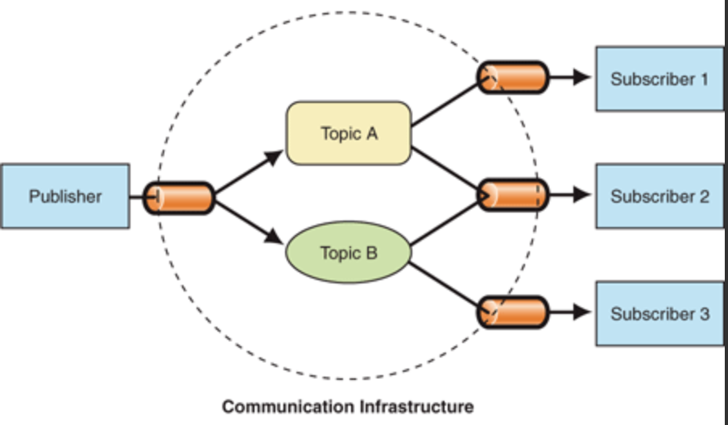
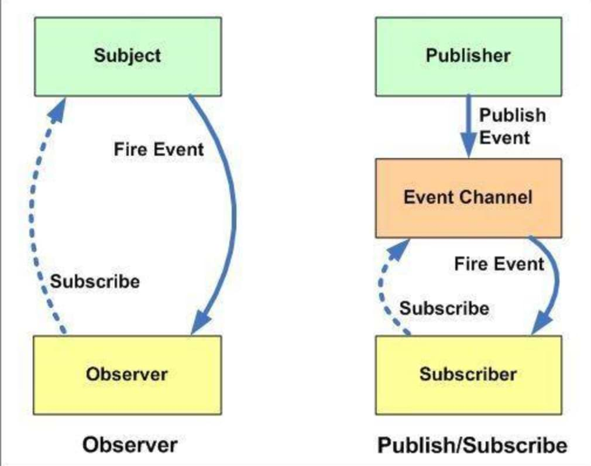

# 设计模式

[设计模式](https://www.w3cschool.cn/zobyhd/pyunfozt.html)

[TOC]

---

## 工厂模式
> 1. 工厂函数提供一个创建对象的公共接口
> 2. 根据入参的不同，创建不同类型的对象
> 3. 前端：各种支持props的基础组件

```js
function Car(options) {
  this.doors = options.doors || 4;
};

function Truck(options) {
  this.doors = options.doors || 2;
};

function VehicleFactory(klass) {
  this.klass = klass;
};

VehicleFactory.prototype.createVehicle = function createVehicle(options) {
  return new this.klass(options);
};

// carFactory
const carFactory = new VehicleFactory(Car);

// truckFactory
const truckFactory = new VehicleFactory(Truck);

// car instance
const newCar = carFactory.createVehicle({
  // ...
});

// truck instance
const newTruck = carFactory.createVehicle({
  // ...
});
```

---

## 单例模式
> 1. 限制一个类只能有一个实例化对象
> 2. 通常暴露getInstance方法用于实例化对象
> 3. 前端：局部store（vuex、redux）

```js
const mySingleton = (function() {
  let singleton;

  function init(options) {
    if (singleton) {
      return singleton;
    }

    singleton = {
      name: options.name,
    };
    return singleton;
  };

  return {
    getInstance(options) {
      const instance = init(options);
      return instance;
    },
  };
} ());

const me = mySingleton.getInstance();
const you = mySingleton.getInstance();
console.log(me === you); // true
```

---

## 原型模式
> 1. 动态改变对象的__proto__，比如Object.create
> 2. 动态改变类的prototype，基于类生产的对象的__proto__，都指向同一个原型
> 3. 前端：mixin？hooks？

### Object.create
```js
var vehicle = {
  getModel() {
      console.log('车辆的模具是：' + this.model);
  }
};

var car = Object.create(vehicle, {
  id: {
    value: MY_GLOBAL.nextId(),
    enumerable: true // 默认writable:false, configurable:false
  },
  model: {
    value: '福特',
    enumerable: true
  },
});
```

### prototype
```js
var proto = {
  init(model) {
    this.model = model;
  },
};

function vehicle(model) {
  function F() {};
  F.prototype = proto;
  var f = new F();
  f.init(model);
  return f;
};

//
var car = vehicle('mazda');
```

---

## 观察者模式
> 1. 维护一个依赖列表
> 2. 当自身状态有任何变更时，自动通知列表中的对象
> 3. 同步更新
> 4. 前端：事件触发



```js
function Observer() {
  this.list = [];
};

Observer.prototype.get = function get(index) {
  if (index > -1 && index < this.count()) {
    return this.list[index];
  }
};

Observer.prototype.count = function count() {
  return this.list.length;
};

Observer.prototype.add = function add(item) {
  return this.list.push(item);
};

// ...Observer.prototype.xx

function Subject() {
  this.observer = new Observer();
};

Subject.prototype.addObserver = function addObserver(item) {
  this.observer.add(item);
};

Subject.prototype.notify = function notify(message) {
  const count = this.observer.count();
  for (let i = 0; i < count; i += 1) {
    this.observer.get(i).update(message);
  }
};
```

---

## 发布订阅模式
> 1. 信息中介维护一个订阅列表
> 2. 发布者发送消息给信息中介
> 3. 信息中介过滤、处理消息，再通知订阅者
> 4. 异步更新
> 5. 前端：computed、watch



```js
function PubSub() {
  this.subscribers = {};
};

PubSub.prototype.subscribe = function subscribe(name, callback) {
  const thisSubscribe = this.subscribers[name] || [];
  thisSubscribe.push(callback);
  this.subscribers[name] = thisSubscribe;
};

PubSub.prototype.publish = function publish(name, ...args) {
  const thisSubscribe = this.subscribers[name] || [];
  thisSubscribe.forEach((callback) => callback(...args));
};

// ...
const pubSub = new PubSub();
pubSub.subscribe('SMS', console.log);
pubSub.subscribe('SMS', console.log);
pubSub.publish('SMS', 'I published `SMS` event');
```

### 与观察者模式的区别



- `观察者模式`中的观察者和被观察者之间存在耦合，必须确切知道对方存在才能建立监听
- `发布订阅则`不需要，完全通过消息代理来通讯

---

## 门面模式
> 1. 简化类的接口
> 2. 消除类和使用本类的客户端的代码耦合
> 3. 通过构建一个简单的门面代码让系统变得更简单
> 4. 前端：utils

```js
// 封装兼容性判断，简化外部调用
function addEventFacade(el,type,fn) {
  if (window.addEventListener) {
    el.addEventListener(type,fn,lse);
  } else if (window.attachEvent) {
    el.attachEvent("on"+type,fn);
  } else {
    el["on"+type] = fn;
  }
}
```

---

## 策略模式

> 定义通用&必须的内容，供未来扩展
>
> 前端：vue2的装饰器形式

```ts
interface Strategy {
  listen(): any;
  close(): any;
}


class StrategyA implements Strategy {
  public listen() { /**/ }
  public close() { /**/ }
}

class StrategyB implements Strategy {
  public listen() { /**/ }
  public close() { /**/ }
}
```


---

## 适配器模式

> 提供可扩展的部分，实现必须部分，供未来扩展

```ts
interface HttpServer {
  get(): any;
  get(path: string): any;
  get(path: string, handler: any): any;
}

abstract class AbstractHttpAdapter implements HttpServer {
  public get(...args: any[]) {
    /**/;
  }
}

class HttpAdapterA extends AbstractHttpAdapter {
  
}

class HttpAdapterB extends AbstractHttpAdapter {
  
}
```

