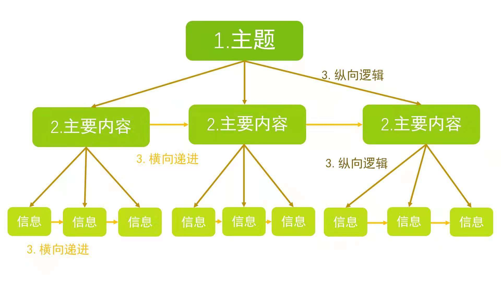
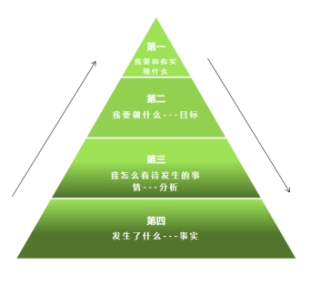

# 高效沟通

## 目录

展开更多

* [`高价值问题`](#高价值问题)
* [`《高效表达》`](#高效表达)
* [`> 定主题`](#定主题)
* [`> 表达框架`](#表达框架)
* [`> 表达素材`](#表达素材)
* [`> 临时汇报`](#临时汇报)
* [`> 回应质疑`](#回应质疑)
* [`> 跨团队沟通`](#跨团队沟通)
* [`《结构化思维》`](#结构化思维)
* [`> 主题先行`](#主题先行)
* [`> 归类分组`](#归类分组)
* [`> 逻辑递进`](#逻辑递进)
* [`> 临场发言`](#临时汇报)
* [`> 结构化练习方式`](#练习方式)
* [`> 结构化讲故事`](#结构化讲故事)
* [`> 课后答疑`](#结构化思维课后答疑)
* [`《结构化写作》`](#结构化写作)
* [`> 写作内容`](#确定写作内容)
* [`> 写作框架`](#构思写作框架)
* [`> 填充内容`](#填充内容)
* [`> 成文修改`](#成文修改)
* [`> 商务邮件`](#商务邮件)
* [`> 工作总结`](#工作总结)
* [`沟通模型`](#沟通模型)

## 高价值问题
>
> 养成一个习惯，在看到问题之后，不要马上解决，而是按清单过一遍
>

- 澄清需求
- 挖掘诉求
- 找准问题
- 确定关键
- 可行性
- 正确思考

### 澄清需求
背景、目的、关键利益方、可用资源、时间节点

kano模型
- 基本需求（满足条件即可）
- 期望需求（越满足越好）
- 兴奋需求（锦上添花）

### 挖掘诉求
> 非与人相关，此条可略

提问动机、真正诉求、其他实现方式、我能做什么

### 找准问题
是否是表象问题、真正原因是什么

### 确定关键
是否需要立刻解决、是否还有更重要的问题

### 可行性
能否解决、时间点能否接受

### 正确思考
> 苦死无解时问自己

思考了多久、进展怎样、继续如此能否解决问题

---

## 第3选择

**放下主观臆断**

1. 时刻记住自己的目的，要解决问题，而不是面子
2. “我选择做” 代替 “我不得不做”

**了解对方的诉求**

1. 保持倾听，多问“然后那”、“所以你的意思是。。。？”、“我理解没错的，你是说。。。？”

**创造第三选择**

1. 做大蛋糕
2. 逆向
3. 引入新条件

---

## 高效表达

### 定主题

**明确汇报对象**

- CEO：主题和公司战略挂钩
- 部门主管：主题和部门业绩挂钩
- 直属领导：主题和方法论、自身遇到困难 + 如何克服相关

**明确汇报目的**

- 奖金：重产出，突出成绩
- 升职加薪：重未来期望（1. 谈个人能力 2. 工作规划）

### 表达框架

**1.时间轴结构**

>
> 首先->然后->最后
>
> 过去->现在->未来
>

使用场景：
- 一时没有头绪
- 汇报工作进度
- 谈新工作设想

**2.解决问题结构**

>
> 承认问题 -> 分析原因 -> 解决方案
>

使用场景：
- 面对上级质疑
- 汇报发生的事故

**2.FAB结构**

>
> 属性 -> 优势 -> 利益
>

使用场景：
- 自我介绍（基本情况->过人之处->可提供的帮助）
- 面试

### 表达素材

**数据**

>
> 1. 提供数据，给人一种专业感
>
> 2. 数据本身没意义，所以要对数据做解释
>
> 3. 数据太多，影响听众理解，所以要对数据筛选 + 突出关键数据
>

**故事**

>
> 冲突->行动->结局
>
> 冲突点明了问题的严重性，吸引听众关注你的行动
>

### 临时汇报

必须包含下面几个关键内容：

- 汇报进度
- 汇报成果
- 汇报困难

**汇报进度**

> 1. 体现自己的积极主动
>
> 2. 提升上级的掌控感
>

**汇报成果**

> 避免细节，提供关键数据即可

**汇报困难**

> 2w1h
what - 发现问题
why - 找出原因
how - 提供多个解决方案，分析各自利弊，给出自己观点

#### 其他注意事项
- 汇报过程关注老板反应，调整汇报节奏（不耐烦要直奔主题，疑惑要提供其他数据佐证）
- 关注老板风格（关注结果or关注细节）
- 逼迫自己选择一个视角，开始回答
- 不断回答听众的疑问（帮助听众不断深入）

### 回应质疑
对方提问后，要给自己留`5秒`时间思考，这段时间可以做两件事：

- 认可对方提问
- 澄清（重复）对方问题
- 结构化回答（定主题、搭架子、填素材）

**好处：**

- 避免将氛围，从`对话`转为`对抗`
- 确保和对方在谈论同一件事

#### 认可对方提问
- 感谢你的提问，我想其他人也会有此疑问
- 正如你所提到的xxx
- 看得出，你对xxx不太满意（如果对方提问带有情绪的话）

避免【这是个好问题】，会暗示自己在更高位置

#### 澄清（重复）对方问题
- 我不确定是不是明白你的问题，你是说xxx
- 你能否重复一遍问题，更具体的描述下xxx
- 你能否举个例子具体说明下xxx

### 跨团队沟通

沟通困难主要体现在：
- 各部门优先级事项不同（你痛我不痛，和我无关）
- 各方理解存在偏差（尽快是多快，1天？1周？）

#### 解决问题结构
- why
- what
- benefit
- action

**why**

背景、问题严重性

**what**

给出明确需要做的事

**benefit**

站在对方角度说明这么做的好处

**action**

拆分出最快能实现的部分先做

---

## 结构化思维

**大脑思维习惯**

- 喜欢归纳主题
- 喜欢归类
- 喜欢有规律
- 喜欢数字3

**特征**

- 主题先行
- 归类分组
- 逻辑递进（可以参考下图）

### 主题先行

主题不是议题，主题表明自己清晰的观点

- 主题适度
- 主题符合预期
- 主题有思想
- scqa（复杂场景时）

#### 主题适度
表明主题，不应占用太多篇幅

#### 主题符合预期
- 首先明确必要背景
- 与后面阐述内容高度相关
- 保证论述前后主题一致

#### 主题有思想
提炼出后面阐述内容的共性，提出来

#### scqa
s（背景）c（冲突，事情复杂性）q（问题）a（答案）

- 标准式（sca）
- 开门见山式（asc）
- 突出忧虑式（csa）
- 突出信心式（qsca）

**标准式**

当问题显而易见时，可以省略

**开门见山式**

听众不耐烦或没时间时

**突出忧虑式**

营销号手法，先爆出一个“大新闻”

### 归类分组

- 信息归类
- 归纳共性
- 结构提炼

#### 信息归类
罗列所有需求点，根据一定维度进行归类

#### 归纳共性
语义化上一步的维度标准，即精炼出共性

#### 结构提炼
查看各归类中是否存在缺失内容，记得补齐

**MECE原则**

> Mutually Exclusive Collectively Exhaustive

ME - 相互独立
CE - 完全穷尽

完全解决问题，需要严格做到MECE
只是为了说服别人，或论证观点，严格做到ME即可

### 逻辑递进

- 纵向推理
- 横向递进

#### 纵向推理

- 演绎推理
- 归纳推理

**演绎推理**

包含结论、大前提（普遍事实）、小前提，从既定现象/规律，推导出事实个例

**归纳推理**

从大量已知个例事实，推导出一定现象/规律

#### 横向递进

- 时间顺序
- 空间顺序
- 程度顺序

**时间顺序**

- 时间
- 周期
- 流程、步骤

**空间顺序**

- 具体地点
- 一个整体的组成部分
- 抽象要素（3C）
- 二维矩阵（重要&紧急矩阵）

**程度顺序**

- 重要
- 紧急

### 练习方式

#### 输入
- 拆文章（收集架子）
- 存模型（记录各种模型）
- 建素材库（按时间、空间、程度分类）

#### 输出
每天3篇、各讲2分钟

### 结构化讲故事

故事三要素：
- 冲突
- 行动
- 结局

什么是冲突？渴望 + 阻碍

对应了之前的 scqa 模型

### 结构化思维课后答疑

---

## 沟通模型

### 3C
- Capability: 你有足够的能力来服务客户，或者你的产品足够好
- Compatibility: 你的产品或服务，能够匹配客户的需求
- Confidence: 你的言谈、举止或者你的产品宣传，给客户信心，让对方相信，买了你的产品/服务，就可以解决问题

**Compatibility最重要，因为必须知道别人需要什么，才能卖给他**

### kano
> 做产品时看看
- 基本需求（满足条件即可）
- 期望需求（越满足越好）
- 兴奋需求（锦上添花）

### 冰山模型
> 面试时看看

[冰山模型](./冰山模型.jfif)

- 知识和技能
- 软技能、通用能力
- 天赋

#### 知识和技能
特定岗位硬件条件

#### 软技能、通用能力
> 创新能力、表达能力

通用岗位硬件能力

#### 天赋
> 价值观、性格特质、动机

### 行为分析模型
> 困惑时看看

- 解释系统（角色认知）-》知道需要做什么及要求
- 动力系统（行为意愿）-》是否有意愿去做
- 能力系统（行为能力）-》是否有能力做

#### 应用场景

**分析员工行为，使之最大化产出**

解释系统: 使之明确需求，对工作重点有清晰认识
动力系统: 要钱or要发展，因人而异，不同对待
能力系统: 员工是否缺乏应对能力，是否需要培训

**分析自己，使自己发挥最大**

解释系统: 是否清楚岗位工作重点
动力系统: 工作内容是否符合自己预期（性格、价值观、家庭）
能力系统: 是否具备工作所需能力

**分析亲密关系的人**

解释系统: 对方是否清楚，自己对其的要求、预期是什么
动力系统: 对方内心意愿度
能力系统: 对方是否有付出，但是缺少发力点等

### 精进表达模型
> 陈述工作

在表达的时候是要从顶端往下，也就是我们学习的主题先行思维，我们的课程的金字塔图的样式。那么在陈述工作的时候
第一，我和你要实现什么；（让对方第一时间知道事情）
第二，我要做什么；（目标是什么）
第三，怎么看待发生的事情；（分析）
第四，附上发生事情的事实，可能需要数据支撑。（发生了什么）
 
在准备陈述的时候顺序倒过来：
第四，发生了什么；
第三，我怎么看待发生的事情；
第二，我要做什么；
第一，我要和对方实现什么。

### SCAMPER模型
> 适合于已经存在的一个产品、服务或者方案，需要进行修改或改进的时候，来打开思路，找到改进点，
>
> 是一个可以提供系统化思考的问题清单。
>

- **S**: Substitute（代替）
- **C**: Combine（合并）
- **A**: Adapt（适应）
- **M**: Modify（修改）
- **P**: Put to other uses（作为他用）
- **E**: Eliminate（简化）
- **R**: Reverse（反向）

### PDCA
> 当领导咨询你的工作计划

- **P**: (plan) 计划，包括方针和目标的确定，以及活动规划的制定。
- **D**: (Do) 执行，根据已知的信息，设计具体的方法、方案和计划布- 局；再根据设计和布局，进行具体运作，实现计划中的内容。
- **C**: (Check) 检查，总结执行计划的结果，分清哪些对了，哪些错- 了，明确效果，找出问题。
- **A**: (Action)处理，对总结检查的结果进行处理

### SWOT
> 当领导叫你分析问题

- **S**: （strengths）优势
- **W**:（weaknesses）劣势
- **O**: （opportunities）机会
- **T**:（threats）威胁

举例：xxx的优势是，xxx的劣势是，如果利用优势会有xxx机会，如果利用劣势，会有xxx威胁

### ABC
> 邮件正文书写方式

- **A**: （Action），发出邮件后希望看到的行动，谁在什么时间点要做什么
- **B**：（Background）背景，达成目的，看到邮件的人需要了解什么信息
- **C**：（Close）闭环，如何掌握行动的反馈，确保行动完成

### 商业模式画布
[商业模式画布](./商业模式画布.jfif)

---

## 结构化写作

### 确定写作内容
- 确认和读者的立场一致
- 对应游说矩阵

#### 确认和读者的立场一致
- 是否同意你的观点
- 如果同意，是否会由于外部条件限制，而暂时没这么做

#### 对应游说矩阵

四种：

- 立场一致/不一致
- 资源约束/无约束

|  | 立场一致 | 立场不一致 |
| --- | -----: | :----: |
| 资源无约束 | 完全达成一致，仅罗列事实即可 | 说服，强调利益所在 |
| 资源约束 | 对约束问题，提供解决方案 | 说服&提供解决方案 |

### 构思写作框架
- 收集素材
- 归纳共性
- 提炼结构
- 补充信息
- 提炼主题

#### 收集素材
- 事实
- 观点
- 新闻
- 故事

#### 归纳共性
- 信息归类

#### 提炼结构
- 根据你自己的观点，对归类做解释，提炼出结论

#### 补充信息
- 基于 MECE 原则，结论去重

#### 提炼主题
- 结论提升为子主题，推导出主题

### 填充内容
- 主题鲜明
- 完善提纲
- 承上启下
- 结尾升华

#### 主题鲜明
- 主题和接下来的内容高度相关
- 主题要吸引人，不宜过长
- 主题要有思想

#### 完善提纲
分类列出支持主题的重要信息

#### 承上启下
- 注意段落间、结构间过渡
- 制造疑问，引读者接受接下去的内容
- 避免机械式的，尝试背景+问题

#### 结尾升华
提醒读者，读完文章之后需要思考或做什么

如果做结尾升华？
> 阐明建议、下一步计划，未来展望

### 成文修改
- 检查主题、子主题是否明确
- 检查整体思路
- 检查内容是否详实、是否具体（需要用具体数字支撑）
- 检查语言是否得体
- 检查语法、标点符号

### 商务邮件

#### 维度
两个维度，内容维度 + 态度维度

- 内容， 参考【ABC法则】
- 态度，考虑到读者的**易读**和**舒适**

**易读**

内容做到自带翻译，自带重点

**舒适**

- 低阶：开头问好，结尾感谢
- 中阶：提倡语气代替命令预语气
- 高阶：让人看完邮件后很有行动力

#### 表达清晰
- 用客观事实，非主观态度
- 用框架、排版代替长篇大论

#### 行文规范
- 邮件标题可以包含关键词
- 正文第一句就要点明邮件目的
- 关键信息如时间、地点等，高亮出来
- 发送前，5w1h（who、what、where、when、why）检查

### 工作总结
- 工作业绩
- 个人成长
- 工作计划

#### 工作业绩
- 做了xxx，产生xxx结果
- 未完成的目标，放在中间（避免第一或最后）
- 不要指责、推卸

#### 个人成长
- 按照下一级能力模型，对照自己的产出
- 他人佐证

#### 工作计划
- 结合公司未来规划

> PDCA

**P** - plan，最终目标，如何完成
**D** - do，如何拆解大目标
**C** - check，执行过程中，如何检查是否达成目标要求
**A** - action，如果没有达成目标，如何修正可能出现的问题

