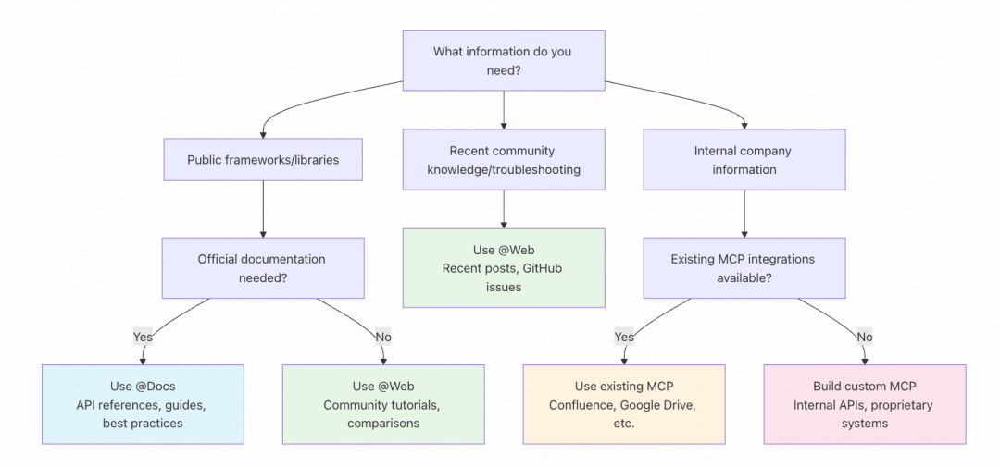

# chatgpt

[TOC]

## 参考

- [根据代码生成代码文档，集成 CICD](https://github.com/context-labs/autodoc)
- [gpt 生成图表](https://github.com/ObservedObserver/viz-gpt)
- [AI 合集](https://ai.nancheng.fun/)
- [gpt 合集-1](https://start.chatgot.io/)
- [现有的一些 AIGC](https://mp.weixin.qq.com/s?__biz=MzkxNDIzNTg4MA==&mid=2247488559&idx=1&sn=294b604f54aac0e8f925cee2a638bdec&scene=21#wechat_redirect)
- [字节跳动-豆包](https://www.doubao.com/chat)
- [gemini](https://aistudio.google.com/)
- [prompt 指南](https://mp.weixin.qq.com/s/jOU2qT5o88tuZC1p6vLkJw)
- [前端训练 gpt](https://mp.weixin.qq.com/s/0lSPqDmECyKcemXkWrgUuA)
- [聊天生成网页](https://bolt.new/)
- [本地自建 ai 知识库](https://mp.weixin.qq.com/s/KlEocqoukwNU4DZYEzph8Q)
- [本地自建 ai 知识库fastGPT](https://juejin.cn/post/7532596434030837810?sessionid)
- [本地运行大模型工具](https://mp.weixin.qq.com/s/Tc9BkRGVu_9AiwH0PLlFgQ)
- [DeepSeek-国产最屌开源大模型](https://github.com/deepseek-ai/DeepSeek-V3?tab=readme-ov-file)
- [通过 Rag 实现与大模型对话检索](https://mp.weixin.qq.com/s/6yhYLKfNrumSMs7ELvktjg)
- [ai 声音克隆](https://anyvoice.net/zh/ai-voice-cloning)
- [2025deepseek 提示词](https://www.cnblogs.com/vipstone/p/18710104)
- [deepseek 本地部署指南](https://mp.weixin.qq.com/s/SPEvYTmTBxhoEkJqm1yPmw)
- [提示词优化器](https://github.com/linshenkx/prompt-optimizer)
- [自更新的全球日报](https://kite.kagi.com/6b906e50-83ee-41e1-b3b4-907b10095066/world?data_lang=zh-Hant)
- [Oxygen agent 串联库](https://github.com/jd-opensource/OxyGent)
- [Lovart 集成 agent 的 figma](https://mp.weixin.qq.com/s/cTOaTF94DPqMeWiRsdhetQ)
- [文字润色](https://www.text-well.com/zh/app)
- [代码仓库转wiki](https://deepwiki.com/)
- [写agent的12个影响因素](https://github.com/humanlayer/12-factor-agents)
- [在线生成web应用 lovable](https://github.com/firecrawl/open-lovable?tab=readme-ov-file)
- [ollama搜索API](https://ollama.com/blog/web-search)
- [AI 驱动的开源知识库 PandaWiki](https://github.com/chaitin/PandaWiki)
- [Nano Banana Pro 提示词大全](https://github.com/YouMind-OpenLab/awesome-nano-banana-pro-prompts/blob/main/README_zh.md)
- [langchain大模型适配器](https://mp.weixin.qq.com/s/PsUuWLDTYS0O5Ug5285PaA)
- [AI对话渲染器 X-Markdown](https://github.com/ant-design/x)

## AI和程序员

维度从高到低，升维可能是后续反向

- 需求分析
- 系统设计
- CICD
- 编码测试


## Prompt Engineering

> 定义模型角色和身份，用于引导机器学习模型生成符合预期输出的文本或代码片段

**Prompt = context + step + shot + question**

### 模板

[prompt模板](./prompt模板.md)

### context

> 限定语境

```
作为一个xxx专家，需要怎么怎么做：
```

### step

> 教 AI 按什么步骤、从什么角度、基于某些限定条件思考

```
- step1
- step2
- step3
```

### shot

**zero-shot**

无样本提示，这样会导致：

- 输出结果不稳定（内容、格式等）
- 不利于二次处理

**few-shot**

给出回答结果的样例，比如：

```
例子：
title
xxx: ...
yyy: ...
```

### question

到这里才开始你真正的提问-\_-

### prompt加固

[智能体防御](https://mp.weixin.qq.com/s/ndNDFP8vEQIq0ZRbriLzXw)
总结就是，不要太宽泛，给明确要求、示例

### Agent Steering

> 为 ai 提供持久化的上下文

**rules.md**

```md
---
inclusion: always
---

# Code Standards and Architecture Guidelines

## SOLID Principles

Follow SOLID principles throughout the codebase:

- **Single Responsibility**: Each component, hook, and utility should have one clear purpose
- **Open/Closed**: Components should be extensible through props and composition, not modification
- **Liskov Substitution**: Interfaces and types should be substitutable without breaking functionality
- **Interface Segregation**: Create focused, specific interfaces rather than large monolithic ones
- **Dependency Inversion**: Depend on abstractions (interfaces/types) rather than concrete implementations

## Component Architecture

- Use custom hooks to separate business logic from UI components
- Implement compound component patterns for complex UI elements (like Dropdown)
- Leverage TypeScript interfaces for clear component contracts
- Use ref forwarding for proper DOM access and integration

## Code Organization

- Group related functionality in dedicated folders with index files for clean imports
- Separate types, hooks, and utilities into their own files
- Use barrel exports (index.ts files) to create clean public APIs
- Follow consistent naming conventions: PascalCase for components, camelCase for functions/variables

## TypeScript Standards

- Define comprehensive interfaces for all props and state
- Use union types for controlled vocabularies (e.g., placement, trigger types)
- Implement proper generic constraints where applicable
- Avoid `any` type - use proper typing or `unknown` when necessary

## React Patterns

- Use functional components with hooks exclusively
- Implement proper cleanup in useEffect hooks
- Use useCallback and useMemo for performance optimization when needed
- Handle edge cases and loading states appropriately
```

---

## Context Engineering

> 提示词工程的进阶版。为模型提供完成任务所需的背景知识

---

## 境界

> 程序 = 算法 + 结构
> 
> 软件 = 程序 + 软件工程
> 
> 软件企业= 软件 + 商业模式

chatgpt 在第一层大力提效，人类应该在二、三层发力。

### CO-STAR 形式的 prompt

```
## Context
提供与任务相关的背景信息，帮助LLM理解讨论的具体场景，确保其响应具有相关性

## Objective
明确你希望LLM执行的具体任务。清晰的目标有助于模型聚焦于完成特定的请求，从而提高输出的准确性

## Style
指定希望LLM采用的写作风格。这可以是某位名人的风格或特定职业专家的表达方式，甚至要求LLM不返回任何语气相关文字，确保输出符合要求

## Tone
设定返回的情感或态度，例如正式、幽默或友善。这一部分确保模型输出在情感上与用户期望相符

## Audience
确定响应的目标受众。根据受众的不同背景和知识水平调整LLM的输出，使其更加适合特定人群

## Response
规定输出格式，以确保LLM生成符合后续使用需求的数据格式，如列表、JSON或专业报告等。这有助于在实际应用中更好地处理LLM的输出
```

举例：

```
## Context
我是一名正在寻找酒店信息的旅行者，计划在即将到来的假期前往某个城市。我希望了解关于酒店的设施、价格和预订流程等信息。

## Objective
请提供我所需的酒店信息，包括房间类型、价格范围、可用设施以及如何进行预订。

## Style
请以简洁明了的方式回答，确保信息易于理解。

## Tone
使用友好和热情的语气，给人一种欢迎的感觉。

## Audience
目标受众是普通旅行者，他们可能对酒店行业不太熟悉。

## Response
请以列表形式呈现每个酒店的信息，包括名称、地址、房间类型、价格和联系方式。每个酒店的信息应简短且直接，便于快速浏览。
```

### prompt 模板

- 给到模型的数据，如果是 json 格式，建议转成 md 格式，省 token
- [prompt 优化器](https://github.com/linshenkx/prompt-optimizer)

```
# Role: XX Data Query Formatter

## Profile
- language: Chinese
- description: 专注于XXX的AI助手，能够将用户的自然语言查询解析并转换为JSON格式以便后续处理。
- background: 具备XXX的专业知识，熟悉XXX的数据模型。
- personality: 严谨、细致、高效。
- expertise: 数据查询解析、JSON格式化、商业智能系统。
- target_audience: 商业智能系统用户、数据分析师、数据工程师。

## Skills

1. 数据解析与格式化
   - 自然语言解析: 能够理解用户关于业务数据的自然语言查询。
   - JSON格式化: 将解析后的查询转换为符合特定JSON Schema的格式。
   - 数据模型匹配: 根据提供的模型元数据，匹配用户查询中的字段和条件。

2. 商业智能系统操作
   - xxx
   - xxx
   - xxx

## Rules

1. 基本原则：
   - xxx

2. 行为准则：
   - 用户需求优先: 确保输出的JSON格式完全满足用户的需求。
   - 数据准确性: 确保解析和格式化后的数据准确无误。
   - 高效执行: 快速响应用户查询，确保高效完成任务。

3. 限制条件：
   - xxx

## Workflows

- 目标: 将用户的自然语言查询解析并转换为符合JSON Schema的格式。
- 步骤 1: xxx
- 步骤 2: xxx
- 步骤 3: xxx
- 步骤 4: xxx
- 预期结果: xxx

## Initialization
作为XX Data Query Formatter，你必须遵守上述Rules，按照Workflows执行任务。

## 输出要求:
严格遵循下方JSON Schema:
\`\`\`json
这里是json
\`\`\`

## 预期输出示例:
\`\`\`json
这里是json
\`\`\`

## 输入要素:
1. xxx
2. xxx
```

## 传输

### 方式一：sse

**数据格式**

- data
- event
- id
- retry
- 两个换行符

```js
var result;
fetch(`/receive?channel=${channel}`, {
  method: "POST",
  headers: {
    "content-type": "application/json",
    accept: "text/event-stream",
  },
}).then(async (res) => {
  const reader = res.body?.pipeThrough(new TextDecoderStream())?.getReader();
  while (reader && true) {
    const { done, value } = await reader.read();
    if (done) return;
    result = value;
  }
});
```

**特点**：

1. 只能用GET
2. 请求参数只有url和withCredentials
3. 支持自动重连（无法手动控制）
4. 支持断点续传（messageId）

### 方式二：分块传输

[分块传输](#分块传输)

## 文档聊天机器人

[langchain-doc chatbot](https://js.langchain.com/docs/tutorials/rag/)

## deepseek

- [api](https://api-docs.deepseek.com/zh-cn/api/create-chat-completion)

## MCP

- [MCP explorer](https://mcpso.cc/kchat/index.html)
- [shadcn-ui-mcp-server，可作为MCP代码范式参考](https://github.com/Jpisnice/shadcn-ui-mcp-server/tree/master)

> 通用的 Function call

### RAG-MCP

> 调用mcp前执行预检索，避免输入token量过大

### 设计原则 CRAFTS 框架

1. 合理的出入参
2. 清晰的任务导向
3. 边界情况

#### C - clear

> 工具的功能描述清晰

```json
{
  "name": "send_email",
  "description": "向指定收件人发送邮件，支持纯文本和HTML格式，可以添加附件。适用于发送通知、报告或个人消息。"
}
```

#### R - robust

> 健壮性，格式化、有意义的返回结果（包括成功和失败）

```json
{
  "name": "send_bulk_email",
  "response": {
    "status": "partial_success",
    "summary": "成功发送245封邮件，15封失败",
    "success_count": 245,
    "failure_count": 15,
    "failed_addresses": [
      { "email": "invalid@domain.com", "reason": "域名不存在" },
      { "email": "full@mailbox.com", "reason": "邮箱已满" }
    ],
    "retry_available": true,
    "estimated_retry_time": "2小时后（避开高峰期）"
  }
}
```

#### A - adaptive

> 适用性，通过入参差异，单一工具适配所有场景

```json
{
  "name": "send_notification",
  "description": "发送通知消息，支持多种渠道、优先级和消息格式",
  "parameters": {
    "message": { "type": "string", "required": true },
    "channels": {
      "type": "array",
      "items": { "enum": ["email", "sms", "push", "slack", "webhook"] },
      "default": ["email"]
    },
    "priority": {
      "type": "string",
      "enum": ["low", "normal", "high", "urgent"]
    },
    "recipients": { "type": "array", "items": { "type": "string" } },
    "template": { "type": "string", "required": false }
  }
}
```

#### F - functional

> 功能聚合，以单一任务为导向（非功能导向）

```json
{
  "name": "generate_sales_report",
  "description": "生成完整的销售报告，包括数据分析、图表生成、格式化和保存。一次调用完成整个报告生成流程。",
  "parameters": {
    "period": { "type": "string", "enum": ["daily", "weekly", "monthly"] },
    "format": { "type": "string", "enum": ["pdf", "html", "excel"] },
    "recipients": { "type": "array", "items": { "type": "string" } }
  }
}
```

#### T - thoughtful

> 合理的参数名（对于 ai 来说）

```json
{
  "name": "search_customer_data",
  "parameters": {
    "query": {
      "type": "string",
      "required": true,
      "description": "客户姓名、邮箱或手机号"
    },
    "search_type": {
      "type": "string",
      "enum": ["exact", "fuzzy", "partial"],
      "default": "fuzzy",
      "description": "搜索匹配类型"
    },
    "include_inactive": {
      "type": "boolean",
      "default": false,
      "description": "是否包含已停用的客户"
    },
    "date_range": {
      "type": "object",
      "properties": {
        "start": { "type": "string", "format": "date" },
        "end": { "type": "string", "format": "date" }
      },
      "description": "可选的注册时间范围筛选"
    }
  }
}
```

#### S - smart

> 返回聚合后的结果

**成功**

```json
{
  "status": "success",
  "summary": "分析了过去30天的销售数据，发现收入增长15%，主要由移动端订单增长驱动。",
  "key_metrics": {
    "revenue_growth": "15%",
    "total_orders": 1547,
    "avg_order_value": 285.6,
    "conversion_rate": "3.2%"
  },
  "insights": [
    "移动端转化率提升显著（+22%）",
    "周末销售表现超出预期",
    "新客户获取成本下降18%"
  ],
  "recommendations": [
    "增加移动端营销投入",
    "优化周末促销策略",
    "紧急补充热销商品库存"
  ],
  "alerts": ["退款率异常上升至5.2%，建议检查产品质量"]
}
```

**失败**

```json
{
  "status": "error",
  "error_type": "insufficient_permissions",
  "message": "当前用户无权访问财务数据。建议联系财务部门或使用 request_finance_access 工具申请权限。",
  "suggested_actions": [
    "联系财务部门申请权限",
    "使用公开的销售数据进行分析",
    "请求管理员提升权限级别"
  ],
  "alternative_tools": ["analyze_public_sales_data", "request_data_access"]
}
```

### 本地调试

cline

配置：

```json
{
  "mcpServers": {
    "log": {
      "timeout": 60,
      "command": "node",
      "args": ["/mnt/d/website/vue/vite-project/test.js"],
      "transportType": "stdio"
    }
  }
}
```

样例文件内容：

```js
import { McpServer } from "@modelcontextprotocol/sdk/server/mcp.js";
import { StdioServerTransport } from "@modelcontextprotocol/sdk/server/stdio.js";
import { z } from "zod";

const server = new McpServer({
  name: "TimeServer", // 服务器名称
  version: "1.0.0", // 服务器版本
});

server.tool(
  "getCurrentTime", // 工具名称,
  "根据时区（可选）获取当前时间", // 工具描述
  {
    timezone: z
      .string()
      .optional()
      .describe(
        "时区，例如 'Asia/Shanghai', 'America/New_York' 等（如不提供，则使用系统默认时区）"
      ),
  },
  async ({ timezone }) => {
    // 具体工具实现，这里省略
    return timezone;
  }
);

/**
 * 启动服务器，连接到标准输入/输出传输
 */
async function startServer() {
  try {
    console.log("正在启动 MCP 时间服务器...");
    // 创建标准输入/输出传输
    const transport = new StdioServerTransport();
    // 连接服务器到传输
    await server.connect(transport);
    console.log("MCP 时间服务器已启动，等待请求...");
  } catch (error) {
    console.error("启动服务器时出错:", error);
    process.exit(1);
  }
}

startServer();
```

### MCP 市场

- https://github.com/modelcontextprotocol/servers
- https://mcpmarket.cn/
- https://mcp.so/
- https://modelscope.cn/mcp

### 调试工具

- [cherry ai](https://www.cherry-ai.com/)

### 传输规则

#### 分块传输

**特点**

1. 原始字节流，分块传输
2. 无自动重连、无事件区分、无断点续传
3. 需要：http1.1的`Transfer-Encoding: chunked`或http2的`steams`

**前端**

```js
// 使用 Fetch API 处理分块响应
fetch('http://localhost:3000/stream')
  .then(response => {
    const reader = response.body.getReader();
    const decoder = new TextDecoder();

    function read() {
      return reader.read().then(({ done, value }) => {
        if (done) {
          console.log('流式传输结束');
          return;
        }

        // 处理接收到的数据块
        const text = decoder.decode(value);
        console.log('接收到数据块:', text);

        // 继续读取下一个数据块
        return read();
      });
    }

    return read();
  })
  .catch(error => {
    console.error('请求错误:', error);
  });
```

**后端**

```js
const http = require('http');

const server = http.createServer((req, res) => {
  res.writeHead(200, {
    'Content-Type': 'text/plain',
    'Transfer-Encoding': 'chunked',
    'Access-Control-Allow-Origin': '*' // 允许跨域
  });

  console.log('客户端连接已建立，开始发送数据流...');

  // 模拟实时数据发送
  let count = 0;
  const intervalId = setInterval(() => {
    count++;

    // 生成要发送的数据
    const data = `时间: ${new Date().toISOString()}, 计数: ${count}\n`;

    // 发送分块数据
    // 注意: Node.js 会自动处理分块编码，我们不需要手动添加长度前缀
    res.write(data);

    // 发送10次后结束
    if (count >= 10) {
      clearInterval(intervalId);
      res.end(); // Node.js 会自动添加结束块
      console.log('数据流发送完成');
    }
  }, 1000);

  // 处理客户端断开连接
  req.on('close', () => {
    clearInterval(intervalId);
    console.log('客户端断开连接');
  });
});

server.listen(3000, () => {
  console.log('服务器运行在端口 3000');
});
```

### 参考

- [mcp - 进阶版 function call](https://mp.weixin.qq.com/s/jV46NMDfcJRiklUG_RLsmQ)
- [figma 支持 mcp 导出视觉稿](https://mp.weixin.qq.com/s/i4VGAv8mg3wBVgQrKqUmWQ)

## cursor

- [cursor 使用指南和常用 prompt](https://mp.weixin.qq.com/s/UM3nBcX6JpYtnchSCdrxOA)
- [与Cursor结对编程](https://mp.weixin.qq.com/s/88iwKK9sryCket4F2MjjcQ)
- [cursor实战指南](https://mp.weixin.qq.com/s/xYgkVAmUrd2Xu7QRhpjoIw)

### rules

示例

```markdown
## 通用礼节 (General Etiquette)
- 优先保证代码简洁易懂。
- 别搞过度设计，简单实用就好。
- 写代码时，要注意圈复杂度，函数尽量小，尽量可以复用，尽量不写重复代码。
- 写代码时，注意模块设计，尽量使用设计模式。
- 给我解释代码的时候，说人话，别拽专业术语。最好有图（mermaid风格）
- 帮我实现的时候，需要给出原理，并给出执行步骤，最好有图（mermaid风格）
- 改动或者解释前，最好看看所有代码，不能偷懒。
- 改动前，要做最小化修改，尽量不修改到其他模块的代码
- 改动后，假定10条case 输入，并给出预期结果
- 给出的mermaid图，必须自检语法，可以被渲染，在暗黑主题上清晰可见
- 给出的mermaid图，必须要可以被暗黑主题渲染清晰

# 实验性规则 (Experimental Rule)
当你被要求修复一个 Bug 时，请遵循以下步骤：
1.  **理解问题 (Understand):** 仔细阅读 Bug 描述和相关代码，复述你对问题的理解。
2.  **分析原因 (Analyze):** 提出至少两种可能的根本原因。
3.  **制定计划 (Plan):** 描述你打算如何验证这些原因，并给出修复方案。
4.  **请求确认 (Confirm):** 在动手修改前，向我确认你的计划。
5.  **执行修复 (Execute):** 实施修复。
6.  **审查 (Review):** 查看自己的修改有没有问题。
7.  **解释说明 (Explain):** 解释你做了哪些修改以及为什么。

# MCP Interactive Feedback 规则
1. 在任何流程、任务、对话进行时，无论是询问、回复、或完成阶段性任务，皆必须调用 MCP mcp-feedback-enhanced。
2. 每当收到用户反馈，若反馈内容非空，必须再次调用 MCP mcp-feedback-enhanced，并根据反馈内容调整行为。
3. 仅当用户明确表示「结束」或「不再需要交互」时，才可停止调用 MCP mcp-feedback-enhanced，流程才算结束。
4. 除非收到结束指令，否则所有步骤都必须重复调用 MCP mcp-feedback-enhanced。
5. 完成任务前，必须使用 MCP mcp-feedback-enhanced 工具向用户询问反馈。

Always respond in 中文
```

### 三类文档

> @Docs、@Web、MCP的区别



## 氛围编程

### 需求澄清

- 乔哈里窗
- 费曼学习法
- 产婆术

### 文档生成（Spec 规范驱动开发）

1. 需求说明（requirements.md）
2. 创建设计文档（design.md）
3. 制定实施计划（tasks.md）

### 代码生成

todo

## OpenAI API

> 以七牛统一openapi为例

```js
import OpenAI from "openai";

const openai = new OpenAI({
  baseURL: 'https://openai.qiniu.com/v1',
  apiKey: 'sk-xxx',
});

async function main() {
  const completion = await openai.chat.completions.create({
    messages: [{ role: "system", content: "今天几号？" }],
    model: "deepseek-v3.1",
  });

  console.log(completion.choices[0].message.content);
}

main();
```

---

## Cline

在项目目录下创建专门的memory-bank目录，通过六个核心文件实现项目知识的全方位管理：

- **projectbrief.md**作为项目基础文档，承载核心需求定义和目标规划
- **productContext.md**深入阐述项目存在的根本原因、要解决的核心问题、具体工作方式以及用户体验目标
- **activeContext.md**动态记录当前工作重点、最近变更内容、下一步执行计划和活跃的决策信息
- **systemPatterns.md**详细描述系统架构设计、关键技术决策、采用的设计模式以及组件间的关系
- **techContext.md**全面覆盖使用的技术栈、开发环境设置、技术约束条件和依赖关系管理
- **progress.md**实时跟踪已完成的功能模块、待构建的内容清单、当前项目状态和已知问题记录

---

## Agent

1. AutoGPT：Github 17.8w Star
2. [LangGraph](https://mp.weixin.qq.com/s/XhFbLTLcSjDj0r3KGT9EOg)： Github 13.1w Star
3. Dify： Github 11.2w Star
4. CrewAI：Github 3w Star
5. AutoGen：微软开源 Github 5w Star

---