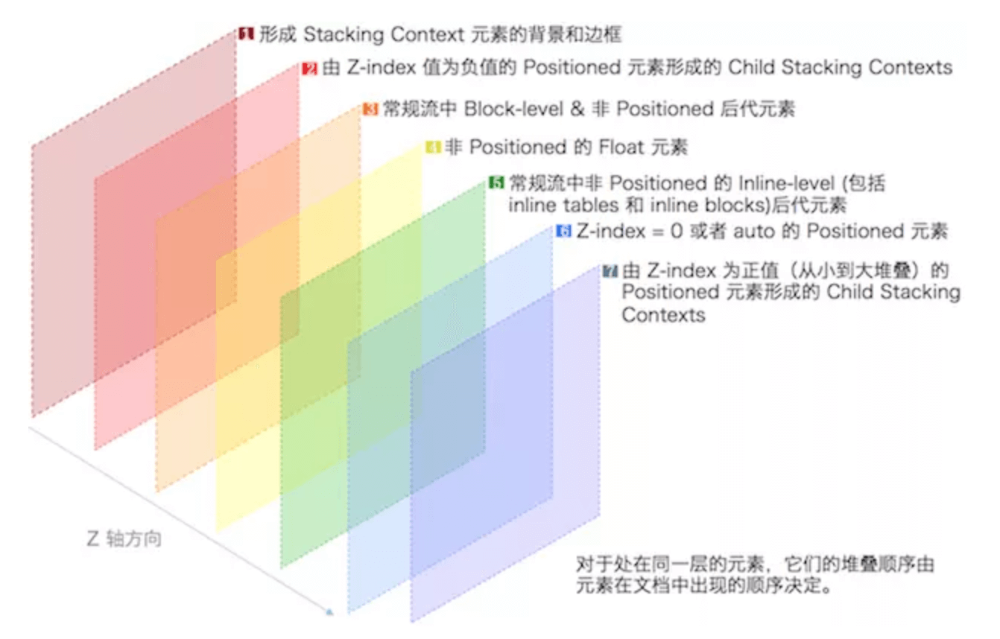

# css

## 参考

### 资源
- [图片库](https://remixicon.com/)
- [icon库](https://mp.weixin.qq.com/s/vBzp8zMZ9he-3JsuAEpoxQ)
- [免费icon库-lineicons](https://lineicons.com/)
- [矢量图片库](https://www.flaticon.com/)
- [bootstrap-icons](https://icons.getbootstrap.com/)
- [特效库](https://cssfx.dev/)
- [通用配色库](https://colorhunt.co/)
- [nb的配色库](https://color.adobe.com/zh/create/color-wheel)
- [渐变色配色库](https://www.bestvist.com/css-gradient)
- [创意海报库](https://www.chuangkit.com/designtools/designindex)
- [卡通的网站](https://uglyduck.ca/articles/)
- [配渐变色](https://www.gradientmagic.com/)
- [生成3d字体](https://bennettfeely.com/ztext/)
- [图片任意变换](https://trekhleb.dev/js-image-carver/)
- [图片转换为玻璃碎片效果](https://rh12503.github.io/triangula/)
- [在线调试css特效](https://animista.net/)
- [react-旅游风格组件库](https://orbit.kiwi/components/button/)
- [daisyUI（基于tailwind）](https://daisyui.com/components/avatar)
- [无类化css-simple.css](https://github.com/kevquirk/simple.css)
- [2022css发展](https://mp.weixin.qq.com/s/jh9dVWGzFTp9a1tNgFZ2yw)
- [headless-ui](https://headlessui.com/vue/tabs)

### 各种案例
- [纯css-swiper](https://mp.weixin.qq.com/s/9eLw-EUE-3kbsMvvdifHOg)
- [前端换肤参考](https://blog.souche.com/untitled-17/)
- [前端换肤-css变量方法](https://www.cnblogs.com/leiting/p/11203383.html)
- [提高幸福感的 9 个 CSS 技巧](https://juejin.im/post/5cb45a06f265da03474df54e)
- [Web开发者需要知道的CSS Tricks](https://juejin.im/post/5aab4f985188255582521c57)
- [CSS 常用技巧](https://juejin.im/post/5b1f41246fb9a01e725131fb)
- [csswg](https://drafts.csswg.org/)
- [移动端-css实现自由拖拽](https://mp.weixin.qq.com/s/gxe5QOVt9kRFWvXx-gugbg)
- [10个后台管理模板](https://segmentfault.com/a/1190000038323430)
- [各种按钮](https://github.com/ui-buttons/core)
- [纯css实现悬浮box-shadow](https://mp.weixin.qq.com/s/kk5oXTAe72hbe72hnc0Jrg)
- [纯css轮播图](https://mp.weixin.qq.com/s/84eYQjIWk8W0hEgQ8daeSg)

### 各种属性
- [现代css性能优化](http://verymuch.site/2018/07/22/CSS%E6%80%A7%E8%83%BD%E4%BC%98%E5%8C%96%E7%9A%848%E4%B8%AA%E6%8A%80%E5%B7%A7/?nsukey=3eczM2FJ0JQ8aS2hEDt1CnIzmS32kXvEkjuE7I0lrEF7M8jW7k7PPZtuVxX%2BT%2FsRQqGQ7YhSV%2FicPVi%2FrRG%2BhGGQQn6y7EuHKuERI93Idzq2ziur8T8dZL3qgDT%2Bw5au3cocxOGnSC7pBI7bve9tigiinrZL8Xaac042IW%2FR%2FxqJp8Fk21Nm7YbVUczUdhD%2F)
- [5个新css属性](https://zhuanlan.zhihu.com/p/40736286)
- [flex](https://mp.weixin.qq.com/s/WtGzVMzh1RupixD_4474mg)
- [23中垂直方法](https://mp.weixin.qq.com/s/JL-9juZgbpz_Cnp6FnLVAQ)
- [CSSOM](https://mp.weixin.qq.com/s/xST3cjumPrxdHbcZcYlLvQ)
- [css与网络性能](https://mp.weixin.qq.com/s/OigM7dPFS3OGEBUE6KjHQA)
- [clippy](https://bennettfeely.com/clippy/)
- [一些新的布局方法](https://mp.weixin.qq.com/s/HYUgb8jEI-aQhbN4sBajNw)
- [文字排布-text-combine-upright](http://www.deathghost.cn/article/css/86)
- [纯CSS实现分栏宽度拉伸调整-resize](https://www.zhangxinxu.com/study/201903/css-idea/behavior-stretch.php)
- [各种换行用法](https://mp.weixin.qq.com/s/D4dn4ot55f7ISzHxwu2H5Q)

### 其他
- [2020-css使用情况](https://2020.stateofcss.com/zh-Hans/technologies/pre-post-processors/)
- [防御性css](https://ishadeed.com/article/defensive-css/)
- [推荐的css初始化属性设置](https://www.joshwcomeau.com/css/custom-css-reset/)
- [2022-css现状](https://mp.weixin.qq.com/s/N33CBhVRwETgbtr3oSW-TA)

## 目录
<details>
<summary>展开更多</summary>

* [`常见用法`](#常见用法)
* [`属性`](#属性)
* [`布局`](#布局)
* [`命名规范-BEM`](#BEM)
* [`须知`](#须知)
* [`答疑`](#答疑)
* [`草案`](#草案)
* [`选择器`](#选择器)
* [`伪元素`](伪元素)
* [`常识`](常识)

</details>

## 常见用法

### 增加权重（骚操作）

```css
/* 重复自己 */
.foo.foo {

}
```

所以说，为什么element:hover会起效果？纯粹是因为权重比element高

### 选择器大小写敏感性

以下值对大小写敏感：

- 属性选择器的值（attr=val）
- class
- Id

如何设置不敏感那？

```css
[class="val" i] {
  
}
```

### 属性选择器

#aa 和 [id="aa"] 是不一样的，前者优先级更高，高到无法用堆叠class逾越，非要用id选择器的话，推荐改用属性选择器

### 如何高亮

新增状态标志符，比如：

- .active

- .checked

- .selected

- .on

- .disabled

- .open

用于交互控制，但是切记，这些类目不能含有自己的样式，配合其他class使用，用于提升权重

```css
.xx.active {
  /**/
}
```


### border玩法

[border](https://www.w3cplus.com/css/css-tips-0904-1.html)

### 伪元素/伪类
- https://segmentfault.com/a/1190000000484493

**伪类**

:Pseudo-classes
行为能力的增强

- :hover
- :active
- :visited
- :focus
- :link
- :first-child

**伪元素**

- [伪元素各种用法-1](https://echeverra.cn/2021/08/06/css-content/)

::Pseudo-elements
元素内容的丰富

- ::before
- ::after
- ::first-letter
- ::first-line

### img裁剪
object-fit
- cover
- contain

### 平滑滚动
[滚动](https://xiaotianxia.github.io/blog/vuepress/js/scroll_behaviors.html)
```css
html {
  scroll-behavior: smooth;
}
```

#### 如果用requestAnimation来做
```js
const scrollToTop = () => {
  const c = document.documentElement.scrollTop || document.body.scrollTop;
  if (c > 0) {
    window.requestAnimationFrame(scrollToTop);
    window.scrollTo(0, c - c / 8);
  }
}

// 事例
scrollToTop()
```

### box-sizing
```css
html {
  box-sizing: border-box;
}
*, *:before, *:after {
  box-sizing: inherit;
}
```

### 滚动不传播父元素
overscroll-behavior: contain;

### width: auto
width: max-content/min-content

### display:none和visibility:hidden
区别：
1. 空间占据 ：
  - display: none-在网页中不占任何的位置，接近移除
  - visibility:hidden-仅仅将元素隐藏，但是在网页中还占着位置
2. 回流与渲染：
  - display: none-同时触发repaint和reflow
  - visibility:hidden-仅触发一次repaint
3. 株连性：
  - display: none-子孙元素无法重现
  - visibility:hidden-子孙元素可用visibility:visible重新显示

### 波浪线
```css
.circle1 {
    position: absolute;
    z-index: 5;
    top: -10px;
    left: 0;
    transform-origin: center left;
    transform: rotate(90deg);
    width: 220px;
    height: 9px;
    <!-- 4px决定圆的实际范围 -->
    background-image: radial-gradient(circle, #fff, #fff 4px, transparent 0px, transparent 2px, transparent 22px, transparent);
    <!-- 决定圆的最大范围 -->
    background-size: 10px 10px;
    background-repeat: repeat-x;
}
```

### 虚拟滚动
https://fusion.design/component/virtual-list?themeid=1

### 换肤
[rel=>alternate](https://www.zhangxinxu.com/wordpress/2019/02/link-rel-alternate-website-skin/comment-page-1/#comment-391940)
```js
document.link.disabled = true;
document.link.disabled = false;
```

### 超出省略

**重要：设置`display: flex`时，不会展示省略号，切记！！！**

```css
/* optimize-css-assets-webpack-plugin会把-webkit-box-orient删掉，要加注释阻止 */
.line-camp( @clamp:2 ) {
  overflow: hidden;
  text-overflow: ellipsis;
  display: -webkit-box;
  -webkit-line-clamp: @clamp;
  /*! autoprefixer: off */
  -webkit-box-orient: vertical;
  /* autoprefixer: on */
}
```

### 普通元素代替submit按钮（还有outline）
```css
[type="submit"] {
    position: absolute;
    clip: rect(0, 0, 0, 0);
}
.btn {
    display: inline-block;
    padding: 2px 12px;
    background-color: #19b955;
    color: #fff;
    font-size: 14px;
    cursor: pointer;
}
:focus + label.btn {
    outline: 1px dashed hotpink;
    outline: 3px auto -webkit-focus-ring-color;
}
```

```html
<div class="panel">
    <input type="submit" id="box">
    <label for="box" class="btn">提交</label>
</div>
```


---

### z-index
[参考](https://juejin.im/post/5ba4efe36fb9a05cf52ac192?utm_source=gold_browser_extension)
[参考2](https://juejin.im/post/5b876f86518825431079ddd6)
[移动端性能优化-层级](https://fed.taobao.org/blog/2016/04/26/performance-composite/)

- 层叠上下文
- 层叠等级

#### 层叠上下文
根层叠上下文 - <html></html>

- 元素产生层叠上下文后，各元素内子元素的层叠关系由父元素决定，
  如果父元素z-index一致，由html先后顺序决定
- 层叠上下文可以互相包含
- 与兄弟元素互相独立（处理层叠时）
- 自包含：当元素内容被层叠后，整个元素在父元素内都会被层叠

**如何产生层叠上下文**

- position值为absolute|relative，且z-index值不为 auto
- position 值为 fixed|sticky
- z-index 值不为 auto 的flex元素，即：父元素display: flex | inline-flex
- opacity 属性值小于 1 的元素
- transform 属性值不为 none的元素
- mix-blend-mode 属性值不为 normal 的元素
- filter、perspective、clip-path、mask、mask-image、mask-border、motion-path 值不为 none 的元素
- perspective 值不为 none 的元素
- isolation 属性被设置为 isolate 的元素
- will-change 中指定了任意 CSS 属性，即便你没有直接指定这些属性的值
- -webkit-overflow-scrolling 属性被设置 touch的元素

#### 层叠等级
同一个层叠，上下文中元素，在z轴上的显示顺序

**如何决定层叠等级**

- 定位元素
  * z-index
- 非定位元素
  * 父级以上元素层叠等级
  * HTML中顺序
  * 层叠顺序

```html
<!DOCTYPE html>
<html>
  <head>
    <meta charset="UTF-8">
    <style>
      .box1, .box2 {
        position: relative;
        z-index: 0;
      }
      .child1 {
        width: 200px;
        height: 100px;
        background: #168bf5;
        position: absolute;
        top: 0;
        left: 0;
        z-index: 2;
      }
      .child2 {
        width: 100px;
        height: 200px;
        background: #32c292;
        position: absolute;
        top: 0;
        left: 0;
        z-index: 1;
      }
    </style>
    </head>
    
    <body>
      <div class="box1">
        <div class="child1">child1</div>
      </div>
    
      <div class="box2">
        <div class="child2">child2</div>
      </div>
    </body>
</html>
```

#### z-index
正整数、负整数、0、auto，默认auto

#### 层叠顺序


**注：inline/inline-block的等级高于block，是因为网页设计之初就是希望文字能不被覆盖**

---

### :focus-visible
键盘访问（比如按tab）时，元素边缘会出现选中的蓝框
Chrome浏览器67+支持

[参考](https://www.zhangxinxu.com/wordpress/2019/03/css-focus-visible/)

可以通过设置属性去除
```css
:focus:not(:focus-visible) {
    outline: 0;
}
```

### flex左右布局
```css
<ul class="demo2">
  <li>首页</li>
  <li>动态</li>
  <li>话题</li>
  <li>活动</li>
  <!-- 登录注册文案贴右边 -->
  <li>登录 &nbsp; 注册</li>
</ul>
<style>
.demo2 {
  display: flex;
}
.demo2 > li:last-child {
  margin-left: auto;
}
</style>
```

### 蒙层高亮
```css
/*解法一：outline*/
.clip-shape {
  width: 150px;
  height: 150px;
  position: absolute;
  left: 0;/*可调整*/
  right: 0;/*可调整*/
  outline: 999px solid rgba(0,0,0,.5);
  top: 0;/*可调整*/
  bottom: 0;/*可调整*/
  margin: auto;
}
/*解法二：box-shadow*/
.clip-shape {
  width: 150px;
  height: 150px;
  position: absolute;
  left: 0;
  right: 0;
  border-radius: 50%;
  box-shadow: 0 0 0 9999px rgba(0,0,0,.75);
  top: 0;
  bottom: 0;
  margin: auto;
  cursor: move;
}
```

### 加载中省略号
```html
<div>加载中<span class="more"></span></div>
```
```css
.more::before {
  content: '...';
  position: absolute;
  animation: dot2 3s infinite step-start both;
}
.more::after {
  content: '...';
  color: transparent;
}
@keyframes dot2 {
  33% { content: '.'; }
  66% { content: '..'; }
}
```

### outlineVSborder
outline不占用盒模型空间

### 两个球相交的粘粘效果
filter:blur（数值）
对比则使用filter:contrast（数值）

### 1px

**border-image**

```css
.border_1px{
  border-bottom: 1px solid #000;
}
@media only screen and (-webkit-min-device-pixel-ratio:2){
  .border_1px{
      border-bottom: none;
      border-width: 0 0 1px 0;
      border-image: url(../img/1pxline.png) 0 0 2 0 stretch;
  }
}
```

**background-image**

> 同border-image

伪类 + scaleY(0.5)

```css
.border_1px:before{
  content: '';
  position: absolute;
  top: 0;
  height: 1px;
  width: 100%;
  background-color: #000;
  transform-origin: 50% 0%;
}
@media only screen and (-webkit-min-device-pixel-ratio:2){
    .border_1px:before{
        transform: scaleY(0.5);
    }
}
@media only screen and (-webkit-min-device-pixel-ratio:3){
    .border_1px:before{
        transform: scaleY(0.33);
    }
}
```

- svg
  * 借助PostCSS的postcss-write-svg
  * ```css
    .example {
      border: 1px solid transparent;
      border-image: url("data:image/svg+xml;charset=utf-8,%3Csvg xmlns='http://www.w3.org/2000/svg' height='2px'%3E%3Crect fill='%2300b1ff' width='100%25' height='50%25'/%3E%3C/svg%3E") 2 2 stretch; }
    ```
- 设置viewport
- ::after + scale
  ```css
  .scale-1px{
    position: relative;
    margin-bottom: 20px;
    border:none;
  }
  .scale-1px:after{
    content: '';
    position: absolute;
    top: 0;
    left: 0;
    border: 1px solid #000;
    -webkit-box-sizing: border-box;
    box-sizing: border-box;
    width: 200%;
    height: 200%;
    -webkit-transform: scale(0.5);
    transform: scale(0.5);
    -webkit-transform-origin: left top;
    transform-origin: left top;
  }
  ```
- viewport + rem 实现
- box-shadow
- background-image
- 0.5px
- transformY:scale(.5)

### 模拟长按
```html
<button id="btn-1">click</button>
```

```css
button:hover:active{
  opacity:.99;/**随便选取一个不影响页面的可以过渡的样式**/
  transition:opacity 1s;
}
```

```js
document.getElementById('btn-1').addEventListener('transitionend', () => {
  console.log(123);
});
```

### 单个元素resize
```css
div#box{
  overflow: hidden;/**需要配合overflow才能生效**/
  resize: both;
}
```

### 单个元素resize + 监听宽高
```css
div#box{
  height: 300px;
  width: 300px;
  background: rgb(244, 244, 244);
  display: flex;
  align-items: center;
  justify-content: center;
  overflow: hidden;/**需要配合overflow才能生效**/
  resize: both;
}
#box:active{
    animation: resize .3s infinite forwards;
}
@keyframes resize{
    to {
       opacity: .99;/**用一个无关紧要的属性来触发动画**/
    }
}
```

```js
document.getElementById('box').addEventListener('animationiteration', function(){
    this.innerHTML = `${this.clientHeight}*${this.clientWidth}`;
});
```

### 镜面反射
-webkit-box-reflect

### flex不压缩空间
flex-shrink: 0

### 垂直居中

- PC端有兼容性要求，宽高固定，推荐absolute + 负margin
- PC端有兼容要求，宽高不固定，推荐css-table
- PC端无兼容性要求，推荐flex
- 移动端推荐使用flex

```html
<div class="margin" style="width: 500px;height: 500px;background-color: aqua">
    <div class="center" style="width: 200px;height: 200px;background-color: antiquewhite"></div>
</div>
```

- absolute + transform
  ```css
  .center{
      position: absolute;
      top: 50%;
      left: 50%;
      transform: translate(-50%, -50%);
    }
  ```
- grid
  ```css
  .margin {
      display: grid;
  }
  .center {
      align-self: center;
      justify-self: center;
  }
  ```
- flex
  ```css
  .margin {
      display: flex;
      justify-content: center;
      align-items: center;
  }
  ```
- flex + margin
```css
.margin{
  display: flex;
}

.center{
  margin: auto;
}
```
- absolute + margin auto
 ```css
 .margin{
    position: relative;
  }

  .center{
    overflow: auto;
    margin: auto;
    position: absolute;
    top: 0; left: 0; bottom: 0; right: 0;
  }
 ```
- absolute + calc
  ```css
  .margin {
      position: relative;
  }
  .center {
      position: absolute;;
      top: calc(50% - 50px);
      left: calc(50% - 50px);
  }
  ```
- writing-mode
  * 文字显示方向
  ```css
  .margin {
    writing-mode: vertical-lr;
  }
  ```
- table
  ```css
  .margin {
    display: table-cell;
    text-align: center;
    vertical-align: middle;
  }
  .center {
    display: inline-block;
  }
  ```
- vertical-align + font-size 0
  ```css
  #parent{
    height: 150px;
    line-height: 150px;
    font-size: 0;
  }
  img#son{
    vertical-align: middle;
  }
  ```

---

## BEM
> 基于 **块（block）、元素（element）、修饰符（modifier）**的命名规范，即：
> 
> .块__元素--修饰符{}
>

### 注意点
- BEM不考虑结构，即多层嵌套时，**block**取得是最外层的父class，**element**也只是加上当前元素的class

### 举例
```css
.person{} /*人*/
.person__hand{} /*人的手*/
.person--female{} /*女人*/
.person--female__hand{} /*女人的手*/
.person__hand--left{} /*人的左手*/
```

**scss中使用**

```scss
.person {
  @at-root #{&}__hand {
    color: red;
    @at-root #{&}--left {
     color: yellow;
    }
  }
  @at-root #{&}--female {
    color: blue;
    @at-root #{&}__hand {
      color: green;
    }
  }
}
/*生成的css*/
.person__hand {
   color: red;
}
.person__hand--left {
   color: yellow; 
}
.person--female{
  color: blue;
}
.person--female__hand {
  color: green;
}
```

**less中使用**

```less
.person__hand {
  &--icon {
    color: #FF7366;
    position: relative;
    top: 1px;
  }
  &--text {
    font-size: 14px;
    cursor: pointer;
  }
}
```

**多层嵌套**

```html
<div class="page-btn">
    <!-- ... -->
   <ul class="page-btn__list">
       <li class="page-btn__item">
           <a href="#" class="page-btn__btn">第一页</a>
       </li>
   </ul>
   <!-- ... -->
</div>
```

---

## 须知

### 选择器
  - 保持简单，不要使用嵌套过多过于复杂的选择器
  - 通配符和属性选择器效率最低，需要匹配的元素最多，尽量避免使用
  - 不要使用类选择器和ID选择器修饰元素标签，如h3#markdown-content，这样多此一举，还会降低效率
  - 不要为了追求速度而放弃可读性与可维护性

### 优化建议
- 如果 JS 文件没有依赖 CSS，你应该将 JS 代码放在样式表之前

### CSSOM
  - js运算安全操作css属性
  - chrome66，chromium70+支持

### css动画要点
[FLIP技术](https://www.w3cplus.com/javascript/animating-layouts-with-the-flip-technique.html)
- F：First，指的是在任何事情发生之前（过渡之前），记录当前元素的位置和尺寸。
```js
el.getBoundingClientRect();
```
- L：Last，执行一段代码，让元素发生相应的变化，并记录元素在最后状态的位置和尺寸。
```js
el.classList.add('totes-at-the-end');
// 记录元素最后状态的位置和尺寸大小
const last = el.getBoundingClientRect();
```
- I：Invert，计算元素第一个位置（first）和最后一个位置（last）之间的（位置、尺寸）变化
```js
const deltaX = first.left - last.left;
const deltaY = first.top - last.top;
const deltaW = first.width / last.width;
const deltaH = first.height / last.height;
```
- P：Play，让元素有动画效果
```js
// Web Animations API
elm.animate([
  { transformOrigin: 'top left', transform: ` translate(${deltaX}px, ${deltaY}px) scale(${deltaW}, ${deltaH}) ` },
  { transformOrigin: 'top left', transform: 'none' }],
  { duration: 300, easing: 'ease-in-out', fill: 'both' },
]);
```

### 换肤

**ElementUI**
- 对制定的style标签里的样式做正则匹配&替换

**antd**
- 在html插入<link rel="stylesheet/less" type="text/css" href="styles.less" />
- 加载less.js(https://cdnjs.cloudflare.com/ajax/libs/less.js/2.7.2/less.min.js)
- 解析less

---

## 属性

### font-size
- px
- rem
  * [参考](../fe-interview/src/common.md#响应式方案)
- em
  * 相对于父元素，1em = 父元素，2em = 2 * 父元素
  * 如果父元素没设置，取浏览器默认值（chrome一般是16px）
- %
  * 类似em，通常用62.5%（即默认大小16px的62.5%），取到10px
  * 子元素设置1.2em/1.6em之类的

### border
border: none - 边框不会渲染，不占内存
border: 0 - 边框宽度为0，会渲染，占内存

### position
- absolute
  * 绝对定位，相对于第一个position不为static的父元素
- fixed
  * 绝对定位，相对于浏览器窗口定位
  * 当父元素的 transform 不为 none 时，改为相对于该父元素定位（[浏览器间有差异](https://www.zhangxinxu.com/wordpress/2015/05/css3-transform-affect/)）
- relative
  * 相对于元素自身位置定位，所以类似`left:20px`有效果
  * 自身位置仍然占据
- static
  * 默认，没有定位，元素处于正常流中，类似`left:20px`无效


#### sticky

> 会创建一个层叠上下文，并“固定”在离他最近的具有“滚动机制”的父元素上。
>
> Q：何为【具有“滚动机制”】？
>
> A：该元素的overflow值是**hidden、scroll、auto或overlay**

### cross-fade
[参考](https://www.zhangxinxu.com/wordpress/2020/07/css-cross-fade-background-image-opacity/)

> 多个图像半透明叠加
>
> 移动端兼容性非常好（记得加前缀），pc端除ie

```css
.dark {
    /* 兜底，IE和Firefox浏览器 */
    background-image: url(2.jpg);
    --transparent: url(data:image/gif;base64,R0lGODlhAQABAIAAAP///w==);
    /* Safari最近版本已经不需要私有前缀了 */
    background-image: cross-fade(var(--transparent), url(2.jpg), 40%);
    /* 如使用自定义属性，-webkit-语句需要放在没有私有前缀语句的下面 */
    background-image: -webkit-cross-fade(var(--transparent), url(2.jpg), 40%);

    background-size: cover;
}
```

### background-blend-mode
[参考](https://www.zhangxinxu.com/wordpress/2020/07/css-background-blend-mode/)

### display

**inline-table**: 在`form-item`中，即使元素间没有 margin，但默认还是有一定不可控的间距，其实本质是个换行符，用 inline-table 可以去除掉。

### font-smoothing
```css
-webkit-font-smoothing: none; # 无抗锯齿

-webkit-font-smoothing: antialiased # 抗锯齿
```

### i18n

```css
# 全站中繁体切换
font-variant-east-asian: traditional;
```

### filter

[巧用CSS filter，让你的网站更加酷炫！](https://juejin.cn/post/7002829486806794276)

```css
# 电影特效
@keyframes fade-away {
    30%{
        filter: brightness(1);
    }
    100%{
        filter: brightness(0);
    }
}
```

### accent-color

> 设置 checkbox 或 radio 被选中时的颜色

```css
input {
  accent-color: blue;
}

input[type=checkbox] {
  accent-color: red;
}
```

### outline

[outline](https://mp.weixin.qq.com/s/m_e37kJvaVvnOmzVm3H6Pg)

### mask

[渐隐](https://mp.weixin.qq.com/s/qADnUx3G2tKyMT7iv6qFwg)

通过遮罩层，可以做很多动画转场效果

```css
.mask {
  background: url(image.png) ;
  mask: linear-gradient(90deg, transparent, #fff);
}
```

### content-visibility

[参考](https://mp.weixin.qq.com/s/o9lpl7CTwcbjM0q3QMRLTg)

- visible - 默认值，无效果
- hidden - 类似`display:none`，但是保留渲染状态，子元素都会被隐藏
- auto - 如果该元素不在页面内or与用户行为无关，则等同于hidden，否则正常渲染


#### 用途

- 原生懒加载
- 利用 `contain-intrinsic-size` 解决滚动条抖动问题

### scroll-snap-type

[参考](https://www.zhangxinxu.com/wordpress/2018/11/know-css-scroll-snap/)

> 网页容器滚动停止的时候，自动平滑定位到指定元素的指定位置

```css
scroll-snap-type: x/y
scroll-snap-align: start/end/center

```


### css houdini

[CSS Houdini：用浏览器引擎实现高级CSS效果](https://mp.weixin.qq.com/s/4owfsfX6bMzvgwvVxaCmzQ)

> 一系列与CSS引擎相关的浏览器API的总称


### 毛玻璃 backdrop-filter

```css
background-image: radial-gradient(transparent 1px,#fff 1px);
background-size: 4px 4px;
backdrop-filter: saturate(50%) blur(4px);
```


### @scope

> 微前端样式冲突，终极解决方案

```css
/* 这样.card里的header样式就被固定了，不受外部影响 */
@scope (.card) {
  header {
    color: var(--text);
  }
}
```


---

### calc

[现代 CSS 解决方案：CSS 数学函数之 calc](https://mp.weixin.qq.com/s?__biz=Mzg2MDU4MzU3Nw==&mid=2247491089&idx=1&sn=84aecbf783859c930bf57660b46d06ef&chksm=ce257de7f952f4f17b49c890910d995362a1a7247fdf20bd427d868a15cef08e1c3d9e68eba1&token=363949812&lang=zh_CN#rd)

---

## 布局

### 垂直居中
[参考](./README.md#垂直居中)

- 优先line-height
- [vertical-align](https://www.zhangxinxu.com/wordpress/2015/08/css-deep-understand-vertical-align-and-line-height/)
- absolute
- flex

### 水平居中
[各种布局](https://juejin.im/post/5aa252ac518825558001d5de#heading-8)
- 纯文本
  ```css
  .center {
    text-align: center;
    display: inline; // 或inline-block
  }
  ```
- 非移动端
  ```css
  .center {
    margin: 0 auto;
  }
  ```
- 移动端-flex

### 水平垂直居中
- button做父元素（IE下，点击会有外边框）
  ```css
  button#parent{  /*改掉button默认样式就好了,不需要居中处理*/
    height: 150px;
    width: 200px;
    outline: none;  
    border: none;
  }
  ```
- table-cell
  ```css
  #parent{
    height: 150px;
    width: 200px;
    display: table-cell;
    vertical-align: middle;
    /*text-align: center;*/   /*如果是行内元素就添加这个*/
  }
  #son{
      /*margin: 0 auto;*/    /*如果是块级元素就添加这个*/
      width: 100px;
      height: 50px;
  }
  ```
- absolute + top/bottom/left/right:0 + margin: auto
- flex

### 两列布局
- float:left + margin-left
- float:left + overflow:hidden
- table(margin失效)
- flex
- grid

### 三列布局
- 中间flex: 1 + 左右定宽
- 双飞翼
- 圣杯

#### 双飞翼
左列和右列宽度恒定，中间列的宽度根据浏览器窗口的大小自适应

**中间内容放最前面**

```html
<div class="container">
  <!-- 放最前面 -->
  <div class="column" id="center_panel">
    <div class="box"></div>
  </div>
  <div class="column" id="right_panel"></div>
  <div class="column" id="left_panel"></div>
</div>
```

**三栏都脱离文档流**

```css
.column {
  float:left;
}
```

**中间栏宽度自适应**

```css
#center_panel {
  width: 100%;
}
```

**左边栏通过margin-left置左**

```css
#left_panel {
  width: 100px;
  margin-left: -100%; // margin相对父元素宽度
}
```

**右边栏通过margin-left置右**

```css
#right_panel {
  width: 100px;
  margin-left: -100px; // 本身会换行，-自身宽度会移回上一行
}
```

**中间栏主体内容设margin**

```css
.box {
  margin: 0 100px 0 100px;
}
```

**容器清除浮动**

```css
.container::after {
  content: '';
  display: block;
  height: 0;
  clear:both;
  visibility: hidden;  
}
```

#### 圣杯
和双飞翼类似

**文档结构不变**

**容器加padding**

```css
.container {
  width: 100%;
  box-sizing: border-box;
  padding: 0 100px 0 100px; // 左右padding是左右边栏宽度
}
```

**三栏加position:relative**

```css
.column {
  float:left;
  height: 300px;
  position: relative; // left相对于自身定位，所以要加relative
}
```

**左边栏置左**

```css
#right_panel {
  width: 100px;
  margin-left: -100%;
  left: -100px; // 加了relative所以有效
}
```

**右边栏置右**

```css
#left_panel {
  width: 100px;
  margin-left: -100px;
  right: -100px;
}
```

### 多列等宽
- flex
```css
#parent {
  margin-left: -15px;  /*使内容看起来居中*/
  height: 500px;
  display: flex;
}
.column{
  flex: 1; /*一起平分#parent*/
  margin-left: 15px; /*设置间距*/
}
.column:nth-child(odd){
  background-color: #f00;
}
.column:nth-child(even){
  background-color: #0f0;
}
```

### 九宫格
- grid
```html
<body>
  <div id="parent">
      <div class="item">1</div>
      <div class="item">2</div>
      <div class="item">3</div>
      <div class="item">4</div>
      <div class="item">5</div>
      <div class="item">6</div>
      <div class="item">7</div>
      <div class="item">8</div>
      <div class="item">9</div>
  </div>
</body>
```

```css
#parent {
    width: 1200px;
    height: 500px;
    margin: 0 auto;
    display: grid;
    grid-template-columns: repeat(3, 1fr); /*等同于1fr 1fr 1fr,此为重复的合并写法*/
    grid-template-rows: repeat(3, 1fr);  /*等同于1fr 1fr 1fr,此为重复的合并写法*/
}
.item {
    border: 1px solid #000;
}
```

---

## 答疑

### 为什么CSS选择器是从右向左匹配
- 从右向左能减少浪费在失败查找上的时间
- CSS中更多的选择器是不会匹配的，所以在考虑性能问题时，需要考虑的是如何在选择器不匹配时提升效率。

### css为什么不要用@import
- 阻塞浏览器的并行下载，强行变成串行
- 先于除了@charset的其他任何CSS规则，多个@import导致下载顺序紊乱

### 屏幕完整截图
- chrome，command + shift + p

### IE6下的双边距bug
**原因**

- 块元素
- 浮动
- 有横向margin

**解决方法**

- display:inline（让块元素变成内联元素）
- 不要使用浮动
- 用padding-left代替margin-left

### 图片加载失败
> 通过css美化加载失败后的图片占位区块

[参考](https://bitsofco.de/styling-broken-images)

```html

```

**1. 提示帮助文字**

```css
img {
  font-family: 'Helvetica';
  font-weight: 300;
  line-height: 2;  
  text-align: center;
  
  width: 100%;
  height: auto;
  display: block;
  position: relative;
}

img:before { 
  content: "We're sorry, the image below is broken :(";
  display: block;
  margin-bottom: 10px;
}

img:after { 
  content: "(url: " attr(src) ")";
  display: block;
  font-size: 12px;
}
```

**2. 图片替换**

```css
img { /* Same as first example */ }

img:after { 
  content: "\f1c5" " " attr(alt);
  
  font-size: 16px;
  font-family: FontAwesome;
  color: rgb(100, 100, 100);
  
  display: block;
  position: absolute;
  z-index: 2;
  top: 0;
  left: 0;
  width: 100%;
  height: 100%;
  background-color: #fff;
}
```

**3. 美化替换文字**

```css
img { 
  /* 样式跟第一个例子里是一样的，然后加了下面一条样式 */
  min-height: 50px;
}

img:before { 
  content: " ";
  display: block;

  position: absolute;
  top: -10px;
  left: 0;
  height: calc(100% + 10px);
  width: 100%;
  background-color: rgb(230, 230, 230);
  border: 2px dotted rgb(200, 200, 200);
  border-radius: 5px;
}

img:after { 
  content: "\f127" " Broken Image of " attr(alt);
  display: block;
  font-size: 16px;
  font-style: normal;
  font-family: FontAwesome;
  color: rgb(100, 100, 100);
  
  position: absolute;
  top: 5px;
  left: 0;
  width: 100%;
  text-align: center;
}
```

---

## 草案
- [折叠屏api](https://github.com/w3c/csswg-drafts/issues/4736)


### @layer

> 管理样式优先级

[CSS5 @layer](https://mp.weixin.qq.com/s/ah4SSomENbFvLasH-WuP5A)

---

## 选择器

### xxx:nth-child(n)

> 表示：xxx 的父元素的第 n 个子元素，是xxx

### xxx:nth-of-type(n)

> 表示：假设 xxx 的 tagName 是 T，那么 xxx 父元素的第 n 个 tagName 是 T 的子元素，是xxx。

---

## 伪元素

### input-placeholder

```css
input::placeholder {
  font-family: PingFangSC-Regular;
  color: #8E8E90;
  font-size: 12px;
  font-weight: normal;
}
```


---

## 常识

### 块级元素

> **负责结构**
>
> 一个水平流上只能单独显示一个元素
>
> 比如：div、p、h1~6等

### 内联元素

> **负责内容**
>
> 和文字在一行显示
>
> 比如：span、label、a

### 元素溢出

> 元素宽度 = 内容宽度 + padding + margin
>
> 平时设置的width，作用在内容宽度上

### 浏览器渲染顺序

> 先父元素，后子元素