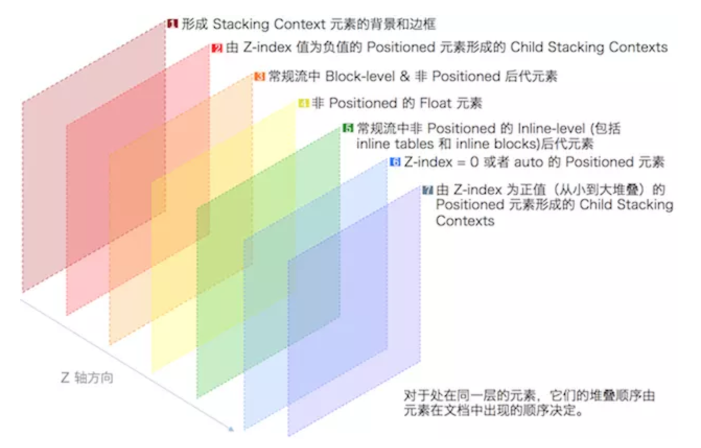

# css

## 参考
- [图片库](https://remixicon.com/)
- [现代css性能优化](http://verymuch.site/2018/07/22/CSS%E6%80%A7%E8%83%BD%E4%BC%98%E5%8C%96%E7%9A%848%E4%B8%AA%E6%8A%80%E5%B7%A7/?nsukey=3eczM2FJ0JQ8aS2hEDt1CnIzmS32kXvEkjuE7I0lrEF7M8jW7k7PPZtuVxX%2BT%2FsRQqGQ7YhSV%2FicPVi%2FrRG%2BhGGQQn6y7EuHKuERI93Idzq2ziur8T8dZL3qgDT%2Bw5au3cocxOGnSC7pBI7bve9tigiinrZL8Xaac042IW%2FR%2FxqJp8Fk21Nm7YbVUczUdhD%2F)
- [5个新css属性](https://zhuanlan.zhihu.com/p/40736286)
- [flex](https://mp.weixin.qq.com/s/WtGzVMzh1RupixD_4474mg)
- [23中垂直方法](https://mp.weixin.qq.com/s/JL-9juZgbpz_Cnp6FnLVAQ)
- [CSSOM](https://mp.weixin.qq.com/s/xST3cjumPrxdHbcZcYlLvQ)
- [css与网络性能](https://mp.weixin.qq.com/s/OigM7dPFS3OGEBUE6KjHQA)
- [前端换肤参考](https://blog.souche.com/untitled-17/)
- [clippy属性在线调试](https://bennettfeely.com/clippy/)

## 目录
<details>
<summary>展开更多</summary>

* [`常见用法`](#常见用法)
* [`属性`](#属性)
* [`须知`](#须知)
* [`答疑`](#答疑)

</details>

## 常见用法

### border玩法
[border](https://www.w3cplus.com/css/css-tips-0904-1.html)

### 伪元素 伪类
- https://segmentfault.com/a/1190000000484493

### object-fit（img裁剪）
- cover
- contain

### 平滑滚动
[滚动](https://xiaotianxia.github.io/blog/vuepress/js/scroll_behaviors.html)
html {
  scroll-behavior: smooth;
}

### 滚动不传播父元素
overscroll-behavior: contain;

### width: auto
width: max-content/min-content

### display:none和visibility:hidden
区别：
1. 空间占据 ：
  - display: none-在网页中不占任何的位置，接近移除
  - visibility:hidden-仅仅将元素隐藏，但是在网页中还占着位置
2. 回流与渲染：
  - display: none-同时触发repaint和reflow
  - visibility:hidden-仅触发一次repaint
3. 株连性：
  - display: none-子孙元素无法重现
  - visibility:hidden-子孙元素可用visibility:visible重新显示

### 波浪线
```css
.circle1 {
    position: absolute;
    z-index: 5;
    top: -10px;
    left: 0;
    transform-origin: center left;
    transform: rotate(90deg);
    width: 220px;
    height: 9px;
    <!-- 4px决定圆的实际范围 -->
    background-image: radial-gradient(circle, #fff, #fff 4px, transparent 0px, transparent 2px, transparent 22px, transparent);
    <!-- 决定圆的最大范围 -->
    background-size: 10px 10px;
    background-repeat: repeat-x;
}
```

### 虚拟滚动
https://fusion.design/component/virtual-list?themeid=1

### 换肤
[rel=>alternate](https://www.zhangxinxu.com/wordpress/2019/02/link-rel-alternate-website-skin/comment-page-1/#comment-391940)
```js
document.link.disabled = true;
document.link.disabled = false;
```

### z-index
[参考](https://juejin.im/post/5ba4efe36fb9a05cf52ac192?utm_source=gold_browser_extension)

#### 层叠上下文
根层叠上下文 - <html></html>

- 层叠上下文可以互相包含
- 与兄弟元素互相独立（处理层叠时）
- 自包含：当元素内容被层叠后，整个元素在父元素内都会被层叠

**新建层叠上下文**

- position值为absolute|relative，且z-index值不为 auto
- position 值为 fixed|sticky
- z-index 值不为 auto 的flex元素，即：父元素display: flex | inline-flex
- opacity 属性值小于 1 的元素
- transform 属性值不为 none的元素
- mix-blend-mode 属性值不为 normal 的元素
- filter、perspective、clip-path、mask、mask-image、mask-border、motion-path 值不为 none 的元素
- perspective 值不为 none 的元素
- isolation 属性被设置为 isolate 的元素
- will-change 中指定了任意 CSS 属性，即便你没有直接指定这些属性的值
- -webkit-overflow-scrolling 属性被设置 touch的元素

#### 层叠等级
同一个层叠，上下文中元素，在z轴上的显示顺序

**如何决定层叠等级**

- 定位元素
  * z-index
- 非定位元素
  * 层叠顺序
  * HTML中顺序
  * 父级以上元素层叠等级

#### z-index
正整数、负整数、0、auto，默认auto

#### 层叠顺序


### :focus-visible
键盘访问（比如按tab）时，元素边缘会出现选中的蓝框

[参考](https://www.zhangxinxu.com/wordpress/2019/03/css-focus-visible/)

可以通过设置属性去除
```css
:focus:not(:focus-visible) {
    outline: 0;
}
```

Chrome浏览器67+支持

### flex左右布局
```css
<ul class="demo2">
  <li>首页</li>
  <li>动态</li>
  <li>话题</li>
  <li>活动</li>
  <!-- 登录注册文案贴右边 -->
  <li>登录 &nbsp; 注册</li>
</ul>
<style>
.demo2 {
  display: flex;
}
.demo2 > li:last-child {
  margin-left: auto;
}
</style>
```

### 垂直水平居中
```css
<div id="grid">
  <div id="box">aa</div>
</div>
<style>
#grid {
  display: flex;
  height: 500px;
  width: 500px;
}
#box {
  margin: auto;
  height: 100px;
  width: 100px;
}
</style>
```

### 蒙层高亮
```css
/*解法一：outline*/
.clip-shape {
  width: 150px;
  height: 150px;
  position: absolute;
  left: 0;/*可调整*/
  right: 0;/*可调整*/
  outline: 999px solid rgba(0,0,0,.5);
  top: 0;/*可调整*/
  bottom: 0;/*可调整*/
  margin: auto;
}
/*解法二：box-shadow*/
.clip-shape {
  width: 150px;
  height: 150px;
  position: absolute;
  left: 0;
  right: 0;
  border-radius: 50%;
  box-shadow: 0 0 0 9999px rgba(0,0,0,.75);
  top: 0;
  bottom: 0;
  margin: auto;
  cursor: move;
}
```

### 加载中
```html
<div>加载中<span class="more"></span></div>
```
```css
.more::before {
  content: '...';
  position: absolute;
  animation: dot2 3s infinite step-start both;
}
.more::after {
  content: '...';
  color: transparent;
}
@keyframes dot2 {
  33% { content: '.'; }
  66% { content: '..'; }
}
```

### outline VS border
outline不占用盒模型空间

### 两个球相交的粘粘效果
filter:blur（数值）
对比则使用filter:contrast（数值）

### 1px
- border-image
  * ```css
  .border_1px{
    border-bottom: 1px solid #000;
  }
  @media only screen and (-webkit-min-device-pixel-ratio:2){
      .border_1px{
          border-bottom: none;
          border-width: 0 0 1px 0;
          border-image: url(../img/1pxline.png) 0 0 2 0 stretch;
      }
  }
  ```
- background-image
  * 同border-image
- 伪类 + transform
  * ```css
    .border_1px:before{
      content: '';
      position: absolute;
      top: 0;
      height: 1px;
      width: 100%;
      background-color: #000;
      transform-origin: 50% 0%;
    }
    @media only screen and (-webkit-min-device-pixel-ratio:2){
        .border_1px:before{
            transform: scaleY(0.5);
        }
    }
    @media only screen and (-webkit-min-device-pixel-ratio:3){
        .border_1px:before{
            transform: scaleY(0.33);
        }
    }
    ```
- svg
  * 借助PostCSS的postcss-write-svg
  * ```css
    .example {
      border: 1px solid transparent;
      border-image: url("data:image/svg+xml;charset=utf-8,%3Csvg xmlns='http://www.w3.org/2000/svg' height='2px'%3E%3Crect fill='%2300b1ff' width='100%25' height='50%25'/%3E%3C/svg%3E") 2 2 stretch; }
    ```
- 设置viewport

---

## 须知

### 选择器
  - 保持简单，不要使用嵌套过多过于复杂的选择器
  - 通配符和属性选择器效率最低，需要匹配的元素最多，尽量避免使用
  - 不要使用类选择器和ID选择器修饰元素标签，如h3#markdown-content，这样多此一举，还会降低效率
  - 不要为了追求速度而放弃可读性与可维护性

### 优化建议
- 如果 JS 文件没有依赖 CSS，你应该将 JS 代码放在样式表之前

### CSSOM
  - js运算安全操作css属性
  - chrome66，chromium70+支持

### css动画要点
[FLIP技术](https://www.w3cplus.com/javascript/animating-layouts-with-the-flip-technique.html)
- F：First，指的是在任何事情发生之前（过渡之前），记录当前元素的位置和尺寸。
```js
el.getBoundingClientRect();
```
- L：Last，执行一段代码，让元素发生相应的变化，并记录元素在最后状态的位置和尺寸。
```js
el.classList.add('totes-at-the-end');
// 记录元素最后状态的位置和尺寸大小
const last = el.getBoundingClientRect();
```
- I：Invert，计算元素第一个位置（first）和最后一个位置（last）之间的（位置、尺寸）变化
```js
const deltaX = first.left - last.left;
const deltaY = first.top - last.top;
const deltaW = first.width / last.width;
const deltaH = first.height / last.height;
```
- P：Play，让元素有动画效果
```js
// Web Animations API
elm.animate([
  { transformOrigin: 'top left', transform: ` translate(${deltaX}px, ${deltaY}px) scale(${deltaW}, ${deltaH}) ` },
  { transformOrigin: 'top left', transform: 'none' }],
  { duration: 300, easing: 'ease-in-out', fill: 'both' },
]);
```

### 换肤

**ElementUI**
- 对制定的style标签里的样式做正则匹配&替换

**antd**
- 在html插入<link rel="stylesheet/less" type="text/css" href="styles.less" />
- 加载less.js(https://cdnjs.cloudflare.com/ajax/libs/less.js/2.7.2/less.min.js)
- 解析less

## 答疑

### 为什么CSS选择器是从右向左匹配
- CSS中更多的选择器是不会匹配的，所以在考虑性能问题时，需要考虑的是如何在选择器不匹配时提升效率。
- 从右向左匹配就是为了达成这一目的的，通过这一策略能够使得CSS选择器在不匹配的时候效率更高。
- 这样想来，在匹配时多耗费一些性能也能够想的通了。

### css为什么不要用@import
- 阻塞浏览器的并行下载，强行变成串行
- 先于除了@charset的其他任何CSS规则，故多个@import导致下载顺序紊乱

### 屏幕完整截图
- chrome，command + shift + p

### IE6下的双边距bug
**原因**

- 块元素
- 浮动
- 有横向margin

**解决方法**

- display:inline（让块元素变成内联元素）
- 不要使用浮动
- 用padding-left代替margin-left


