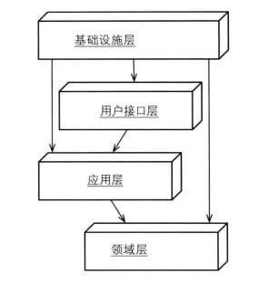

# 领域驱动模型



## 参考
- [ddd-car](https://github.com/Sayi/ddd-cargo)
- 《领域驱动设计精粹》

---

## 目录
<details>
<summary>展开更多</summary>

* [`通用架构`](#通用架构)
* [`要素`](#要素)
* [`精粹`](#精粹)
* [`案例`](#案例)

</details>

---

## 通用架构

**用户接口层**

> 负责向用户展现信息

```typescript
class CarController {
  private carQueryService: CarQueryService;
  private carCmdService: CarCommandService;

  constructor(...args) {
    // ...
  }

  public book(carInfo: CarInfo): void {
    carCmdService.book(carInfo);
  }

  public update(carId: string, info: CarInfo): void {
    carCmdService.update(carId, info);
  }

  public cargo(carId: string): Car {
    return carQueryService.queryById(carId);
  }
}
```

**应用服务层**

> 协调应用内的活动，可以做流程编排，通用流程可以抽象、固化
>
> 不包含业务逻辑，不保留业务对象的状态，仅保留业务进度状态
>
> 通常的处理流程：
>
> 1. 校验
>
> 2. 协调领域模型或者领域服务
>
> 3. 持久化
>
> 4. 发布领域事件
>

```typescript
class CarCmdServiceImplement implements CarCmdService {
  private carRepository: CarRepository;
  private eventPublisher: EventPublisher;

  public book(carInfo: CarInfo): void {
    // validate

    // create
    const car: Car = Car.newCar(CarDomainService.newCarId(), carInfo);
    // save
    cargoRepository.save(car);
    // publish event
    eventPublisher.publish(car);
  }

  public update(carId: string, info: CarInfo): void {
    // validate
    CarDomainService.validate(info);
    // find
    const car: Car = cargoRepository.find(carId);
    // update
    car.update(info);
    // save
    cargoRepository.save(car);
    // publish event
    eventPublisher.publish(car);
  }
}
```

```typescript
class CarQueryServiceImplement implements CarQueryService {
  private carMapper: CarMapper;

  public queryById(): Car {
    const car: Car = carMapper.select(id);
    return car;
  }
}
```

**领域层**

> 业务核心，包含关于领域的信息
>
> 主要包含：
>
> 1. 领域模型（单个聚合根、模型）
>
> 2. 领域服务（静态方法、涉及多个聚合配合的业务、外部服务处理业务）的状态
>

```typescript
// 领域模型
class Car {
  private id: String;
  private color: String;
  private description: String;

  constructor(carId: string, carInfo: CarInfo) {
    this.id = carId;
    this.color = carInfo.color;
    this.description = carInfo.description;
  }

  public static newCar(carId: string, carInfo: CarInfo): Car {
    const car: Car = new Car(carId, carInfo);
    return car;
  }
}
```

```typescript
class CarDomainService {
  public static PREFIX: string = 'mycar';

  public static newCarId(): string {
    return CarDomainService.PREFIX + Math.random().toString(32);
  }

  public static validate(carInfo: CarInfo): void {
    if (!carInfo.color || !carInfo.description) {
      throw new Error('缺少必要参数');
    }
  }
}
```

**基础设施层**

>
> 作为其他层的支撑层
>
> 实现业务对象的持久化，提供各层通信、防腐
>

```typescript
class CarRepositoryImplement implements CarRepository {
  private carMapper: CarMapper;

  public find(id: string): Car {
    const car: Car = carMapper.select(id);
    return car;
  }

  public save(car: Car): void {
    // ...
  }
}
```

---

## 要素

**实体(Entity)**

> 具有唯一标识的基本元素（class）
>
> 是业务对象的抽象，属于解决方案

**值对象(Value Object)**

> 没有唯一标识的`实体`（class.getInstance()）

**服务(Service)**

> 无状态，无属性，提供便捷方法，具有行为，行为无状态（Utils）
>
> 但是行为不属于任何实体或对象，能涉及多个对象，
>

**模块(Module)**

> 应当包含统一接口供外部调用，
>
> 通过组织模块，降低模型复杂度（mixins）

**聚合(Aggregates)**

> 由一或多个`实体`组成，是解决方案
>
> 是一个典型的命令模型，关联领域事件、和命令
>
> 每个聚合都有一个根实体，叫`聚合根`，在聚合中，聚合根是唯一允许外部引用的元素
>
> 聚合内部的对象可以互相引用，外部只能看到聚合根
>

**工厂(Factory)**

> 封装复杂对象的创建过程（复杂class）
>
> 聚合的根创建后，聚合包含的对象也随之创建
> 

**资源库(Repositories)**

> 封装所有获取对象引用的逻辑，是全局存储点（storage）
>
> 与DAO的区别：DAO包含了从数据库提取数据，是资源库的下层
>
> 与工厂的区别：工厂创建对象，资源库保存已创建的对象
>

**子域**

> 一个单一、有逻辑的领域模型

- 核心域
- 支撑子域
- 通用域

---

## 精粹

### 运用上下文映射
> 战略设计

**合作关系**

> 各团队各自负责一个限界上下文
>
> 互相依赖一套合作目标形成合作关系

**共享内核**

> 各团队间共享一块小规模&通用的模型
>
> 需要就共享模型的构成，不断达成一致

**客户-供应商**

> 供应商位于上游，客户位于下游
>
> 客户需要与供应商制定规则来满足自己的诉求，供应商也需要按约定满足客户需求

**跟随者**

> 即尊奉者，下游无资源去适应上游的通用语言，只能顺应上游模型
>
> 当团队需要与一个庞大复杂的系统集成时使用
>
> 开放式主机服务，提供一套开放的协议和接口，作为跟随者更容易被下游接收

**防腐层**

> 下游在其通用语言和上游通用语言之间，建立的一个翻译层
>
> api网关就是典型的防腐层

**已发布的语言**

> 比如`JSON schema`，更方便上下游协作

#### 映射方式
- rpc
- restful
- 消息机制

**消息机制**

backoff

> 一种重试机制，发送者在发送前会等待一个随机的间隔，避免和其他相同发送间隔的发送者冲突

reactive

> 请求响应的通信方式，所以延迟是可预见性的结果

de-duplication

> 一种去重机制，消息接受者，应该根据消息的唯一标志，忽略重复的消息

### 运用聚合
> 将业务逻辑放在各自领域中

**规则一：在聚合边界内保证业务规则不变性**

> 聚合的组成部分，必须根据最终业务决定

检查其他聚合，是否会响应当前聚合的（属性）变动，如果会的话，需要以清单形式，罗列于当前聚合下

**规则二：聚合要设计的小巧**

> 单一职责

尽量做到每次创建聚合只包含一个实体，用关联最紧密的字段属性，填充这个实体，即为聚合根

**规则三：只能通过标识符引用其他聚合**

> 聚合间根据特定标识连接
>
> 好处是可以用任意类型的持久化机制存储

**规则四：利用最终一致性更新其他聚合**

> 在事务一定能提交成功时，可以涉及多个聚合的修改
>
> 否则的话，需要通过事件分发，保证最终一致性

即时响应 or 延时响应

> 如果两个实体要求即时响应，则要将他们合并到同一个聚合中
>
> 否则，根据最终一致性，更新其他聚合

### 运用领域事件
> 事件是对过去发生事务的陈述，比如 productCommitted
>
> 事件类型必须准确描述事务的行为
>
> 事件的引起可以由命令引起，也能由其他变化而引起

**事件保存**

> 事件保存后，会发布给任何感兴趣的订阅方

**事件溯源**

> 持久化一个`聚合`实例上发生的所有领域事件
>
> 同时一定会用到`CQRS`

**命令**

> 命令通常是用户的某个操作结果，会导致领域事件的发生
>
> 所以其命名是指令式的，比如CreateProduct


### 运用事件风暴


---

## 案例

### 命令和查询职责分离--CQRS

可以将领域模型分为：`命令模型（Command）`和`查询模型（Read）`

**命令模型**

>
> 可以修改对象状态，但是不能返回数据
>
> 命令模型是有副作用的
>

**查询模型**

>
> 可以返回数据，但是不能直接或间接修改对象状态
>
> 查询模型无副作用（总是能返回固定结果）
>

