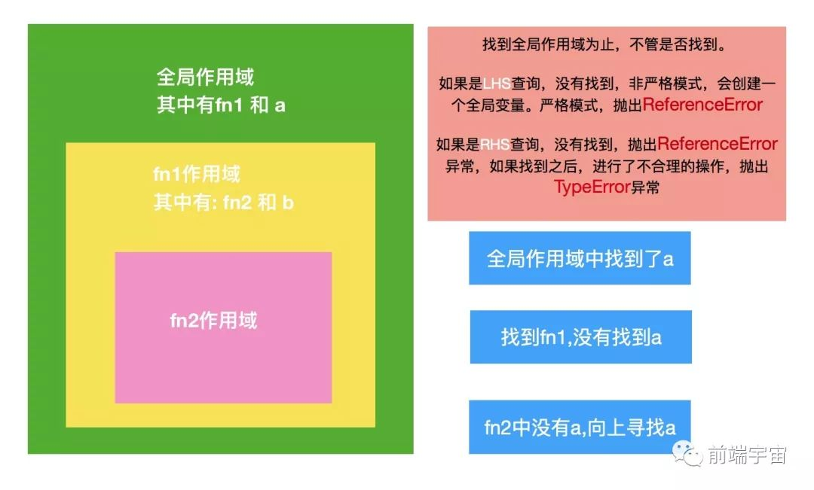

# 基础面试题

## 参考
- [基础20题](https://mp.weixin.qq.com/s/ViucwxvZg-g_YsHxN1PiAA)
- [前端100问](https://juejin.im/post/5d23e750f265da1b855c7bbe?utm_source=gold_browser_extension#heading-2)
- [前端必学](https://juejin.im/post/5d387f696fb9a07eeb13ea60?utm_source=gold_browser_extension)

## 目录
<details>
<summary>展开更多</summary>

* [`==和===`](#==和===)
* [`[]==![]`](#[]==![])
* [`let、const以及var的区别`](#let、const以及var的区别)
* [`flex布局`](#flex布局)
* [`this`](#this)
* [`函数声明&变量声明`](#函数声明&变量声明)
* [`统计数组成员重复个数`](#统计数组成员重复个数)
* [`vue/react中key的作用`](#vue/react中key的作用)
* [`setTimeout原理`](#setTimeout原理)
* [`onload/DOMContentLoaded`](#onload/DOMContentLoaded)
* [`事件触发过程`](#事件触发过程)
* [`flex属性`](#flex属性)
* [`响应式方案`](#响应式方案)
* [`a==1&&a==2&&a==3`](#a==1&&a==2&&a==3)
* [`隐藏页面元素`](#隐藏页面元素)
* [`Promise.all实现`](#Promise.all实现)
* [`执行上下文和作用域链`](#执行上下文和作用域链)
* [`节流&防抖`](#节流&防抖)
* [`flattenArray`](#flattenArray)
* [`数组去重uniq`](#数组去重uniq)
* [`何为可迭代对象`](#何为可迭代对象)
* [`Set、Map、WeakSet和WeakMap的区别`](#Set、Map、WeakSet和WeakMap的区别)
* [`深度优先和广度优先`](#深度优先和广度优先)
* [`es5/es6继承的区别`](#es5/es6继承的区别)
* [`setTimeout、Promise、Async/Await区别`](#setTimeout、Promise、Async/Await区别)
* [`模拟async&await`](#模拟async&await)
* [`同/异任务`](#同/异任务)
* [`算法题`](#算法题)
* [`如何实现一个new`](#如何实现一个new)
* [`http2多路复用`](#http2多路复用)
* [`描述网页从输入url到渲染的过程`](#描述网页从输入url到渲染的过程)
* [`TCP三次握手&四次挥手的理解`](#TCP三次握手&四次挥手的理解)
* [`react的setState变更的同/异步`](#react的setState变更的同/异步)
* [`npm模块安装机制`](#npm模块安装机制)
* [`判断数组方法的区别`](#判断数组方法的区别)
* [`重绘和回流`](#重绘和回流)
* [`发布订阅VS观察者模式`](#发布订阅VS观察者模式)
* [`redux和vuex`](#redux和vuex)
* [`浏览器和Node事件循环的区别`](#浏览器和Node事件循环的区别)
* [`前端中的模块化开发`](#前端中的模块化开发)
* [`cookie和token都存放在header中，为什么不会劫持token`](#cookie和token都存放在header中，为什么不会劫持token)
* [`如何实现token加密`](#如何实现token加密)
* [`setTimeout输出0-9改法`](#setTimeout输出0-9改法)
* [`VirtualDom对比原生DOM处理`](#VirtualDom对比原生DOM处理)
* [`浏览器缓存读取规则`](#浏览器缓存读取规则)
* [`BFC`](#BFC)
* [`作用域`](#作用域)
* [`实现sleep`](#实现sleep)
* [`https`](#https)
* [`埋点请求用1x1图片`](#埋点请求用1x1图片)
* [`css布局`](#css布局)
* [`排序`](#排序)
* [`class/function`](#class/function)
* [`display/opacity/visibility`](#display/opacity/visibility)
* [`普通函数/箭头函数`](#普通函数/箭头函数)
* [`求数组交集`](#求数组交集)
* [`Promise.prototype.finally`](#Promise.prototype.finally)
* [`es6->es5`](#es6->es5)
* [`retina屏1px问题`](#retina屏1px问题)
* [`webpack热更新`](#webpack热更新)
* [`字符串中查找字符串位置`](#字符串中查找字符串位置)
* [`forVSforEach`](#forVSforEach)
* [`proxy`](#proxy)
* [`JSpring的vnode解析`](#JSpring的vnode解析)
* [`取arr[0]和arr[100000]区别`](#取arr[0]和arr[100000]区别)
* [`Vue的父组件和子组件生命周期钩子执行顺序`](#Vue的父组件和子组件生命周期钩子执行顺序)
* [`中文输入防抖`](#中文输入防抖)
* [`react里的link和a的区别`](#react里的link和a的区别)
* [`验证url合法性`](#验证url合法性)
* [`vue在v-for时给每项元素绑定事件需要用事件代理吗?`](#vue在v-for时给每项元素绑定事件需要用事件代理吗?)
* [`反爬虫技术`](#反爬虫技术)
* [`逆序数字（递归实现）`](#逆序数字（递归实现）)
* [`正则引擎`](#正则引擎)
* [`node异步错误捕获`](#node异步错误捕获)
* [`css影响页面加载`](#css影响页面加载)
* [`BOMvsDOMvsHTML5`](#BOMvsDOMvsHTML5)
* [`white-space/word-break/word-wrap`](#white-space/word-break/word-wrap)
* [`z-index`](#z-index)
* [`CSS性能优化`](#CSS性能优化)
* [`jsonp`](#jsonp)
* [`文档流`](#文档流)
* [`浏览器页面资源加载过程与优化`](#浏览器页面资源加载过程与优化)


</details>

### ==和===
- === 不需要进行类型转换，只有类型相同并且值相等时，才返回 true.
- == 如果两者类型不同，首先需要进行类型转换。具体流程如下:
  * 首先判断两者类型是否相同，如果相等，判断值是否相等；
  * 如果类型不同，进行类型转换；
  * 判断比较的是否是 null 或者是 undefined, 如果是, 返回 true；
  * 判断其中一方是否为 boolean, 如果是, 将 boolean 转为 number 再进行判断；
  * 判断两者类型是否为 string 和 number, 如果是, 将字符串转换成 number；
判断其中一方是否为 object 且另一方为 string、number 或者 symbol , 如果是, 将 object   * 转为原始类型再进行判断。

---

### []==![]

数组转数字方法

Number(array.toString())

```js
Number([]) === 0
```

---

### let、const以及var的区别

| 声明方式 | 变量提升 | 暂时死区 | 重复声明 | 块作用有效 | 
| -------- | -----: | :----: | :----: | :----: |
| var | √ | × | √ | × |
| let | × | √ | × | √ |
| const | × | √ | × | √ |

- var会变量提升
- var可重复声明
- let、const声明在块级作用域，var声明在局部/全局作用域
-  let、const存在暂时性死区
  * 暂时性死区的本质就是，只要一进入当前作用域，所要使用的变量就已经存在了，但是不可获取，只有等到声明变量的那一行代码出现，才可以获取和使用该变量
  * ```js
    typeof x; // ReferenceError(暂时性死区，抛错)
    let x;

    typeof y; // 值是 undefined, 不会报错
    ```

---

### 函数声明&变量声明
- 函数会首先被提升，然后才是变量
- 换言之，无论两者（书面上）的声明顺序如何，优先读取到的是函数声明
- 原因如下

#### 执行环境
包括创建 + 执行阶段

**创建过程**

1. 初始化arguments对象，及形参
2. 扫描函数声明，并进行处理
  - 如果该函数名在变量对象中已存在，则覆盖已存在的函数引用
3. 扫描变量声明，并进行处理
  - 如果该变量名在变量对象中已存在，为防止与函数名冲突，则跳过，不进行任何操作

```js
executionContextObj = {
  'variableObject': {...}, //函数的arguments、参数、函数内的变量及函数声明
  'scopeChian': {...}, //本层变量对象及所有上层执行环境的变量对象
  'this': {}
};
```

---

### this

```js
var number = 5;
var obj = {
    number: 3,
    fn1: (function () {
        var number;
        this.number *= 2;
        number = number * 2;
        number = 3;
        return function () {
            var num = this.number;
            this.number *= 2;
            console.log(num);
            number *= 3;
            console.log(number);
        }
    })(),
}
var fn1 = obj.fn1;
//  10 9
fn1.call(null);
// 3 27
obj.fn1();
// 20
console.log(window.number);
```

---

### 统计数组成员重复个数
```js
const arr = [0, 1, 1, 2, 2, 2];
const count = arr.reduce((t, c) => {
    t[c] = t[c] ? ++t[c] : 1;
    return t;
}, {});
// count => { 0: 1, 1: 2, 2: 3 }

```

---

### vue/react中key的作用
- 不能单纯的讲和性能好坏有无关联
  * 节点树简单时，纯innerText改动比节点位置改动快
- 没有key时，做innerText的改动
- 有key时，会做节点位置交换

#### 准确性
对比a.key === b.key，可以避免复用节点，更准确

#### 性能
利用key生成map的话，查找比单纯找数组快

---

### flex属性
**flex-basis**

- 设置或检索弹性盒伸缩基准值，不设置，默认使用元素的width，
  如果width是auto，宽度由文本内容决定
- 用法
  * flex-basis: 120px;
  * flex-basis: auto;
  * flex-basis: 10%;

**flex-grow**

- 设置弹性盒对象扩展比
- 如果子元素的宽度和小于父容器，则剩余空间根据flex-grow瓜分
- 默认0，即剩余空间宽度瓜分到0，到当前子元素
- 

**flex**

flex: 1

- 均分父元素剩余宽度达到自适应

**flex-shrink**

- 设置弹性盒对象收缩比
- 用法
  * flex-shrink: 0; // 不收缩
  * flex-shrink: 1; // 默认值
- 计算方式
  ```js
  const 元素总宽度和 = '各元素 flex-basis 之和'
  const 超出宽度 = 元素总宽度和 - 容器宽度
  const 当前元素宽度占比 = (当前元素 flex-basis * 当前元素 flex-shrink) / (所有元素各自 flex-basis * flex-shrink 之和)
  const 当前元素最终宽度 = 当前元素 flex-basis - (超出宽度 * 当前元素宽度占比)
  ```
- 实例
  ```html
  <div id="content">
    <!-- 宽度105.72 -->
    <div class="box">A</div>
    <div class="box">B</div>
    <div class="box">C</div>
    <!-- 宽度91.42 -->
    <!-- 120 - (120 * 5 - 500) * 120 * 2 / (120 * 3 * 1 + 120 * 2 * 2) -->
    <div class="box1">D</div>
    <div class="box1">E</div>
  </div>
  <style type="text/css">
    #content {
      display: flex;
      width: 500px;
    }

    #content div {
      flex-basis: 120px;
    }

    .box { 
      flex-shrink: 1;
    }

    .box1 { 
      flex-shrink: 2; 
    }
  </style>
  ```

---

### 响应式方案
[参考](https://github.com/forthealllight/blog/issues/13)

- 媒体查询
- 百分比
- rem
- vw/vh

#### 媒体查询
缺点：需要准备多套样式

```css
@media screen and (max-width: 960px){
}

@media screen and (max-width: 768px){
}

@media screen and (max-width: 550px){
}

@media screen and (max-width: 320px){
}
```

#### 百分比
缺点：
1. 所有尺寸都要重新换算
2. 各尺寸参照父元素的宽高标准不一

- width/height: 相对于直接父元素
- top和bottom 、left和right: 相对于直接非static父元素的高度/宽度
- padding/margin: 相对于直接父元素的width，与height无关
- border-radius: 相对于自身宽度
- vertical-align: 百分比相对于自身line-height计算

#### vh/vw
缺点：
1. ie9-11不支持vmin和vmax，opera整体不支持

- vh: 相对于视窗的宽度，视窗宽度是100vh
- vw: 相对于视窗的宽度，视窗宽度是100vw
- vmax: vw和vh中的较大值
- vmin: vw和vh中的较小值

**与%的区别**

%大多相对于祖先元素，vh/vw相对于视窗

**px转vw**

- 手动转：1px=(1/375)*100vw（假设在iphone6/7，375*667的分辨率）
- 插件：postcss-px-to-viewport

#### rem
本质是等比缩放

缺点：font-size的设置必须在样式前

- 默认1rem = 16px
- 配合媒体查询才能实现响应式
- 当html的字体大小恒等于屏幕宽度 / 100，则1rem = 1vw
- 在dom ready、resize、屏幕rotate时重新计算html的font-size

**举例**

```js
// 1. 计算font-size
document.documentElement.style.fontSize = document.documentElement.clientWidth / 100 + 'px';

// 2. 计算元素宽度
// 比如设计稿尺寸是640px，元素宽度100px
// 公式：元素宽度 / 640 * 100
// 元素宽度 = 100 / 640 * 100 = 15.625rem
```

**步骤**

1. 给根元素设置字体大小，并在body元素校正
```css
<!-- 1rem = 100px -->
html{font-size:100px;}
<!-- 1rem = 10px -->
html{font-size: 62.5%;}
body{font-size:14px;}
```
2. 绑定监听事件，dom加载后和尺寸变化时改变font-size
3. px自动转rem =》postcss

**转换工具**

```js
// 工具1：px2rem-loader
module.exports = {
  // ...
  module: {
    rules: [{
      test: /\.css$/,
      use: [{
        loader: 'style-loader'
      }, {
        loader: 'css-loader'
      }, {
        loader: 'px2rem-loader',
        options: {
          remUni: 75,
          remPrecision: 8
        }
      }]
    }]
  }
};

// 工具2：postcss-loader
var px2rem = require('postcss-px2rem');

module.exports = {
  module: {
    loaders: [
      {
        test: /\.css$/,
        loader: "style-loader!css-loader!postcss-loader"
      }
    ]
  },
  postcss: function() {
    return [px2rem({remUnit: 75})];
  }
};
```

**设置font-size**

```js
!function(a,b){
  function c(){
    var b=f.getBoundingClientRect().width;
    b/k>540&&(b=540*k);
    var c=b/10;
    f.style.fontSize=c+"px",m.rem=a.rem=c
  }
var d,e=a.document,f=e.documentElement,
g=e.querySelector('meta[name="viewport"]'),
h=e.querySelector('meta[name="flexible"]'),
i=e.querySelector('meta[name="flexible-in-x5"]'),
j=!0,k=0,l=0,m=b.flexible||(b.flexible={});
if(g){
  console.warn("将根据已有的meta标签来设置缩放比例");
  var n=g.getAttribute("content").match(/initial\-scale=([\d\.]+)/);
  n&&(l=parseFloat(n[1]),k=parseInt(1/l))
} else if(h){
  var o=h.getAttribute("content");
  if(o){
    var p=o.match(/initial\-dpr=([\d\.]+)/),
    q=o.match(/maximum\-dpr=([\d\.]+)/);
    p&&(k=parseFloat(p[1]),l=parseFloat((1/k).toFixed(2))),
    q&&(k=parseFloat(q[1]),l=parseFloat((1/k).toFixed(2)))
  }
}if(i&&(j="false"!==i.getAttribute("content")),!k&&!l){
  var r=(a.navigator.appVersion.match(/android/gi),a.chrome),
  s=a.navigator.appVersion.match(/iphone/gi),
  t=a.devicePixelRatio,u=/TBS\/\d+/.test(a.navigator.userAgent),v=!1;
  try{
    v="true"===localStorage.getItem("IN_FLEXIBLE_WHITE_LIST")
  }catch(w){
    v=!1
  }
  k=s||r||u&&j&&v?t>=3&&(!k||k>=3)?3:t>=2&&(!k||k>=2)?2:1:1,l=1/k
}if(f.setAttribute("data-dpr",k),!g)
  if(g=e.createElement("meta"),g.setAttribute("name","viewport"),g.setAttribute("content","initial-scale="+l+", maximum-scale="+l+", minimum-scale="+l+", user-scalable=no"),f.firstElementChild)
    f.firstElementChild.appendChild(g);
  else{
    var x=e.createElement("div");
    x.appendChild(g),e.write(x.innerHTML)
  }
  a.addEventListener("resize",function(){
    clearTimeout(d),d=setTimeout(c,300)
  },!1),
  a.addEventListener("pageshow",function(a){
    // persisted 是否来自缓存
    a.persisted&&(clearTimeout(d),d=setTimeout(c,300))
  },!1),
  "complete"===e.readyState?e.body.style.fontSize=12*k+"px":e.addEventListener("DOMContentLoaded",function(a){
    e.body.style.fontSize=12*k+"px"
  },!1),c(),m.dpr=a.dpr=k,m.refreshRem=c,
  m.rem2px=function(a){
    var b=parseFloat(a)*this.rem;
    return"string"==typeof a&&a.match(/rem$/)&&(b+="px"),b
  },m.px2rem=function(a){
    var b=parseFloat(a)/this.rem;
    return"string"==typeof a&&a.match(/px$/)&&(b+="rem"),b
  }
}(window,window.lib||(window.lib={}));
```

---

### setTimeout原理
[参考](../../js&browser/基本常识.md#setTimeout)

---

### onload/DOMContentLoaded
[DOMContentLoaded](https://juejin.im/post/5b2a508ae51d4558de5bd5d1)

#### DOMContentLoaded
- HTML5事件
- 初始的HTML文件被完整读取时触发
- 异步加载的css，不会影响DOMContentLoaded

**几种说法**

说法一：js高程
- 形成完整dom树后触发
- 不理会js、css、图片等资源文件

说法二：普遍观点
- 等待js的下载 + 加载
- 不理会css、图片、iframe等的加载

说法三：较权威的观点
[css加载](https://segmentfault.com/a/1190000018130499)
- 只存在css 或 js加载在css之前，DOMContentLoaded不需要等css加载完才触发
- 存在css和js 或 js加载在css后面，DOMContentLoaded需要等css和js都加载完才触发

我的实验：chrome76
- 无论js是否存在，或js和css位置关系如何，都会影响DOMContentLoaded触发

#### onload
- DOM事件
- 所有内容加载完，包括js中的js、css、图片、iframe
- 不包括请求

---

### 事件触发过程
- attachEvent(event,listener)
- addEventListener(event, listener, useCapture = false)

捕获 - 目标状态 - 冒泡
onDoingthing冒泡阶段触发

---

### a==1&&a==2&&a==3

**隐式转换**

=》[Symbol.toPrimitive]/valueOf / toString

#### 方式1
```js
// 闭包
var a = {
  [Symbol.toPrimitive]: (function(i) {
    return function() {
      return i++;
    }
  }(1))
};
```

#### 方式2
```js
// proxy
var a = new Proxy({}, {
  value: 1,
  get() {
    return () => this.value++;
  }
});
```

#### 方式3
```js
// 对象
var a = {
	count: 1,
	toString() {
		switch (this.count) {
            case 1:
            case 2:
            case 3:
				return this.count++;
		}
	},
};
```

#### 方式4
```js
// arr.join = arr.shift
var arr = [1, 2, 3];
arr.join = arr.shift;
```

---

### 隐藏页面元素

#### 完全隐藏
- display: none
- hidden

#### 视觉隐藏
- position: fixed; top:-9999px;
- transform: scale(0);
- transform: translateX(-9999px);
- transform: rotateX(90deg);
- width: 0;
- opacity: 0;
- visibility: hidden;
- z-index: -999; position: relative;

#### 读屏软件隐藏
- aria-hidden="true"

---

### 执行上下文和作用域链

#### 执行上下文
js被解析和执行环境的抽象概念

- 全局执行上下文
- 函数执行上下文
  * 创建对象、函数
  * 作用域链
  * this

#### 作用域链
作用域的工作模型，分两种
1. 词法作用域（js是这种）
2. 动态作用域


**作用域**

- 全局作用域
- 函数作用域
- 块级作用域

**任务队列**

先进先出

**执行栈**

即js调用栈，具有 LIFO (后进先出) 结构

**作用域链**



---

### 节流&防抖

#### 防抖
n秒内高频事件再次触发，都会重新计时
[防抖参考](./debounce.js)

#### 节流
n秒内高频触发，只会执行一次
[节流参考](./throttle.js)

---

### Promise.all实现
```js
Promise.all = function all(arr = {}) {
  const { length } = arr;
  const result = [];
  let step = 0;
  return new Promise((resolve, reject) => {
    if (length) {
      arr.forEach((value) => {
        const promise = value instanceof Promise ? value : Promise.resolve(value);
        promise.then(
          (res) => {
            result.push(res);
            if (++step >= length) {
              resolve(result);
            }
          },
          (err) => reject(err),
        )
      });
    } else {
       throw new TypeError('undefined is not iterable (cannot read property Symbol(Symbol.iterator))');
    }
  });
};

Promise.all2 = function(promises) {
  return new Promise((resolve, reject) => {
    if (promises && promises.length) {
      const result = [];
      let index = 0;
      for (let i = 0, promise; i < promises.length; i += 1) {
        promise = promises[i];
        Promise.resolve(promise).then((res) => {
          result[i] = res;
          if (++index === promises.length) {
            resolve(result);
          }
        }, (err) => {
          reject(err);
          return;
        });
      }
    } else {
      throw new TypeError('undefined is not iterable (cannot read property Symbol(Symbol.iterator))');
    }
  });
};
```

--

### 数组扁平化flattenArray

#### 方式一
```js
const falttenArray = (arr, result = []) => {
  arr.forEach((item) => {
    if (Array.isArray(item)) {
      falttenArray(item, result)
    } else {
      result.push(item);
    }
  });
  return result;
};
```

#### 方式二
```js
var flattenArray = (arr) => {
  return arr.reduce((res, item) => {
    if (Array.isArray(item)) {
      res.push(...flattenArray(item));
    } else {
      res.push(item);
    }
    return res;
  }, []);
};
```

---

### 数组去重uniq
- Set
  ```js
  [new Set(...arr)]
  ```
- indexOf
- includes
- Map
- indexOf(i, step) === lastIndexOf(i)

---

### 何为可迭代对象
- Array
- Map
- Set
- String
- TypedArray
- 函数的 arguments 对象
- NodeList 对象

#### 特点
- Symbol.iterator
- for...of...
- Array.from

---

### Set、Map、WeakSet和WeakMap的区别

#### Set
- 成员不能重复
- 类似数组
- 可遍历
- add/delete

#### WeakSet
- 成员不能重复
- 成员必须是对象（可存DOM引用）
- 不可遍历
- add/delete

#### Map
- 可遍历
- set/delete

#### WeakMap
- 不可遍历
- 键值是对象
- set/delete

---

### 深度优先和广度优先
应用于图

#### 深度优先
- 类似树的先序遍历
- 从邻接节点出发，优先遍历子节点

#### 广度优先
- 优先访问当前节点的邻接节点
- 当没有邻接节点时，另选一个未被访问的节点，重复上述过程

---

### es5/es6继承的区别
function vs class

#### function
- function声明提升
- function内部可引用未声明变量，
- function方法、原型可枚举，class都不可枚举

#### class
- class有暂时性死区
- class内部会自动启用严格模式
- class的静态方法、原型方法都没有prototype，也没[[constructor]]，所以都不能实例化
- class只能用new调用
- class内部重写类名无效

---

### setTimeout、Promise、Async/Await区别
- setTimeout属于宏任务
- Promise本身是同步的立即执行函数，Promise.then属于微任务
- async方法执行时，遇到await会立即执行表达式，表达式之后的代码放到微任务执行

---

### 模拟async&await
参考babel转换后的代码

async/await -> Generator -> Promise
依次执行context.next()，直到context.stop()，触发this.done = true，resolve Promise

---

### 同/异任务
[参考](../../js&browser/并发模型-event_loop.md#交互事件触发)

- 宏任务自调用不会造成未响应
- 微任务自调用会导致未响应

```js
// 正常调用
function foo() {
  setTimeout(foo, 0); // 是否存在堆栈溢出错误?
};

// 会导致未响应
function foo() {
  return Promise.resolve().then(foo);
};
```

---

### 算法题
```js
// 例：已知如下数组：
// var arr = [ [1, 2, 2], [3, 4, 5, 5], [6, 7, 8, 9, [11, 12, [12, 13, [14] ] ] ], 10];
// 编写一个程序将数组扁平化去并除其中重复部分数据，最终得到一个升序且不重复的数组

// 方法一：正道
function flatten(arr = [], res = []) {
	return arr.reduce((r, item) => {
		if (Array.isArray(item)) {
			flatten(item, r);
		} else {
			r.push(item);
		}
		return r;
	}, res);
};

function diff(arr = []) {
	return [...new Set(arr)];
};

function upper(arr = []) {
	return arr.sort((pre, next) => pre - next);
};

[
  flatten,
  diff,
  upper,
].reduce((res, fn) => fn(res), arr);


// 方式二：邪道
// Array.prototype.flat才刚到提案（chrome69支持）
Array.from(new Set(arr.flat(Infinity))).sort((a,b)=>{ return a-b})；


// 方式三：妖道
Array.from(new Set(arr.toString().split(","))).sort((a,b)=>{ return a-b})
```

---

### 如何实现一个new
[参考](./new.js)

---

### http2多路复用
- 同一域名下所有通信都在单个连接上完成，消除因多个TCP连接带来的延时和内存消耗
- 单个连接上的请求可以并行交错，互不影响

---

### 描述网页从输入url到渲染的过程
[过程](../../js&browser/页面过程与浏览器缓存.md#过程简述)

---

### TCP三次握手&四次挥手的理解
[网络编程基础](https://crystalwindz.com/unp_note_1/#%E7%AC%AC%E4%B8%80%E7%AB%A0-%E6%9C%AC%E4%B9%A6%E7%AE%80%E4%BB%8B)

#### 三次握手
- 客户端请求服务端【服务端确认客户端有发送能力】
- 服务端请求客户端【客户端确认服务端有发送能力】
- 客户端正式请求

#### 四次挥手
- 客户端发送要求断开的请求
- 服务端返回正在断开的请求【服务端可能并不会立即关闭SOCKET，所以先返回ACK】
- 服务端返回已经关闭的请求
- 客户端发送正式断开的请求

#### A、B 机器正常连接后，B 机器突然重启，问 A 此时处于 TCP 什么状态
- 服务器不重启，客户继续工作，就会发现对方没有回应(ETIMEOUT)，目的地不可达(EHOSTUNREACH)。
- 服务器重启后，客户继续工作，然而服务器已丢失客户信息，收到客户数据后响应RST。

---

### react的setState变更的同/异步
[参考](https://github.com/sisterAn/blog/issues/26)

- react自身引发的事件处理（onClick，componentWillMount等），异步执行
- 此外的调用（addEventLister、setTimeout等），同步执行

#### 原因
- 同/异步处理受isBatchingUpdates影响，默认isBatchingUpdates=false，也就是同步执行
- 当调用batchUpdate函数时，isBatchingUpdates=true
- react的事件处理前，就会调用batchingUpdate

#### 获取异步后的值
```js
// 虽然执行还是异步执行的，但是通过props能拿到更新瞬间的props
this.setState((prevState, props) => ({
    count: prevState.count + props.increment
}));
```

#### 测试题
```js
class Example extends React.Component {
  constructor() {
    super();
    this.state = {
      val: 0
    };
  }
  
  componentDidMount() {
    this.setState({val: this.state.val + 1});
    console.log(this.state.val);    // 第 1 次 log

    this.setState({val: this.state.val + 1});
    console.log(this.state.val);    // 第 2 次 log

    setTimeout(() => {
      this.setState({val: this.state.val + 1});
      console.log(this.state.val);  // 第 3 次 log

      this.setState({val: this.state.val + 1});
      console.log(this.state.val);  // 第 4 次 log
    }, 0);
  }

  render() {
    return null;
  }
};

// 答案
0 0 2 3

```

---

### npm模块安装机制
[参考](../../npm&yarn/README.md#npm安装原理)

---

### 判断数组方法的区别
- Object.prototype.toString.call
- instanceof
- Array.isArray()

Object.prototype.toString.call
- 每一个继承 Object 的对象都有 toString 方法
- 判断是否是数组 [Object array]

instanceof
- 判断对象的原型链中是不是能找到类型的prototype

 Array.isArray
 - 能检测出Iframes，而instanceof不行
  ```js
  xArray = window.frames[window.frames.length-1].Array;
  var arr = new xArray(1,2,3); // [1,2,3]

  Array.isArray(arr);  // true
  Object.prototype.toString.call(arr); // true
  arr instanceof Array; // false
  ```

---

### 重绘和回流
[参考](https://github.com/Advanced-Frontend/Daily-Interview-Question/issues/24)

#### 原理
**重绘**

- 几何或样式发生变动，但是不影响布局的

**回流**

- 几何属性变动，页面需要全部或局部更新
- [触发浏览器回流的属性方法一览表](https://mp.weixin.qq.com/s/EL40dbdMWKh9BSfHKtZf2Q)

回流必定会发生重绘，重绘不一定会引发回流

#### 优化
- 浏览器多使用队列方式，批量更新布局，至少一个浏览器刷新（16.6ms）才会清空队列
- 获取全局属性或方法，会强制清空队列，应避免频繁调用
  + offsetTop、offsetLeft、offsetWidth、offsetHeight
  + scrollTop、scrollLeft、scrollWidth、scrollHeight
  + clientTop、clientLeft、clientWidth、clientHeight
  + width、height
  + getComputedStyle()
  + getBoundingClientRect()

#### 如何减少触发
- transform代替top
- visibility代替display：none
- 避免使用tabel（通常要花3倍于同等元素的时间）
- 避免多次样式嵌套
- 动画效果尽量加载absolute或fixed元素上
- 使用GPU加速
- 频繁重绘或回流的单拉一个图层，例will-change

---

### 发布订阅VS观察者模式

- 观察者模式中主体和观察者是互相感知的
- 发布-订阅模式是借助第三方来实现调度的，发布者和订阅者之间互不感知

---

### redux和vuex
[参考](https://zhuanlan.zhihu.com/p/53599723)

- 单向数据流
- state不可变更
- 纯函数，无副作用

#### Store
- 整个应用只有一个store
- store允许监听，即store.subscribe，变更即dispatch订阅的callback
- store里的state不会变更，每次只会生成新的state

#### Action
- action可以由view触发，或由其他操作触发
- action必须有type，及一些属性，告诉Store State要改变的内容

#### Reducer
- 即上面说的，每次收到action，生成一个新的state
- 纯函数
- reduce是一个函数式编程的概念，所以起这名字

---

### 浏览器和Node事件循环的区别
[参考](../../js&browser/并发模型-event_loop.md#nodeVS浏览器)

---

### 前端中的模块化开发
[参考](../../js&browser/基本常识.md#模块化)

#### AMD
依赖必须提前声明好
```js
define('./index.js',function(code){
	// code 就是index.js 返回的内容
})
```

#### CMD
支持动态引入依赖文件
```js
define(function(require, exports, module) {  
  var indexCode = require('./index.js');
});
```

#### CommonJS
- require('fs')
- exports
- module.exports

#### UMD
兼容AMD，CommonJS 模块化语法

---

### cookie和token都存放在header中，为什么不会劫持token
[参考](../../js&browser/网络安全.md#CSRF)

- token用于防范csrf攻击
- csrf只能使用用户自动带上的cookie（浏览器所为），但是浏览器不会自动带上token

---

### 如何实现token加密
[参考](../../js&browser/网络安全.md#CSRF)

- 后端利用 一个随机数 + 加密算法，对信息（比如账号密码）加密
- 生成的token返给前端
- 前端请求时带上token
- 后端解密token校验

---

### 把两个数组 ['A1', 'A2', 'B1', 'B2', 'C1', 'C2', 'D1', 'D2'] 和 ['A', 'B', 'C', 'D']，合并为 ['A1', 'A2', 'A', 'B1', 'B2', 'B', 'C1', 'C2', 'C', 'D1', 'D2', 'D']
- ['A', 'B', 'C', 'D'] => .map(item => item + 3)
- concat + sort
- if (item.includes(3)) { ... }

---

### setTimeout输出0-9改法
```js
// 1
for (var i = 0; i< 10; i++){
    setTimeout(console.log, 1000, i)
}

// 2
for (var i = 0; i< 10; i++){
  ((i) => {
    setTimeout(() => {
      console.log(i);
    }, 1000)
 })(i)
}

// 3
for (let i = 0; i< 10; i++){
  setTimeout(() => {
    console.log(i);
  }, 1000)
}
```

---

### VirtualDom对比原生DOM处理
[参考](../../career/README.md#框架对比)

- diff+部分渲染 和 innerHTML改动的比较
- 无法得出客观结论，因时制宜

---

### 浏览器缓存读取规则
[参考](../../js&browser/页面过程与浏览器缓存.md#缓存机制)

---

### BFC

#### 创建BFC
- html 根元素
- float 浮动
- position不为relative和static
- overflow 不为 visiable
- display 为表格布局或者弹性布局
- 行内块元素
- 网格布局
- contain值为layout、content或 strict的元素

#### 特性
- 内部box会在垂直方向，一个接一个地放置。
- Box垂直方向的距离由margin决定，在一个BFC中，两个相邻的块级盒子的垂直外边距会产生折叠。
- 在BFC中，每一个盒子的左外边缘（margin-left）会触碰到容器的左边缘(border-left)（对于从右到左的格式来说，则触碰到右边缘）
- 形成了BFC的区域不会与float box重叠
- 计算BFC高度时，浮动元素也参与计算

#### 解决问题
- 清除浮动
- 防止同一 BFC 容器中的相邻元素间的外边距重叠问题

#### 其他术语

**IFC**

内联格式上下文

**GFC**

display: grid

**FFC**

display: flex

---

### 作用域
- 局部作用域是爹
- 不明确window下，且作用域内声明的（无论顺序），都是域内
- 函数声明比变量声明提前

```js
var a = 10;
(function () {
  console.log(a); // undefined
  a = 5;
  console.log(a); // 5
  console.log(window.a); // 10
  var a = 20;
  console.log(a); // 20
})();


// 翻译下
var a = 10;
(function () {
  var a;
  console.log(a); // undefined
  a = 5;
  console.log(a); // 5
  console.log(window.a); // 10
  a = 20;
  console.log(a); // 20
})();
```

---

### 实现sleep
```js
// Promise
const sleep = time => {
  return new Promise(resolve => setTimeout(resolve,time))
}
sleep(1000).then(()=>{
  console.log(1)
})

//Generator
function* sleepGenerator(time) {
  yield new Promise(function(resolve,reject){
    setTimeout(resolve,time);
  })
}
sleepGenerator(1000).next().value.then(()=>{console.log(1)})

//async
function sleep(time) {
  return new Promise(resolve => setTimeout(resolve,time))
}
async function output() {
  let out = await sleep(1000);
  console.log(1);
  return out;
}
output();

//ES5
function sleep(callback,time) {
  if(typeof callback === 'function')
    setTimeout(callback,time)
}

function output(){
  console.log(1);
}
sleep(output,1000);
```

---

### https
[http](../../http/README.md)
[参考](https://github.com/Advanced-Frontend/Daily-Interview-Question/issues/74)

https = http + tls安全层（比http多了2次tls的RTT）

#### 与http的区别
- https需要证书
- http是明文传输，https会用tls加密传输
- http80端口，https443端口

#### 加密方式

**非对称加密**

- 服务端A，将公钥发送给客户端B
- 客户端B产生一个秘钥，用服务端A的公钥加密，返给服务端A
- 服务端A用自己私钥解密B返的信息，获取客户端B的秘钥
- 以后A和B的数据通信都通过这个秘钥加密

#### 风险

**中间人攻击**

- 中间人拦截A的公钥，替换成自己的公钥
- B不清楚公钥的所属，用中间人公钥加密，返给中间人
- 中间人拦截，用自己私钥解密

#### 证书的作用

**证书制作**

- 服务端A，将自己的公钥key发给证书颁发机构，申请证书
- 证书机构有自己的公私钥，用自己的私钥加密A的公钥key + 服务端网址生成证书签名
- 打包成证书返给A

**鉴别真伪**

- 客户端B向服务端A请求时，A返回的是证书（不再是自己的公钥）
- B根据证书对应机构的公钥，解密出证书签名
- B使用同样规则，生成自己的证书签名，两者对比一致，说明证书有效
- B用机构的公钥，解密出A的公钥，之后就是非对称加密的过程

证书签名由服务端网址生成，中间人无法获取、攻击

#### 校验证书合法性
- 校验证书的颁发机构是否受客户端信任
- 通过 CRL（证书吊销列表，Certificate Revocation List）或OCSP（在线证书状态协议，Online Certificate Status Protocol）的方式校验证书是否被吊销
  * CRL需要经常在客户端下载最新版，所以比较繁琐
  * OCSP会在访问服务器时，自动请求一个证书状态的信息
- 对比系统时间，校验证书是否在有效期内
- 通过校验对方是否存在证书的私钥，判断证书的网站域名是否与证书颁发的域名一致

---

### 埋点请求用1x1图片
- 能够完成整个 HTTP 请求+响应（尽管不需要响应内容）
- GET请求之后不需要服务器返回数据
- 跨域友好
- 执行过程无阻塞
- 相比XMLHttpRequest对象发送GET请求，性能上更好
- GIF的最低合法体积最小

---

### 排序


---

### class/function
```js
// LazyMan('Tony');
// Hi I am Tony

// LazyMan('Tony').sleep(10).eat('lunch');
// Hi I am Tony
// 等待了10秒...
// I am eating lunch

// LazyMan('Tony').eat('lunch').sleep(10).eat('dinner');
// Hi I am Tony
// I am eating lunch
// 等待了10秒...
// I am eating diner

// LazyMan('Tony').eat('lunch').eat('dinner').sleepFirst(5).sleep(10).eat('junk food');
// Hi I am Tony
// 等待了5秒...
// I am eating lunch
// I am eating dinner
// 等待了10秒...
// I am eating junk food

function LazyMan (name = '') {
  if (!(this instanceof LazyMan)) {
    return new LazyMan(name);
  }
  this.name = name;
  this.queue = [];
  this.say();
};

LazyMan.prototype = {
  say(name = this.name) {
    console.log(`Hi I\`m ${name}`);
  },

  sleep(timeout) {
    this.queue.push(() => new Promise((res) =>
      setTimeout(() => {
        res();
      }, timeout * 1000 || 0))
    );
    return this;
  },

  sleepFirst(timeout) {
    this.queue.unshift(() => new Promise((res) =>
      setTimeout(() => {
        res();
      }, timeout * 1000 || 0))
    );
    return this;
  },

  clearQueue() {
    if (this.timeout) {
      clearTimeout(this.timeout);
      this.timeout = null;
    }

    this.timeout = setTimeout(async () => {
      while (this.queue.length) {
        const task = this.queue.shift();
        await task.call(this);
      }
    });
  },

  eat(word) {
    this.queue.push(this.say.bind(this, word));
    this.clearQueue();
    return this;
  },
};
```

---

### display/opacity/visibility

#### 结构
|  | 从渲染树中消失 | 渲染时占空间 | 事件监听 |
| -------- | -----: | :----: | :----: |
| display: none | √ | × | × |
| opacity: 0 | × | √ | √ |
| visibility: hidden | × | √ | × |

#### 继承性
- 子元素都会继承
- display和opacity的子元素无法显示
- 子元素设为visibility: visible可以显示

#### 性能
|  | 重绘 | 回流 | 读屏器读取 | 性能消耗 |
| -------- | -----: | :----: | :----: | :----: |
| display: none | √ | √ | × | 大 |
| opacity: 0 | √ | × | × | 小 |
| visibility: hidden | √ | × | √ | 小 |

---

### 普通函数/箭头函数
[箭头函数](../../js&browser/基本常识.md#箭头函数)

- 没有prototype，无法完成new
- 没有arguments，只能用rest方式
- this指向定义时环境
- 不支持Generator

---

### 求数组交集
```js
function solution(arr1, ...rest) {
    const temp = new Set(arr1);
    const res = new Set();
    arr2.forEach(item => temp.has(item) && res.add(item));
    return Array.from(res);
}
```

---

### Promise.prototype.finally
[finally](../../js&browser/基本常识.md#Promise.finally)

---

### es6->es5
[参考](../../babel/README.md#流程)

---

### [2,10,3,4,5,11,10,11,20]转[[2,3,4,5],[10,11],[20]]
- 生成10个随机数
- .sort((pre, next) => pre - next)
- var map = {};
- .forEach((num) => {
  map[num % 10].push(num)
})
- keys().map(key => value)

---

### retina屏1px问题
[7种方式](https://www.jianshu.com/p/7e63f5a32636)
[参考](../../css-related/README.md#1px)

---

### webpack热更新
[参考](../../webpack/README.md)

---

### 字符串中查找字符串位置
```js
function findSubstr(s1, s2) {
  const l1 = s1.length;
  const l2 = s2.length;
  if (l2 > l1) return -1;
  for (let i = 0; i < l1; i += 1) {
    if (s1.substr(i, l2) === s2) {
      return i;
    }
  }
  return -1;
}
```

---

### forVSforEach
https://jsperf.com

- forEach需要判断长度、元素值、终止条件等因素
- chrome高版本下，forEach性能高于for
- node环境下
  * 10万次遍历，forEach性能远高于for（10倍）
  * 100万次，55开
  * 1000万次，for远高于forEach

---

### proxy
[参考](../../meta-programming/README.md)

---

### JSpring的vnode解析
- html -> vobj
  ```json
  {
    tagName : tagName,
		staticAttrs : staticAttrs,
		uniqAttrs : uniqAttrs,
		children : [
      {
        isElem : false,
        isStatic : false,
        nodeType : 8,
        data : STRING,
        textContent : '',
      }
    ],
		isElem : true,
		isFor : isFor,
		isComponent : isComponent,
		isNeedRender : isNeedRender,
		isStatic : isStatic,
		nodeType : 1
  }
  ```
- with(data) { vobj } -> vnode
  ```js
  with(_j) {
    _j.cn(tagName, data, [
      _j.txt(data),
      // ...
    ])
  }

  // ==> vnode
  {
    tagName,
    data,
    children: []
  }
  ```

---

### 取arr[0]和arr[100000]区别
v8里数组即对象，hashtable方式存储，无差别

---

### Vue的父组件和子组件生命周期钩子执行顺序
类似执行栈，从外到内，再从内到外

#### 加载渲染过程
父beforeCreate->父created->父beforeMount->子beforeCreate->子created->子beforeMount->子mounted->父mounted

#### 子组件更新过程
父beforeUpdate->子beforeUpdate->子updated->父updated

#### 父组件更新过程
父beforeUpdate->父updated

#### 销毁过程
父beforeDestroy->子beforeDestroy->子destroyed->父destroyed

---

### 中文输入防抖
- input
- compositionstart
- compositionupdate
- compositionend

compositionstartHandler设置pending=true
inputHandler里判断，pending=true则不执行请求，否则，正常字母输入做防抖请求（停止输入时请求）

---

### react里的link和a的区别
- Link是react-router里实现路由跳转的链接，刷新部分内容，配合<Router>
  * 顺序：有onclick，执行onclick
  * 触发onclick，会阻止href
  * 否则用href，按history方式（pushState、popState、replaceState）跳转，刷新部分内容
- a会重新加载页面

---

### 验证url合法性
- new URL(url)
- ```js
  function isUrl(url) {
    const a = document.createElement('a')
    a.href = url
    return [
      /^(http|https):$/.test(a.protocol),
      a.host,
      a.pathname !== url,
      a.pathname !== `/${url}`,
    ].find(x => !x) === undefined
  }
  ```

---

### vue在v-for时给每项元素绑定事件需要用事件代理吗?
没有

---

### 反爬虫技术
[参考](https://github.com/Advanced-Frontend/Daily-Interview-Question/issues/150)
- font-family
- 数字直接下发加密值
- 汉字做凯撒加密（转unicode，偏移量可以设为一个常量，比如1，2,3）

---

### 逆序数字（递归实现）
```js
function fun(num){
    let num1 = num / 10;
    let num2 = num % 10;
    if(num1<1){
        return num;
    }else{
        num1 = Math.floor(num1)
        return `${num2}${fun(num1)}`
    }
}
```

---

### 正则

#### 正则引擎
- NFA：非确定性有限状态自动机
- DFA：确定性有限状态自动机

---

### node异步错误捕获
- uncaughtException
  ```js
  process.on('uncaughtException', (e)=>{
    console.error('process error is:', e.message);
    // 显式的手动杀掉进程
    process.exit(1);
    restartServer(); // 重启服务
  });
  ```
- domain
  * 把处理多个不同的IO的操作作为一个组。注册事件和回调到domain，当发生一个错误事件或抛出一个错误时，domain对象会被通知，不会丢失上下文环境，也不导致程序错误立即退出
  ```js
  const domain = require('domain');
  const d = domain.create();

  d.on('error', (err) => {
    console.log('err', err.message);
    console.log(needSend.message);
  });

  const needSend = { message: '需要传递给错误处理的一些信息' };
  d.add(needSend);
  d.run(() => {
    setTimeout(() => {
      throw new Error('aaaa');
    }, 1);  
  });
  ```

#### 多进程使用domain例子
```js
const cluster = require('cluster');
const os = require('os');
const http = require('http');
const domain = require('domain');

const d = domain.create();

if (cluster.isMaster) {
  const cpuNum = os.cpus().length;
  for (let i = 0; i < cpuNum; ++i) {
    cluster.fork()
  };
  // fork work log
  cluster.on('fork', worker=>{
    console.info(`${new Date()} worker${worker.process.pid}进程启动成功`);
  });
  // 监听异常退出进程，并重新fork
  cluster.on('exit',(worker,code,signal)=>{
    console.info(`${new Date()} worker${worker.process.pid}进程启动异常退出`);
    cluster.fork();
  })
} else {
  http.createServer((req, res)=>{
    d.add(res);
    d.on('error', (err) => {
      console.log('记录的err信息', err.message);
      console.log('出错的 work id:', process.pid);
      // uploadError(err)  // 上报错误信息至监控
      res.end('服务器异常, 请稍后再试');
      // 将异常子进程杀死
      cluster.worker.kill(process.pid);
    });
    d.run(handle.bind(null, req, res));
  }).listen(8080);
}

function handle(req, res) {
  if (process.pid % 2 === 0) {
    throw new Error(`出错了`);
  }
  res.end(`response by worker: ${process.pid}`);
};
```

---

### css影响页面加载
[参考](../../js&browser/页面过程与浏览器缓存.md#知识点)

---

### BOMvsDOMvsHTML5

#### BOM
浏览器对象模型

- window
- location
- navigator

#### DOM
文档对象模型

- nodeType
- querySelectorAll
- treewalker
- onload

#### HTML5
各浏览器自定义的模型

- DOMContentLoaded

---

### white-space/word-break/word-wrap
[参考](https://juejin.im/post/5b8905456fb9a01a105966b4)

#### white-space
控制空白字符的显示

- normal: 空格和换行符无效，自动换行
- nowrap: 永不换行
- pre: 即preserve，空格和换行符保留，无自动换行
- pre-wrap: 即preserve + wrap，空格和换行符保留，自动换行
- pre-line: 即preserve new line +wrap，空格无效，换行符保留，自动换行

#### word-break
控制单词如何被拆分换行

- keep-all: 一律不换行，除了空格
- break-all: 一律换行

#### word-wrap
控制单词如何被拆分换行

- break-word: 当一个单词一行显示不下时，才会换行

---

### z-index
[参考](../../css-related/README.md#z-index)

---

### CSS性能优化
- 内联首屏关键css
  * 【<14.6kb，[tcp连接](https://tylercipriani.com/blog/2016/09/25/the-14kb-in-the-tcp-initial-window/)单次往返最大数据量】
- 文件压缩
- 去除无用css
- 有效使用选择器
  * css选择器从右向左解析
  * 现代浏览器对不同选择器的解析已做了优化，差别很小
  * 避免嵌套过深
  * 避免标签+id混用
  * 避免通配符
  * 维持可读性
- 异步加载css
  * js动态建link
  * link的media设为不匹配的媒体类型，加载完后改回正确类型
    ```html
    <link rel="stylesheet" href="mystyles.css" media="noexist" onload="this.media='all'">
    ```
  * link的ref设为alternate可选样式表
    ```html
    <link rel="alternate stylesheet" href="mystyles.css" onload="this.rel='stylesheet'">
    ```
  * link的ref设为preload，as设为style
    + html标准规范，目前尚有兼容性问题
    + 相比上两种方式，能更早加载css
    ```html
    <link rel="preload" href="mystyles.css" as="style" onload="this.rel='stylesheet'">
    ```
- 避免昂贵属性
  * box-shadow
  * border-radius
  * filter
  * opacity
  * :nth-child
- 优化重绘重排
- 避免@import
  * 破坏了浏览器并行下载

---

### jsonp
[沙箱技术](https://github.com/aui/jsonp-sandbox/issues/13)

---

### 浏览器页面资源加载过程与优化

#### 加载过程
- 资源分类
- 安全策略检查
- 计算资源优先级
- 按优先级加载

**安全策略检查**

[安全策略检查](../../js&browser/网络安全.md#CSP)

**计算资源优先级**


- 网络请求
- 浏览器内核
  * html,css,font
  * <link rel="preload" />,script,xhr
  * image,audio,语音
  * prefetch
- 用户控制台

**preload**

【提前加载资源，优先级不提升】告知浏览器哪些资源将被使用，可以预加载

**prefetch**

【降低请求加载优先级】在浏览器空闲时才预加载

- 资源预加载：<link rel="prefetch" href="test.css">
- DNS预解析：<link rel="dns-prefetch" href="//haitao.nos.netease.com">
- http预连接：<link rel="prefetch" href="//www.kaola.com">
- 页面预渲染：<link rel="prerender" href="//m.kaola.com">

#### localStorage的使用
- 微信
  * js都放在localStorage里
  * 页面请求会带一个资源map，和localStorage对比
- 天猫
  * 缓存关键xhr
- 京东
  * 非关键（首屏）资源放在localStorage
  * 页面滚动到可视区之后，再拉取localStorage，动态append到页面

---

### 懒加载
intersectionObserver
- 目标元素和视口有一个交叉区，可以判断是否可见

---

### css布局
[css布局](../../css-related/README.md#布局)

---

### 文档流
将窗体自上而下分成一行一行，并在每行中按从左至右依次排放元素，
称为文档流

**脱离文档流**

- float
- position: absolute
- position: fixed

---

### 清除浮动
- 新增子标签 + clear:both【不推荐，语义化差】
- 父标签 + overflow:hidden【不推荐，内容多时无法显示溢出内容】
- 父标签 + 伪元素clear:both【推荐】
  ```css
  .clearfix::after {
    content: "";
    display: block;
    height: 0;
    clear:both;
    visibility: hidden;
  }
  ```
- 父标签 + 双伪元素【推荐】
  ```css
  .clearfix:after,.clearfix:before{
    content: "";
    display: table;
  }
  .clearfix:after{
    clear: both;
  }
  .clearfix{
    *zoom: 1;
  }
  ```

---

### 小程序的意义

---

### jsbridge
[参考](../../js&browser/jsbridge.md)

