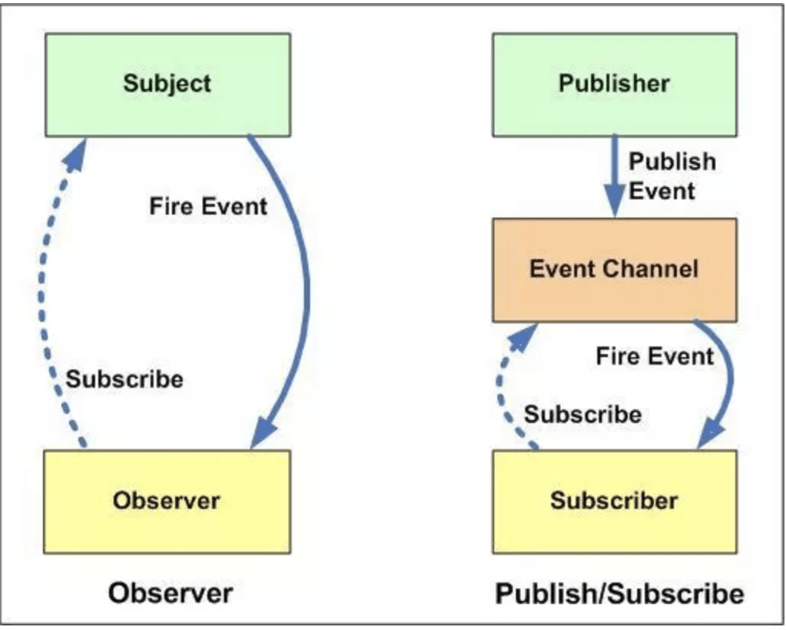

# 基础面试题

## 参考

- [基础 20 题](https://mp.weixin.qq.com/s/ViucwxvZg-g_YsHxN1PiAA)
- [前端 100 问](https://juejin.im/post/5d23e750f265da1b855c7bbe?utm_source=gold_browser_extension#heading-2)
- [前端必学](https://juejin.im/post/5d387f696fb9a07eeb13ea60?utm_source=gold_browser_extension)
- [react](https://github.com/xiaomuzhu/front-end-interview/blob/master/docs/guide/react.md)
- [90% 的前端都会踩的坑](https://juejin.im/post/5dfb3e73f265da33b12ea9d3?utm_source=gold_browser_extension#heading-16)
- [javascript-questions](https://github.com/lydiahallie/javascript-questions/blob/master/zh-CN/README-zh_CN.md)

## 目录

<details>
<summary>展开更多</summary>

**基础 js**

* [`==和===`](#==和===)
* [`arguments`](#arguments)
* [`isNaN和Number.isNaN`](#isNaN和Number.isNaN)
* [`[]==![]`](#[]==![])
* [`let、const以及var的区别`](#let、const以及var的区别)
* [`this`](#this)
* [`函数声明&变量声明`](#函数声明&变量声明)
* [`统计数组成员重复个数`](#统计数组成员重复个数)
* [`setTimeout原理`](#setTimeout原理)
* [`onload/DOMContentLoaded`](#onload/DOMContentLoaded)
* [`事件触发过程`](#事件触发过程)
* [`a==1&&a==2&&a==3`](#a==1&&a==2&&a==3)
* [`执行上下文和作用域链`](#执行上下文和作用域链)
* [`节流&防抖`](#节流&防抖)
* [`flattenArray`](#flattenArray)
* [`flattenObject`](#flattenObject)
* [`数组去重uniq`](#数组去重uniq)
* [`何为可迭代对象`](#何为可迭代对象)
* [`Set、Map、WeakSet和WeakMap的区别`](#Set、Map、WeakSet和WeakMap的区别)
* [`es5/es6继承的区别`](#es5/es6继承的区别)
* [`setTimeout、Promise、Async/Await区别`](#setTimeout、Promise、Async/Await区别)
* [`模拟async&await`](#模拟async&await)
* [`判断数组方法的区别`](#判断数组方法的区别)
* [`setTimeout输出0-9改法`](#setTimeout输出0-9改法)
* [`闭包`](#闭包)
* [`bind`](#bind)
* [`Object.is`](#Object.is)
* [`作用域`](#作用域)
* [`实现sleep`](#实现sleep)
* [`class/function`](#class/function)
* [`普通函数/箭头函数`](#普通函数/箭头函数)
* [`求数组交集`](#求数组交集)
* [`Promise.prototype.finally`](#Promise.prototype.finally)
* [`es6->es5`](#es6->es5)
* [`字符串中查找字符串位置`](#字符串中查找字符串位置)
* [`forVSforEach`](#forVSforEach)
* [`proxy`](#proxy)
* [`取arr[0]和arr[100000]区别`](#取arr[0]和arr[100000]区别)
* [`中文输入防抖`](#中文输入防抖)
* [`正则引擎`](#正则引擎)
* [`BOMvsDOMvsHTML5`](#BOMvsDOMvsHTML5)
* [`懒加载`](#懒加载)
* [`原型链的理解`](#原型链的理解)
* [`参数传递`](#参数传递)
* [`eventTarget`](#eventTarget)
* [`对象属性枚举`](#Object.keys)
* [`appendVSappendChild`](#appendVSappendChild)
* [`passive`](#passive)
* [`解构赋值`](#解构赋值)
* [`创建n个有值元素的数组`](#创建n个有值元素的数组)
* [`数字转金额分割`](#数字转金额分割)
* [`JSON.stringify`](#JSON.stringify)
* [`连续赋值`](#连续赋值)
* [`constructor.prototype.constructor`](#constructor.prototype.constructor)
* [forEach和forof](#forEach和forof)

**进阶 js**

* [`如何实现一个new`](#如何实现一个new)
* [`Promise.all实现`](#Promise.all实现)
* [`jsbridge`](#jsbridge)
* [`前端监控&异常捕获`](#前端监控&异常捕获)
* [`如何实现URLSearchParams`](#URLSearchParams)
* [`浏览器用esmodule不用cjs的原因`](#浏览器用esmodule不用cjs的原因)

**构建/打包**

* [`webpack热更新`](#webpack热更新)
* [`webpack的hashid规则`](#webpack的hashid规则)

**框架**

* [`vue/react中key的作用`](#vue/react中key的作用)
* [`react的setState变更的同/异步`](#react的setState变更的同/异步)
* [`redux和vuex`](#redux和vuex)
* [`reducer每次都要生成新state`](#reducer每次都要生成新state)
* [`VirtualDom对比原生DOM处理`](#VirtualDom对比原生DOM处理)
* [`JSpring的vnode解析`](#JSpring的vnode解析)
* [`Vue的父组件和子组件生命周期钩子执行顺序`](#Vue的父组件和子组件生命周期钩子执行顺序)
* [`react里的link和a的区别`](#react里的link和a的区别)
* [`vue在v-for时给每项元素绑定事件需要用事件代理吗?`](#vue在v-for时给每项元素绑定事件需要用事件代理吗?)
* [`vue生命周期`](#vue生命周期)
* [`异步请求`](#异步请求)
* [`reduxVSmobx`](#reduxVSmobx)
* [`mv*`](#mv*)
* [`react优化指南`](#react优化指南)
* [`e2e测试`](#e2e测试)

**node**

* [`npm模块安装机制`](#npm模块安装机制)
* [`前端中的模块化开发`](#前端中的模块化开发)
* [`浏览器和Node事件循环的区别`](#浏览器和Node事件循环的区别)
* [`node异步错误捕获`](#node异步错误捕获)
* [`文件上传`](#文件上传)
* [`进程退出如何善后`](#进程退出如何善后)
* [`buffer转json`](#buffer转json)
* [`node垃圾回收`](#node垃圾回收)
* [`http接口规范`](#http接口规范)

**浏览器**

* [`同/异任务`](#同/异任务)
* [`http2`](#http2)
* [`描述网页从输入url到渲染的过程`](#描述网页从输入url到渲染的过程)
* [`TCP三次握手&四次挥手的理解`](#TCP三次握手&四次挥手的理解)
* [`重绘和回流`](#重绘和回流)
* [`cookie弊端`](#cookie弊端)
* [`cookie和token都存放在header中，为什么不会劫持token`](#cookie和token都存放在header中，为什么不会劫持token)
* [`如何实现token加密`](#如何实现token加密)
* [`浏览器缓存读取规则`](#浏览器缓存读取规则)
* [`https`](#https)
* [`埋点请求用1x1图片`](#埋点请求用1x1图片)
* [`验证url合法性`](#验证url合法性)
* [`反爬虫技术`](#反爬虫技术)
* [`jsonp`](#jsonp)
* [`浏览器页面资源加载过程与优化`](#浏览器页面资源加载过程与优化)
* [`域名收敛`](#域名收敛)
* [`性能优化`](#性能优化)
* [`cssom`](#cssom)
* [`浏览器跨域`](#浏览器跨域)
* [`如何判断对象是否被GC`](#如何判断对象是否被GC)
* [`get和post区别`](#get和post区别)
* [`js单线程`](#js单线程)
* [`performanceAPI`](#performanceAPI)
* [`rpc和http区别`](#rpc和http区别)
* [`X-Frame-Options`](#X-Frame-Options)
* [`crossorigin`](#crossorigin)
* [`中间人劫持`](#中间人劫持)

**算法**

* [`算法题`](#算法题)
* [`深度优先和广度优先`](#深度优先和广度优先)
* [`发布订阅VS观察者模式`](#发布订阅VS观察者模式)
* [`排序`](#排序)
* [`逆序数字`](#逆序数字（递归实现）)
* [`红黑树`](#红黑树)
* [`判断属性继承自哪个原型`](#判断属性继承自哪个原型)
* [`前端加密`](#前端加密)

**css**

* [`flex属性`](#flex属性)
* [`响应式方案`](#响应式方案)
* [`隐藏页面元素`](#隐藏页面元素)
* [`BFC`](#BFC)
* [`css布局`](#css布局)
* [`display/opacity/visibility`](#display/opacity/visibility)
* [`retina屏1px问题`](#retina屏1px问题)
* [`css影响页面加载`](#css影响页面加载)
* [`white-space/word-break/word-wrap`](#white-space/word-break/word-wrap)
* [`z-index`](#z-index)
* [`CSS性能优化`](#CSS性能优化)
* [`css布局`](#css布局)
* [`文档流`](#文档流)
* [`清除浮动`](#清除浮动)
* [`图片加载失败处理`](#图片加载失败处理)
* [`暗黑模式`](#暗黑模式)
* [`抗锯齿`](#抗锯齿)

**html**

* [`doctype`](#doctype)
* [`src和href`](#src和href)
* [`实现一个轮播组件`](#实现一个轮播组件)
* [`rel属性`](#rel属性)

**typescript**

* [`type和interface区别`](#type和interface区别)

**性能优化**

* [`移动端离线包`](#移动端离线包)

**各种坑**

* [`IOS点击input不聚焦`](#IOS点击input不聚焦)
* [`IOS点击focus响应错位`](#IOS点击focus响应错位)
* [`微信浏览器调整字体页面错位`](#微信浏览器调整字体页面错位)
* [`iOS下取消input在输入的时候英文首字母的默认大写`](#iOS下取消input在输入的时候英文首字母的默认大写)

**小知识**

* [`utm字段`](#utm字段)

</details>

### ==和===

- === 不需要进行类型转换，只有类型相同并且值相等时，才返回 true.
- == 如果两者类型不同，首先需要进行类型转换。具体流程如下:
  * 首先判断两者类型是否相同，如果相等，判断值是否相等；
  * 如果类型不同，进行类型转换；
  * 判断比较的是否是 null 或者是 undefined, 如果是, 返回 true；
  * 判断其中一方是否为 boolean, 如果是, 将 boolean 转为 number 再进行判断；
  * 判断两者类型是否为 string 和 number, 如果是, 将字符串转换成 number；
  * 判断其中一方是否为 object 且另一方为 string、number 或者 symbol , 如果是, 将 object 转为原始类型再进行判断。


```js
const a = [1, 2, 3];
const b = [1, 2, 3];

console.log(a == b); // 引用类型，false
console.log(a === b); // 引用类型，false
console.log(a < b); // toString，3 < 4，true
console.log(a > b); // toString，3 > 4，false

```

---

### []==![]

数组转数字方法

Number(array.toString())

```js
Number([]) === 0
```

---

### let、const 以及 var 的区别

| 声明方式 | 变量提升 | 暂时死区 | 重复声明 | 块作用有效 |
| :-: | :-: | :-: | :-: | :-: |
| var | √ | × | √ | × |
| let | × | √ | × | √ |
| const | × | √ | × | √ |

- var 会变量提升
- var 可重复声明
- let、const 声明在块级作用域，var 声明在局部/全局作用域
- let、const 存在暂时性死区
  * 暂时性死区的本质就是，只要一进入当前作用域，所要使用的变量就已经存在了，
    但是不可获取，只有等到声明变量的那一行代码出现，才可以获取和使用该变量
  * ```js
    typeof x; // ReferenceError(暂时性死区，抛错)
    let x;

    typeof y; // 值是 undefined, 不会报错
    ```

#### 问题

Q: const 一个对象，对象 key 对应的 value 为什么能改
A: const 不允许修改声明绑定，允许修改值

---

### 函数声明&变量声明

#### js 引擎工作方式

- 解析代码，获取被声明的变量（var、function）
- 按行执行
- 变量提升

```js
var name = 'abc';

(function() {
  if (typeof name === 'undefined') {
    var name = 'cba'; // 变量提升
    console.log(name); // 会走这里
  } else {
    console.log(name);
  }
})();
```

#### 提升顺序

- 函数会首先被提升，然后才是变量
- 换言之，无论两者（书面上）的声明顺序如何，优先读取到的是函数声明
- 原因如下

#### 执行环境

包括创建 + 执行阶段

**创建过程**

这里可以[参考](../../js&browser/并发模型-event_loop.md#执行上下文和作用域链)

1. 初始化 arguments 对象，及形参
2. 扫描函数声明，并进行处理

- 如果该函数名在变量对象中已存在，则覆盖已存在的函数引用

3. 扫描变量声明，并进行处理

- 如果该变量名在变量对象中已存在，为防止与函数名冲突，则跳过，不进行任何操作

```js
executionContextObj = {
  'variableObject': {...}, //函数的arguments、参数、函数内的变量及函数声明
  'scopeChian': {...}, //本层变量对象及所有上层执行环境的变量对象
  'this': {}
};
```

---

### this

```js
var number = 5;
var obj = {
    number: 3,
    fn1: (function () {
        var number;
        this.number *= 2; // window.number = 10
        number = number * 2;
        number = 3;
        return function () {
            var num = this.number;
            this.number *= 2; // window.number = 20
            console.log(num);
            number *= 3;
            console.log(number);
        }
    })(),
}
var fn1 = obj.fn1;
//  10 9
fn1.call(null);
// 3 27
obj.fn1();
// 20
console.log(window.number);
```

---

### 统计数组成员重复个数

```js
const arr = [0, 1, 1, 2, 2, 2];
const count = arr.reduce((t, c) => {
    t[c] = t[c] ? ++t[c] : 1;
    return t;
}, {});
// count => { 0: 1, 1: 2, 2: 3 }
```

---

### vue/react 中 key 的作用

- 没有 key 时，做 innerText 的改动
- 有 key 时，会做节点位置交换
- 不能单纯的讲和性能好坏有无关联
  * 节点树简单时，纯 innerText 改动比节点位置改动快

#### 准确性

对比 a.key === b.key，可以避免复用节点，更准确

#### 性能

利用 key 生成 map 的话，查找比单纯找数组快

---

### flex 属性

#### flex

> `flex` 是 `flex-grow`、`flex-shrink`、`flex-basis` 的缩写

**flex: 1**

- 均分父元素剩余宽度达到自适应

**flex: 0 1 auto**

flex 的默认值

**flex: none**

表示 0 0 auto

**flex: auto**

1 1 auto

**flex: 非负数字**

表示为 `flex-grow` 值

```css
.item {flex: 1;}
.item {
    flex-grow: 1;
    flex-shrink: 1;
    flex-basis: 0%;
}
```

**flex: 长度或百分比**

表示为 `flex-basis` 值

```css
.item-1 {flex: 0%;}
.item-1 {
    flex-grow: 1;
    flex-shrink: 1;
    flex-basis: 0%;
}
.item-2 {flex: 24px;}
.item-1 {
    flex-grow: 1;
    flex-shrink: 1;
    flex-basis: 24px;
}
```

**flex: 两个非负数字**

表示 `flex-grow` 和 `flex-shrink` 值，`flex-basis` 取 0%

```css
.item {flex: 2 3;}
.item {
    flex-grow: 2;
    flex-shrink: 3;
    flex-basis: 0%;
}
```

**flex: 非负数字和长度或百分比**

表示 `flex-grow` 和 `flex-basis` 的值，`flex-shrink` 取 1

```css
.item {flex: 2333 3222px;}
.item {
    flex-grow: 2333;
    flex-shrink: 1;
    flex-basis: 3222px;
}
```

**flex-basis**

> 设置或检索弹性盒伸缩基准值，不设置，默认使用元素的 width
>
> 如果 width 是 auto，宽度由文本内容决定

用法

* flex-basis: 120px;
* flex-basis: auto;
* flex-basis: 10%;

**flex-grow**

> 设置弹性盒对象扩展比，默认 0，即剩余空间宽度瓜分到 0，到当前子元素
>
> 如果子元素的宽度和小于父容器，则剩余空间根据 flex-grow 瓜分

**flex-shrink**

> 设置弹性盒对象收缩比

用法

* flex-shrink: 0; // 不收缩
* flex-shrink: 1; // 默认值

计算方式

```js
const 元素总宽度和 = '各元素 flex-basis 之和'
const 超出宽度 = 元素总宽度和 - 容器宽度
const 当前元素宽度占比 = (当前元素 flex-basis * 当前元素 flex-shrink) / (所有元素各自 flex-basis * flex-shrink 之和)
const 当前元素最终宽度 = 当前元素 flex-basis - (超出宽度 * 当前元素宽度占比)
```

实例

```html
<div id="content">
  <!-- 宽度105.72 -->
  <div class="box">A</div>
  <div class="box">B</div>
  <div class="box">C</div>
  <!-- 宽度91.42 -->
  <!-- 120 - (120 * 5 - 500) * 120 * 2 / (120 * 3 * 1 + 120 * 2 * 2) -->
  <div class="box1">D</div>
  <div class="box1">E</div>
</div>
<style type="text/css">
  #content {
    display: flex;
    width: 500px;
  }

  #content div {
    flex-basis: 120px;
  }

  .box { 
    flex-shrink: 1;
  }

  .box1 { 
    flex-shrink: 2; 
  }
</style>
```

---

### 响应式方案

- [参考](https://github.com/forthealllight/blog/issues/13)
- [响应式设计](https://zhuanlan.zhihu.com/p/109781992)

**处理方式**

- 媒体查询
- 百分比
- rem
- vw/vh

#### 媒体查询

**缺点**

需要准备多套样式

```css
@media screen and (max-width: 960px){
}

@media screen and (max-width: 768px){
}

@media screen and (max-width: 550px){
}

@media screen and (max-width: 320px){
}
```

#### 百分比

**缺点**

1. 所有尺寸都要重新换算
2. 各尺寸参照父元素的宽高标准不一

**属性相关**

- width/height: 相对于直接父元素
- top 和 bottom 、left 和 right: 相对于直接非 static 父元素的高度/宽度
- padding/margin: 相对于直接父元素的 width，与 height 无关
- border-radius: 相对于自身宽度
- vertical-align: 百分比相对于自身 line-height 计算

#### vh/vw

**缺点**

1. ie9-11 不支持 vmin 和 vmax，opera 整体不支持

**属性相关**

- vh: 相对于视窗的宽度，视窗宽度是 100vh
- vw: 相对于视窗的宽度，视窗宽度是 100vw
- vmax: vw 和 vh 中的较大值
- vmin: vw 和 vh 中的较小值

**与 % 的区别**

% 大多相对于祖先元素，vh/vw 相对于视窗

**px 转 vw**

- 手动转：1px=(1/375)*100vw（假设在 iphone6/7，375*667 的分辨率）
- 插件：postcss-px-to-viewport

#### rem

> 本质是等比缩放

**缺点**

font-size 的设置必须在样式前

**属性相关**

- 默认 1rem = 16px
- 配合媒体查询才能实现响应式
- 当 html 的字体大小恒等于屏幕宽度 / 100，则 1rem = 1vw
- 在 dom ready、resize、屏幕 rotate 时重新计算 html 的 font-size

**举例**

```js
// 1. 计算font-size
document.documentElement.style.fontSize = document.documentElement.clientWidth / 100 + 'px';

// 2. 计算元素宽度
// 比如设计稿尺寸是640px，元素宽度100px
// 公式：元素宽度 / 640 * 100
// 元素宽度 = 100 / 640 * 100 = 15.625rem
```

**步骤**

1. 给根元素设置字体大小，并在 body 元素校正

```css
<!-- 1rem = 100px -->
html{font-size:100px;}
<!-- 1rem = 10px -->
html{font-size: 62.5%;}
body{font-size:14px;}
```

2. 绑定监听事件，dom 加载后和尺寸变化时改变 font-size
3. px 自动转 rem =》postcss

**转换工具**

```js
// 工具1：px2rem-loader
module.exports = {
  // ...
  module: {
    rules: [{
      test: /\.css$/,
      use: [{
        loader: 'style-loader'
      }, {
        loader: 'css-loader'
      }, {
        loader: 'px2rem-loader',
        options: {
          remUni: 75,
          remPrecision: 8
        }
      }]
    }]
  }
};

// 工具2：postcss-loader
var px2rem = require('postcss-px2rem');

module.exports = {
  module: {
    loaders: [
      {
        test: /\.css$/,
        loader: "style-loader!css-loader!postcss-loader"
      }
    ]
  },
  postcss: function() {
    return [px2rem({remUnit: 75})];
  }
};
```

**设置 font-size**

```js
const resize = (size) => {
  let viewWidth
  const dpr = window.devicePixelRatio
  const html = document.documentElement
  const dataDpr = html.getAttribute('data-dpr')
  const ratio = dataDpr ? (dpr / dataDpr) : dpr

  try {
    viewWidth = +(html.getAttribute('style').match(/(\d+)/) || [])[1]
  } catch(e) {
    const w = html.offsetWidth
    if (w / dpr > 540) {
      viewWidth = 540 * dpr / 10
    } else {
      viewWidth = w / 10
    }
  }

  viewWidth = viewWidth * ratio

  if (Number(viewWidth) >= 0 && typeof viewWidth === 'number') {
    return (size * viewWidth) / 75 // 75 is the 1/10 iphone6 deivce width pixel
  } else {
    return size
  }
};
```

#### 详细清单

[参考](https://mp.weixin.qq.com/s/M5jJ3gwMfRM1SZlkdYut6A)

**监控**

- 兼容多种浏览器和设备
- 定期更新设备-浏览器组合
- 检查网站加载速度

**内容可见性**

- 重要内容是否在所有设备上可见
- 内容展示顺序根据内容的重要性
- 完善显示细节（可滚动、边缘溢出、对齐、字体等）
- 合适字体

**用户体验**

- 网站是否能流畅导航
- 所有弹出窗口是否正常响应
- 交互层级（触摸、click、笔尖）
- 小型移动设备优化

---

### setTimeout 原理

[参考](../../js&browser/基本常识.md#setTimeout)

---

### onload/DOMContentLoaded

[DOMContentLoaded](https://juejin.im/post/5b2a508ae51d4558de5bd5d1)

#### DOMContentLoaded

- HTML5 事件
- 初始的 HTML 文件被完整读取时触发
- 异步加载的 css，不会影响 DOMContentLoaded

**几种说法**

> 说法一：js 高程

- 形成完整 dom 树后触发
- 不理会 js、css、图片等资源文件

> 说法二：普遍观点

- 等待 js 的下载 + 加载
- 不理会 css、图片、iframe 等的加载

> 说法三：较权威的观点
> [css 加载](https://segmentfault.com/a/1190000018130499)

- 只存在 css 或 js 加载在 css 之前，DOMContentLoaded 不需要等 css 加载完才触发
- 存在 css 和 js 或 js 加载在 css 后面，DOMContentLoaded 需要等 css 和 js 都加载完才触发

> 说法四：我的实验（chrome76）

- 无论 js 是否存在，或 js 和 css 位置关系如何，都会影响 DOMContentLoaded 触发

#### onload

- DOM 事件
- 所有内容加载完，包括 js 中的 js、css、图片、iframe
- 不包括请求

---

### 事件触发过程

```js
// ie8，只支持冒泡阶段触发
attachEvent(event,listener)

addEventListener(event, listener, useCapture = false)
```

捕获 - 目标状态 - 冒泡
onDoingthing 冒泡阶段触发

---

### a==1&&a==2&&a==3

**隐式转换**

#### 方式 1-Symbol.toPrimitive

```js
// 闭包
var a = {
  [Symbol.toPrimitive]: (function(i) {
    return function() {
      return i++;
    }
  }(1))
};
```

#### 方式 2-valueOf

```js
// proxy
var a = new Proxy({}, {
  value: 1,
  get() {
    return () => this.value++;
  }
});
```

#### 方式 3-toString

```js
// 对象
var a = {
	count: 1,
	toString() {
		switch (this.count) {
            case 1:
            case 2:
            case 3:
				return this.count++;
		}
	},
};
```

#### 方式 4-邪道

```js
// arr.join = arr.shift
var arr = [1, 2, 3];
arr.join = arr.shift;
```

---

### 隐藏页面元素

#### 完全隐藏

- display: none
- hidden

#### 视觉隐藏

- position: fixed; top:-9999px;
- transform: scale(0, 0);
- transform: translateX(-9999px);
- transform: rotateX(90deg);
- width: 0;
- opacity: 0;
- visibility: hidden;
- z-index: -999; position: relative;

#### 读屏软件隐藏

- aria-hidden="true"

---

### 执行上下文和作用域链

[参考](../../js&browser/并发模型-event_loop.md#执行上下文和作用域链)

---

### 节流&防抖

#### 防抖

n 秒内高频事件再次触发，都会重新计时
[防抖参考](./debounce.js)

#### 节流

n 秒内高频触发，只会执行一次
[节流参考](./throttle.js)

---

### Promise.all 实现

```js
Promise.all = function all(arr = {}) {
  const { length } = arr;
  const result = [];
  let step = 0;
  return new Promise((resolve, reject) => {
    if (length) {
      arr.forEach((value) => {
        const promise = value instanceof Promise ? value : Promise.resolve(value);
        promise.then(
          (res) => {
            result.push(res);
            if (++step >= length) {
              resolve(result);
            }
          },
          (err) => reject(err),
        )
      });
    } else {
       throw new TypeError('undefined is not iterable (cannot read property Symbol(Symbol.iterator))');
    }
  });
};

Promise.all2 = function(promises) {
  return new Promise((resolve, reject) => {
    if (promises && promises.length) {
      const result = [];
      let index = 0;
      for (let i = 0, promise; i < promises.length; i += 1) {
        promise = promises[i];
        Promise.resolve(promise).then((res) => {
          result[i] = res;
          if (++index === promises.length) {
            resolve(result);
          }
        }, (err) => {
          reject(err);
          return;
        });
      }
    } else {
      throw new TypeError('undefined is not iterable (cannot read property Symbol(Symbol.iterator))');
    }
  });
};
```

---

### flattenArray

#### 方式一

```js
const falttenArray = (arr, result = []) => {
  arr.forEach((item) => {
    if (Array.isArray(item)) {
      falttenArray(item, result)
    } else {
      result.push(item);
    }
  });
  return result;
};
```

#### 方式二

```js
var flattenArray = (arr) => {
  return arr.reduce((res, item) => {
    if (Array.isArray(item)) {
      res.push(...flattenArray(item));
    } else {
      res.push(item);
    }
    return res;
  }, []);
};
```

---

### flattenObject

方式一：纯遍历

```js
function flattenObject(
  input = {},
  output = {},
  memo = [],
) {
  if (Array.isArray(input)) {
    input.forEach((item, index) => flatten(item, output, memo.concat(index)))
  } else if (input && typeof input === 'object') {
    Object.keys(input).forEach((key) => {
      flatten(input[key], output, memo.concat(key));
    });
  } else {
    output[memo.join('.').replace(/\.(\d+)/g, '[$1]')] = input;
  }
  return output;
};
```

方式二：强行要秀 reduce 的话

```js
function flattenObject2(
  input = {},
  output = {},
  memo = [],
) {
  if (Array.isArray(input)) {
    return input.reduce((res, pre, index) => {
      return flattenObject2(pre, res, memo.concat(index));
    }, output);
  } else if (input && typeof input === 'object') {
    return Object.keys(input).reduce((res, key) => {
      return flattenObject2(input[key], res, memo.concat(key));
    }, output);
  }
  return output[memo.join('.').replace(/\.(\d+)/g, '[$1]')] = input, output;
}
```

测试：

```js
var obj = {
  "a": {
    "b": {
      "c": {
        "d": 1
      }
    }
  },
  "aa": 2,
  "c": [
    1,
    2,
    [3,4,{
      dd: [2]
    }]
  ]
};

// {
//   'a.b.c.d': 1,
//   aa: 2,
//   'c[0]': 1,
//   'c[1]': 2,
//   'c[2][0]': 3,
//   'c[2][1]': 4,
//   'c[2][2].dd[0]': 2
// }
flattenObject(obj);
flattenObject2(obj);
```

---

### 数组去重 uniq

- Set
  ```js
  const uniqArr = [...new Set(arr)];
  ```
- indexOf+Object
- includes
- Map
- indexOf(i, step) === lastIndexOf(i)

---

### 可迭代对象

- Array
- Map
- Set
- String
- TypedArray
- 函数的 arguments 对象
- NodeList 对象

#### 特点

- Symbol.iterator
- for...of...
- Array.from

---

### Set、Map、WeakSet 和 WeakMap 的区别

#### Set

- 成员不能重复
- 类似数组
- 可遍历
- add/delete

#### WeakSet

- 成员必须是引用
- 成员是弱引用，不会影响垃圾回收（对象被回收后，成员自动移除）
- 不能重复
- 不可遍历
- add/delete

#### Map

- 可遍历
- set/delete

#### WeakMap

- key 必须是引用（可存 DOM 引用）
- key 是弱引用，不会影响垃圾回收（对象被回收后，key 自动移除）
- key 不可遍历（同样的，可遍历就会受垃圾回收的影响，返回值有不确定性）
- set/delete

例：

```js
// 将元素存至WeakMap，在其被卸载时，自动垃圾回收
let wm = new WeakMap(), element = document.querySelector(".element");
wm.set(element, "data");

let value = wm.get(elemet);
console.log(value); // data

element.parentNode.removeChild(element);
element = null;
```

---

### 深度优先和广度优先

应用于图

#### 深度优先

- 类似树的先序遍历
- 从邻接节点出发，优先遍历子节点


```js
// children逆序push，while-pop出来
// 能保证节点原来的顺位
function dts(node) {
  const list = [];
  list.push(node);
  while (list.length) {
    const item = list.pop();
    console.log(item.value);
    if (item.children && item.children.length) {
      for (let i = item.children.length - 1; i >= 0; i -= 1) {
        list.push(item.children[i]);
      }
    }
  }
};
```

#### 广度优先

- 优先访问当前节点的邻接节点
- 当没有邻接节点时，另选一个未被访问的节点，重复上述过程


```js
// 正常操作push/shift
function wts(node) {
  const list = [];
  list.push(node);
  while (list.length) {
    const item = list.shift();
    console.log(item.value);
    if (item.children && item.children.length) {
      for (let i = 0; i < item.children.length; i += 1) {
        list.push(item.children[i]);
      }
    }
  }
};
```

---

### es5/es6 继承的区别

function vs class

#### function

- function 声明提升
- function 内部可引用未声明变量，
- function 方法、原型可枚举，class 都不可枚举

#### class

- class 有暂时性死区
- class 内部会自动启用严格模式
- class 的静态方法、原型方法都没有 prototype，也没[[constructor]]，所以都不能实例化
- class 只能用 new 调用
- class 内部重写类名无效

---

### setTimeout、Promise、Async/Await 区别

- setTimeout 属于宏任务
- Promise 本身是同步的立即执行函数，Promise.then 属于微任务
- async 方法执行时，遇到 await 会立即执行表达式，表达式之后的代码放到微任务执行

---

### 模拟async&await

参考 babel 转换后的代码
[实现](./async&await.js)

async/await
-> Generator
-> Promise
-> 依次执行 context.next()，直到 context.stop()，触发 this.done = true，resolve Promise

- yield 会被 v8 编译成 SuspendGenerator 和 ResumeGenerator 两条字节码，await 也是

---

### 同/异任务

[参考](../../js&browser/并发模型-event_loop.md#交互事件触发)

- 宏任务自调用不会造成未响应
- 微任务自调用会导致未响应

```js
// 正常调用
function foo() {
  setTimeout(foo, 0); // 是否存在堆栈溢出错误?
};

// 会导致未响应
function foo() {
  return Promise.resolve().then(foo);
};
```

---

### 算法题

所有题可参考 `src/algorithm/*`

```js
// 例：已知如下数组：
// var arr = [ [1, 2, 2], [3, 4, 5, 5], [6, 7, 8, 9, [11, 12, [12, 13, [14] ] ] ], 10];
// 编写一个程序将数组扁平化去并除其中重复部分数据，最终得到一个升序且不重复的数组

// 方法一：正道
function flatten(arr = [], res = []) {
	return arr.reduce((r, item) => {
		if (Array.isArray(item)) {
			flatten(item, r);
		} else {
			r.push(item);
		}
		return r;
	}, res);
};

function diff(arr = []) {
	return [...new Set(arr)];
};

function upper(arr = []) {
	return arr.sort((pre, next) => pre - next);
};

[
  flatten,
  diff,
  upper,
].reduce((res, fn) => fn(res), arr);

// 方式二：邪道
// Array.prototype.flat才刚到提案（chrome69支持）
Array.from(new Set(arr.flat(Infinity))).sort((a,b)=>{ return a-b});

// 方式三：妖道
Array.from(new Set(arr.toString().split(","))).sort((a,b)=>{ return a-b});
```

---

### 如何实现一个 new

[参考](./new.js)

---

### http2

[参考](../../http/README.md#多路复用)

---

### 描述网页从输入 url 到渲染的过程

[过程](../../js&browser/页面过程与浏览器缓存.md#过程简述)

---

### TCP 三次握手&四次挥手的理解

[网络编程基础](https://crystalwindz.com/unp_note_1/#%E7%AC%AC%E4%B8%80%E7%AB%A0-%E6%9C%AC%E4%B9%A6%E7%AE%80%E4%BB%8B)

#### 三次握手

- 客户端请求服务端【服务端确认客户端有发送能力】
- 服务端请求客户端【客户端确认服务端有发送能力】
- 客户端正式请求

#### 四次挥手

- 客户端发送要求断开的请求
- 服务端返回正在断开的请求【服务端可能并不会立即关闭 SOCKET，所以先返回 ACK】
- 服务端返回已经关闭的请求
- 客户端发送正式断开的请求

#### A、B 机器正常连接后，B 机器突然重启，问 A 此时处于 TCP 什么状态？

- 服务器不重启，客户继续工作，就会发现对方没有回应(ETIMEOUT)，目的地不可达(EHOSTUNREACH)。
- 服务器重启后，客户继续工作，然而服务器已丢失客户信息，收到客户数据后响应 RST。

#### 为什么不能二次握手？

如果客户端是弱网环境，服务端由于收不到确认响应，而维持 ESTABLISHED 状态，等待会浪费服务端资源

#### 客户端突然故障怎么办？

> TCP 保活计时器

每次客户端请求服务器，服务端都会重置计时器，当 `2小时` 之内没收到客户端任何数据时，会每隔 `75s` 向客户端发一个探测报文，若接连发送 `10个`，客户端都没有反应，则认为客户端故障，关闭连接。

#### syn 泛洪攻击

**手法**

攻击者不断向服务端做第一次握手，使服务端维持大量 tcp 连接在挂起状态而消耗内存和 cpu

**防范**

- 降低 syn timeout 时间
- syn cookie 设置，判断短时间内收到同个 ip 的重复请求，则丢弃该 ip 的后续请求

---

### react 的 setState 变更的同/异步

[参考](https://github.com/sisterAn/blog/issues/26)

- react 自身引发的事件处理（onClick，componentWillMount 等），即合成事件，异步执行
- 此外的调用（addEventListener、setTimeout 等），同步执行

#### 原因

- 同/异步处理受 `isBatchingUpdates` 影响，默认 isBatchingUpdates=false，也就是 `同步执行`
- react 的自身事件处理前，就会调用 batchingUpdate
- 当调用 batchUpdate 函数时，isBatchingUpdates=true

#### 获取异步后的值

```js
// 虽然执行还是异步执行的，但是通过props能拿到更新瞬间的props
this.setState((prevState, props) => ({
    count: prevState.count + props.increment
}));
```

#### 测试题

```js
class Example extends React.Component {
  constructor() {
    super();
    this.state = {
      val: 0
    };
  }
  
  componentDidMount() {
    // 异步
    this.setState({val: this.state.val + 1});
    console.log(this.state.val);    // 第 1 次 log

    // 异步
    this.setState({val: this.state.val + 1});
    console.log(this.state.val);    // 第 2 次 log

    setTimeout(() => {
      // 同步
      this.setState({val: this.state.val + 1});
      console.log(this.state.val);  // 第 3 次 log
      // 同步
      this.setState({val: this.state.val + 1});
      console.log(this.state.val);  // 第 4 次 log
    }, 0);
  }

  render() {
    return null;
  }
};

// 答案
0 0 2 3
```

---

### npm 模块安装机制

[参考](../../npm&yarn/README.md#npm安装原理)

---

### 判断数组方法的区别

- Object.prototype.toString.call
- instanceof
- Array.isArray()

**Object.prototype.toString.call**

- 每一个继承 Object 的对象都有 toString 方法
- 判断是否是数组 [Object array]

**instanceof**

- 判断对象的原型链中是不是能找到类型的 prototype

**Array.isArray**

- 能检测出 Iframes，而 instanceof 不行

```js
xArray = window.frames[window.frames.length-1].Array;
var arr = new xArray(1,2,3); // [1,2,3]

Array.isArray(arr);  // true
Object.prototype.toString.call(arr); // true
arr instanceof Array; // false
```

---

### 重绘和回流

[参考](https://github.com/Advanced-Frontend/Daily-Interview-Question/issues/24)

#### 原理

**重绘**

> 更新了元素绘制属性

- 相比回流，**省去了布局和分层阶段**，可以参考[关键渲染路径](../../js&browser/页面过程与浏览器缓存.md#17.关键渲染路径)


**回流**

> 更新了元素的几何属性

- [触发回流一览表](https://gist.github.com/paulirish/5d52fb081b3570c81e3a)


回流必定会发生重绘，重绘不一定会引发回流

**既非重绘也非回流**

> 即**合成操作**（比如修改transform）

- 相比回流，**省去了布局、分层和绘制阶段**
- 可以参考[关键渲染路径](../../js&browser/页面过程与浏览器缓存.md#17.关键渲染路径)


#### 优化

- 浏览器多使用队列方式，批量更新布局，至少一个浏览器刷新（16.6ms）才会清空队列
- 获取全局属性或方法，会强制清空队列，应避免频繁调用
  + offsetTop、offsetLeft、offsetWidth、offsetHeight
  + scrollTop、scrollLeft、scrollWidth、scrollHeight
  + clientTop、clientLeft、clientWidth、clientHeight
  + width、height
  + getComputedStyle()
  + getBoundingClientRect()

#### 如何减少触发

- transform 代替 top
- visibility 代替 display：none
- 避免使用 table（通常要花 3 倍于同等元素的时间）
- 避免多次样式嵌套
- 动画效果尽量加载 `absolute` 或 `fixed` 元素上
- 使用 GPU 加速
- 频繁重绘或回流的单拉一个图层，例 will-change

---

### 发布订阅 VS 观察者模式



- 观察者模式中主体和观察者是互相感知的
- 发布-订阅模式是借助第三方来实现调度的，发布者和订阅者之间互不感知

---

### redux 和 vuex

[参考](https://zhuanlan.zhihu.com/p/53599723)
[10 行实现 redux](../../redux/redux.js)

- 单向数据流
- state 不可变更
- 纯函数，无副作用

#### Store

- 整个应用只有一个 store
- store 允许监听，即 store.subscribe，变更即 dispatch 订阅的 callback
- store 里的 state 不会变更，每次只会生成新的 state

#### Action

- action 可以由 view 触发，或由其他操作触发
- action 必须有 type，及一些属性，告诉 Store State 要改变的内容

#### Reducer

- 即上面说的，每次收到 action，生成一个新的 state
- 纯函数
- reduce 是一个函数式编程的概念，所以起这名字

---

### 浏览器和 Node 事件循环的区别

[参考](../../js&browser/并发模型-event_loop.md#nodeVS浏览器)

---

### 前端中的模块化开发

[参考](../../js&browser/基本常识.md#模块化)

#### AMD

依赖必须提前声明好

```js
define('./index.js',function(code){
	// code 就是index.js 返回的内容
})
```

#### CMD

支持动态引入依赖文件

```js
define(function(require, exports, module) {  
  var indexCode = require('./index.js');
});
```

#### CommonJS

- require('fs')
- exports
- module.exports

#### UMD

兼容 AMD，CommonJS 模块化语法

---

### cookie 和 token 都存放在 header 中，为什么不会劫持 token

[参考](../../js&browser/网络安全.md#CSRF)

- token 用于防范 csrf 攻击
- csrf 只能使用用户自动带上的 cookie（浏览器所为），但是浏览器不会自动带上 token

---

### 如何实现 token 加密

[参考](../../js&browser/网络安全.md#CSRF)

- 后端利用 一个随机数 + 加密算法，对信息（比如账号密码）加密
- 生成的 token 返给前端
- 前端请求时带上 token
- 后端解密 token 校验

---

### 合并数组

题目：把两个数组 ['A1', 'A2', 'B1', 'B2', 'C1', 'C2', 'D1', 'D2'] 和 ['A', 'B', 'C', 'D']，合并为 ['A1', 'A2', 'A', 'B1', 'B2', 'B', 'C1', 'C2', 'C', 'D1', 'D2', 'D']

- ['A', 'B', 'C', 'D'] => .map(item => item + 3)
- concat + sort
- if (item.includes(3)) { ... }

---

### setTimeout 输出 0-9 改法

```js
// 1
for (var i = 0; i< 10; i++) {
    setTimeout(console.log, 1000, i)
}

// 2
for (var i = 0; i< 10; i++) {
  ((i) => {
    setTimeout(() => {
      console.log(i);
    }, 1000)
 })(i)
}

// 3
for (let i = 0; i< 10; i++) {
  setTimeout(() => {
    console.log(i);
  }, 1000)
}
```

---

### VirtualDom 对比原生 DOM 处理

[参考](../../career/README.md#框架对比)

- diff + 部分渲染 和 innerHTML 改动的比较
- 无法得出客观结论，因时制宜

---

### 浏览器缓存读取规则

[参考](../../js&browser/页面过程与浏览器缓存.md#缓存机制)

---

### BFC

#### 创建 BFC

- html 根元素
- float 浮动
- position 不为 relative 和 static
- overflow 不为 visiable
- display 为 table、flex、grid
- 行内块元素 inline-block
- contain 值为 layout、content 或 strict 的元素

#### 特性

- 内部 box 会在垂直方向，一个接一个地放置。
- Box 垂直方向的距离由 margin 决定，在一个 BFC 中，两个相邻的块级盒子的垂直外边距会产生折叠。
- 在 BFC 中，每一个盒子的左外边缘（margin-left）会触碰到容器的左边缘(border-left)（对于从右到左的格式来说，则触碰到右边缘）
- 形成了 BFC 的区域不会与 float box 重叠
- 计算 BFC 高度时，浮动元素也参与计算

#### 存在意义

**清除浮动**

- 如果父元素内都是浮动元素，那父元素宽高都是 0
- 利用 BFC 清除浮动，可以正常获取父元素宽高

**防止相邻元素间的外边距塌陷问题**

- 在标准文档流中，块级标签之间竖直方向的 margin，默认以大的为准
- 利用 BFC 可以修复这种现象，上下元素的 margin 都会有效

#### 其他术语

**IFC**

内联格式上下文

**GFC**

display: grid

**FFC**

display: flex

---

### 作用域

- 局部作用域是爹
- 不明确 window 下，且作用域内声明的（无论顺序），都是域内
- 函数声明比变量声明提前

```js
var a = 10;
(function () {
  console.log(a); // undefined
  a = 5;
  console.log(a); // 5
  console.log(window.a); // 10
  var a = 20;
  console.log(a); // 20
})();


// 翻译下
var a = 10;
(function () {
  var a;
  console.log(a); // undefined
  a = 5;
  console.log(a); // 5
  console.log(window.a); // 10
  a = 20;
  console.log(a); // 20
})();
```

---

### 实现 sleep

```js
// Promise
const sleep = time => {
  return new Promise(resolve => setTimeout(resolve, time))
}
sleep(1000).then(()=>{
  console.log(1)
})

// Generator
function* sleepGenerator(time) {
  yield new Promise(function(resolve,reject){
    setTimeout(resolve,time);
  })
}
sleepGenerator(1000).next().value.then(()=>{console.log(1)})

// async
function sleep(time) {
  return new Promise(resolve => setTimeout(resolve,time))
}
async function output() {
  let out = await sleep(1000);
  console.log(1);
  return out;
}
output();

//ES5
function sleep(callback,time) {
  if(typeof callback === 'function')
    setTimeout(callback, time)
}

function output(){
  console.log(1);
}
sleep(output, 1000);
```

---

### https

- [https](../../http/README.md#https)
- [百度-https 参考手册](https://developer.baidu.com/resources/online/doc/security/https-pratice-1.html)

---

### 埋点请求用 1x1 图片

- 能够完成整个 HTTP 请求 + 响应（尽管不需要响应内容）
- GET 请求之后不需要服务器返回数据
- 跨域友好
- 执行过程无阻塞
- 相比 XMLHttpRequest 对象发送 GET 请求，性能上更好
- GIF 的最低合法体积最小

---

### 排序


---

### class/function

```js
// LazyMan('Tony');
// Hi I am Tony

// LazyMan('Tony').sleep(10).eat('lunch');
// Hi I am Tony
// 等待了10秒...
// I am eating lunch

// LazyMan('Tony').eat('lunch').sleep(10).eat('dinner');
// Hi I am Tony
// I am eating lunch
// 等待了10秒...
// I am eating diner

// LazyMan('Tony').eat('lunch').eat('dinner').sleepFirst(5).sleep(10).eat('junk food');
// Hi I am Tony
// 等待了5秒...
// I am eating lunch
// I am eating dinner
// 等待了10秒...
// I am eating junk food

function LazyMan(name = '') {
  if (!(this instanceof LazyMan)) {
    return new LazyMan(name);
  }
  this.name = name;
  this.queue = [];
  this.say();
};

LazyMan.prototype = {
  say(name = this.name) {
    console.log(`Hi I\`m ${name}`);
  },

  sleep(timeout) {
    this.queue.push(() => new Promise((res) =>
      setTimeout(() => {
        res();
      }, timeout * 1000 || 0))
    );
    return this;
  },

  sleepFirst(timeout) {
    this.queue.unshift(() => new Promise((res) =>
      setTimeout(() => {
        res();
      }, timeout * 1000 || 0))
    );
    return this;
  },

  clearQueue() {
    if (this.timeout) {
      clearTimeout(this.timeout);
      this.timeout = null;
    }

    this.timeout = setTimeout(async () => {
      while (this.queue.length) {
        const task = this.queue.shift();
        await task.call(this);
      }
    });
  },

  eat(word) {
    this.queue.push(this.say.bind(this, word));
    this.clearQueue();
    return this;
  },
};
```

---

### display/opacity/visibility

#### 结构

|   | 从渲染树中消失 | 渲染时占空间 | 事件监听 | 影响计数 |
| - | -: | :-: | :-: | :-: |
| display: none | √ | × | × | √ |
| opacity: 0 | × | √ | √ | × |
| visibility: hidden | × | √ | × | × |

#### 继承性

- 子元素都会继承
- display 和 opacity 的子元素无法显示
- 子元素设为 visibility: visible 可以显示

#### 性能

|   | 重绘 | 回流 | 读屏器读取 | 性能消耗 |
| - | -: | :-: | :-: | :-: |
| display: none | √ | √ | × | 大 |
| opacity: 0 | √ | × | × | 小 |
| visibility: hidden | √ | × | √ | 小 |

---

### 普通函数/箭头函数

[箭头函数](../../js&browser/基本常识.md#箭头函数)

- 没有 prototype，无法完成 new
- 没有 arguments，只能用 rest 方式
- this 指向定义时环境
- 不支持 Generator

---

### 求数组交集

```js
function solution(arr1, ...rest) {
    const temp = new Set(arr1);
    const res = new Set();
    rest.forEach(item => temp.has(item) && res.add(item));
    return Array.from(res);
}
```

---

### Promise.prototype.finally

[finally](../../js&browser/基本常识.md#Promise.finally)

---

### es6->es5

[参考](../../babel/README.md#流程)

---

### [2,10,3,4,5,11,10,11,20]转[[2,3,4,5],[10,11],[20]]

- 生成 10 个随机数
- .sort((pre, next) => pre - next)
- var map = {};
- .forEach((num) => {
  map[num % 10].push(num)
  });
- keys().map(key => value)

---

### retina 屏 1px 问题

[7 种方式](https://www.jianshu.com/p/7e63f5a32636)
[参考](../../css-related/README.md#1px)

---

### webpack 热更新

[参考](../../webpack/README.md#热更新)

---

### 字符串中查找字符串位置

```js
function findSubstr(s1, s2) {
  const l1 = s1.length;
  const l2 = s2.length;
  if (l2 > l1) return -1;
  for (let i = 0; i < l1; i += 1) {
    if (s1.substr(i, l2) === s2) {
      return i;
    }
  }
  return -1;
}
```

---

### forVSforEach

https://jsperf.com

- forEach 需要判断长度、元素值、终止条件等因素
- chrome 高版本下，forEach 性能高于 for
- node 环境下
  * 10 万次遍历，forEach 性能远高于 for（10 倍）
  * 100 万次，55 开
  * 1000 万次，for 远高于 forEach

---

### proxy

[参考](../../meta-programming/README.md#Proxy)

---

### JSpring 的 vnode 解析

- html -> vobj
  ```
  {
    tagName : tagName,
    	staticAttrs : staticAttrs,
    	uniqAttrs : uniqAttrs,
    	children : [
      {
        isElem : false,
        isStatic : false,
        nodeType : 8,
        data : STRING,
        textContent : '',
      }
    ],
    	isElem : true,
    	isFor : isFor,
    	isComponent : isComponent,
    	isNeedRender : isNeedRender,
    	isStatic : isStatic,
    	nodeType : 1
  }
  ```
- with(data) { vobj } -> vnode
  ```js
  with(_j) {
    _j.cn(tagName, data, [
      _j.txt(data),
      // ...
    ])
  }

  // ==> vnode
  {
    tagName,
    data,
    children: []
  }
  ```
- vnode -> element
  ```js
  const fragment = document[NodeFn[nodeType]].bind(null, tagName);
  fragment.appendChild(element1);
  // ...
  ```
- render
  ```js
  this.container.appendChild(fragment);
  ```

---

### 取 arr[0]和 arr[100000]区别

v8 里数组即对象，hashtable 方式存储，无差别

---

### Vue 的父组件和子组件生命周期钩子执行顺序

类似执行栈，从外到内，再从内到外

#### 加载渲染过程

父 beforeCreate-> 父 created-> 父 beforeMount-> 子 beforeCreate-> 子 created-> 子 beforeMount-> 子 mounted-> 父 mounted

#### 子组件更新过程

父 beforeUpdate-> 子 beforeUpdate-> 子 updated-> 父 updated

#### 父组件更新过程

父 beforeUpdate-> 父 updated

#### 销毁过程

父 beforeDestroy-> 子 beforeDestroy-> 子 destroyed-> 父 destroyed

---

### 中文输入防抖

- input
- compositionstart
- compositionupdate
- compositionend

compositionstartHandler 设置 pending=true
inputHandler 里判断，pending=true 则不执行请求，否则，正常字母输入做防抖请求（停止输入时请求）

---

### react 里的 link 和 a 的区别

- Link 是 react-router 里实现路由跳转的链接，刷新部分内容，配合<Router>
  * 顺序：有 onclick，执行 onclick
  * 触发 onclick，会阻止 href
  * 否则用 href，按 history 方式（pushState、popState、replaceState）跳转，刷新部分内容
- a 会重新加载页面

---

### 验证 url 合法性

- new URL(url)
- ```js
  function isUrl(url) {
    const a = document.createElement('a')
    a.href = url
    return [
      /^(http|https):$/.test(a.protocol),
      a.host,
      a.pathname !== url,
      a.pathname !== `/${url}`,
    ].find(x => !x) === undefined
  }
  ```

---

### vue 在 v-for 时给每项元素绑定事件需要用事件代理吗?

没有

---

### 反爬虫技术

[参考](https://github.com/Advanced-Frontend/Daily-Interview-Question/issues/150)
[记一次爬 douyu 经历](https://cjting.me/2020/07/01/douyu-crawler-and-font-anti-crawling/)

- font-family
- 数字直接下发加密值
- 汉字做凯撒加密（转 unicode，偏移量可以设为一个常量，比如 1，2,3）

#### font-family

```css
@font-face {
  font-family: test;
  src:url(./mpepc5unpb.woff);
}

* {
  font-family: test;
}
```

#### 工具

- SDL（图像渲染），[node-sdl](https://www.npmjs.com/package/node-sdl2)

#### 关键问题处理

- **日志**: 详细的日志可以帮助分析问题，改进不足以及恢复数据等。
- **错误处理**: 爬虫的天然属性就是随时可能无法工作，完善的错误处理和报警机制是必须的。
- **重试机制**: 很多接口会报错，需要有一定的重试机制。
- **数据校验**: 每一步获取到的数据都需要校验有效性，否则很容易在数据库中写入无效数据。
- **人工干预**: 有些环节比如 OCR 的准确率是无法做到 100% 的，要考虑到失败的情况，一旦 OCR 识别失败，需要引入人工干预流程。
- **IP 池**: 很多接口会限制 IP 的访问频率，这个时候要挂 IP 池。

---

### 逆序数字（递归实现）

```js
function fun(num){
    let num1 = num / 10;
    let num2 = num % 10;
    if(num1<1){
        return num;
    }else{
        num1 = Math.floor(num1)
        return `${num2}${fun(num1)}`
    }
}
```

---

### 正则

#### 正则引擎

- NFA：非确定性有限状态自动机
- DFA：确定性有限状态自动机

---

### node 异步错误捕获

- uncaughtException
  ```js
  process.on('uncaughtException', (e)=>{
    console.error('process error is:', e.message);
    // 显式的手动杀掉进程
    process.exit(1);
    restartServer(); // 重启服务
  });
  ```
- ```js
  const domain = require('domain');
  const d = domain.create();

  d.on('error', (err) => {
    console.log('err', err.message);
    console.log(needSend.message);
  });

  const needSend = { message: '需要传递给错误处理的一些信息' };
  d.add(needSend);
  d.run(() => {
    setTimeout(() => {
      throw new Error('aaaa');
    }, 1);  
  });
  ```

#### 多进程使用 domain 例子

```js
const cluster = require('cluster');
const os = require('os');
const http = require('http');
const domain = require('domain');

const d = domain.create();

if (cluster.isMaster) {
  const cpuNum = os.cpus().length;
  for (let i = 0; i < cpuNum; ++i) {
    cluster.fork()
  };
  // fork work log
  cluster.on('fork', worker=>{
    console.info(`${new Date()} worker${worker.process.pid}进程启动成功`);
  });
  // 监听异常退出进程，并重新fork
  cluster.on('exit',(worker,code,signal)=>{
    console.info(`${new Date()} worker${worker.process.pid}进程启动异常退出`);
    cluster.fork();
  })
} else {
  http.createServer((req, res)=>{
    d.add(res);
    d.on('error', (err) => {
      console.log('记录的err信息', err.message);
      console.log('出错的 work id:', process.pid);
      // uploadError(err)  // 上报错误信息至监控
      res.end('服务器异常, 请稍后再试');
      // 将异常子进程杀死
      cluster.worker.kill(process.pid);
    });
    d.run(handle.bind(null, req, res));
  }).listen(8080);
}

function handle(req, res) {
  if (process.pid % 2 === 0) {
    throw new Error(`出错了`);
  }
  res.end(`response by worker: ${process.pid}`);
};
```

---

### css 影响页面加载

[参考](../../js&browser/页面过程与浏览器缓存.md#js/css对dom解析渲染的影响)

---

### BOMvsDOMvsHTML5

#### BOM

> 浏览器对象模型

- window
- location
- navigator

#### DOM

> 文档对象模型

- nodeType
- [querySelectorAll](https://www.cnblogs.com/HavenLau/p/10476508.html)
- treewalker
- onload

#### HTML5

> 各浏览器自定义的模型

- DOMContentLoaded

---

### white-space/word-break/word-wrap

[参考](https://juejin.im/post/5b8905456fb9a01a105966b4)

#### white-space

> 控制空白字符的显示

- normal: 空格和换行符无效，自动换行
- nowrap: 永不换行
- pre: 即 preserve，空格和换行符保留，无自动换行
- pre-wrap: 即 preserve + wrap，空格和换行符保留，自动换行
- pre-line: 即 preserve new line +wrap，空格无效，换行符保留，自动换行

#### word-break

> 控制单词如何被拆分换行

- keep-all: 一律不换行，除了空格
- break-all: 一律换行

#### word-wrap

> 控制单词如何被拆分换行

- break-word: 当一个单词一行显示不下时，才会换行

---

### z-index

[参考](../../css-related/README.md#z-index)

---

### CSS 性能优化

#### 内联首屏关键 css

* 【<14.6kb，[tcp 连接](https://tylercipriani.com/blog/2016/09/25/the-14kb-in-the-tcp-initial-window/)单次往返最大数据量】

#### 文件压缩

#### 去除无用 css

#### 有效使用选择器

- css 选择器从右向左解析
- 现代浏览器对不同选择器的解析已做了优化，差别很小
- 避免嵌套过深
- 避免标签 +id 混用
- 避免通配符
- 维持可读性

#### 异步加载 css

- js 动态建 link
- link 的 media 设为不匹配的媒体类型，加载完后改回正确类型
  ```html
  <link rel="stylesheet" href="mystyles.css" media="noexist" onload="this.media='all'">
  ```
- link 的 ref 设为 alternate 可选样式表
  ```html
  <link rel="alternate stylesheet" href="mystyles.css" onload="this.rel='stylesheet'">
  ```
- ```html
  <link rel="preload" href="mystyles.css" as="style" onload="this.rel='stylesheet'">
  ```

#### 避免昂贵属性

- box-shadow
- border-radius
- filter
- opacity
- :nth-child

#### 优化重绘重排

#### 避免@import

- 破坏了浏览器并行下载

---

### jsonp

[沙箱技术](https://github.com/aui/jsonp-sandbox/issues/13)

---

### 浏览器页面资源加载过程与优化

#### 加载过程

- 资源分类
- 安全策略检查
- 计算资源优先级
- 按优先级加载

**安全策略检查**

[安全策略检查](../../js&browser/网络安全.md#CSP)

**计算资源优先级**


- 网络请求
- 浏览器内核
  * html,css,font
  * <link rel="preload" />,script,xhr
  * image,audio,语音
  * prefetch
- 用户控制台

**preload**

【提前加载资源，优先级不提升】告知浏览器哪些资源将被使用，可以预加载

**prefetch**

【降低请求加载优先级】在浏览器空闲时才预加载

- 资源预加载：<link rel="prefetch" href="test.css">
- DNS 预解析：<link rel="dns-prefetch" href="//haitao.nos.netease.com">
- http 预连接：<link rel="prefetch" href="//www.kaola.com">
- 页面预渲染：<link rel="prerender" href="//m.kaola.com">

#### localStorage 的使用

- 微信
  * js 都放在 localStorage 里
  * 页面请求会带一个资源 map，和 localStorage 对比
- 天猫
  * 缓存关键 xhr
- 京东
  * 非关键（首屏）资源放在 localStorage
  * 页面滚动到可视区之后，再拉取 localStorage，动态 append 到页面

---

### 懒加载

intersectionObserver

- 目标元素和视口有一个交叉区，可以判断是否可见

---

### css 布局

[css 布局](../../css-related/README.md#布局)

---

### 文档流

> 将窗体自上而下分成一行一行，并在每行中按从左至右依次排放元素，
> 称为文档流

**脱离文档流**

- float
- position: absolute
- position: fixed

---

### 清除浮动

- 新增子标签 + clear:both【不推荐，语义化差】
- 父标签 + overflow:hidden【不推荐，内容多时无法显示溢出内容】
- 父标签 + 伪元素 clear:both【推荐】
  ```css
  .clearfix::after {
    content: "";
    display: block;
    height: 0;
    clear: both;
    visibility: hidden;
  }
  ```
- 父标签 + 双伪元素【推荐】
  ```css
  .clearfix:after,.clearfix:before{
    content: "";
    display: table;
  }
  .clearfix:after{
    clear: both;
  }
  .clearfix{
    *zoom: 1;
  }
  ```

---

### 小程序实现

[参考](../../miniprogram/README.md)

---

### jsbridge

[参考](../../js&browser/jsbridge.md)

---

### 前端监控&异常捕获

[参考](../../career/前端埋点和监控方案.md)

---

### 红黑树

---

### 闭包

> 能够访问其他函数内部变量的函数，或者说能够访问 `自由变量` 的函数
>
> 自由变量 = 非函数局部变量 + 非函数入参
>
> 上下文已经销毁，但是作用域链还在，所以能取到

参考[执行上下文](../js&browser/并发模型-event_loop.md#执行上下文)

#### 示例:执行上下文

```js
// 普通循环方法执行
var data = [];

for (var i = 0; i < 3; i++) {
  data[i] = function () {
    console.log(i);
  };
}

data[0](); // 3

/*
globalContext = {
  VO: {
    data: [fn, fn, fn],
    i: 3,
  },
}

data[i]Context = {
  AO: {
    arguments: {
      length: 0,
    },
  },
  Scope: [AO, globalContext.VO],
}
*/

// 闭包循环方法执行
var data = [];

for (var i = 0; i < 3; i++) {
  data[i] = (function (i) {
        return function(){
            console.log(i);
        }
  })(i);
}

data[0](); // 0

/*
globalContext = {
  VO: {
    data: [fn, fn, fn],
    i: 3,
  },
}

匿名[i]Context = {
  AO: {
    arguments: {
      0: 0,
      length: 1,
    },
    i: 0,
  },
  Scope: [AO, globalContext.VO],
}
data[i]Context = {
  AO: {
    arguments: {
      length: 0,
    },
  },
  Scope: [AO, 匿名Context.VO, globalContext.VO],
}
 */
```

---

### bind

>

> bind(thisObj, ...args)

[参考](./call&apply&bind.js)

- thisObj 绑定一次有效
- 作为 constructor 时，绑定的 thisObj 无效

---

### doctype

[参考](../../html/README.md#doctype)

---

### src 和 href

[参考](../../html/README.md#src和href)

---

### 原型链的理解

- 原型对象
  > protptype：所有创建的对象都会共享此原型链
  >
- 原型链
  > __proto__：对象的__proto__都会指向构造函数的 prototype
  >

---

### 参数传递

函数/方法调用的参数有三种形式：

- 值传递
  * 基本类型
- 引用传递
- 共享传递
  * 对象的浅拷贝

---

### 域名收敛

[dns 解析](../../js&browser/页面过程与浏览器缓存.md#dns)

---

### vue 生命周期

- beforeCreate: 组件实例被创建之初，组件的属性生效之前
- created: 组件实例已经完全创建，属性也绑定，但真实 dom 还没有生成，$el 还不可用
- beforeMount: 在挂载开始之前被调用：相关的 render 函数首次被调用
- mounted: el 被新创建的 vm.$el 替换，并挂载到实例上去之后调用该钩子
- beforeUpdate: 组件数据更新之前调用，发生在虚拟 DOM 打补丁之前
- update: 组件数据更新之后
- activited: keep-alive 专属，组件被激活时调用
- deadctivated: keep-alive 专属，组件被销毁时调用
- beforeDestory: 组件销毁前调用
- destoryed: 组件销毁后调用

---

### 异步请求

#### vue

- created（最推荐，因为 ssr 没有 beforeMount、mounted，都在 created 请求，能保持统一）
- beforeMount
- mounted

#### react

- componentDidmount

注：17 后，componentWillMount 被废弃，改为 UNSAFE_componentWillMount

---

### reduxVSmobx

**store**

- redux 是单一 store，由顶层 Provider 保存
- mobx 的数据分散在多个 store

**数据类型**

- redux 保存纯数据
- mobx 保存 getter/setter

**不变性**

- redux 数据不变性，只能读取，无法直接修改
- mobx 数据可直接修改

**调试**

- redux 方便，纯函数定位明确
- mobx 有 vue 的缺点

---

### 实现一个轮播组件

- 节点复用
  * 总共只保持 3 个 banner，滑动时判断方向，预设前后两张图片
- 图片压缩
- 图片懒加载

---

### 性能优化

[参考](../../js&browser/性能优化2019.md#面试回答)

---

### webpack 的 hashid 规则

[参考](../../webpack/README.md#hash)

---

### reducer 每次都要生成新 state

- redux 通过比较对象的引用来判断是否同一个对象
- 如果是，则继续使用旧的 state，页面不会有任何的变化
- 所以每次要 Object.assign 新对象

---

### eventTarget

- target
- currentTarget
- relatedTarget

#### relatedTarget

[参考](https://www.cnblogs.com/rubylouvre/p/7384375.html)

- 对于 mouseover 事件来说，该属性是鼠标指针移到目标节点上时所离开的那个节点
- 对于 mouseout 事件来说，该属性是离开目标时，鼠标指针进入的节点
- 对于其他类型的事件来说，这个属性没有用

```js
function getRelatedTarget(e) {
    var t = e.relatedTarget
    if (t) {
        return t
    }
    return e.fromElement === e.target ?
        e.toElement :
        e.fromElement;
}
String("mouseenter,mouseleave").replace(/\w+/g, function (type) {
    eventHooks[type] = function (dom) {
        var eventType = type === "mouseenter" ? "mouseover" : "mouseout";
        addEvent(dom, eventType, function (e) {
            var t = getRelatedTarget(e)
            if (!t || (t !== dom && !dom.contains(t))) {
                dispatchEvent(e, type, true);
            }
        });
    };
});
```

---

### mv*

[参考](https://juejin.im/post/5cd8a7c1f265da037a3d0992#heading-7)

#### mvvm

vue 1/2

#### mvc

- react + redux
- ng2

#### mvp


- mvc 的改良
- view 不依赖 model，纯组件化处理
- presenter 比较厚
- model 变动后，通过观察者模式通知 presenter
- 如果有 view 更新，也需要 presenter 调用 view 更新接口

---

### cssom

[参考](../../js&browser/页面过程与浏览器缓存.md#CSSOM)

---

### 浏览器跨域

[参考](../../http/跨域.md)

---

### Object.keys

[参考](../../js&browser/Object.keys.md#获取对象属性方式的对比)

---

### appendVSappendChild

#### append

- 能插入节点或字符串
- 在 `with` 中被特殊处理，不生效

#### appendChild

- 只能插节点

---

### passive

[参考](../../js&browser/现代浏览器.md#passive)

---

### 解构赋值

也有这种用法，不报错

```js
var obj = { a: 1 };
var { b = a, a} = obj;
b; // undefined
a; // 1
```

---

### rel 属性

[参考](../../html/README.md)

---

### 判断属性继承自哪个原型

> 要求

```
const foo = {a: 1}

const bar = Object.create(foo)
bar.b = 2

const baz = Object.create(bar)
baz.c = 3

console.log(findPrototypeByProperty(baz, "c") === baz) // true
console.log(findPrototypeByProperty(baz, "b") === bar) // true
console.log(findPrototypeByProperty(baz, "a") === foo) // true
```

> 解答

```js
function findPrototypeByProperty(obj, name) {
  do {
    if (obj.hasOwnProperty(name)) {
      return obj;
    }
  } while(obj = Object.getPrototypeOf(obj))
};
```

---

### react优化指南
[参考](../../react/README.md)

---

### URLSearchParams
[如何实现URLSearchParams](./urlSearchParams.js)

- URLSearchParams 接口定义了一些实用的方法来处理 URL 的查询字符串
- 一个实现了 URLSearchParams 的对象可以直接用在 for...of 结构中

---

### 如何判断对象是否被GC

1. Chrome-Memory
2. 对象操作前，记录一次快照
3. 对象解除引用后，点击 GC，再次记录快照
4. 对比前后对象分配内存大小

---

### get和post区别

[参考](../../js&browser/页面过程与浏览器缓存.md#GETvsPOST)

---

### 创建n个有值元素的数组

- for 循环直接撸
- [...Array(n)].map(() => ...)
- **Array.from({ length: n }, (_, i) => ...)**
- Array(n).fill(...)
- [generator](../../meta-programming/README.md#Generator)

---

### 数字转金额分割

```js
// 正则1
// 从头部开始，找三连数字组合外的index，插,
// index: 1, 5, 7
String('1234567890').replace(/\B(?=(\d{3})+(?!\d))/g, ',');


// 正则2
// 从头部开始，找三连数字组合外的第一个数字，逗号分割
// value: 1, 4, 7 
String('1234567890').replace(/(\d)(?=(\d{3})+\b)/g, '$1,');

// 正则3
// 同上
String('1234567890').replace(/(\d{1,3})(?=(\d{3})+$)/g, '$1,');
```

---

### JSON.stringify

[参考](../../jsonlike/README.md#JSON.stringify)

---

### IOS 点击 input 不聚焦

强制性加上点击事件，点击后给 input 框聚集光标

```js
cilckTextarea(){
    document.getElementsByClassName('cont-inp')[0].focus();
},
```

---

### IOS 点击 focus 响应错位

[通用完美解](http://www.alloyteam.com/2020/02/14265/)

#### vue

手动把滚动条滚到底部写一个自定义指令

```js
import Vue from 'vue';
Vue.directive('blur', {
    'bind'(el) {
        el.addEventListener("click", function(){
            window.scrollTo(0,0);
        })
    }
}); 
//在点击页面提交按钮的时候，把滚动条滚到底部就OK了
```

---

### 微信浏览器调整字体页面错位

> 阻止页面字体自动调整大小

```js
// 安卓：
(function() {
  if (typeof WeixinJSBridge == "object" && typeof WeixinJSBridge.invoke == "function") {
    handleFontSize();
  } else {
    if (document.addEventListener) {
      document.addEventListener("WeixinJSBridgeReady", handleFontSize, false);
    } else if (document.attachEvent) {
      //IE浏览器，非W3C规范
      document.attachEvent("onWeixinJSBridgeReady", handleFontSize);
    }
  }
  function handleFontSize() {
    // 设置网页字体为默认大小
    WeixinJSBridge.invoke('setFontSizeCallback', { 'fontSize' : 0 });
    // 重写设置网页字体大小的事件
    WeixinJSBridge.on('menu:setfont', function() {
      WeixinJSBridge.invoke('setFontSizeCallback', { 'fontSize' : 0 });
    });
  }
})();
```

```css
//iOS：
// ios使用-webkit-text-size-adjust禁止调整字体大小
body{
  -webkit-text-size-adjust: 100%!important;
}
```

---

### iOS 下取消 input 在输入的时候英文首字母的默认大写

```html
<input type="text" autocapitalize="none">
```

---

### js 单线程

- 多线程操作 UI，会造成操作冲突
- 多线程操作 DOM，会造成操作冲突
- 互斥锁能解决这个问题，但是会带来更高的复杂度

---

### 文件上传

[文件上传](./文件上传.md)

---

### 图片加载失败处理

[参考](../../css-related/README.md#图片加载失败)

---

### performanceAPI

[参考](https://www.cnblogs.com/bldxh/p/6857324.html)

```js
performance.now(); // 获取到 performance.timing.navigationStart 到当前时间之间的微秒数
```

```js
// 计算加载时间
function getPerformanceTiming() {
    var t = performance.timing
    var times = {}
    // 页面加载完成的时间，用户等待页面可用的时间
    times.loadPage = t.loadEventEnd - t.navigationStart
    // 解析 DOM 树结构的时间
    times.domReady = t.domComplete - t.responseEnd
    // 重定向的时间
    times.redirect = t.redirectEnd - t.redirectStart
    // DNS 缓存时间
    times.appcache = t.domainLookupStart - t.fetchStart
    // DNS 查询时间
    times.lookupDomain = t.domainLookupEnd - t.domainLookupStart
    // TCP 建立连接完成握手的时间
    times.connect = t.connectEnd - t.connectStart
    // 读取页面第一个字节的时间
    times.ttfb = t.responseStart - t.navigationStart
    // 资源请求开始&响应完成的时间
    times.request = t.responseEnd - t.requestStart
    // 执行 onload 回调函数的时间
    times.loadEvent = t.loadEventEnd - t.loadEventStart
    // 卸载页面的时间
    times.unloadEvent = t.unloadEventEnd - t.unloadEventStart
    return times
}
```

---

### 进程退出如何善后

[ctrl+c 退出进程后，如何处理清理工作](https://yvonnickfrin.dev/shutdown-correctly-nodejs-apps)

```js
function handleExit(signal) {
  console.log(`Received ${signal}. Close my server properly.`)
  server.close(function () {
    process.exit(0);
  });
}
process.on('SIGINT', handleExit);
process.on('SIGQUIT', handleExit);
process.on('SIGTERM', handleExit);
```

---

### http 接口规范

[规范](https://www.jitao.tech/blog/2020/01/java-http-api/)

---

### rpc 和 http 区别

[参考](../../http/README.md#rpc)
[知乎问答-rpc 和 http](https://www.zhihu.com/question/41609070)

---

### type 和 interface 区别

[参考](../../typescript/README.md#interface和type)

---

### e2e 测试

- [puppeteer](../../node/puppeteer/test-case/README.md)
- nightwatch
- cypress

---

### X-Frame-Options

[参考](../../js&browser/网络安全.md#X-Frame-Options)

---

### crossorigin

[参考](../../js&browser/网络安全.md#crossorigin)

#### integrity

[参考](../../js&browser/网络安全.md#integrity)

---

### 中间人劫持

[参考](../../js&browser/网络安全.md#中间人劫持)

---

### 移动端离线包

将文件缓存到本地，过段时间拉取新版本，检查是否需要更新，此外，预加载、按需加载、执行流程编排也可以谈谈

---

### 浏览器用 esmodule 不用 cjs 的原因

- esmodule 有确定性，可做预加载等优化处理
- esmodule 加载的异步代码，无需 await

---

### constructor.prototype.constructor

> 为什么 constructor.prototype.constructor 指向本身？

这样实例化以后的 instance 的 constructor 也指向原 class

---

### 暗黑模式

```css
@media (prefers-color-scheme: dark) {
    body {
        color: white;
        background: black;
    }
}
```

---

### buffer 转 json

```js
const buff = Buffer.from(JSON.stringify(obj));

const json = JSON.parse(buff.toString());
```

---

### utm 字段

[参考](https://smashnotes.com/updates/how-to-use-utm-parameters-to-grow-your-audience)

---

### 前端加密

[参考](https://juejin.im/post/6844903986156273678)

- 常见对称加密有 AES、DES、3DES 等
- 常见非对称加密有 RSA、ECC 等

**hash**

- 单向不可逆（只能加密，不能解密）
- 一般前端 hash 加密后，后端直接入库的（因为无法解密），这样的安全性较低

**RSA**

- 非对称加密
- 公、私钥在每次服务端收到预登录请求时生成，预登陆成功后，将 RSA 公钥传给前端
- AES 密钥由前端生成，用于对密码等信息加密；用服务端给的 RSA 公钥加密后，统一返回给服务端
- 服务端用 RSA 私钥解密，获得 AES 密钥；用 AES 密钥解密用户密码等信息
- 若验证成功，AES 密钥保存至 session 过期（退出、重新登录、超时等）
- 登录成功后，前端一直保留 AES 密钥；后续和后端交互也使用这个密钥

---

### 连续赋值
> 1. 正常赋值从右到左
>
> 2. `.`比`=`优先级高

```js
let a = { x: 1 };
let b = a;
a.x = a = { y: 2 };
console.log(a); // { y: 2 }
console.log(b); // { x: { y: 2 } }
```

---

### node垃圾回收
[内存回收](../../js&browser/内存管理.md#内存回收)
[查看内存-memoryUsage](../../js&browser/内存管理.md#内存查看)

- 引用计数
- 标记清除
- 标记压缩

---

### Object.is
[Object.is](../../js&browser/基本常识.md#Object.is)

---

### isNaN和Number.isNaN

**isNaN**

1. 输入转数字
2. 判断

**Number.isNaN**

1. 判断是否为数字，不是的话直接返回false
2. 再判断

```js
const name = 'abc';
const age = 123;

console.log(Number.isNaN(name)); // false
console.log(Number.isNaN(age)); // false

console.log(isNaN(name)); // true
console.log(isNaN(age)); // false
```

---

### cookie弊端
[cookie](../../js&browser/基本常识.md#cookie)

---

### arguments

- arguments是类数组对象
- 内部的key赋值操作都是有效

```js
function sideEffect(args) {
  args[0] = args[2]; // 赋值有效
}

function bar(a, b, c) {
  c = 10;
  sideEffect(arguments);
  return a + b + c;
}

console.log(bar(1,1,1)); // 21
```

### 抗锯齿
[font-smooth](../../css-related/README.md#font-smoothing)

---

### forEach和forof

> Q：说出下面的执行结果
>
> A：1 秒后，一次性输出1，4，9。因为forEach底层仅执行传入的回调，没有做异步处理

```js
var multi = num => {
  return new Promise((resolve, reject) => {
    setTimeout(() => {
      if (num) {
        resolve(num * num);
      } else {
        reject(new Error('num not specified'));
      }
    }, 1000);
  })
}
async function test () {
  var nums = [1, 2, 3];
  nums.forEach(async x => {
    var res = await multi(x);
    console.log(res);
  })
}
test();
```

> Q：如果希望每隔1s输出一次结果，该怎么改

```js
// 方式一：for...of
async function test () {
  var nums = [1, 2, 3];
  for(let x of nums) {
    var res = await multi(x);
    console.log(res);
  }
}

// 方式二：Symbol.iterator
async function test() {
  const iterator = list[Symbol.iterator]();
  let result = iterator.next();
  while(!result.done) {
    const res = await square(result.value);
    console.log(res);
    result = iterator.next();
  }
}
```


