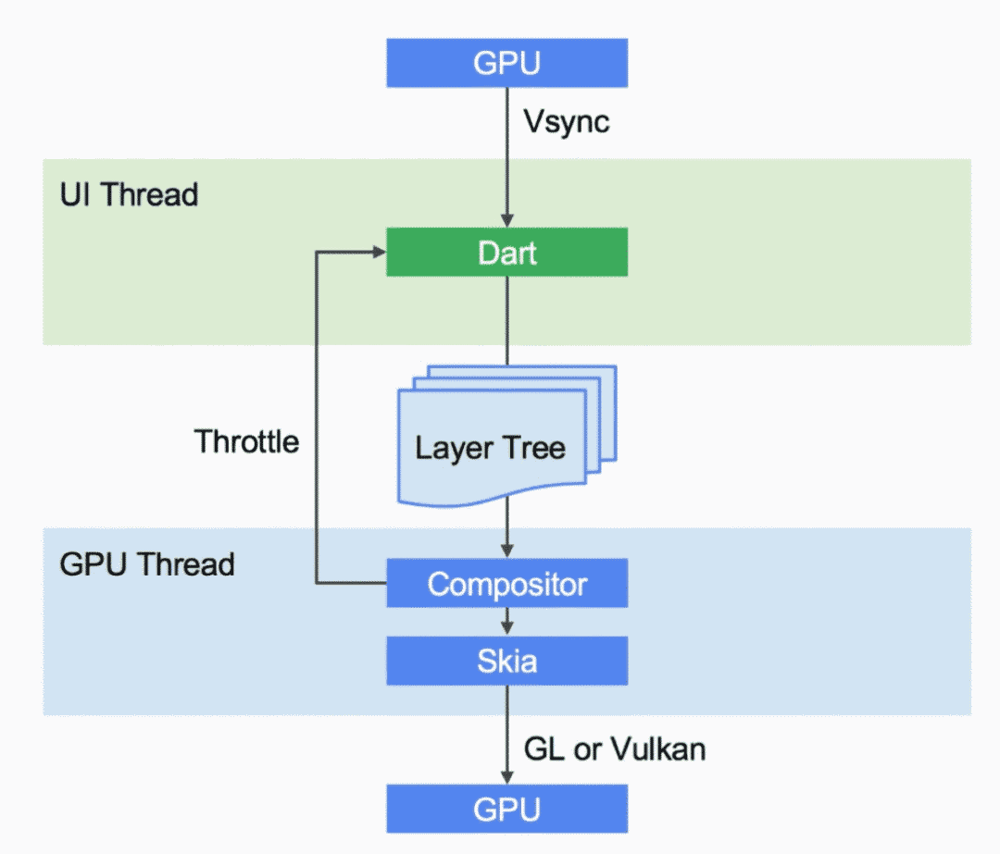

# flutter

## 参考
  - flutter入门：https://flutterchina.club/setup-windows/
  - https://mp.weixin.qq.com/s/yPvaB7sLuJoGfsjj7x7wcg
  - https://github.com/Nealyang/PersonalBlog/issues/11

## Flutter VS ReactNative
 - 都实现了移动开发跨平台
 - 界面的编写都很类型，采用响应式视图，维护了一个状态机，只更新改变的最小区域界面
 - 都支持热重载hot reload，开发调试非常方便
 - 调用系统的service仍然需要封装接口，仍然还是需要懂得native开发
 - RN采用JS语言开发，基于React，受众更多。Dart语言受众小
 - Flutter的UI框架性能貌似更高一些，但是直接丢弃了原生UI框架。而RN还是可以自己利用原生框架，两个各有好处。Flutter的兼容性高，RN可以利用原生已有的优秀UI
 - Flutter的第三方库还很少，RN发展的早，虽然也还不完善，但是比Flutter好
 - RN的界面布局更像网页布局，而Flutter的布局更像native布局
 - Flutter在跨平台这方面做得更彻底一些

## 其他
  - 
  - 

