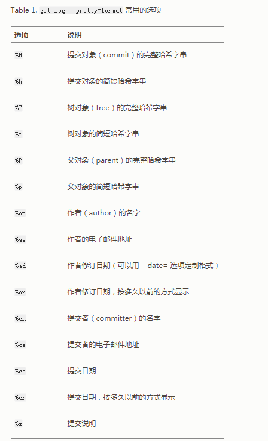

# git flow

[TOC]


## 参考
1. https://juejin.im/post/5ad99c05f265da0b9265231b
2. 

## 总结
- 主要分支
  - master: 永远处在即将发布(production-ready)状态
  - develop: 最新的开发状态
- 辅助分支
  - feature: 开发新功能的分支, 基于 develop, 完成后 merge 回 develop
  - release: 准备要发布版本的分支, 用来修复 bug. 基于 develop, 完成后 merge 回 develop 和 master
  - hotfix: 修复 master 上的问题, 等不及 release 版本就必须马上上线. 基于 master, 完成后 merge回 master 和 develop

## tag
- git tag v1.0.0
- git push origin v1.0.0

## git-commit-info
[git-commit](https://nitayneeman.com/posts/understanding-semantic-commit-messages-using-git-and-angular/#fix)

```
style: 样式修改
fix: bug修复
feat: 功能开发
refactor: 代码重构
test: 测试类修改
doc: 文档更新
conf: 配置修改
merge: 代码合并
```

## 命令

### git-blame

```
// 看差异
git blame ./package.json
```

### git-log

```
//  在当前目录之外的地方执行查看日志
git -C ${目录} log --all ${目录下某文件}

// 输出美化，规则查看下图，比如只想看提交作者，format:%an
git log --pretty=format:xxx ${某文件}
```



### git-branch

```
// 查远程所有分支包含某次commit
git branch -r --contains commitID
```

### git-reset
[reset还是revert](https://zhuanlan.zhihu.com/p/137856034)

---

## github
- [你会用github的搜索吗？](https://juejin.im/post/6891056415440535565?utm_source=gold_browser_extension)
- [github-action](http://www.ruanyifeng.com/blog/2019/09/getting-started-with-github-actions.html)
- [从原项目合分支到fork项目](https://segmentfault.com/q/1010000004228020)
- [facebook版本管理工具](https://sapling-scm.com/docs/introduction/getting-started/)
- [集成chatgpt到git action](https://github.com/umijs/umi/pull/10779/files)

