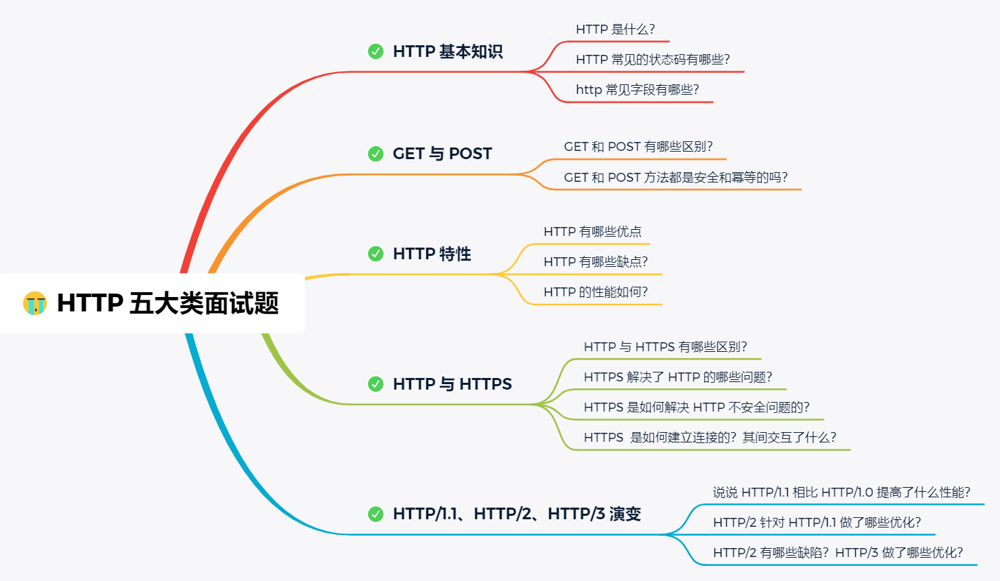
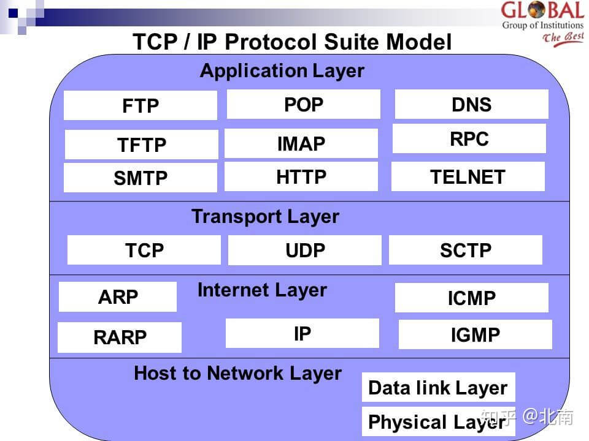
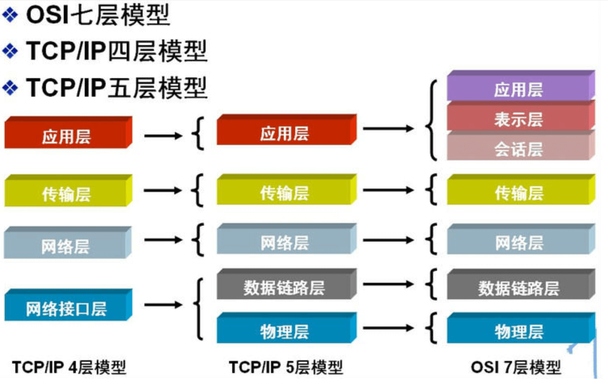
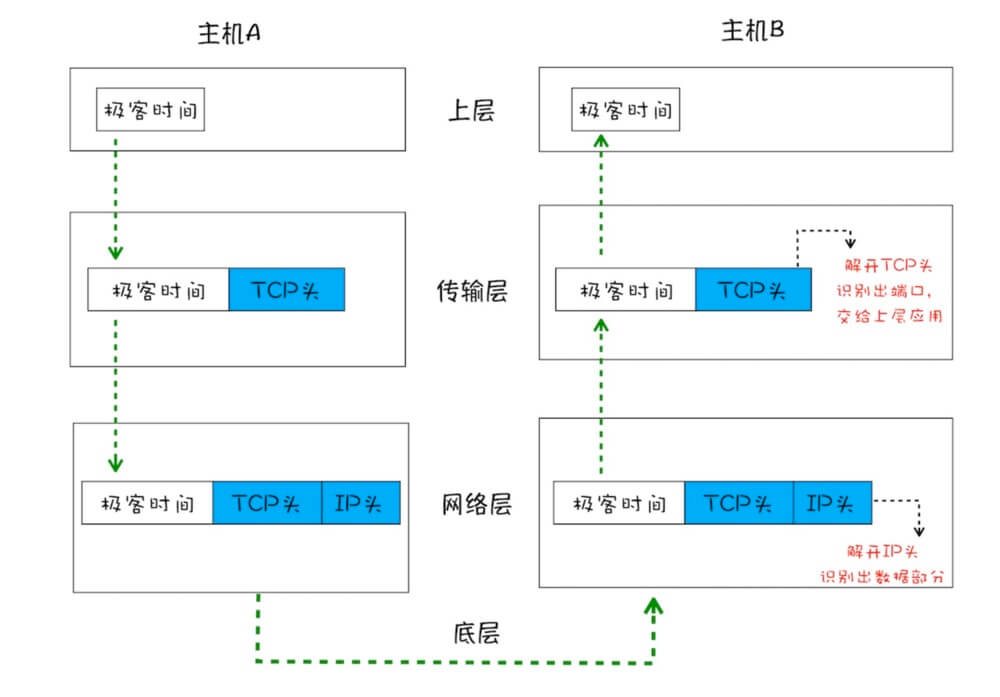
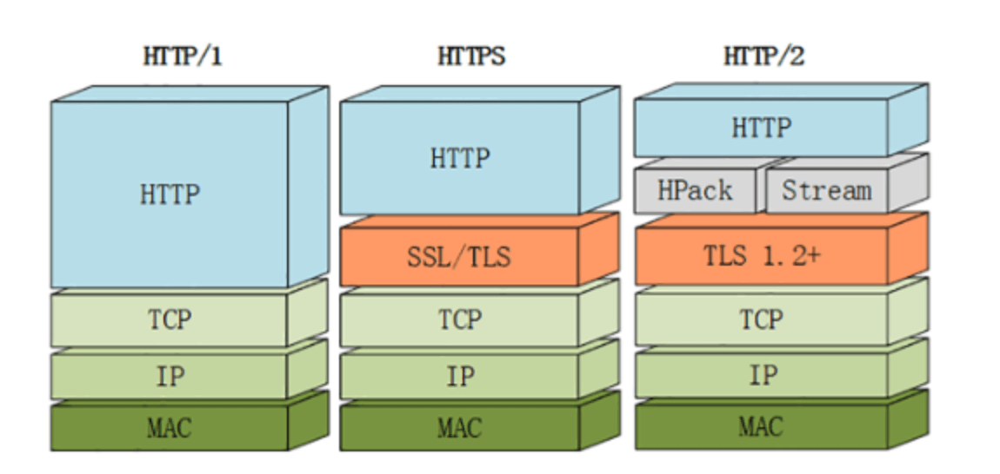
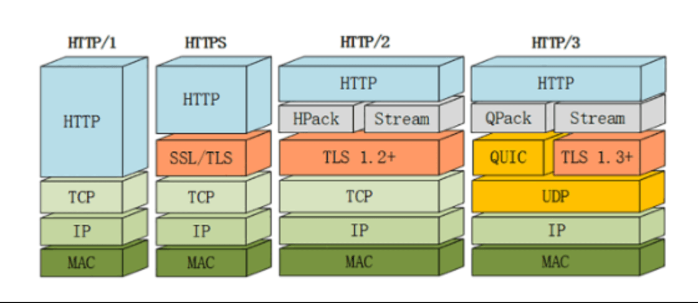
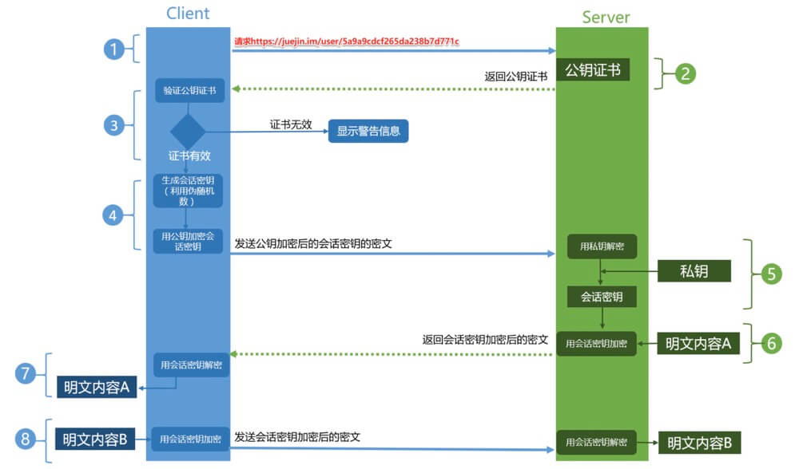
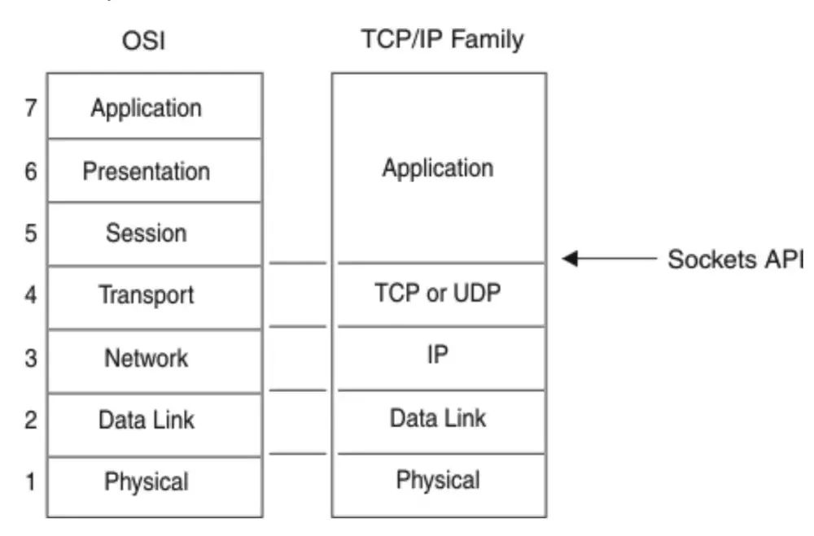

# 网络

## 参考

- [fastly](https://www.fastly.com/blog/headers-we-dont-want)
- https://www.nihaoshijie.com.cn/index.php/archives/630/
- [前端必须明白的 http 知识点](https://mp.weixin.qq.com/s/4tluvji9YVtxloqmssY-Nw)
- [把网站升级到 QUIC](https://www.yinchengli.com/2018/06/10/quic/)
- [https 连接的前几毫秒发生了什么](https://fed.renren.com/2017/02/03/https/)
- [流量劫持](https://zhuanlan.zhihu.com/p/40682772)
- [http3.0](https://mp.weixin.qq.com/s?__biz=MzA5NzkwNDk3MQ==&mid=2650589264&idx=1&sn=6ff446e3029c40eaabcff373c070e0f7&chksm=8891d874bfe6516261a18cdd029aa5e8730f0e955641ac7468f6bbae27e3b6acf8b4fb3813a3&mpshare=1&scene=1&srcid=&key=cb09f7b1396893c712194eeb7d524d812aaa1d6fd932852583a9a7574e6641a4a96b4f1563570eb1d4082bccaeade398aa998d7795c039cc6f06a1adc02a6e8236aeca8dd63d762fb6ffe09a33f210c1&ascene=1&uin=MjkyNDMwMjUwNg%3D%3D&devicetype=Windows+10&version=62060728&lang=zh_CN&pass_ticket=iFII9Td9YjjFZBzWoNyPFItjPfv26zZMyl%2By%2ByRZ3h5qwAJTlx0MoRSGaGIS%2B2jK)

## 目录

<details>
<summary>展开更多</summary>

* [`总览`](#总览)
* [`tcp`](#tcp)
* [`udp`](#udp)
* [`request header`](#requestHeader)
* [`http1.0`](#http1.0)
* [`http1.1`](#http1.1)
* [`spdy`](#spdy)
* [`http2.0`](#http2.0)
* [`quic`](#quic)
* [`http3.0`](#http3.0)
* [`https`](#https)
* [`rpc`](#rpc)
* [`网络模型`](#网络模型)
* [`OSI`](#OSI)
* [`常用端口`](#常用端口)
* [`常用状态码`](#常用状态码)
* [`常识`](#常识)

</details>

---

## 总览

> tcp-ip协议层级，本质是**下层为上层提供服务**



**TCP-IP 协议层级**




**TCP-IP 协议模型**



---

## tcp
> **传输控制协议**(Transmission Control Protocol)
>
> 基于 IP 协议构建 + 流模式，但是不适合[低延迟直播场景](./webRTC.md#tcp劣势)



### 术语

**RTT**

> 一个数据包从发出去到回来的时间

**cwnd**

> 拥塞窗口

**rwnd**

> 接收窗口

**ssthresh**

> 慢启动门限

### 过程

- 建立连接
- 传输数据
- 断开连接

### tcp/http请求过程


#### 一对多

- 一个 tcp 连接可以发送多个 http 请求（原因：Connection: keep-alive）
- 设置 **Connection: close** 的话，一个 http 请求结束就会断掉 tcp 连接
- 维持连接的优点是能省下请求的**初始化和 ssl 连接**时间

#### 并行请求

- http1.1 的单个 TCP 连接在同一时刻只能处理一个请求（生命周期不重叠），
- 浏览器内置 pipelining，支持同时发送多个请求，不过默认是关闭的
- http2 提供了 Multiplexing 多路传输特性，可以在一个 TCP 连接中同时完成多个 HTTP 请求

#### 连接上限

- chrome 里可以通过 network 里的 `Connection ID` 查看单个 tcp 连接
- 对同一域名，http1.1支持最多并发 6 个tcp连接，h2 没有限制，不同的浏览器有一些区别

#### 丢包处理

- 丢包和重传都在tcp层处理，http能保证数据按顺序接收

### 拥塞机制

- 基于丢包
  * reno
  * newreno
  * cubic
- 基于链路容量
  * bbr
- 基于时延
  * vegas
  * fastTCP
- 基于学习
  * remy

#### RENO

**慢启动**

- 启动时会限制连接的最大速度，数据传输成功，传输速度不断提升
- 当新建连接时，cwnd 初始化为 1 个最大报文段(MSS)大小
- 之后随着报文段确认，就新增一个 MSS，最终 cwnd 呈指数型增长

开始 ---> cwnd = 1
经过 1 个 RTT 后 ---> cwnd = 1 * 2 = 2
经过 2 个 RTT 后 ---> cwnd = 2 * 2= 4
经过 3 个 RTT 后 ---> cwnd = 4 * 2 = 8

**拥塞规避**

- cwnd 不能无限增长，需要一个慢启动门限(ssthresh)
- ssthresh 多设为 65536
- 超过 ssthresh，进入拥塞规避
- cwnd 值呈线性增长（每次加一）

**快速重传**

- TCP 在收到乱序到达包时，会发送 ack
- 当接收到 3 个 ack 时，TCP 判定此为数据包丢失
- 超时时间一般 200ms
- 进入快速重传

**快速恢复**

- ssthresh 设为 cwnd 一半
- cwnd 设为 ssthresh 值（或 ssthresh + 3）
- 重新进入拥塞规避

### tcp 粘包

> tcp 默认启用 `nagle` 算法，即短时间内多个数据包发送，会缓冲到一起发送，减少 io 消耗，接受方接收时粘成一个包了
> 缓冲大小通过 `socket.bufferSize` 设置
> 文件传输不用处理 tcp 粘包

#### 解决方案

1. 增加传输间隔

* **优点**：适应交互频次低的场景
* **缺点**：对于交互频次高的场景，传输效率太低

2. 关闭 nagle 算法

* socket.setNoDelay()
* **优点**：适应单次发送数据量较大，频次不太高的场景
* **缺点**：对于单次发送数据量小，交互频次高的场景，嘿嘿

3. 封包/拆包

* 常用解决手段
* 在发送每个数据包之前，在数据前后加特征标识，接收数据时按特征标识分割数据

### backlog


- 三次握手之后，服务端并未立即处理请求
- 服务端的一个连接队列
- 半连接/全连接

### tcp 可靠性

- 校验和（校验数据是否损坏）
- 定时器（分组丢失则重传）
- 序号（用于检测丢失的分组和冗余的分组）
  * 发送方会把已发送的数据保存在缓存区
  * 超时前接收到应答，则释放缓存区
  * 重传直至达到重传次数上限
- 确认（接收方告知发送方正确接收分组以及期望的下一个分组）
- 否定确认（接收方通知发送方未被正确接收的分组）
- 窗口和流水线（用于增加信道的吞吐量）

---

## udp

> **用户数据包协议**(User Datagram Protocol)

基于 IP 协议构建 + 数据报文

- 要求资源较少
- 不保证数据返回顺序
- 可能丢包
- 要求系统资源较少

### tcp和udp区别

**连接性**

- tcp 需要先建立连接
- udp 不需要

**可靠性**

- tcp 传送的数据按序到达、无差错、不丢失、不重复
- udp 不保证可靠交付

**传输类型**

- tcp 面向字节流，无结构
- udp 面向报文、消息，无拥塞

**连接数**

- tcp 是一对一
- udp 支持多种（1. 一对一 2. 一对多 3. 多对多）

**首部开销**

- tcp 是 20 字节
  
- udp 是 8 字节
  

**包**

- tcp 至少 9 个包（三次握手 + 请求 + 响应 + 四次挥手）
- udp 有 2 个包（请求 + 响应）

**信道**

- tcp 全双工、可靠
- udp 不可靠

### udp 不粘包

- udp 面向消息，以消息为单位提取数据
- 每个 udp 包都有消息头，接收方易于区分
- 接受方一次只接收一个数据包，即使数据丢失，也不会分两次去接收

---

## requestHeader

### 请求无用头部（新版）

- server
- expires
- x-powered-by
- pragma
  - 可用 Cache-Control: no-store, private 替代
- x-frame-options
  - 防范 [clickjacking](https://en.wikipedia.org/wiki/Clickjacking)（UI 虚假内容点击，比如下载按钮搞成图片）
  - 可用 Content-Security-Policy: frame-ancestors 'self'代替
- x-cache
- via
- p3p
- x-aspnet-version
- x-ua-compatible

### 未来头部新字段

- "Device-Memory": #memory-value
> 浏览器可以返回设备内存大小给服务端，Chrome 63+ 和 Opera50+ 支持

### POST 和 PUT

- PUT 方法是幂等的，连续调用一次或者多次的效果相同
- PUT 指向单一资源，POST 指向资源集合

### 安全性请求头部

#### http only

> 确保前端无法直接操作 cookie

#### x-frame-options

> 禁止页面通过 iframe 形式加载，防御【页面伪装点击】攻击

#### x-xss-protection

[参考](https://developer.mozilla.org/zh-CN/docs/Web/HTTP/Headers/X-XSS-Protection)

> 配置浏览器 xss 行为

- **0**: 禁用 xss 过滤
- **1**: 默认，启用 xss 过滤，如果有 xss，则删除页面的不安全部分
- **1; mode=block**: 启用 xss 过滤，如果有 xss，则不加载页面
- **1; report=[report-uri]**: 启用 xss 过滤，如果有 xss，则删除页面，并使用 csp 的 `report-url` 指令，发送违规报告

#### x-content-type-options

> 强制浏览器一定遵循服务器在 `Content-Type` 对 MIME 类型的设定，不得对其进行修改（也就要求服务器要正确设置 `Content-Type`），禁止浏览器嗅探资源类型

**什么是浏览器嗅探资源类型？**

[参考](https://developer.mozilla.org/zh-CN/docs/Web/HTTP/Basics_of_HTTP/MIME_types)

如果资源文件缺失 MIME 类型，或者浏览器认为资源设置了错误的 MIME 类型，会尝试嗅探资源内容来确定其 MIME 类型，这个操作会存在一定安全问题。

#### strict-transport-security

> 要求浏览器对所有的资源都是用 https 链接

#### access-control-allow-origin

> 跨域安全列表

#### Content-Security-Policy

- same-origin
- same-site
- cross-origin

---

## http1.0

- 带宽限制
- 延迟
  + 浏览器阻塞（并行请求）
  + DNS 查询（域名发散，同一个 hostname 最大 tcp 连接数约为 6 个）
  + tcp
- 状态码
  + 301: 永久重定向
  + 302: 临时重定向
    * 只有当服务器发出 Cache-Control 或 Expires（废弃） 头字段进行指示，
      此响应才能被缓存，否则不能被缓存
    * 临时 URI 应该由响应头部中的`Location`字段给出
    * 在除 GET 或 HEAD 两种请求方法之外的请求时，接收到 302 状态码，
      客户端不得自动重定向请求，除非用户可以确认
  + 304: [协商缓存](../js&browser/页面过程与浏览器缓存.md#协商缓存)
- 缓存处理
  + If-Modified-Since：再次请求服务器时，通过此字段通知服务器上次请求时，服务器返回的资源最后修改时间
  + 缓存头部优先级: Pragma > Cache-Control > Expires（废弃） > ETag > Last-Modified

### pragma

取值和 Cache-Control 类似，如果服务器默认支持 http1.1，直接设置 Cach-Control 即可

---

## http1.1

对比 `http1.0`，新增如下特性：

- 缓存处理
- 带宽优化
- 长连接

### 缓存处理

- Entity tag
- If-Unmodified-Since
- If-Match
- If-None-Match

缓存字段[参考](../js&browser/页面过程与浏览器缓存.md#缓存分类)

#### Cach-Control

- private：客户端可以缓存
  * 执行浏览器自己的缓存策略，无法在用户间共享
  * 比如 Expires = 当前时间(Date - Last-Modified) * 10%（下面有举例）
- public：默认值，客户端和代理服务器、其他客户端都可共享缓存
  
  * 包括中间节点的 proxy
- max-age=xxx：缓存的内容将在 xxx 秒后失效
- no-cache：需要使用协商缓存来验证缓存数据
- no-store：所有内容都不会缓存，强缓存、协商缓存都不会触发
- s-maxage：仅在代理服务器（比如 CDN）有效，优先级高于 max-age，即使更新了 CDN 的内容，浏览器也不会请求
- max-stale：能容忍的最大过期时间
- min-fresh：能够容忍的最小新鲜度
- stale-while-revalidate：如果缓存过期了，仍然会使用，并同时在后台请求新鲜的资源，供下次使用（chrome75 以上支持）
  * 可[参考](https://zhuanlan.zhihu.com/p/64694485)
  * 
- must-revalidate
  ```text
  // must-revalidate生效有个前提，前提就是这个缓存必须已经过期，
  // 在浏览器端几乎没有任何作用
  Cache-Control: max-age=86400, must-revalidate
  ```

#### 资源缓存几种方式

* HTTP 1.1 风格的 Cache-Control 响应头中的 max-age 指令
 + Cach-Control: private 可缓存时长
* HTTP 1.0 风格的 Expires 响应头
* Last-Modified 响应头

```
HTTP/2 200
Date: Wed, 27 Mar 2019 22:00:00 GMT
Last-Modified: Wed, 27 Mar 2019 12:00:00 GMT
```

### 带宽优化

range，请求资源一部分（206），支持断点续传

#### 断点续传

检查服务器是否支持：Content-Range

#### 错误通知

新增状态码

- 303：明确表示客户端应当采用 get 方法获取资源
- 307：和 302 的区别是，不会把部分 POST 转为 GET

#### host 处理

一台服务器，多个 server，同一个 ip

### 长连接

一次 tcp 串行发送多个 http 请求（keep-alive）

### 缓存字段


---

## spdy

- 多路复用
- 请求优先级（可设置）
- 首部压缩
- 服务端推送

---

## http2.0

[HTTP/2.0 相比 1.0 有哪些重大改进](https://www.zhihu.com/question/34074946)



### 多路复用

* 同个域名只需要占用一个 TCP 连接
* 同一个 tcp 连接上并行请求任意数量的双向交换消息
* 减轻服务端负载
* 

### 二进制分帧


- 便于机器解码
- 报文格式就被拆分为一个个二进制帧，用「Headers 帧」存放头部字段，「Data 帧」存放请求体数据，就是一堆乱序的二进制帧，它们不存在先后关系，因此不需要排队等待，解决了 HTTP 队头阻塞问题
- 在客户端与服务器之间，双方都可以互相发送二进制帧，这样子「双向传输的序列」，称为流，所以 HTTP/2 中以流来表示一个 TCP 连接上进行多个数据帧的通信，这就是多路复用概念

> 所谓的乱序，指不同 ID 的 Stream 是乱序，同一个 Stream ID 的帧是按顺序传输的。
>
> 接收方收到二进制帧后，将相同的 Stream ID 组装成完整的请求报文和响应报文。
>
> 二进制帧中有一些字段，控制着优先级和流量控制等功能，这样能优先处理重要请求

### 首部压缩

* 客户端和服务器端使用 `首部表`”` 来跟踪和存储之前发送的键-值对
* 相同的数据，不再每次请求和响应都发送
* 每个新的首部键-值对要么被追加到当前表的末尾，要么替换表中之前的值
* 采用 HPACK 算法压缩

### 服务端推送

[阮一峰参考](http://www.ruanyifeng.com/blog/2018/03/http2_server_push.html)

* 服务端可以主动把 JS 和 CSS 文件推送给客户端，不需要客户端解析 HTML 时再请求
* 遵守同源策略
* 如果资源已经被浏览器缓存，浏览器可以通过发送 RST_STREAM 帧来拒收
* prefetch

#### nginx 配置

**普通配置**

```
location / {
  root   /usr/share/nginx/html;
  index  index.html index.htm;
  http2_push /style.css;
  http2_push /example.png;
}
```

**缺陷**

- 如果客户端已有缓存，重复推送是带宽浪费
- 即使推送成功，浏览器也会优先使用本地缓存
- 建议做成只对首次访问的用户推送（比如用 cookie 判断）

**改进的配置**

```
server {
    listen 443 ssl http2 default_server;

    ssl_certificate ssl/certificate.pem;
    ssl_certificate_key ssl/key.pem;

    root /var/www/html;
    http2_push_preload on;

    location = /demo.html {
        add_header Set-Cookie "session=1";
        add_header Link $resources;
    }
}


map $http_cookie $resources {
    "~*session=1" "";
    default "</style.css>; as=style; rel=preload";
}
```

### spdy 与 http 2.0 区别

- HTTP2.0 支持明文 HTTP 传输，而 SPDY 强制使用 HTTPS
- HTTP2.0 消息头的压缩算法采用 HPACK，而非 SPDY 采用的 DEFLATE

### http2.0 的缺点

**建连延时**

> TCP 以及 TCP+TLS 建立连接的延时，需要花掉 3～4 个 rtt

* 三次握手需要 1.5 个 rtt
* 建立 tls（根据 tls 版本不同，1.2 或 1.3），需要 1-2 个 rtt

**队头阻塞**

- http1.x 出现丢包时，tcp 会启用丢包重传机制，由于并行请求跑在多个 tcp 管道，只会影响当前管道的后续请求，其他管道无影响
- http2 出现丢包后，同样会重传，不过由于所有请求复用了同一管道，所以阻塞后续请求的影响比 1.x 更大

---

## quic

> 基于 UDP，0rtt 建连，汲取了 tcp 的精华

### 特点

- 类似 TCP 的流量控制、传输可靠性的功能（包括数据包重传、拥塞控制以及其他一些 TCP 中存在的特性）
- 快速握手（通过减少往返次数，以缩短连接建立时间）
- 安全加密，集成 TLS 加密（基于 TLS1.3），减少 RTT
- 多路复用，并解决 HTTP/2 队头阻塞问题（即一个流的 TCP 包丢失导致所有流都暂停组装。在 QUIC 里面，一个流的包丢失只会影响当前流，不会影响其它流）
- 使用 FEC（前向纠错）恢复丢失的包，以减少超时重传
- 使用一个随机数标志一个连接，取代传统 IP + 端口号的方式，使得切换网络环境如从 4G 到 wifi 仍然能使用之前的连接。


### 对比 http/https/quic

- 

---

## http3.0



- 基于 UDP 协议的 QUIC
- 加密认证的报文
  * TCP 协议头部
- 无阻塞的多路复用
- 0RTT
- 向前纠错机制
  * 每个数据包中含有部分其他数据包的内容，丢包可能会触发重组，而无需重传
  * 以上仅限于单个包丢失的情况

### 对比 http2.0 和 http3.0

- 多路复用
  * http2.0：单个连接上有多个 stream 之间会阻塞，stream 丢包会影响之后的 stream
  * http3.0：stream 之间无影响

---

## https

> 相当于 http + tls 安全层（比 http 至少多 2 次 tls 的 RTT）
>
> 耗时影响，主要在于：
>
> 1. 交互所增加的网络 RTT(round trip time)
> 2. 加解密相关的计算耗时

[深入了解 https](https://zhuanlan.zhihu.com/p/43789231)

### 与 http 的区别

- https 需要证书
- http 是明文传输，https 会用 tls 加密传输
- http80 端口，https443 端口

### RTT

**首次请求需要的网络耗时如下**

1. 三次握手建立 TCP 连接。耗时一个 RTT。
2. 使用 HTTP 发起 GET 请求，服务端返回 302 跳转到 https://www.baidu.com 。需要一个 RTT 以及 302 跳转延时。
  - 大部分情况下用户不会手动输入 https://www.baidu.com 来访问 HTTPS，服务端只能返回 302 强制浏览器跳转到 https。
  - 浏览器处理 302 跳转也需要耗时。
3. 三次握手重新建立 TCP 连接。耗时一个 RTT。
  - 302 跳转到 HTTPS 服务器之后，由于端口和服务器不同，需要重新完成三次握手，建立 TCP 连接。
4. TLS 完全握手阶段一。耗时至少一个 RTT。
  - 这个阶段主要是完成加密套件的协商和证书的身份认证。
  - 服务端和浏览器会协商出相同的密钥交换算法、对称加密算法、内容一致性校验算法、证书签名算法、椭圆曲线（非 ECC 算法不需要）等。
  - 浏览器获取到证书后需要校验证书的有效性，比如是否过期，是否撤销。
5. 解析 CA 站点的 DNS。耗时一个 RTT。
  - 浏览器获取到证书后，有可能需要发起 OCSP 或者 CRL 请求，查询证书状态。
  - 浏览器首先获取证书里的 CA 域名。
  - 如果没有命中缓存，浏览器需要解析 CA 域名的 DNS。
6. 三次握手建立 CA 站点的 TCP 连接。耗时一个 RTT。
  - DNS 解析到 IP 后，需要完成三次握手建立 TCP 连接。
7. 发起 OCSP 请求，获取响应。耗时一个 RTT。
8. 完全握手阶段二，耗时一个 RTT 及计算时间。
  - 主要是密钥协商。
9. 完全握手结束后，浏览器和服务器之间进行应用层（也就是 HTTP）数据传输。

**简化上述过程**

1. http 请求
2. http 重定向 https
3. https 请求
4. 密钥/算法协商
5. CA 证书 DNS 解析
6. CA 证书请求
7. CA 证书可用性校验（OCSP）
8. 密钥/算法协商结束
9. 数据传输

并非所有请求（0.01%）都要增加 **7 个 RTT**，需要满足

1. 首次请求（TCP 建立连接后第一个请求，之后请求不发生上述行为）
2. 必须要完全握手（80% 请求只要求简化握手即可）
3. 浏览器开启了 ocsp (在线证书状态协议) 或 crl (证书吊销列表) 功能
4. 浏览器没有命中 ocsp 缓存列表
5. 浏览器没有命中 CA 证书的 DNS 缓存

一般走 2+4 即可

### 完整流程
> 非常推荐下图



### 加密方式

> 非对称加密 + 对称加密
>
> https 在第一次握手使用非对称加密，同时会保存通信的密钥到本地
>
> 之后的通信，数据加密走的都是对称加密
>
> 因为服务器为每个客户端维护一个 session ID，通过 session ID 可以找到对应密钥

#### 对称加密

- 通信双方都各自持有同一个密钥，且没有第三者知道
- 双方通信都是用这个密钥加密

#### 非对称加密

**算法**

- RSA
  * 1977 年诞生，兼容性好
  * 缺点是需要较大的素数，耗 cpu 资源
- ECDHE
  * 支持 ECC 加速，计算和访问速度快
  * 对于不支持 ECDHE 的，可以降级到 RSA

**特点**

- 私钥加密的密文，公钥都能解
- 公钥加密的密文，只有私钥能解

**过程**

- 客户端 B 发起握手请求，携带随机数，支持的算法列表的参数
- 服务端 A，将公钥、合适的算法、随机数发送给客户端 B
- 客户端 B 产生一个密钥（随机数），用服务端 A 的公钥加密，返给服务端 A
- 服务端 A 用自己私钥解密 B 返的随机数，也就获取了客户端 B 的密钥
- 以后 A 和 B 的数据通信都通过这个密钥加密

密钥，也就是 `Session Ticket`

#### 非对称vs对称的劣势

- cpu 消耗大，计算量占单次 tls 握手时间的 90%
- 加密内容的长度不得超过公钥的长度（2048 位）

#### 非对称加密的风险

**中间人攻击**

- 中间人拦截 A 的公钥，替换成自己的公钥
- B 不清楚公钥的所属，用中间人公钥加密，返给中间人
- 中间人拦截，用自己私钥解密

### CA 证书

**数字签名**

将证书内容（公钥 key）hash + 私钥加密后，生成的签名

**hash一下的作用**

- hash 后能得到固定长度的信息（比如 md5 后，固定 128 位）
- 证书信息一般都比较长，非对称加密比较耗时

**证书制作过程**

- 服务端 A，将自己的公钥 key 发给 CA，申请证书
- CA 对服务端 A 的公钥 key 做 hash 处理
- CA 对 hash 后的值用私钥加密，得到数字签名
- 证书明文（服务端A公钥 key） + hash算法 + 数字签名 = 数字证书（颁发给网站）

**鉴别真伪**

- 客户端 B 向服务端 A 请求时，A 返回的是数字证书（证书明文 + hash算法 + 数字签名 S）
- 客户端 B 用 CA 证书的对应公钥解密数字签名 S，得到 S'
- 客户端 B 用 CA 证书的 hash 算法，对证书明文做 hash 处理，得到 A'
- 如果 A' === S'，说明服务端 A 的证书有效
- 之后就是非对称加密的过程

**中间人为何不能篡改证书**

- 中间人没有数字证书的私钥，无法对证书明文做数字签名加密
- 即使篡改，客户端用 CA 证书解密后，对比不一致，也会不受信任

**中间人能否掉包证书**

- 没用，证书包含网站域名等信息
- 浏览器对比下请求和本地证书的基本信息即可

**如何证明 CA 机构的公钥可信**

- 信任链
- 通常需要安装根证书

### 校验证书合法性

- 校验证书的颁发机构是否受客户端信任
- 通过 CRL（证书吊销列表，Certificate Revocation List）或 OCSP（在线证书状态协议，Online Certificate Status Protocol）的方式校验证书是否被吊销
  * CRL 需要经常在客户端下载最新版，所以比较繁琐
  * OCSP 会在访问服务器时，自动请求一个证书状态的信息
- 对比系统时间，校验证书是否在有效期内
- 通过校验对方是否存在证书的私钥，判断证书的网站域名是否与证书颁发的域名一致

### 其他知识

[免费证书申请](https://mp.weixin.qq.com/s/sQLRsW3axiL8XRP0tTyjJA?utm_medium=hao.caibaojian.com&utm_source=hao.caibaojian.com)

- http + tls
- 
  * 服务器选中的密钥交换加密方式为 RSA
  * 数据传输加密方式为 AES
  * 检验数据是否合法的算法为 SHA256
    
    
- 公钥加密，私钥解密
- 过程 -> 3RTT
  * 1 次 tcp RTT
  * 2 次 tls RTT（比 http 多了 2 次 tls 的 RTT）
    

### HTTP、HTTPS、TCP、SSL/TLS

- HTTP 基于 TCP
- SSL/TLS 基于 TCP
- HTTPS 基于 SSL/TLS

### ssl 和 tls

ssl（Secure Sockets Layer 安全套接层）
tls（Transport Layer Security 安全传输层协议）

- 位于传输层
- tls 由 ssl 演变而来，目前 ssl 已极不安全
- tls1.0 相当于 ssl3.1
- 推荐 tls1.2
- 

### SSL 断开重连方式

- session ID
- session ticket

#### sessionId

每次对话都会产生一个 sessionId，由浏览器生成，只要客户端给出编号，服务端根据编号就能找到以前的通信的秘钥；

缺点是 sessionId 只能保存在一个服务器上，如果做了负载均衡就无法恢复之前的秘钥了。

#### session ticket

由服务端根据之前的会话信息（对话秘钥、加密方式等）加密而生成，然后返回给客户端，只要下次会话带了 session ticket，服务端就一定能解密出，有且只有服务端能解

---

## OSI

Open System Interconnection 开放式系统互联



### 表示层

- 数据压缩
- 数据加密

### 会话层

- 数据交换/同步功能，比如建立检查点、恢复方案

---

## 常用端口

80 - 网页用

8080 - 同 80

---

## 常用状态码

### 2xx

204 - 请求成功，无内容返回

### 3xx

301 - 永久重定向，原地址被搜索引擎缓存为新地址
302 - 临时重定向，原地址搜索引擎仍保留
304 - not modified

### 4xx

401 -unauthorized

* 用户已认证，但是未被授权访问

403 - forbidden

* 用户未被认证

405 - method not allowed

### 5xx

502 - Bad Gateway

* 服务器自身是正常的，访问的时候出了问题

503 - service unavailable

* 表明服务器暂时处于超负载或正在停机维护，无法处理请求

---

## rpc
> remote procedure call(远程方法调用)
>
> RPC可以采用自定义协议，也可以通过HTTP协议来传输，thrift，grpc，xml-rpc，json-rpc都是通过HTTP传输的

### 网络传输方式
- 基于http的rpc调用
- 基于tcp的rpc调用
- 基于udp的rpc调用

#### 基于http的rpc调用
> 过程就和网页掉接口没区别
1. 服务调用方发请求
2. 提供方处理请求
3. 调用方根据返回结果（JSON、XML）做对应解析

#### 基于tcp的rpc调用
1. 服务调用方和提供方建立 Socket 连接
2. 调用方通过 Socket 将**接口名称**、**方法名称**和**参数**序列化后给提供方
3. 提供方反序列化后，通过反射调用相应方法/服务
4. 将结果返回给调用方

#### 基于udp的rpc调用

#### 区别

**tcp**

- 位于协议下层，能更灵活的定制协议字段，极大程度精简传输内容
- 底层数据结构复杂，需要针对不同格式做对应解析

**http**

- 作为上层协议，传输开销更大
- 返回结构清晰，有很多现成工具

### rpc优势
RPC是一种编程模式，把对服务器的调用抽象为过程调用，是面相服务的封装，对服务可用性和效率做了优化，这是http做不到的

需要综合考虑：

- 可读性 VS 效率
- 通用性 VS 易用性

---

## 网络模型

> 超文本传输协议(Hypertext Transfer Protocol)
>
> 协议 > 传输 > 超文本
>
> 分为多种协议模型，如下图：

### 应用层

- http
- dns 域名系统

### 传输层

- tcp
- udp

### 网络层

- 数据报文（datagram）
- ip 协议

### 链路层

- wifi
- 以太

### 物理层

- 电缆
- 光纤

---

## 常识

**队头阻塞**

> 对于 http 请求，请求会被放入一个队列中串行执行，一旦队首请求太慢，会阻塞后面的请求，即队头阻塞

**并发连接**

> chrome，并行 6 个

**Content-Length**

> 数据长度（如果被 gzip 的话，即 gzip 之后的长度）
