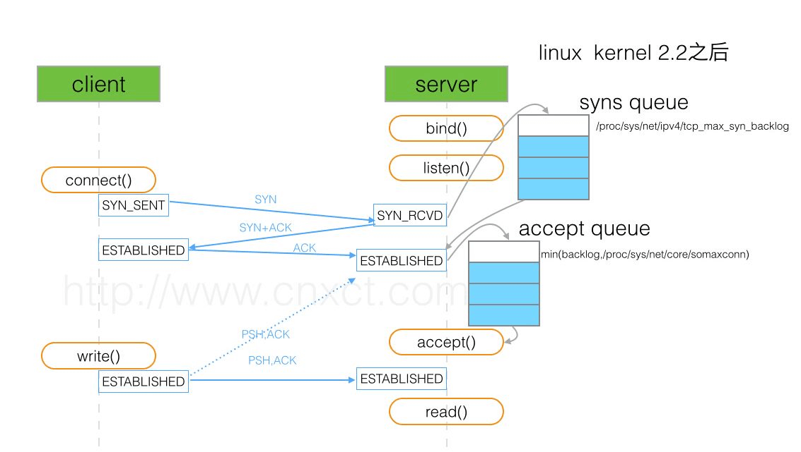
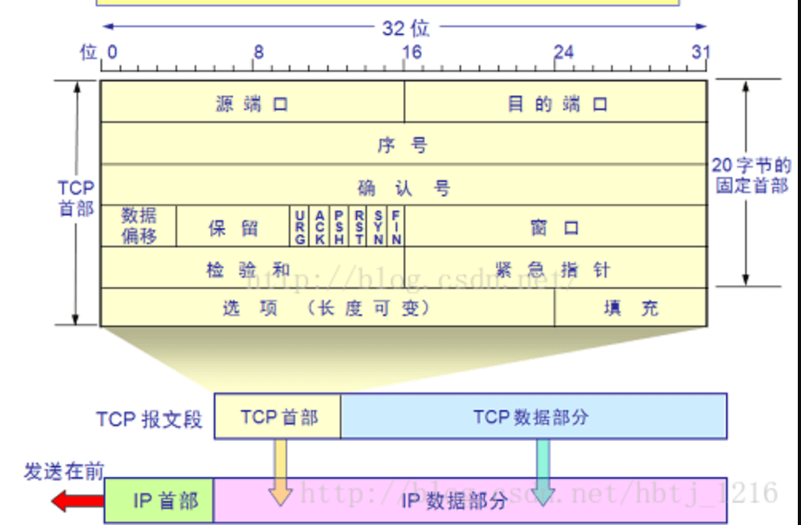
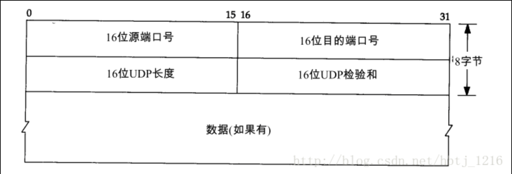
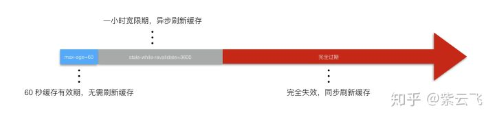

# network

## 参考
- https://www.fastly.com/blog/headers-we-dont-want
- https://www.nihaoshijie.com.cn/index.php/archives/630/
- [前端必须明白的 http 知识点](https://mp.weixin.qq.com/s/4tluvji9YVtxloqmssY-Nw)
- [把网站升级到QUIC](https://www.yinchengli.com/2018/06/10/quic/)
- [https连接的前几毫秒发生了什么](https://fed.renren.com/2017/02/03/https/)
- [流量劫持](https://zhuanlan.zhihu.com/p/40682772)
- [http3.0](https://mp.weixin.qq.com/s?__biz=MzA5NzkwNDk3MQ==&mid=2650589264&idx=1&sn=6ff446e3029c40eaabcff373c070e0f7&chksm=8891d874bfe6516261a18cdd029aa5e8730f0e955641ac7468f6bbae27e3b6acf8b4fb3813a3&mpshare=1&scene=1&srcid=&key=cb09f7b1396893c712194eeb7d524d812aaa1d6fd932852583a9a7574e6641a4a96b4f1563570eb1d4082bccaeade398aa998d7795c039cc6f06a1adc02a6e8236aeca8dd63d762fb6ffe09a33f210c1&ascene=1&uin=MjkyNDMwMjUwNg%3D%3D&devicetype=Windows+10&version=62060728&lang=zh_CN&pass_ticket=iFII9Td9YjjFZBzWoNyPFItjPfv26zZMyl%2By%2ByRZ3h5qwAJTlx0MoRSGaGIS%2B2jK)

## 目录
<details>
<summary>展开更多</summary>

* [`tcp`](#tcp)
* [`udp`](#udp)
* [`request header`](#requestHeader)
* [`http1.0`](#http1.0)
* [`http1.1`](#http1.1)
* [`spdy`](#spdy)
* [`http2.0`](#http2.0)
* [`http3.0`](#http3.0)
* [`quic`](#quic)
* [`https`](#https)
* [`osl`](#osl)
* [`协议层次`](#协议层次)
* [`常用端口`](#常用端口)
* [`常用状态码`](#常用状态码)

</details>

---

## tcp
基于IP协议构建 + 流模式

**RTT**: 一个数据包从发出去到回来的时间
**cwnd**: 拥塞窗口
**rwnd**: 接收窗口
**ssthresh**: 慢启动门限

### tcp和http的关系

#### 一对多
- 一个tcp连接可以发送多个http请求（原因：Connection: keep-alive）
- chrome里可以通过network里的`Connection ID`查看（http1.1有并发6个上线，h2没有限制)
- 设置**Connection: close**的话，一个http请求结束就会断掉tcp连接
- 维持连接的优点是能省下请求的**初始化和ssl连接**时间

#### 并行请求
- http1.1的单个 TCP 连接在同一时刻只能处理一个请求（生命周期不重叠），
- 浏览器内置pipelining，支持同时发送多个请求，不过默认是关闭的
- http2 提供了 Multiplexing 多路传输特性，可以在一个 TCP 连接中同时完成多个 HTTP 请求

#### 连接上限
- Chrome 最多允许对同一个 Host 建立六个 TCP 连接，不同的浏览器有一些区别

### 拥塞机制
- 基于丢包
  * reno
  * newreno
  * cubic
- 基于链路容量
  * bbr
- 基于时延
  * vegas
  * fastTCP
- 基于学习
  * remy

#### RENO

**慢启动**

- 启动时会限制连接的最大速度，数据传输成功，传输速度不断提升
- 当新建连接时，cwnd初始化为1个最大报文段(MSS)大小
- 之后随着报文段确认，就新增一个MSS，最终cwnd呈指数型增长

开始 ---> cwnd = 1
经过1个RTT后 ---> cwnd = 1*2 = 2
经过2个RTT后 ---> cwnd = 2*2= 4
经过3个RTT后 ---> cwnd = 4*2 = 8

**拥塞规避**

- cwnd不能无限增长，需要一个慢启动门限(ssthresh)
- ssthresh多设为65536
- 超过ssthresh，进入拥塞规避
- cwnd值呈线性增长（每次加一）

**快速重传**

- TCP在收到乱序到达包时，会发送ack
- 当接收到3个ack时，TCP判定此为数据包丢失
- 进入快速重传

**快速恢复**

- ssthresh设为cwnd一半
- cwnd设为ssthresh值（或ssthresh + 3）
- 重新进入拥塞规避

### tcp粘包
> tcp默认启用 `nagle` 算法，即短时间内多个数据包发送，会缓冲到一起发送，减少 io 消耗，接受方接收时粘成一个包了
> 缓冲大小通过 `socket.bufferSize` 设置
> 文件传输不用处理tcp粘包

#### 解决方案

1. 增加传输间隔
  * **优点**：适应交互频次低的场景
  * **缺点**：对于交互频次高的场景，传输效率太低
2. 关闭 nagle 算法
  * socket.setNoDelay()
  * **优点**：适应单次发送数据量较大，频次不太高的场景
  * **缺点**：对于单次发送数据量小，交互频次高的场景，嘿嘿
3. 封包/拆包
  * 常用解决手段
  * 在发送每个数据包之前，在数据前后加特征标识，接收数据时按特征标识分割数据

### backlog


- 三次握手之后，服务端并未立即处理请求
- 服务端的一个连接队列
- 半连接/全连接

---

## udp
基于IP协议构建 + 数据报文

- 要求资源较少
- 不保证数据返回顺序
- 可能丢包
- 要求系统资源较少

### tcp和udp区别

**连接性**

- tcp需要先建立连接
- udp不需要

**可靠性**

- tcp传送的数据按序到达、无差错、不丢失、不重复
- udp不保证可靠交付

**传输类型**

- tcp面向字节流，无结构
- udp面向报文、消息，无拥塞

**连接数**

- tcp是一对一
- udp支持多种，一对一，一对多，多对多

**首部开销**

- tcp是20字节
  
- udp是8字节
  

**包**

- tcp至少9个包（三次握手 + 请求 + 响应 + 四次挥手）
- udp有2个包（请求 + 响应）

**信道**

- tcp全双工、可靠
- udp不可靠

### udp不粘包
- udp面向消息，以消息为单位提取数据
- 每个udp包都有消息头，接收方易于区分
- 接受方一次只接收一个数据包，即使数据丢失，也不会分两次去接收

---

## requestHeader

### 请求无用头部（新版）
- server
- expires
- x-powered-by
- pragma
  - 可用Cache-Control: no-store, private替代
- x-frame-options
  - 防范[clickjacking](https://en.wikipedia.org/wiki/Clickjacking)（UI虚假内容点击，比如下载按钮搞成图片）
  - 可用Content-Security-Policy: frame-ancestors 'self'代替
- x-cache
- via
- p3p
- x-aspnet-version
- x-ua-compatible

### 未来头部新字段
- "Device-Memory" ":" #memory-value
  - 浏览器可以返回设备内存大小给服务端，Chrome 63+ 和 Opera50+支持

### POST和PUT
- PUT方法是幂等的，连续调用一次或者多次的效果相同
- PUT指向单一资源，POST指向资源集合

---

## http1.0
- 带宽限制
- 延迟
  + 浏览器阻塞（并行请求）
  + DNS查询（域名发散，同一个hostname最大tcp连接数约为6个）
  + tcp
- 状态码
  + 301: 永久重定向
  + 302: 临时重定向
    * 只有当服务器发出 Cache-Control 或 Expires（废弃） 头字段进行指示，
      此响应才能被缓存，否则不能被缓存
    * 临时URI应该由响应头部中的 Location 字段给出
    * 在除 GET 或 HEAD 两种请求方法之外的请求时，接收到302状态码，
      客户端不得自动重定向请求，除非用户可以确认
  + 304: [协商缓存](../js&browser/页面过程与浏览器缓存.md#协商缓存)
- 缓存处理
  + If-Modified-Since：再次请求服务器时，通过此字段通知服务器上次请求时，服务器返回的资源最后修改时间
  + 缓存头部优先级: Pragma > Cache-Control > Expires（废弃） > ETag > Last-Modified

---

## http1.1

对比`http1.0`，新增如下特性：
- 缓存处理
- 带宽优化
- 长连接

### 缓存处理
- Entity tag
- If-Unmodified-Since
- If-Match
- If-None-Match

缓存字段[参考](../js&browser/页面过程与浏览器缓存.md#缓存分类)

#### Cach-Control

- private：客户端可以缓存
  * 走浏览器自己的缓存策略
  * 比如 `Expires = 当前时间(Date - Last-Modified) * 10%`（下面有举例）
- public：客户端和代理服务器、其他客户端都可共享缓存
  * 包括中间节点的proxy
- max-age=xxx：缓存的内容将在 xxx 秒后失效
- no-cache：需要使用协商缓存来验证缓存数据
- no-store：所有内容都不会缓存，强缓存、协商缓存都不会触发
- s-maxage：仅在代理服务器（比如CDN）有效，优先级高于max-age
- max-stale：能容忍的最大过期时间
- min-fresh：能够容忍的最小新鲜度
- stale-while-revalidate：如果缓存过期了，仍然会使用，并同时在后台请求新鲜的资源，供下次使用（chrome75以上支持）
  * 可[参考](https://zhuanlan.zhihu.com/p/64694485)
  * 
- must-revalidate
  ```text
  // must-revalidate生效有个前提，前提就是这个缓存必须已经过期，
  // 在浏览器端几乎没有任何作用
  Cache-Control: max-age=86400, must-revalidate
  ```

#### 资源缓存几种方式
* HTTP 1.1 风格的Cache-Control 响应头中的 max-age指令
* HTTP 1.0 风格的 Expires 响应头
* Last-Modified响应头

>
> Cach-Control: private 可缓存时长
>
> 可缓存时长1小时（22 - 12） * 0.1
>
> 注：浏览器差异导致缓存时长不同

```
HTTP/2 200
Date: Wed, 27 Mar 2019 22:00:00 GMT
Last-Modified: Wed, 27 Mar 2019 12:00:00 GMT
```

### 带宽优化
range，请求资源一部分（206），支持断点续传

#### 断点续传

检查服务器是否支持：Content-Range

#### 错误通知

新增状态码
- 303：明确表示客户端应当采用get方法获取资源
- 307：不会把POST转为GET

#### host处理
一台服务器，多个server，同一个ip

### 长连接
一次tcp串行发送多个http请求（keep-alive）

### 缓存字段


---

## spdy
- 多路复用
- 请求优先级（可设置）
- 首部压缩
- 服务端推送

---

## http2.0
[HTTP/2.0相比1.0有哪些重大改进](https://www.zhihu.com/question/34074946)

### 多路复用
* 同个域名只需要占用一个 TCP 连接
* 同一个tcp连接上并行请求任意数量的双向交换消息
* 减轻服务端负载
* 

### 二进制分帧
* 将首部信息和请求体，采用二进制编码封装进HEADER和BODY frame
* 
* css sprites优势荡然无存

### 首部压缩
* 客户端和服务器端使用`首部表`”`来跟踪和存储之前发送的键-值对
* 相同的数据，不再每次请求和响应都发送
* 每个新的首部键-值对要么被追加到当前表的末尾，要么替换表中之前的值

### 服务端推送
[阮一峰参考](http://www.ruanyifeng.com/blog/2018/03/http2_server_push.html)
* 服务端可以主动把JS和CSS文件推送给客户端，不需要客户端解析HTML时再请求
* 遵守同源策略
* 如果资源已经被浏览器缓存，浏览器可以通过发送 RST_STREAM 帧来拒收
* prefetch

#### nginx配置

**普通配置**

```
location / {
  root   /usr/share/nginx/html;
  index  index.html index.htm;
  http2_push /style.css;
  http2_push /example.png;
}
```

**问题**

- 如果客户端已有缓存，重复推送是带宽浪费
- 即使推送成功，浏览器也会优先使用本地缓存
- 建议做成只对首次访问的用户推送（比如用cookie判断）

**改进的配置**

```
server {
    listen 443 ssl http2 default_server;

    ssl_certificate ssl/certificate.pem;
    ssl_certificate_key ssl/key.pem;

    root /var/www/html;
    http2_push_preload on;

    location = /demo.html {
        add_header Set-Cookie "session=1";
        add_header Link $resources;
    }
}


map $http_cookie $resources {
    "~*session=1" "";
    default "</style.css>; as=style; rel=preload";
}
```

### spdy与http 2.0区别
- HTTP2.0 支持明文 HTTP 传输，而 SPDY 强制使用 HTTPS
- HTTP2.0 消息头的压缩算法采用 HPACK，而非 SPDY 采用的 DEFLATE

---

## quic
- 基于UDP
- 通过减少往返次数，以缩短连接建立时间
- 使用一种新的ACK确认机制（包含了NACK），达到更好的拥塞控制
- 多路复用，并解决HTTP/2队头阻塞问题，即一个流的TCP包丢失导致所有流都暂停组装。在QUIC里面，一个流的包丢失只会影响当前流，不会影响其它流。
- 使用FEC（前向纠错）恢复丢失的包，以减少超时重传
- 使用一个随机数标志一个连接，取代传统IP + 端口号的方式，使得切换网络环境如从4G到wifi仍然能使用之前的连接。
- 

### 对比http/https/quic
- 

---

## http3.0
- 基于UDP协议的QUIC
- 加密认证的报文
  * TCP 协议头部
- 无阻塞的多路复用
- 0RTT
- 向前纠错机制
  * 每个数据包中含有部分其他数据包的内容，丢包可能会触发重组，而无需重传
  * 以上仅限于单个包丢失的情况

### 对比http2.0和http3.0
- 多路复用
  * http2.0：单个连接上有多个stream之间会阻塞，stream丢包会影响之后的stream
  * http3.0：stream之间无影响

---

## https
[深入了解https](https://zhuanlan.zhihu.com/p/43789231)

> https
> 相当于http + tls安全层（比http至少多2次tls的RTT）
> 
> 耗时影响，主要在于：
>
> 1. 议交互所增加的网络 RTT(round trip time)
> 2. 加解密相关的计算耗时

### 与http的区别
- https需要证书
- http是明文传输，https会用tls加密传输
- http80端口，https443端口

### RTT

**首次请求需要的网络耗时如下**

1. 三次握手建立 TCP 连接。耗时一个 RTT。
2. 使用 HTTP 发起 GET 请求，服务端返回 302 跳转到 https://www.baidu.com 。需要一个 RTT 以及 302 跳转延时。
  - 大部分情况下用户不会手动输入 https://www.baidu.com 来访问 HTTPS，服务端只能返回 302 强制浏览器跳转到 https。
  - 浏览器处理 302 跳转也需要耗时。
3. 三次握手重新建立 TCP 连接。耗时一个 RTT。
  - 302 跳转到 HTTPS 服务器之后，由于端口和服务器不同，需要重新完成三次握手，建立 TCP 连接。
4. TLS 完全握手阶段一。耗时至少一个 RTT。
  - 这个阶段主要是完成加密套件的协商和证书的身份认证。
  - 服务端和浏览器会协商出相同的密钥交换算法、对称加密算法、内容一致性校验算法、证书签名算法、椭圆曲线（非 ECC 算法不需要）等。
  - 浏览器获取到证书后需要校验证书的有效性，比如是否过期，是否撤销。
5. 解析 CA 站点的 DNS。耗时一个 RTT。
  - 浏览器获取到证书后，有可能需要发起 OCSP 或者 CRL 请求，查询证书状态。
  - 浏览器首先获取证书里的 CA 域名。
  - 如果没有命中缓存，浏览器需要解析 CA 域名的 DNS。
6. 三次握手建立 CA 站点的 TCP 连接。耗时一个 RTT。
  - DNS 解析到 IP 后，需要完成三次握手建立 TCP 连接。
7. 发起 OCSP 请求，获取响应。耗时一个 RTT。
8. 完全握手阶段二，耗时一个 RTT 及计算时间。
  - 主要是密钥协商。
9. 完全握手结束后，浏览器和服务器之间进行应用层（也就是 HTTP）数据传输。

**简化上述过程**

1. http请求
2. http重定向https
3. https请求
4. 密钥/算法协商
5. CA证书DNS解析
6. CA证书请求
7. CA证书可用性校验（OCSP）
8. 密钥/算法协商结束
9. 数据传输

**并非所有请求（0.01%）都要增加7个RTT，需要满足**

1. 首次请求（TCP 建立连接后第一个请求，之后请求不发生上述行为）
2. 必须要完全握手（80%请求只要求简化握手即可）
3. 浏览器开启了ocsp (在线证书状态协议) 或 crl (证书吊销列表) 功能
4. 浏览器没有命中 ocsp 缓存列表
5. 浏览器没有命中CA证书的DNS缓存

一般走2+4即可

### 加密方式
> 非对称加密 + 对称加密
>
> https在第一次握手使用非对称加密，同时会保存通信的密钥到本地
>
> 之后的通信，数据加密走的都是对称加密
>
> 因为服务器为每个客户端维护一个session ID，通过session ID可以找到对应密钥

#### 对称加密
- 通信双方都各自持有同一个密钥，且没有第三者知道
- 双方通信都是用这个密钥加密

#### 非对称加密

**算法**

- RSA
  * 1977年诞生，兼容性好
  * 缺点是需要较大的素数，耗cpu资源
- ECDHE
  * 支持ECC加速，计算和访问速度快
  * 对于不支持ECDHE的，可以降级到RSA

**特点**

- 私钥加密的密文，公钥都能解
- 公钥加密的密文，只有私钥能解

**过程**

- 客户端B发起握手请求，携带随机数，支持的算法列表的参数
- 服务端A，将公钥、合适的算法、随机数发送给客户端B
- 客户端B产生一个密钥（随机数），用服务端A的公钥加密，返给服务端A
- 服务端A用自己私钥解密B返的随机数，也就获取了客户端B的密钥
- 以后A和B的数据通信都通过这个密钥加密

密钥，也就是`Session Ticket`

#### 非对称vs对称的劣势
- cpu消耗大，计算量占单次tls握手时间的90%
- 加密内容的长度不得超过公钥的长度（2048位）

#### 非对称加密的风险

**中间人攻击**

- 中间人拦截A的公钥，替换成自己的公钥
- B不清楚公钥的所属，用中间人公钥加密，返给中间人
- 中间人拦截，用自己私钥解密

### CA证书

**数字签名**

将证书内容（公钥key）hash + 私钥加密后，生成的签名

**hash一下的作用**

- hash后能得到固定长度的信息（比如md5后，固定128位）
- 证书信息一般都比较长，非对称加密比较耗时

**证书制作过程**

- 服务端A，将自己的公钥key发给CA，申请证书
- CA对服务端A的公钥key做hash处理
- CA对hash后的值用私钥加密，得到数字签名
- 证书明文（公钥key） + 数字签名 = 数字证书，颁发给网站

**鉴别真伪**

- 客户端B向服务端A请求时，A返回的是数字证书（证书明文 + 数字签名S）
- 客户端B用CA证书的对应公钥解密数字签名S，得到S'
- 客户端B用CA证书的hash算法，对证书明文做hash处理，得到A'
- 如果A' === S'，说明服务端A的证书有效
- 之后就是非对称加密的过程

**中间人为何不能篡改证书**

- 中间人没有数字证书的私钥，无法对证书明文做数字签名加密
- 即使篡改，客户端用CA证书解密后，对比不一致，也会不受信任

**中间人能否掉包证书**

- 没用，证书包含网站域名等信息
- 浏览器对比下请求和本地证书的基本信息即可

**如何证明CA机构的公钥可信**

- 信任链
- 通常需要安装根证书

### 校验证书合法性
- 校验证书的颁发机构是否受客户端信任
- 通过 CRL（证书吊销列表，Certificate Revocation List）或OCSP（在线证书状态协议，Online Certificate Status Protocol）的方式校验证书是否被吊销
  * CRL 需要经常在客户端下载最新版，所以比较繁琐
  * OCSP 会在访问服务器时，自动请求一个证书状态的信息
- 对比系统时间，校验证书是否在有效期内
- 通过校验对方是否存在证书的私钥，判断证书的网站域名是否与证书颁发的域名一致

### 其他知识
[免费证书申请](https://mp.weixin.qq.com/s/sQLRsW3axiL8XRP0tTyjJA?utm_medium=hao.caibaojian.com&utm_source=hao.caibaojian.com)

- http + tls
- 
  * 服务器选中的密钥交换加密方式为RSA
  * 数据传输加密方式为AES
  * 检验数据是否合法的算法为SHA256
    
    
- 公钥加密，私钥解密
- 过程 -> 3RTT
  * 1次tcp RTT
  * 2次tls RTT（比http多了2次tls的RTT）
    

### HTTP、HTTPS、TCP、SSL/TLS
- HTTP基于TCP
- SSL/TLS基于TCP
- HTTPS基于SSL/TLS

### ssl和tls
ssl（Secure Sockets Layer 安全套接层）
tls（Transport Layer Security 安全传输层协议）

- 位于传输层
- tls由ssl演变而来，目前ssl已极不安全
- tls1.0相当于ssl3.1
- 推荐tls1.2
- 

---

## osl
Open System Interconnection 开放式系统互联


---

## 常用端口
80 - 网页用
8080 - 同80

---

## 常用状态码

### 3xx
301 - 永久重定向，原地址被搜索引擎缓存为新地址
302 - 临时重定向，原地址搜索引擎仍保留
304 - not modified

### 4xx
401 -unauthorized
  * 用户已认证，但是未被授权访问
403 - forbidden
  * 用户未被认证
405 - method not allowed

---

## 协议层次
>
> 分为多种协议模型，如下图：
>


### 传输层
- tcp
- udp

### 应用层
- http

