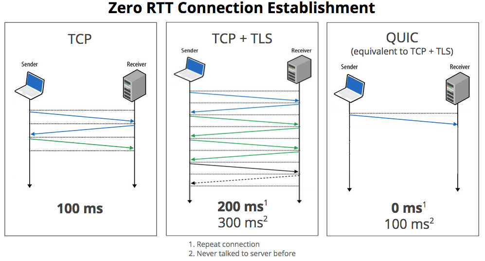
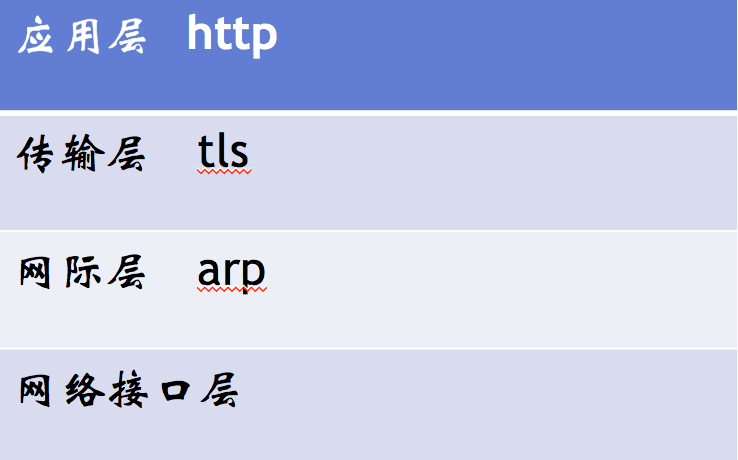

# network

## 参考
  - https://www.fastly.com/blog/headers-we-dont-want
  - https://www.nihaoshijie.com.cn/index.php/archives/630/
  - 前端必须明白的 http 知识点：https://mp.weixin.qq.com/s/4tluvji9YVtxloqmssY-Nw
  - 把网站升级到QUIC：https://www.yinchengli.com/2018/06/10/quic/
  - https连接的前几毫秒发生了什么：https://fed.renren.com/2017/02/03/https/

## 请求无用头部（新版）
  - server
  - expires
  - x-powered-by
  - pragma
    - 可用Cache-Control: no-store, private替代
  - x-frame-options
    - 防范[clickjacking](https://en.wikipedia.org/wiki/Clickjacking)（UI虚假内容点击，比如下载按钮搞成图片）
    - 可用Content-Security-Policy: frame-ancestors 'self'代替
  - x-cache
  - via
  - p3p
  - x-aspnet-version
  - x-ua-compatible

## http1.0
  - 带宽限制
  - 延迟
    - 浏览器阻塞（并行请求）
    - DNS查询（域名发散）
    - tcp
  - 缓存处理
    - If-Modified-Since,Expires

## http1.1
  - 缓存处理扩展
    - Entity tag，If-Unmodified-Since, If-Match, If-None-Match
  - 带宽优化
    - range，请求资源一部分（206），支持断点续传
  - 错误通知
    - 新增状态码
  - host处理
    - 一台服务器，多个server，同一个ip
  - 长连接
    - 一次tcp传多个http请求（keep-alive）

## spdy
  - 多路复用
  - 请求优先级（可设置）
  - 首部压缩
  - 服务端推送

## http 2.0
  - 多路复用：同一个tcp连接上并行请求，双向交换消息
  - 
  - 二进制分帧：将首部信息和请求体，采用二进制编码封装进HEADER和BODY frame
  - 
  - 首部压缩
  - 服务端推送

## spdy与http 2.0区别
  - HTTP2.0 支持明文 HTTP 传输，而 SPDY 强制使用 HTTPS
  - HTTP2.0 消息头的压缩算法采用 HPACK，而非 SPDY 采用的 DEFLATE

## quic
  - 通过减少往返次数，以缩短连接建立时间
  - 使用一种新的ACK确认机制（包含了NACK），达到更好的拥塞控制
  - 多路复用，并解决HTTP/2队头阻塞问题，即一个流的TCP包丢失导致所有流都暂停组装。在QUIC里面，一个流的包丢失只会影响当前流，不会影响其它流。
  - 使用FEC（前向纠错）恢复丢失的包，以减少超时重传
  - 使用一个随机数标志一个连接，取代传统IP + 端口号的方式，使得切换网络环境如从4G到wifi仍然能使用之前的连接。
  - 

### 对比http/https/quic
  - 

## https
  - http + tls
  - 
    - 服务器选中的密钥交换加密方式为RSA
    - 数据传输加密方式为AES
    - 检验数据是否合法的算法为SHA256
  - 
  - 公钥加密，私钥解密
  - 过程 -> 3RTT
    - 

