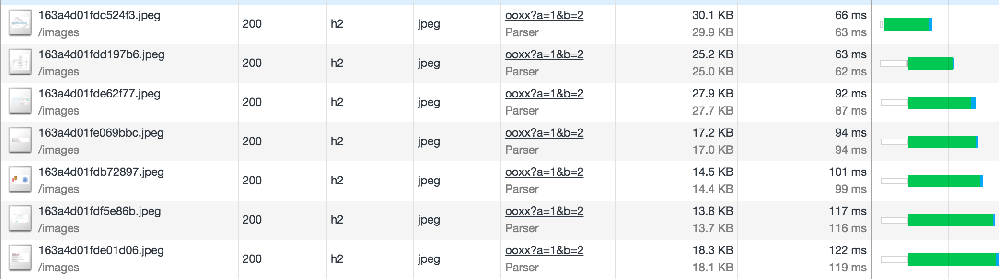
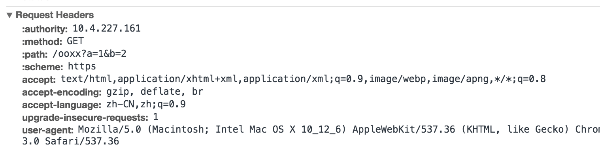
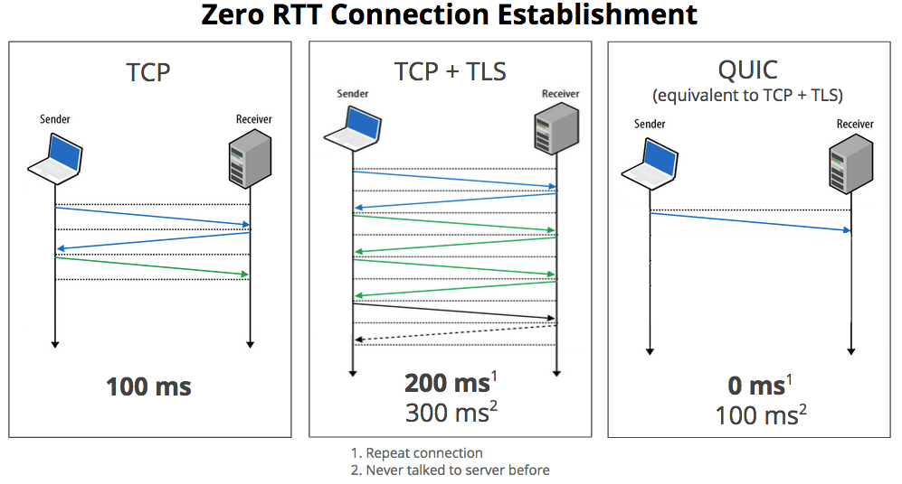
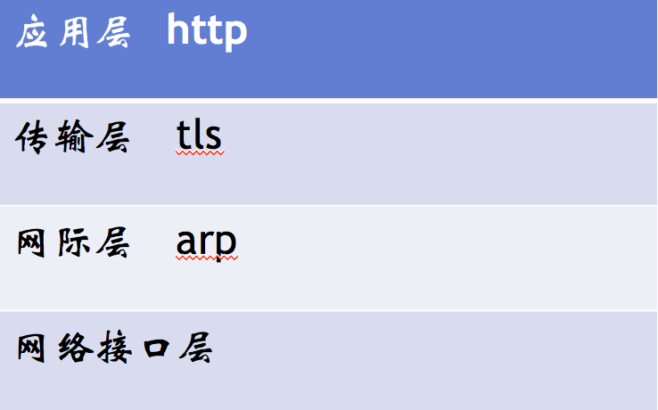
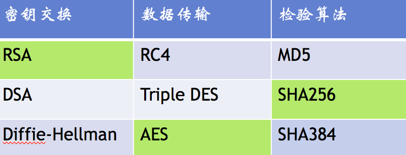
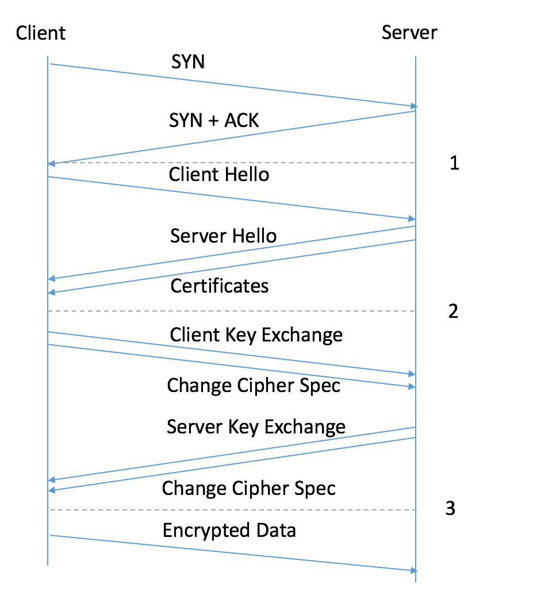
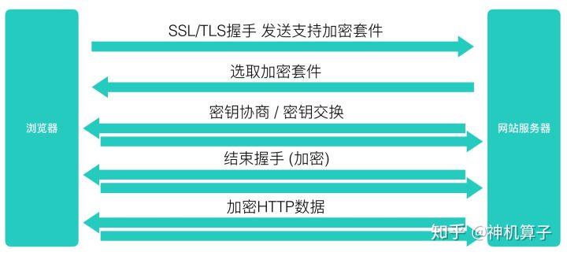
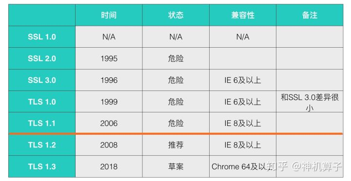
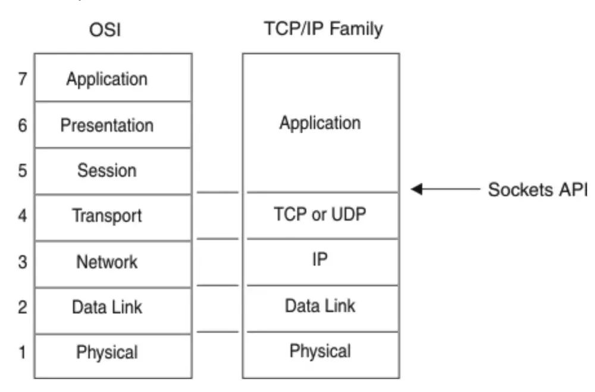

# network

## 参考
- https://www.fastly.com/blog/headers-we-dont-want
- https://www.nihaoshijie.com.cn/index.php/archives/630/
- [前端必须明白的 http 知识点](https://mp.weixin.qq.com/s/4tluvji9YVtxloqmssY-Nw)
- [把网站升级到QUIC](https://www.yinchengli.com/2018/06/10/quic/)
- [https连接的前几毫秒发生了什么](https://fed.renren.com/2017/02/03/https/)
- [流量劫持](https://zhuanlan.zhihu.com/p/40682772)
- [http3.0](https://mp.weixin.qq.com/s?__biz=MzA5NzkwNDk3MQ==&mid=2650589264&idx=1&sn=6ff446e3029c40eaabcff373c070e0f7&chksm=8891d874bfe6516261a18cdd029aa5e8730f0e955641ac7468f6bbae27e3b6acf8b4fb3813a3&mpshare=1&scene=1&srcid=&key=cb09f7b1396893c712194eeb7d524d812aaa1d6fd932852583a9a7574e6641a4a96b4f1563570eb1d4082bccaeade398aa998d7795c039cc6f06a1adc02a6e8236aeca8dd63d762fb6ffe09a33f210c1&ascene=1&uin=MjkyNDMwMjUwNg%3D%3D&devicetype=Windows+10&version=62060728&lang=zh_CN&pass_ticket=iFII9Td9YjjFZBzWoNyPFItjPfv26zZMyl%2By%2ByRZ3h5qwAJTlx0MoRSGaGIS%2B2jK)

## 目录
<details>
<summary>展开更多</summary>

* [`tcp`](#tcp)
* [`request header`](#request header)
* [`http1.0`](#http1.0)
* [`http1.1`](#http1.1)
* [`spdy`](#spdy)
* [`http2.0`](#http2.0)
* [`http3.0`](#http3.0)
* [`quic`](#quic)
* [`https`](#https)
* [`osl`](#osl)

</details>

## tcp

### tcp和http的关系

#### 一对多
- 一个tcp连接可以发送多个http请求（原因：Connection: keep-alive）
- chrome里可以通过network里的`Connection ID`查看（http1.1有并发6个上线，h2没有限制)
- 设置**Connection: close**的话，一个http请求结束就会断掉tcp连接
- 维持连接的优点是能省下请求的**初始化和ssl连接**时间

#### 并行请求
- http1.1的单个 TCP 连接在同一时刻只能处理一个请求（生命周期不重叠），
  但是浏览器内置pipelining结束，支持同时发送多个请求，不过存在问题
- http2 提供了 Multiplexing 多路传输特性，可以在一个 TCP 连接中同时完成多个 HTTP 请求

#### 连接上限
- Chrome 最多允许对同一个 Host 建立六个 TCP 连接，不同的浏览器有一些区别

---

## request header

### 请求无用头部（新版）
- server
- expires
- x-powered-by
- pragma
  - 可用Cache-Control: no-store, private替代
- x-frame-options
  - 防范[clickjacking](https://en.wikipedia.org/wiki/Clickjacking)（UI虚假内容点击，比如下载按钮搞成图片）
  - 可用Content-Security-Policy: frame-ancestors 'self'代替
- x-cache
- via
- p3p
- x-aspnet-version
- x-ua-compatible

### 未来头部新字段
- "Device-Memory" ":" #memory-value
  - 浏览器可以返回设备内存大小给服务端，Chrome 63+ 和 Opera50+支持

---

## http1.0
  - 带宽限制
  - 延迟
    - 浏览器阻塞（并行请求）
    - DNS查询（域名发散）
    - tcp
  - 状态码
    - 301: 永久重定向
    - 302: 临时重定向
      * 只有当服务器发出 Cache-Control 或 Expires（废弃） 头字段进行指示，
        此响应才能被缓存，否则不能被缓存
      * 临时URI应该由响应头部中的 Location 字段给出
      * 在除 GET 或 HEAD 两种请求方法之外的请求时，接收到302状态码，
        客户端不得自动重定向请求，除非用户可以确认
  - 缓存处理
    - If-Modified-Since：再次请求服务器时，通过此字段通知服务器上次请求时，服务器返回的资源最后修改时间
    - 缓存头部优先级：Pragma > Cache-Control > Expires（废弃） > ETag > Last-Modified

---

## http1.1

### 缓存处理扩展
Entity tag，If-Unmodified-Since, If-Match, If-None-Match
这里可以参考[浏览器缓存](../js&browser/页面过程与浏览器缓存.md#缓存分类)

**Cach-Control**

- private：客户端可以缓存
- public：客户端和代理服务器都可缓存
  * 包括中间节点的proxy
- max-age=xxx：缓存的内容将在 xxx 秒后失效
- no-cache：需要使用协商缓存来验证缓存数据
- no-store：所有内容都不会缓存，强缓存、协商缓存都不会触发
- s-maxage：仅在代理服务器（比如CDN）有效，优先级高于max-age
- max-stale：能容忍的最大过期时间
- min-fresh：能够容忍的最小新鲜度

例：must-revalidate
```text
// must-revalidate生效有个前提，前提就是这个缓存必须已经过期，
// 在浏览器端几乎没有任何作用
Cache-Control: max-age=86400, must-revalidate
```

### 资源缓存几种方式
* HTTP 1.1 风格的Cache-Control 响应头中的 max-age指令
* HTTP 1.0 风格的 Expires 响应头
* Last-Modified响应头

例：可缓存时长

可缓存时长1小时（22 - 12） * 0.1

注：浏览器差异导致缓存时长不同

```text
HTTP/2 200
Date: Wed, 27 Mar 2019 22:00:00 GMT
Last-Modified: Wed, 27 Mar 2019 12:00:00 GMT
```

### 带宽优化
range，请求资源一部分（206），支持断点续传

### 错误通知

新增状态码
- 303：明确表示客户端应当采用get方法获取资源
- 307：不会把POST转为GET

### host处理
一台服务器，多个server，同一个ip

### 长连接
一次tcp传多个http请求（keep-alive）

### 缓存字段
- 

---

## spdy
- 多路复用
- 请求优先级（可设置）
- 首部压缩
- 服务端推送

---

## http2.0
[HTTP/2.0 相比1.0有哪些重大改进](https://www.zhihu.com/question/34074946)

- 多路复用
  * 同个域名只需要占用一个 TCP 连接
  * 同一个tcp连接上并行请求任意数量的双向交换消息
  * 减轻服务端负载
- 
- 二进制分帧
  * 将首部信息和请求体，采用二进制编码封装进HEADER和BODY frame
  * 
- 首部压缩
  * 客户端和服务器端使用“首部表”来跟踪和存储之前发送的键－值对
  * 相同的数据，不再通过每次请求和响应发送
  * 每个新的首部键－值对要么被追加到当前表的末尾，要么替换表中之前的值
- 服务端推送
  * 服务端可以主动把JS和CSS文件推送给客户端，而不需要客户端解析HTML时再发送这些请求
  * 遵守同源策略
  * 如果资源已经被浏览器缓存，浏览器可以通过发送RST_STREAM帧来拒收
  * prefetch

### spdy与http 2.0区别
- HTTP2.0 支持明文 HTTP 传输，而 SPDY 强制使用 HTTPS
- HTTP2.0 消息头的压缩算法采用 HPACK，而非 SPDY 采用的 DEFLATE

---

## quic
- 基于UDP
- 通过减少往返次数，以缩短连接建立时间
- 使用一种新的ACK确认机制（包含了NACK），达到更好的拥塞控制
- 多路复用，并解决HTTP/2队头阻塞问题，即一个流的TCP包丢失导致所有流都暂停组装。在QUIC里面，一个流的包丢失只会影响当前流，不会影响其它流。
- 使用FEC（前向纠错）恢复丢失的包，以减少超时重传
- 使用一个随机数标志一个连接，取代传统IP + 端口号的方式，使得切换网络环境如从4G到wifi仍然能使用之前的连接。
- 

### 对比http/https/quic
- 

---

## http3.0
- 基于UDP协议的QUIC
- 加密认证的报文
  * TCP 协议头部
- 无阻塞的多路复用
- 0RTT
- 向前纠错机制
  * 每个数据包中含有部分其他数据包的内容，丢包可能会触发重组，而无需重传
  * 以上仅限于单个包丢失的情况

### 对比http2.0和http3.0
- 多路复用
  * http2.0：单个连接上有多个stream之间会阻塞，stream丢包会影响之后的stream
  * http3.0：stream之间无影响

---

## https
  - http + tls
  - 
    - 服务器选中的密钥交换加密方式为RSA
    - 数据传输加密方式为AES
    - 检验数据是否合法的算法为SHA256
  - 
  - 
  - 公钥加密，私钥解密
  - 过程 -> 3RTT
    - 1次tcp RTT
    - 2次tls RTT
    - 

### HTTP、HTTPS、TCP、SSL/TLS
- HTTP基于TCP
- SSL/TLS基于TCP
- HTTPS基于SSL/TLS

### ssl和tls
- tls由ssl演变而来，目前ssl已极不安全
- tls1.0相当于ssl3.1
- 推荐tls1.2
- 

---

## osl
Open System Interconnection 开放式系统互联



