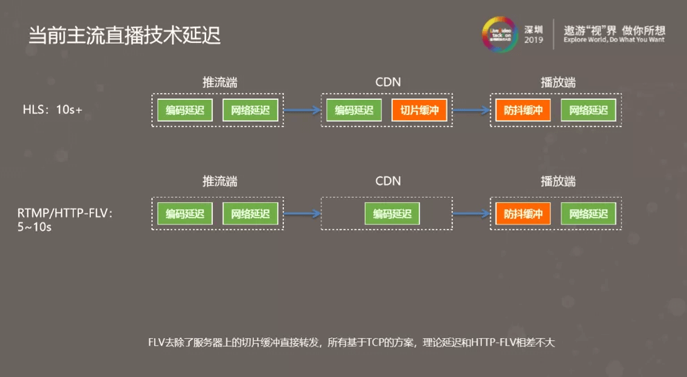
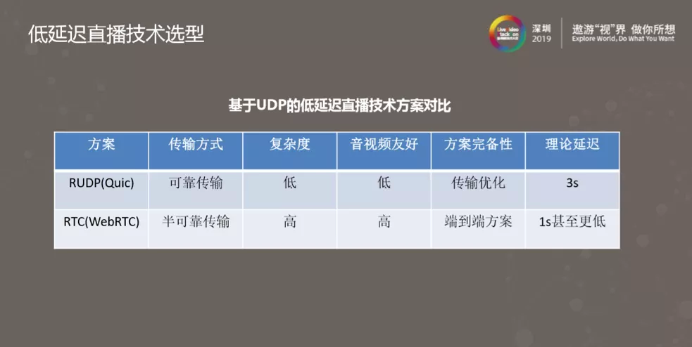

# webRTC

## 参考
- [webrtc-book](https://a-wing.github.io/webrtc-book-cn/01_introduction.html#peerconnection)
- [淘宝直播低延迟的背后](https://www.infoq.cn/article/sos0orAePCxwVs7KJgfD)
- [webRTC-demo](https://webrtc.github.io/samples/)

---

## 目录

展开更多

* [`介绍`](#介绍)
* [`主流直播技术`](#主流直播技术)
* [`> HLS`](#HLS)
* [`> RTMP/HTTP-FLV`](#RTMP/HTTP-FLV)
* [`低延迟直播技术`](#低延迟直播技术)

---

## 介绍
- `Flash`的替代品是`HLS`和`MPEG-DASH`，但是两者的传播实时性不够，所以有了`webRTC`
- 目前部分浏览器已经支持基本[RTCPeerConnection](https://developer.mozilla.org/en-US/docs/Web/API/RTCPeerConnection/RTCPeerConnection)，其他特性在不断支持中
- webRTC使用`https`，本地调试需要做些[处理](https://blog.csdn.net/onlycoder_net/article/details/76702481)，底层大多用`udp`传输
- 实时的流量价格更是CDN流量的3倍以上, 部署一个超低延迟的直播网络成本非常高

---

## 主流直播技术
> 在低延迟直播技术出现前主要有 HLS 和 RTMP/HTTP-FLV 两个协议

### HLS
> 基于TCP
>
> 延迟主要来自编码解码时产生延迟、网络延迟、CDN 分发延迟。
>
> 由于它是切片协议，延迟分两大块一个是服务端有切片缓冲延迟，另一个是在播放端防抖缓冲会有延迟。
>
> 切片的大小和数量都会 HLS 影响延迟大小，一般在十秒以上。

### RTMP/HTTP-FLV
> 基于TCP
>
> 目前国内大部分厂家在用的 RTMP，它相对于 HLS 在服务端做了优化。
>
> RTMP 服务端不再进行切片，而是分别转发每一帧，CDN 分发延迟非常小。
>
> RTMP 延迟主要来自播放端防抖缓冲：为提升弱网环境下抖动时直播的流畅度，缓冲延迟一般有五到十秒

### TCP的劣势

**重传慢**:

TCP的ACT确认机制，丢包后发送侧超时重传，超时时间一般 200ms，会造成接收侧帧抖动

**拥塞判定不准确**

基于丢包的拥塞控制算法无法准确判断拥塞，丢包并不等于拥塞；也会造成发送链路 bufferbloat，链路 RTT 增大，延迟增加

**灵活性差**

这是最主要原因，TCP 拥塞控制算法在操作系统内核层实现，优化成本较高，移动端只有利用系统已有的优化

---

## 低延迟直播技术

### Quic

### webRTC

---