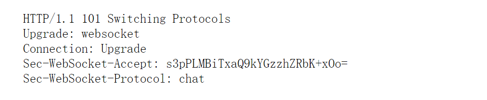

# websocket

## 参考
- 

## 应知
- 请求方式必须为GET，协议必须大于1.1
- 必须有HOST头，其格式为hostname[:port]
- 必须有Upgrade头，其值必须包含 websocket 关键字
- 必须有Connection头，其值为必须包含Upgrade
- 必须有Sec-WebSocket-Key头，其值为随机生成的16字节的值用BASE64编码后的字符串
- 若客户端为浏览器，则必须有Origin头，其值为请求发起方的hostname (因为中间可能经过代理才到达服务器，服务器可以根据该字段选择是否和客户端建立连接)
- 必须有Sec-WebSocket-Version头，其值必须为13
- 可选头Sec-WebSocket-Protocol，其值为由逗号分隔的子协议的名字，按优先度排序，每个名字必须唯一
- 可选头Sec-WebSocket-Extension，表示协议级别的扩展
- 除以上要求外，可有其它任意符合HTTP的协议头，例如cookies之类的都可以。

## 过程
1. 客户端发一个HTTP GET请求，请求服务端将连接升级到websocket
2. 如果服务端支持WebSocket，那就构造一个HTTP响应（状态码必须为101）返回，
若不支持，则返回其他合理状态码的响应，以说明理由
3. 服务端就可以发送websocket消息帧了

## 终止
- 连接任一端想关闭websocket，就发一个close frame（opcode为0x8的就是close frame）给对端
- 对端收到该frame，若之前没有发过close frame，则必须回复一个close frame
- 发送或回复close frame后该端就不能再发任何frame，但可以接收数据
- close frame之后无法保证数据完整性

