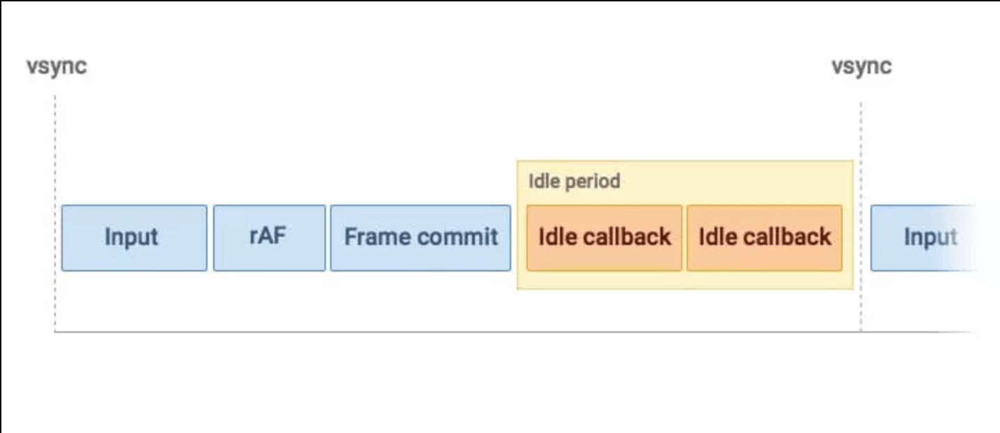
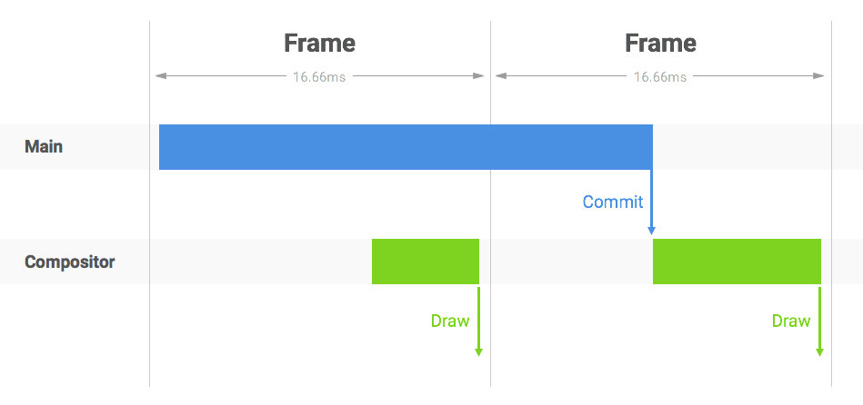

## 参考
1. https://mp.weixin.qq.com/s/LIfvU8j0gBVIFF8AYYtfFg
2. 

## 帧-生命周期
1. 输入事件（touch、wheel、click、keypress）
2. js脚本
3. 帧事件（window.resize、scroll、media query、animation）
4. rAF（requestAnimationFrame、ObserverCallback、帧回调）
5. layout（重排，计算大小）
6. paint（重绘，更新样式）

具体操作可[参考](./requestIdleCallback.png)

---

## 线程
- JS线程
- UI渲染线程
- 事件线程
- 定时器触发线程
- HTTP请求线程（XMLHttpRequest）
- ...

**JS线程和渲染线程互斥**，长时间JS执行导致页面卡顿，比如下面这种情况



注：**chrome渲染页面涉及两个线程：主线程和合成线程**

---

## microTask使用
```js
  function flush() {
    // ...
  };

  function useMutationObserver() {
    var iterations = 0;
    var observer = new MutationObserver(flush);
    var node = document.createTextNode('');
    observer.observe(node, { characterData: true });

    return function () {
      node.data = iterations = ++iterations % 2;
    };
  };
```

---

## 任务拆分
- 如何拆分子任务
- 子任务多大合适
- 如何判断当前帧剩余可执行时间
- 如何在剩余时间调度执行另一个任务
- 没有剩余时间，之前任务如何处理


