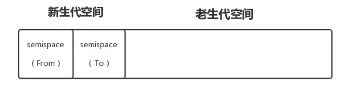
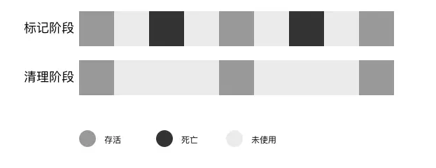

##参考

- https://juejin.im/post/5a2559ae6fb9a044fe4634ba?utm_medium=fe&utm_source=weixinqun
- https://zcfy.cc/article/how-javascript-works-memory-management-how-to-handle-4-common-memory-leaks
- https://en.wikipedia.org/wiki/Tracing_garbage_collection
- https://blog.csdn.net/xiepeifeng/article/details/43341113
- [内存管理](https://github.com/xiaomuzhu/front-end-interview/blob/master/docs/guide/memory.md)
- [前端内存优化](https://mp.weixin.qq.com/s/xmb9gtECWvSRoFdz69BOGQ)

## 目录

<details>
<summary>展开更多</summary>

* [`基本概念`](#基本概念)
* [`内存结构`](#内存结构)
* [`内存回收`](#内存回收)
* [`内存分代`](#内存分代)
* [`内存泄漏`](#内存泄漏)
* [`内存查看`](#内存查看)

</details>

## 内存泄漏

### 原因

- 全局变量/方法（意外创建或未清除的）
- 定时器（页面卸载时未销毁）
- 闭包
- 节点引用（比如 dom 和 js 中都保留了对节点的引用，dom 即使 removechild 了，js 中的引用还存在）

### node 内存泄漏

**检测工具**

- [easy-monitor](https://github.com/hyj1991/easy-monitor#readme)
- [node-heapdump](https://github.com/bnoordhuis/node-heapdump)

---

## 基本概念

### 字节

- 8 位一字节
- 整型 2 字节
- 双精度 4 字节

---

## 内存结构

### 栈内存

- 大小确认
- 编译时分配
- LIFO（后进先出）
- 基本类型、定长数组
- cpu 有特定寄存器（esp、ebp）来操作栈，速度快

### 堆内存

- 大小不定
- 运行时分配
- 对象
- 堆通过间接寻址操作，速度较栈慢
- 闭包变量（包括基本类型）

### 对象

- 每一个属性，按照一定的哈希映射规则，都会映射到不同的存储地址
- 随着属性增加，可能出现哈希碰撞的情况，不同语言有各自解法：
  * 开放寻址法
  * 再哈希法
  * 拉链法（js的解法）
- 拉链法：算法得到的相同映射地址的值，用链表的形式存储起来，一个链表的每个单元，存储着该属性的 key, value 和下一个元素的指针

### 数组
> 特殊的对象

Q：为何 JS 的数组每个数据类型都可以不一样？
Q：为何 JS 的数组无需提前设置长度，是可变数组？
Q：为何数组可以像 Object 一样挂载任意属性？
A：因为他就是个对象    答案同上；

### ArrayBuffer，TypedArray 和 DataView
> js里真正的数组

#### ArrayBuffer
> 分配的一段定长的连续内存块，只能通过TypedArray和DataView间接操作

#### TypedArray
> 统称，包括Int8Array / Int16Array / Int32Array / Float32Array等，元素都是定长的、相同类型的。

```js
const typedArray = new Int8Array(10);

typedArray[0] = 8;
typedArray[1] = 127;
typedArray[2] = 128;
typedArray[3] = 256;
```

#### DataView
> 比TypedArray灵活，能动态分配每一个元素的长度。

```js
var arrayBuffer = new ArrayBuffer(8 * 10);
var dataView = new DataView(arrayBuffer);

dataView.setInt8(0, 2);
dataView.setFloat32(8, 65535);

// 从偏移位置开始获取不同数据
dataView.getInt8(0);
// 2
dataView.getFloat32(8);
```

### SharedArrayBuffer
> 共享内存，适用于多线程或wasm，在百万级数据量下，会有明显优势，仅chrome68及firefox当前最新版支持

main.js
```js
var worker = new Worker('./sharedArrayBufferWorker.js');

worker.onmessage = function(e){
  // 传回到主线程已经被计算过的数据
  console.log("e.data","   -- ", e.data );
  // SharedArrayBuffer(3) {}

  // 和传统的 postMessage 方式对比，发现主线程的原始数据发生了改变
  console.log("int8Array-outer","   -- ", int8Array );
  // Int8Array(3) [2, 3, 4]
};

var sharedArrayBuffer = new SharedArrayBuffer(3);
var int8Array = new Int8Array(sharedArrayBuffer);

int8Array[0] = 1;
int8Array[1] = 2;
int8Array[2] = 3;

worker.postMessage(sharedArrayBuffer);
```

worker.js
```
onmessage = function(e){
  var arrayData = increaseData(e.data);
  postMessage(arrayData);
};

function increaseData(arrayData){
  var int8Array = new Int8Array(arrayData);
  for(let i = 0; i < int8Array.length; i++){
    int8Array[i] += 1;
  }
  return arrayData;
}
```

---

## 内存回收

[参考](https://segmentfault.com/a/1190000018605776?utm_medium=hao.caibaojian.com&utm_source=hao.caibaojian.com&share_user=1030000000178452)

### 什么是内存垃圾

* 没有被引用
* 互相引用，但是根无法访问

### 算法

[参考](https://www.jianshu.com/p/a8a04fd00c3c)

**引用计数（现代浏览器不再使用）**

循环引用造成计数不为 0，无法清除

**标记清除（常用）**

取全局变量（window 或 global）作为根元素，子元素递归检查是否为活跃的

缺点：

- 碎片化、散落在堆各处
- 分配速度不理想，需要分配较大区块

**标记压缩**

标记清除进阶版本

缺点：

- 有效利用了堆，不过压缩时间长

**GC 复制**

- 堆分成两部分：from 和 to
- from 优先开始存储，满了，将活动对象复制到 to
- from 和 to 互换

缺点：

- 堆使用率低
- 递归调用函数， 复制子对象需要递归调用复制函数 消耗栈

**保守式 GC**

---

## 内存分代

### 全暂停

为避免应用逻辑与垃圾回收器看到的情况不一致，垃圾回收算法在执行时，需要停止应用逻辑

GC 时间 = 全暂停时间

### 新生代

> 对象的存活时间较短。新生对象或只经过一次垃圾回收的对象。
> 垃圾回收算法是 Scavenge

#### Scavenge



- 分为 from 和 to 两个 semispace
- 当 from 空间占满，执行垃圾回收
- 检查存活对象，是否符合晋升条件，符合则晋升到老生代，
  不符合则复制到 to 空间
- 释放不存活的对象
- 复制完成，翻转 from 和 to

### 老生代

> 对象存活时间较长。经历过一次或多次垃圾回收的对象。
> 垃圾回收算法是 Mark-Sweep 和 Mark-Compact

#### Mark-Sweep

> 标记清除

- 标记阶段：遍历堆，标记存活对象
- 清除阶段：回收未标记对象



会导致内存碎片、内存不连续

#### Mark-Compact

> 标记整理，基于 Mark-Sweep 的改进

- 标记阶段：同 Mark-Sweep
- 清除阶段：对存活、未使用的对象归类


由于涉及对象移动，所以比 Mark-Sweep 慢，v8 默认使用 Mark-Sweep，
当内存空间不足时，使用 Mark-Compat

#### 增量标记

> 由于老生代存活对象较新生代多，单次 GC 耗时较大，也造成全暂停耗时较大
> 为了减少页面卡顿无响应，2011 年 v8 改进成增量标记，拆分单次过程为多个小步

#### 延迟清理

- 在增量标记之后
- 清理完成后，增量标记重新开始

---

## 内存查看

### node 环境

```js
console.log(process.memoryUsage());

// 输出
{ 
  rss: 27709440,        // resident set size，所有内存占用，包括指令区和堆栈
  heapTotal: 5685248,   // "堆"占用的内存，包括用到的和没用到的
  heapUsed: 3449392,    // 用到的堆的部分
  external: 8772         // V8 引擎内部的 C++ 对象占用的内存
}
```

### 浏览器环境

devtool->memory -> take snapshot

#### 名词解释

Distance：到 root 的引用距离
Shallow size：对象本身的大小，不包含它引用的数据的大小
Retained size：对象自身以及所有引用的大小，就是对象总共占用的内存

---
