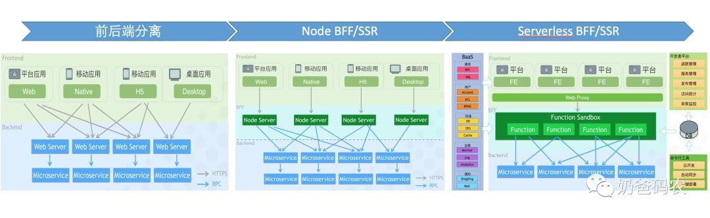

# 前端软件架构

## 通用
通常涵盖三个部分：
**架构模型**：定义了系统组件是如何组织和拼装的，明确系统的组件模块，划分各自边界以及如何组合在一起。

**通信接口**：定义了系统组件之间是如何进行通信的，通常指的是组件/模块之间的通信方式、接口定义、API。

**质量要求**：定义了非功能性的系统要求，例如扩展性、稳定性、高可用性、高并发、高性能、安全等等。

---

## 层次
**系统级**，即应用在整个系统内的关系，如与后台服务如何通信，与第三方系统如何集成。

**应用级**，即应用外部的整体架构，如多个应用之间如何共享组件、如何通信等。

**模块级**，即应用内部的模块架构，如代码的模块化、数据和状态的管理等。

**代码级**，即从基础设施来保障架构实施。

## 前端进程

