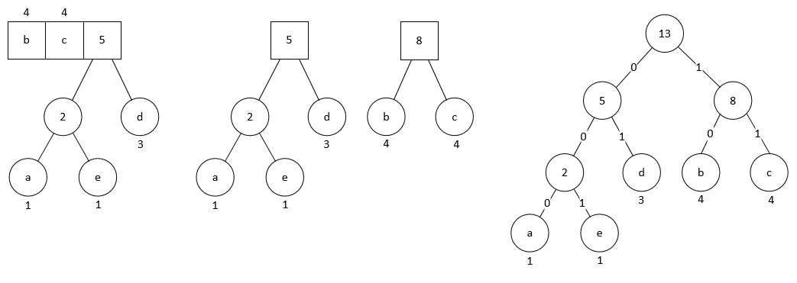

# 图片优化

[TOC]

## 参考

- [图片优化](https://github.com/berwin/Blog/issues/28)
- [图片优化2](https://mp.weixin.qq.com/s/Q5-IZYChQulNLaCRb7SBSw)

## 目录

<details>
<summary>展开更多</summary>

* [`无损压缩`](#无损压缩)
* [`图片类型`](#类型)
* [`图片格式`](#图片格式)
* [`apng`](#apng)
* [`优化措施`](#优化措施)
* [`应知`](#应知)

</details>


## 无损压缩

[参考](http://zhangbohun.github.io/2019/04/01/%E6%97%A0%E6%8D%9F%E5%8E%8B%E7%BC%A9%E7%AE%97%E6%B3%95%E7%90%86%E8%AE%BA%E5%AD%A6%E4%B9%A0%E6%80%BB%E7%BB%93/?utm_medium=hao.caibaojian.com&utm_source=hao.caibaojian.com)

### 分类

- 熵编码
  * 根据符号出现概率，用短符号 替代 原符号
  * 霍夫曼编码
- 字典编码
  * 提取重复字符，通过映射替代原部分
  * LZ77与LZ78
  * LZSS

### 算法

- DEFLATE
  1. LZ77（或 LZSS）预处理
  2. 霍夫曼编码对压缩后的 literal、length、distance 编码优化

---

## 类型

- 矢量图
- 栅格图（位图）

### 矢量图

#### 组成

由点、直线或者多边形等基于数学方程的几何图元组成

#### 作用

适用于简单的几何图像

#### 示例

svg - [压缩工具](https://github.com/svg/svgo)

### 栅格图

#### 组成

使用像素阵列，1像素4字节

---

## 优化措施

可以[参考](./移动端开发.md#图片模糊适配)

### srcset（根据DPR取图）

**定义默认图片和2x、3x下加载的图片**

```html

```

### 使用<picture>的Art direction

**一些含有人物的图片，在不同设备上都需要凸显人物的话就可以用到`Art direction`**

```html
<!-- https://mdn.github.io/learning-area/html/multimedia-and-embedding/responsive-images/responsive.html -->
<picture>
  <source media="(max-width: 799px)" srcset="elva-480w-close-portrait.jpg">
  <source media="(min-width: 800px)" srcset="elva-800w.jpg">
  
</picture>
```

### 预加载

**preload允许强制浏览器在不阻止文档onload事件的情况下请求资源**

```html
<link rel="preload" as="image" href="logo.jpg"/>
```

### fetchPriority-标记优先级

```html
<div>
  
  
  
</div>
```

### 其他注意事项

**display:none并不能阻止图片的下载**

---

## 图片格式

**区别**


**选择方式**


---

## 应知

### Data Url

**格式**

data:[<mediatype>][;base64],data

data前缀[<MIME类型（表明数据类型）>][;base64标志位（如果是文本，则可选）],数据

**缺点**

- 数据体积通常是原数据的体积4/3
- 不会缓存

### DEFLATE算法

- [参考](https://luyuhuang.github.io/2020/04/28/gzip-and-deflate.html)

#### 1. 哈希表存储

- 字符按一定长度做哈希存储，比如3位、4位
- 后续字符匹配到以后，用哈希表里对应的位置信息替换

```
hash table: {"abc":[0],"bcb":[1],"cbc":[2],"bcd":[3],"cda":[4],"dab":[5]}
abcbcdabcda
      ^
output: abcbcd<6,3>
```

#### 2. 惰性匹配

- 当匹配到哈希表里对应的位置信息后，会尝试继续匹配
- 直到匹配不到时，返回上次匹配到的位置信息
- 该过程会让压缩变慢，所以要通过配置关闭/开启惰性匹配

```
hash table: {"abc":[0],"bcb":[1],"cbc":[2],"bcd":[3],"cda":[4],"dab":[5], "bcda": [6]}
abcbcdabcda
            ^
output: abcbcda<7,6>
```

#### 3. huffman编码

如果用`<7,6>`这种形式，很占空间，而且也不方便转义，所以需要用**Huffman 编码重新编码**。

**基本原则**

> 使用频率高的字符编码短, 使用频率低的字符编码长

假设按单字符出现频率统计：

| 字符  | 次数  |
| --- | ---:|
| a   | 1   |
| b   | 4   |
| c   | 4   |
| d   | 3   |
| e   | 1   |

编码过程：


结果：

| 字符  | 次数  |
| --- | ---:|
| a   | 000 |
| b   | 10  |
| c   | 11  |
| d   | 01  |
| e   | 001 |

---

## apng

> animated png
> 
> 支持 24 位真彩色图像和 8 位 Alpha 透明度

[apng原理解析](https://musicfe.dev/apng/)
