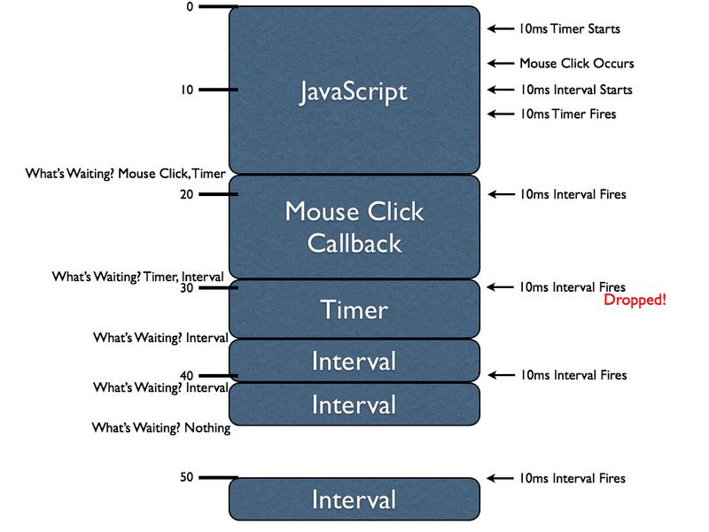

# 基本常识

## 目录
<details>
<summary>展开更多</summary>

* [`Symbol`](#Symbol)
* [`new`](#new)
* [`String`](#String)
* [`基础类型`](#基础类型)
* [`类型转换`](#类型转换)
* [`二进制`](#二进制)
* [`JSON`](#JSON)
* [`Object`](#Object)
* [`Number`](#Number)
* [`this`](#this)
* [`ajax等请求方式`](#前端请求方式)
* [`Array`](#Array)
* [`Promise`](#Promise)
* [`setTimeout`](#setTimeout)
* [`iterator`](#iterator)
* [`Storage`](#Storage)
* [`箭头函数`](#箭头函数)
* [`null`](#null)
* [`正则`](#正则)
* [`cookie`](#cookie)
* [`模块化`](#模块化)
* [`其他`](#其他)
* [`继承`](#继承)
* [`深拷贝`](#深拷贝)
* [`反模式`](#反模式)
* [`递归`](#递归)
* [`字节`](#字节)
* [`节流vs防抖`](#节流vs防抖)
* [`文件下载`](#文件下载)

</details>

## String

### indexOf VS search
- search:默认处理正则，比如'aaa\n'.search('.')，是0，因为/./
- indexOf:处理字符串，同是字符串，略快

### valueOf VS toString
- 类型转换时，优先调用valueOf()方法，然后通过toString抽象操作将返回值转换为字符串
```js
function Foo(n) {
  this.number = n;
}

Foo.prototype.valueOf = function() {
  return 123;
};

var obj = new Foo;
obj + 1; // 此时输出124

Foo.prototype.valueOf = function() {
  return 321;
};

obj + 1; // 此时输出322
```

### +
- 操作数是string，做拼接，否则做相加；
- 操作数是object，做toPrimitive（valueOf或toString），再按（1）判断；

### == VS ===
-  == 允许在相等比较中进行强制类型转换，而 === 不允许。

### 字符串和数字之间的相等比较
- 如果 Type(x) 是数字，Type(y) 是字符串，则返回 x == ToNumber(y) 的结果。 
- 如果 Type(x) 是字符串，Type(y) 是数字，则返回 ToNumber(x) == y 的结果。
- 否则返回 ToBoolean(x) == ToBoolean(y)的结果。

### 对象和非对象之间的相等比较
- ToPromitive默认转数字；
- 如果 Type(x) 是字符串或数字，Type(y) 是对象，则返回 x == ToPrimitive(y) 的结果；
- 如果 Type(x) 是对象，Type(y) 是字符串或数字，则返回 ToPromitive(x) == y 的结果；

---

## 基础类型
- null
- undefined
- boolean
- number
- string
- symbol

### 特性
- 不变性
- 没有属性、__proto__
- 任何的属性访问，都是访问基础包装类型
  * 创建基础类型的一个实例
  * 在实例上调用指定的方法
  * 销毁实例

---

## 类型转换

转换原始类型会执行原生的toPrimitive

1. 返回当前值（如果已是原始类型）
2. 转string，先toString，再valueOf
3. 不是转string，先valueOf，再toString

```js
let num = {
  valueOf() {
    return 1;
  },
  toString() {
    return '2';
  },
  // 优先级最高
  [Symbol.toPrimitive]() {
    return 3;
  }
};
```

### 转换为布尔值

| 参数类型 | 结果 |
| ------ | ------ |
| Undefined | false |
| Null | false |
| Boolean | 当前参数 |
| Number | 如果参数为 +0、 -0或 NaN，则返回 false；其他情况则返回 true |
| String | 如果参数为空字符串，则返回 false；否则返回 true |
| Symbol | true |
| Object | true |
  
### 转换为数字

| 参数类型 | 结果 |
| ------ | ------ |
| Undefined | NaN |
| Null | +0 |
| Boolean | 如果参数为 true，则返回 1； false则返回 +0 |
| Number | 返回当前参数 |
| String | 先调用 ToPrimitive，再调用 ToNumber，然后返回结果 |
| Symbol | 抛出 TypeError错误 |
| Object | 先调用 ToPrimitive，再调用 ToNumber，然后返回结果 |

### 转换为字符串

| 参数类型 | 结果 |
| ------ | ------ |
| Undefined | 返回 "undefined" |
| Null | 返回 "null" |
| Boolean | 如果参数为 true ,则返回 "true"；否则返回 "false" |
| Number | 调用 NumberToString，然后返回结果 |
| String | 返回 当前参数 |
| Symbol | 抛出 TypeError错误 |
| Object | 先调用 ToPrimitive，再调用 ToString，然后返回结果 |

---

## 二进制

### 原码
符号位 + 真值

### 反码
正数 - 本身
负数 - 在原码的基础上, 符号位不变，其余各个位取反

### 补码
正数 - 本身
负数 - 在原码的基础上, 符号位不变, 其余各位取反, 最后+1. (即在反码的基础上+1)

---

## 正则

- [常用语言正则特性一览](https://github.com/yurii-yu/regexs/blob/master/feature_overview.md)
- [未来的正则](https://ponyfoo.com/articles/regular-expressions-post-es6)

### 特殊用法
**匹配所有**

[^]

**非贪婪**
\w+?

### 转义字符
- * . ? + $ ^ [ ] ( ) { } | \ /

### exec VS match
- exec会带lastIndex，match不会
例：正则递归
```js
var str = 'abc';
var reg = /\w/g;
var result;
while (result = reg.exec(str)) {
  console.log(result);
}
```

---

## Number

### 0.1 + 0.2 !== 0.3
1. 进制转换
  - 计算机无法直接对十进制数计算，需要对照IEEE 754标准，转换成二进制
  - IEEE双精度格式具有53 位有效数字精度(包含1位符号位)，并总共占用64 位
  - 小数转换完之后需要做尾数截断，多余尾数截掉后就会造成精度损失
  - Number.MAX_SAFE_INTEGER 2的53次方 - 1
  ```js
  // 9007199254740991
  // 
  // (0.1)10 => (0.00011001100110011001(1001循环)...)2
  // (0.2)10 => (0.00110011001100110011(0011循环)...)2
  ```
2. 对阶运算
  - 由于指数位数不相同，运算时需要对阶运算 这部分也可能产生精度损失
  - 0.1 + 0.2的结果就是：
  ```js
  // 0.30000000000000004
  0.0100110011001100110011001100110011001100110011001100
  ```

---

## 泛用型isObject
- 类似new String('aa')仍不算object
```js
function isProxyable(value) {
  if (!value) return false;
  if (typeof value !== "object") return false;
  if (Array.isArray(value)) return true;
  const proto = Object.getPrototypeOf(value);
  return proto === null || proto === Object.prototype;
};
```

---

## 前端请求方式
[前端所有网络请求方式](https://mp.weixin.qq.com/s/LKcEylaxb21_GeCXoGZ8fA)

### 变迁
- form表单、ifream、刷新页面
- Ajax - 异步网络请求的开山鼻祖
- jQuery - 一个时代
- fetch - Ajax的替代者
- axios、request等众多开源库

### readystate
- 0: 请求未初始化（还没有调用 open()）。
- 1: 请求已经建立，但是还没有发送（还没有调用 send()）。
- 2: 请求已发送，正在处理中（通常现在可以从响应中获取内容头）。
- 3: 请求在处理中；通常响应中已有部分数据可用了，但是服务器还没有完成响应的生成。
- 4: 响应已完成；您可以获取并使用服务器的响应了。

## Object.getOwnPropertyDescriptor
```js
var obj = {};
Object.defineProperty(obj, aa, {
  get() {/*...*/},
  set() {/*...*/},
});

Object.getOwnPropertyDescriptor(obj);
/*
  {
    get(){},
    set(){},
    configurable: true,
    enumerable: true,
  }
*/
```

### fetch VS XMLHttpRequest
相比XMLHttpRequest，fetch可对请求做更多控制
- credentials
- mode
- cache
- redirect
- referrer
- integrity

#### credentials
请求是否带上 cookie 等机密信息（跨域情况默认不带的）

fetch
- omit: 请求不带任何 cookie
- same-origin: 同域请求会带上 cookie
- include: 无论是否跨域都会带上 cookie

XMLHttpRequest (withCredentials)
- true: 大致对应上面的 include，MDN 上描述此 flag 不止控制 cookie 还控制 authorization headers 或者 TLS client certificates。
- false: 大致对应上面的 omit，MDN 上描述为 false 时还控制跨域请求的 response 不能设置 cookie。

#### mode
设置请求方式的阻止跨域标志位

fetch
- same-origin
- no-cors
- cors
- navigate

## JSON

### toJSON
- 如果对象中定义了toJSON() 方法，stringify会首先调用该方法，再用它的返回 值来进行序列化
```js
var obj = {
  toJSON() {
    return 'aaa';
  },
};
```

### 支持的数据类型
由于JSON是通用文本格式，和语言无关，所以无法针对语言的特定数据类型做转换
- String
- Number
- Null
- Boolean

### stringify
- Boolean | Number| String 类型会自动转换成对应的原始值。
- undefined、任意函数以及symbol，会被忽略（出现在非数组对象的属性值中时），
  或者被转换成 null（出现在数组中时）。
- 不可枚举的属性会被忽略
- 如果一个对象的属性值通过某种间接的方式指回该对象本身，即循环引用，属性也会被忽略。

**入参**

- input
- replacement
  * key替换方法，深度遍历
  * function(key, value)，return值为替代值
- space

---

## this
- 函数在new中调用(new绑定)的话，this绑定的是新创建的对象。
```js
var bar = new foo();
```

- 函数是否通过call、apply(显式绑定)或者硬绑定调用，this绑定的是指定的对象。
```js
var bar = foo.call(obj2);
var bar2 = foo.apply(obj2);
var bar3 = foo.bind(obj2);
```

- 函数是否在某个上下文对象中调用(隐式绑定)，this 绑定的是那个上下文对象。
```js
var bar = obj1.foo();
```

- 如果都不是的话，使用默认绑定。如果在严格模式下，就绑定到undefined，否则绑定到 全局对象。
```js
var bar = foo();
```

### this显式绑定
```js
class MeowctComponent {
  constructor() {
    this.paw = document.getElementById('button');
  }

  meow() {
    console.info('🐱 on this: ', this.paw);
  }
}
const cat = new MeowctComponent();

// 方式1：箭头函数
cat.paw.addEventListener('click', () => cat.meow());
// 方式2：bind
cat.paw.addEventListener('click', cat.meow.bind(cat));
// 方式3：绑定操作符::（提案）
cat.paw.addEventListener('click', ::cat.meow);
```

---

## new

### new关键字
- 参考ecma262-12.3.3
- 创建一个新的对象，这个对象的类型是object
- 链接到原型: obj.__proto__ = Con.prototype
(设置这个新的对象的内部、可访问性和[[Prototype]]属性为构造函数（指prototype.construtor所指向的构造函数）中设置的)
- 绑定this: apply
(执行[[Construct]]，当this关键字被提及的时候，使用新创建的对象的属性)
- 返回新创建的对象（除非构造方法中返回的是‘无原型’）

### 判断是否是new调用
```js
class Parent {
  constructor() {
    if (new.target === Parent) {
      console.log( "Parent instantiated" );
    }
    else {
      console.log( "A child instantiated" );
    }
  }
}
```

### instanceof
实例的原型对象链中，能否找到该构造函数的prototype属性所指向的原型对象

---

## Object

### 创建对象
```js
var atom = {/* ... */};
var atom = Object.create(null);
var atom = new Foo;
var atom = Foo.call(/* ... */);
var atom = Object.setPrototypeOf(new Object, null);
```

### Object.keys
参见[Object.keys](Object.keys.md)

### Object.preventExtensions、Object.seal、Object.freeze
- http://www.cnblogs.com/snandy/p/5278474.html

### 对象删除不需要的属性
```js
const obj = {
  a: 1,
  b: 2,
  c: 3,
  d: 4,
};

const {
  a,
  b,
  ...cleanObject,
} = obj;

console.log(cleanObject);
```

### 合并对象
```js
const obj = {
  a: 1,
  b: 2,
};

const obj2 = {
  c: 3,
  d: 4,
};

const obj3 = {...obj, ...obj2};
console.log(obj3);
```

### for...of对象
```js
for (const k of Object.keys(obj)) ... // enumerable own keys
for (const [k, v] of Object.entries(obj)) ... // enumerable own [key, value]s
for (const k of Object.getOwnPropertyNames(obj)) // all own keys
for (const s of Object.getOwnPropertySymbols(obj)) // all own symbols
for (const k of Reflect.ownKeys(obj)) // all own keys (include symbols)
```

---

## Promise
[v8-promise](https://github.com/v8/v8/blob/4b9b23521e6fd42373ebbcb20ebe03bf445494f9/src/objects/promise.h)

### Promise.all

**只要一个结果是reject就进error**

```js
async function getFullPost() {
  return await Promise.all([
    fetch('/aa'),
    fetch('/bb')
  ]);
};

const [aa, bb] = getFullPost();
```

**也可以传入iterator**

```js
const iterator = {
  [Symbol.iterator]() {
    let index = 0;
    return {
      next() {
        return {
          value: Promise.resolve(index++),
          done: index > 2,
        };
      },
    };
  },
};

Promise.all(iterator).then(res => console.log(res)); // [1, 2]
```

### Promise.all返回对象
```js
async function func(deps) {
  return deps.reduce(async(t, v) => {
    const res = await t;
    const version = await request(v);
    res[v] = version;
    return res;
  }, Promise.resolve({}));
}
const result = await func(); // 需在async包围下使用
```

### Promise.prototype.cancel

**调用cancel后，未触发的cb都不会执行**

```js
function CancelPromise(cb) {
  this.promise = new Promise(cb);
  this.canceled = false;
};

CancelPromise.prototype = {
  cancel() {
    this.canceled = true;
  },

  then(cb) {
    cb = (data) => {
      if (!this.canceled) {
        cb(data);
      }
    };
    return this.promise.then(cb);
  },
};

// test
const p1 = new CancelPromise((resolve, reject) => {
  setTimeout(() => {
    resolve(123);
  }, 3000);
});

setTimeout(() => {
  p1.cancel();
}, 1000);

p1.then((data) => {
  console.log(data);
});
```

### Promise.race

**例1**
- 加载多张图片，优先返回的取为目标图片，优先返回的如果报错则不取
- 考虑异常情况

```js
// 第一个图片
const p1 = new Promise((resolve, reject) => {
  setTimeout(() => {
    // if (/*成功*/) {
    //   resolve(1);
    // } else {
    //   // 什么也不做
    // }
  }, 1000);
});

// 第二个图片
const p2 = new Promise((resolve, reject) => {
  setTimeout(() => {
    // if (/*成功*/) {
    //   resolve(2);
    // } else {
    //   // 什么也不做
    // }
  }, 2000);
});

// 兜底图片
const p3 = new Promise((resolve, reject) => {
  setTimeout(() => {
    resolve(3);
  }, 3000);
});

Promise.race([p1, p2, p3]).then((res) => {
  console.log(res);
}).catch((err) => {
  console.log('err', err);
});
```

### Promise.finally
```js
Promise.prototype.finally = function (callback) {
    return this.then((value) => {
        return Promise.resolve(callback()).then(() => {
            return value;
        });
    }, (err) => {
        return Promise.resolve(callback()).then(() => {
            throw err;
        });
    });
}
```

### Promise.first

**返回第一个resolve的promise值**

```js
Promise.first = function(promises) {
  let count = 0;
  return new Promise((resolve, reject) => {
    promises.forEach((promise) => {
      promise.then((res) => {
        resolve(res);
      }, () => {
        count++;
        if (count >= promises.length) {
          reject('all reject');
        }
      });
    });
  });
};

// test
const p1 = new Promise((resolve, reject) => {
  reject(1);
});

const p2 = new Promise((resolve, reject) => {
  resolve(2);
});

const p3 = new Promise((resolve, reject) => {
  reject(3);
});

Promise.first([p1, p2, p3])
  .then(res => console.log(res))
  .catch(err => console.log(err));
```

### Promise.last

**返回最后一个resolve的promise值**

```js
Promise.last = function(promises) {
  let count = 0;
  let last = null;

  return new Promise((resolve, reject) => {
    const checkLast = () => {
      count += 1;
      if (count >= promises.length) {
        resolve(last);
      }
    };
    promises.forEach((promise) => {
      promise.then((res) => {
        last = res;
        checkLast();
      }, checkLast);
    });
  });
};

const p1 = new Promise((resolve, reject) => {
  reject(1);
});

const p2 = new Promise((resolve, reject) => {
  resolve(2);
});

const p3 = new Promise((resolve, reject) => {
  setTimeout(() => {
    resolve(3);
  }, 2000);
});

Promise.last([p1, p2, p3])
  .then(res => console.log(res))
  .catch(err => console.log(err));
```

### Promise.allSettled

**与Promise.all相对立，有reject不会短路**

```js
Promise.allSettled([
  Promise.resolve(1),
  Promise.reject(0)
]); // Promise {<resolved>: Array(2)}
```

### Promise.none

**所有的promise都被拒绝了，则Promise.none变成完成状态**

### Promise.any

**只获取所有的promise中进入完成状态的结果，被拒绝的则忽略掉**

### Promise.every

**所有的promise都进入完成状态，则返回true，否则返回false**

### async/await VS generator
- await会等待后面结果，再执行下面语句，如果在函数内，仅对函数内语句起阻塞作用
- async是Generator函数的语法糖。
- async函数就是将 Generator 函数的星号（*）替换成async，将yield替换成await
```js
function *foo() {
  yield 1;
  yield 2;
  yield 3;
};

var f = foo();
f.next();
// { value: 1, done: false }
// ...
```

```js
async function run() {
  async function aa() {
    return new Promise((res) => {
      setTimeout(() => { res(['a', 'b', 'c'])}, 3000);
    });
  };

  var aaRes = await aa();

  for await (const friend of aaRes) {
    console.log(friend);
  }
};
```

### setTimeout模拟promise

常见情况比如延时输出数组每个值
```js

// 个人认为最优解
for (var i = 0; i< 10; i++){
 setTimeout((i) => {
  console.log(i);
 }, 1000, i);
}

// let
for (let i = 0; i< 10; i++){
  setTimeout(() => {
    console.log(i);
  }, 1000)
}
```

### 时间切片模拟promise
W3C性能工作组在LongTask规范中将超过50ms的任务定义为长任务，所以利用generator模拟时间切片
[参考](https://mp.weixin.qq.com/s/T72mOswfA8xTyd8Wq91Iiw)

```js
function ts (gen) {
  if (typeof gen === 'function') gen = gen()
  if (!gen || typeof gen.next !== 'function') return
  return function next() {
    const res = gen.next()
    if (res.done) return
    setTimeout(next)
  }
};

btn.onclick = ts(function* () {
  someThing(); // 执行了50毫秒
  yield;
  otherThing(); // 执行了50毫秒
});

```

---

## setTimeout
[计时器原理](https://segmentfault.com/a/1190000002633108)


### 要点
- setTimeout属于浏览器API
- 单线程导致前面的代码会阻塞之后的代码，
包括异步事件的执行（click，计时器，XMLHttpRequest）
- 异步事件的回调将排在当前队列最后执行（不同浏览器可能有差异）
- 计时器在代码执行前已开始计时
- 计时器的回调不会立即执行，在线程可用时执行（所以会在至少xx毫秒后执行）

### setInterval和setTimeout
- interval不能保证精确的计时
- timeout能保证至少xxms后执行

```js
// setTimeout能保证至少10毫秒后执行code，
// setInterval不关心当前回调是否执行完，
都会执行下个回调，所以可能会出现连续触发
setTimeout(function(){
    /* Some long block of code... */
    setTimeout(arguments.callee, 10);
}, 10);
 
setInterval(function(){
    /* Some long block of code... */
}, 10);
```

### 返回值
setInterval和setTimeout执行结果都是一个timeoutId/intervalId

---

## 函数调用模式
- 函数调用
  * foo.getName()
- 方法调用
  * getName()
- .call()
- .apply()

---

## iterator
[iterator前世今生](https://github.com/helios741/myblog/issues/35)

- 具有Symbol.iterator属性，即是iterable

### 原生具备Iterator接口的数据结构
- Array
- Map
- Set
- String
- TypedArray
- 函数的 arguments 对象
- NodeList 对象
```js
var arr = [];
var iterator = arr[Symbol.iterator](); // { next () { ... } }

// 创建自定义iterator
var iterator2 = {
  [Symbol.iterator] : function () {
    return {
      next: function () {
        return {
          value: 1,
          done: true
        };
      }
    };
  }
};

var iterator3 = {
	[Symbol.iterator](){
		var arr = [1,2,3];
		var i = 0;
		return {
			next() {
				return {
					value: arr[i++],
					done: i > arr.length,
				}
			}
		};
	},
};

var iterator4 = {
  [Symbol.iterator]: function* () {
    var i = 1;
    while(i < 10) {
      yield i;
      i++;
    }
  }
};
```

---

## Storage
多个tab为了维持状态同步，可以监听Storage事件
[StorageEvent](https://developer.mozilla.org/zh-CN/docs/Web/API/StorageEvent)

```js
window.addEventListener('storage', (evt) => {
  // do sth
});
```

---

## 箭头函数
* 本身没有prototype
* this指向
  - 不能修改
  - 外层有普通函数时，指向普通函数
  - 外层没有普通函数时，this指向window（非严格）或undefined（严格模式）
* arguments
  - 外层有普通函数时，为普通函数的arguments
  - 外层没有普通函数时，会报未申明错误（可以手动设置全局的arugments避免报错）
* new
  - 不支持，is not a constructor
* new.target
  - 普通函数如果通过new调用，new.target会返回该函数的引用
  - 不支持
* 函数参数重命名
  - ```js
    function test(aa, aa) {
      // 第二个aa取值会覆盖第一个
    }
    ```
  - 不支持，Duplicate parameter name not allowed in this context

---

## cookie
使用注意:
1. 控制生命周期
2. 加密和安全传输技术（SSL）
3. 只存放不敏感数据
4. 分担服务端负担

缺点:
1. 早期IE，每个domain最多只能有20条cookie，每个cookie长度不能超过4KB

---

## 模块化
- IIFE
- AMD/CommonJS
- CMD
- UMD
  * 兼容AMD，CommonJS 模块化语法
- webpack(require.ensure)
  * webpack 2.x 版本中的代码分割
- ESModule
- angular

### angular
```js
angular.module('myApp', [])
  .controller('Ctl', ['$scope', '$log', function ($scope, $log) {
  $scope.name = 'leonwgc';
  $log.log('hello,world');
}]);
```

### ESModule
- import
- export
- export default

**import**

- 编译时静态执行（不支持变量、条件判断等）
- 命令提升

**export**

一个模块可以有多个export，但是只能有一个export default，export default可以和多个export共存

```js
// output
const a = 'valueA1';
const b = 'valueB1';
function foo() {
  console.log(`foo执行，c的值是${c}`);
};
export {a};
export {b};
export default { a, b, foo };


// input
import { a, b } from '...'; // { a: 'valueA1', b: 'valueB1' }

const a = require('./output.js')
console.log(a); // { a: 'valueA1', b: 'vallueB1', default: { a: 'valueA1', b: 'valueB1', foo: [Function] } }
```

### amd
- define
- require

```js
define("alpha", ["require", "exports", "beta"], function (require, exports, beta) {
 exports.verb = function() {
   return beta.verb();
   //Or:
   return require("beta").verb();
 }
});
```

### CommonJS
- exports
- module.exports

**exports和module.exports的关系相当于下面**

```js
const exports = module.exports;
```

**注：直接给exports赋值会切断exports和 module.exports的关联**

```js
// output
const a = 'valueA1'
const b = 'valueB1'
const c = 'valueC1'
// 这里直接给 module.exports 重新赋值了
module.exports = { c }
// 这里的 `exports.b = b` 会失效
exports.b = b
module.exports.a = a

// input
const obj = require('./output.js')
console.log(obj); //=>{ c: 'valueC1', a: 'valueA1' }
```

### cmd
```js
define(function(require, exports) {

  // 获取模块 a 的接口
  var a = require('./a');

  // 调用模块 a 的方法
  a.doSomething();

});
```

### 总结
- require，exports，module.exports属于AMD规范，
  import，export，export default属于ES6规范
- require支持动态导入，动态匹配路径，import对这两者都不支持
- require是运行时调用，import是编译时调用
- require是赋值过程，import是解构过程
- 对于export和export default 不同的使用方式，
  import就要采取不同的引用方式，主要区别在于是否存在{},
  export导出的，import导入需要{},导入和导出一一对应,
  export default默认导出的，import导入不需要{}
- exports是module.exports一种简写形式，不能直接给exports赋值
- 当直接给module.exports赋值时，exports会失效
- amd和cmd区别[参考](https://www.zhihu.com/question/20351507)

---

## null

### 类型标签
- 000开头: 对象，由于null全是0，所以也是对象。数据是对对象的引用。
- 001开头: 整型。数据是31位带符号整数。
- 010开头: 浮点型。数据是对浮点数据的引用。
- 100开头: 字符。 数据是对字符串类型的引用
- 110开头: boolean. 数据是boolean.

```c++
JS_PUBLIC_API(JSType)

    JS_TypeOfValue(JSContext *cx, jsval v)

    {

        JSType type = JSTYPE_VOID;

        JSObject *obj;

        JSObjectOps *ops;

        JSClass *clasp;

        CHECK_REQUEST(cx);

        if (JSVAL_IS_VOID(v)) { // (1)

            type = JSTYPE_VOID;

        } else if (JSVAL_IS_OBJECT(v)) { // (2)

            obj = JSVAL_TO_OBJECT(v);

            if (obj &&

                (ops = obj->map->ops,

                 ops == &js_ObjectOps

                 ? (clasp = OBJ_GET_CLASS(cx, obj),

                    clasp->call || clasp == &js_FunctionClass) // (3,4)

                 : ops->call != 0)) { // (3)

                type = JSTYPE_FUNCTION;

            } else {

                type = JSTYPE_OBJECT;

            }

        } else if (JSVAL_IS_NUMBER(v)) {

            type = JSTYPE_NUMBER;

        } else if (JSVAL_IS_STRING(v)) {

            type = JSTYPE_STRING;

        } else if (JSVAL_IS_BOOLEAN(v)) {

            type = JSTYPE_BOOLEAN;

        }

        return type;

    }
```

---

## 反模式
- 在全局上下文中定义大量的变量污染全局命名空间。
- 向setTimeout或setInterval传递字符串，无意中触发eval( )的内部使用。
- 修改Object类的原型
- 以内联形式使用Javascript，它是不可改变的。
- 在使用document.createElement等原生DOM方法更适合的情况下使用document.write

---

## Array

### 判断数组
- Array.isArray
- xxx.constructor === Array
- Object.prototype.toString.call(xxx) === '[object Array]'
- xxx instanceof Array

### 去重

- Set数组去重
  ```js
  let arr = [1, 1, 2, 2, 3, 3];
  let deduped = [...new Set(arr)];
  ```
- 双重遍历
- sort() + 相邻元素去重
- Object
- 新数组 + indexOf === -1
- indexOf !== lastIndexOf

### 字符串转数组
```js
[...`${str}`]
```

### 扁平化1层数组 flatten(array, 1)
```js
const arr = [11, [22, 33], [44, 55], 66];
const flatArr = [].concat(...arr);
```

### slice(start, end)
- 做 xxx += array.length 处理
- 做 Math.floor(Math.abs(xxxx)) 处理

### 指定上下文环境
```js
const arr = [11, [22, 33], [44, 55], 66];
arr.forEach(function() {
  console.log(this); // Object { test: 'test' }
}, {
  test: 'test',
});
```

### Array.prototype.filterAsync
```js
Array.prototype.filterAsync = function(predicate) {
	return Promise.all(this.map(it => predicate(it)))
		.then((result) => {
			return this.filter((item, idx) => {
				return result[idx];
			});
		});
};
```

---

## 递归

### 尾递归
另外一种形式
```js
function trampoline( res ) {
  while (typeof res == "function") {
    res = res();
  }
  return res;
}

var foo = (function(){
  function _foo(acc,x) {
    if (x <= 1) return acc;
    return function partial(){
      return _foo( (x / 2) + acc, x - 1 );
    };
  }

  return function(x) {
    return trampoline( _foo( 1, x ) );
  };
})();
```

- - -

## 其他
- 在 ES6 中，如果参数被省略或者值为 undefined，则取该参数的默认值
- 函数声明不可以省略函数名
- 控制反转是思想，依赖注入是具体实现
  * 依赖注入：实例在外部初始化后传入方法，而不是在方法里初始化
- 设置Error的stack层数：Error.stackTraceLimit = Infinity
- 斐波那契数：for (var f = 1; number > 1; f *= number--)
- [复制粘贴](https://mp.weixin.qq.com/s/2SFPhRVbbtMz3PatKTPF8w)
- [docker操作](https://mp.weixin.qq.com/s/McViifQcoGhI6M-n1iCXfw)
- [磁盘读写和数据库读写效率对比](https://blog.csdn.net/xiaofei0859/article/details/51147849)
  * 一次读取的内容越大，直接读文件的优势会更明显
- 后端uuid放量算法
  * (Math.abs(uuid) & 0x7fffffff) % 10 < percent
  * 0x7fffffff是int里的最大值，这里起边界保护作用
- [cmd制表符大全](http://www.fhdq.net/ts/49.html)
- if使用switch...case替代
  ```js
  const num = 1;
  switch(true) {
    case isNaN(num):
      // TODO
      break;
    case num > 0:
      // TODO
      break;
  }
  ```
- encodeURIComponent比encodeURI多转义
  * ; , / ? : @ & = + $
- 浏览器按需加载脚本
  ```html
  <!-- 低版本浏览器不识别nomodule、type="module"，所以都会加载 -->
  <!-- 高版本浏览器只会加载type="module" -->
  <!-- script默认都是type="text/javascript"，所以没注明type也没关系 -->
  <script nomodule src="./src/es6.polyfill.js"></script>
  <script type="module" src="./src/es6.js"></script>
  ```
- target和currentTarget
  * event.target返回触发事件的元素
  * event.currentTarget返回绑定事件的元素

### localstorage限制
pc端：5-10M，移动端：2.5M

### 类型语言
- 静态类型语言：在编译时期就检查数据类型的，所以必须在声明变量的时候指定数据类型，否则编译会不通过
- 强类型语言：变量的数据类型一旦确定下来，就不能改变了，除非经过强制类型转换

### eval
- fast path和slow path，eval运行于slow path，解析速度慢10倍
- 做代码混淆压缩时容易报错
- 难以做优化
- 不方便调试

### 赋值null和undefined
null
- 全局变量：将这个变量的指针对象以及值清空
- 对象属性：给这个属性分配了一块空的内存，垃圾回收会回收null

undefined
- 将这个对象的值清空，对象依旧存在

### 变量声明
var声明在全局作用域

let/const声明在块级作用域，由{}产生

---

## 继承

### 基本概念
```js
function F() {}
var f = new F;

F.prototype.constructor ===  F;
F.__proto__ === Function.prototype;
Function.prototype.__proto__ === Object.prototype;
Object.prototype.__proto__ === null;

f.__proto__ === F.prototype;
F.prototype.__proto__ === Object.prototype;
Object.prototype.__proto__ === nulll;
```

### es6的继承
```js
class Parent {
  constructor(name) {
    this.name = name;
  }

  static sayHello() {
    console.log('hello');
  }

  sayName() {
    console.log(this.name);
  }
}

class Child extends Parent {
  constructor(name, age) {
    super(name);
    this.age = age;
  }

  sayAge() {
    console.log(this.age);
  }
}
```

### es5的继承
```js
function Parent(name) {
  this.name = name;
};

Parent.sayHello = function() {
  console.log('hello');
};

Parent.prototype.sayName = function() {
  console.log(this.name);
};

function Child(name, age) {
  Parent.call(this, name);
  this.age = age;
};

Child.prototype = Object.create(Parent.prototype, {
  constructor: {
    value: Child,
    writable: true,
    configurable: true,
  },
});

Child.__proto__ = Parent;

// 相当于Child.__proto__ = Parent;
// 静态方法也会赋予新function
Object.setPrototypeOf(Child, Parent);
Child.prototype.sayAge = function() {
  console.log(this.age);
};

var parent = new Parent('Parent');
var child = new Child('Child', 8);

console.log(parent);
console.log(child);

Parent.sayHello();
Child.sayHello();

parent.sayName();
child.sayName();
child.sayAge();

console.log(child.__proto__ === Child.prototype);
console.log(Child.prototype.__proto__ === Parent.prototype);
console.log(Parent.prototype.__proto__ === Object.prototype);
```

### webpack的继承
```js
function _classCallCheck(instance, Klass) {
  if (!(instance instanceof Klass)) {
    throw new Error('Cannot call a class as a function');
  }
};

function _defineProperties(target, props) {
  for (var i = 0, len = props.length; i < len; i += 1) {
    const descriptor = props[i];
    descriptor.enumerable = descriptor.enumerable || false;
    descriptor.configurable = true;
    if ('value' in descriptor) descriptor.writable = true;
    Object.defineProperty(target, descriptor.key, descriptor);
  }
};

function _inherit(Child, Parent) {
  Child.prototype = Object.create(Parent.prototype, {
    constructor: {
      value: Child,
      writable: true,
      configurable: true,
    },
  });
  Object.setPrototypeOf(Child, Parent);
};

function _createClass(Klass, protoProps, staticProps) {
  if (protoProps) {
    _defineProperties(Klass.prototype, protoProps);
  }

  if (staticProps) {
    _defineProperties(Klass, staticProps);
  }
};

var Parent = (function() {
  function Parent(name) {
    _classCallCheck(this, Parent);
    this.name = name;
  }

  _createClass(Parent, [{
    key: 'sayName',
    value: function sayName() {
      console.log(this.name);
    }
  }], [{
    key: 'sayHello',
    value: function sayHello() {
      console.log('hello');
    }
  }]);
  return Parent;
} ());

var Child = (function(_Parent) {
  _inherit(Child, _Parent);
  function Child() {
    // ...
    // _possibleConstructorReturn
  };
} (Parent));
```

---

## 深拷贝

### 不考虑symbol的情况
```js
const isObject = val => val && typeof val === 'object';
const has = (list = [], child) => {
  for (let item of list) {
    const [ source, target ] = item;
    if (source === child) {
      return target;
    }
  }
};
const deepClone = (source, uniqList = []) => {
  if (!isObject(source)) return source;
  let target = has(uniqList, source);
  if (!target) {
    target = Array.isArray(source) ? [] : {};
    for (let key in source) {
      const ssValue = source[key];
      if (isObject(ssValue)) {
        target[key] = deepClone(ssValue, uniqList);
        uniqList.push([ssValue, target[key]]);
      } else {
        target[key] = ssValue;
      }
    }
  }
  return target;  
};
```

### 考虑symbol的情况
```js
// 方式1
const deepClone = (source, uniqList = []) => {
  if (!isObject(source)) return source;
  let target = has(uniqList, source);
  if (!target) {
    target = Array.isArray(source) ? [] : {};
    const symbolKeys = Object.getOwnPropertySymbols(source);

    for (let sKey of symbolKeys) {
      const symbolValue = source[sKey];
      if (isObject(symbolValue)) {
        target[sKey] = deepClone(symbolValue, uniqList);
      } else {
        target[sKey] = symbolValue;
      }
    }

    for (let key in source) {
      const ssValue = source[key];
      if (source.hasOwnProperty(key) && isObject(ssValue)) {
        target[key] = deepClone(ssValue, uniqList);
        uniqList.push([ssValue, target[key]]);
      } else {
        target[key] = ssValue;
      }
    }
  }
  return target;  
};

// 方式2 - es6
const deepClone = (source, uniqMap = new WeakMap()) => {
  if (!isObject(source)) return source;
  if (uniqMap.has(source)) return uniqMap.get(source);
  let target = Array.isArray(source) ? [ ...source ] : { ...source };
  uniqMap.set(source, target);
  Reflect.ownKeys(target).forEach((key) => {
    const ssValue = source[key];
    if (isObject(ssValue)) {
      target[key] = deepClone(ssValue, uniqMap);
    } else {
      target[key] = ssValue;
    }
  });
  return target;
};
```

### 应对爆栈问题
```js
const deepClone = (source) => {
  const root = {};

    // 栈
    const loopList = [
        {
            parent: root,
            key: undefined,
            data: x,
        }
    ];

    while(loopList.length) {
        // 深度优先
        const node = loopList.pop();
        const parent = node.parent;
        const key = node.key;
        const data = node.data;

        // 初始化赋值目标，key为undefined则拷贝到父元素，否则拷贝到子元素
        let res = parent;
        if (typeof key !== 'undefined') {
            res = parent[key] = {};
        }

        for(let k in data) {
            if (data.hasOwnProperty(k)) {
                if (typeof data[k] === 'object') {
                    // 下一次循环
                    loopList.push({
                        parent: res,
                        key: k,
                        data: data[k],
                    });
                } else {
                    res[k] = data[k];
                }
            }
        }
    }
    return root;
};
```

---

## 字节
[计算字符串所占字节数](http://www.cnblogs.com/1175429393wljblog/p/4562736.html)

### utf8和utf16
* utf8 - 变长字符编码
  - 1字节：000000 - 00007F（128个）
  - 2字节：000080 - 0007FF（1920个）
  - 3字节：000800 - 00D7FF 和 00E000 - 00FFFF（61440个）
    注：D800-DFFF 中不存在任何字符
  - 4字节：010000 - 10FFFF（1048576个）
* utf16 - 定长字符编码（其实也算变长字符）
  - 2字节：000000 – 00FFFF
  - 4字节：010000 – 10FFFF

### 拓展
Java简单数据类型中所占字符不定：
- float占用 4 字节
- double 8 字节
- byte 1字节 -128到127
- short 2 字节
- int 4 字节
- long 8 字节

---

## 节流vs防抖
**节流(throttle)**

每隔一段时间后执行一次

**防抖 (debounce)**

将多次高频操作优化为只在最后一次执行

---

## 文件下载

### 生成下载字符串文件
```html
<!-- 要设置download -->
<a download="xxx.json" id="mylink" href="#">click download</a>
```
```js
const debug = {hello: "world"};
const blob = new Blob([JSON.stringify(debug, null, 2)], {type : 'application/json'});

// 生成blob链接
const objectURL = URL.createObjectURL(blob);
const link = document.getElementById('mylink');
link.setAttribute('href', objectURL);

// 为避免内存过度占用，在安全时机删除url
URL.revokeObjectURL(objectURL)
```

### 读取文件
```js
const reader = new FileReader();
const debug = {hello: "world"};
const blob = new Blob([JSON.stringify(debug, null, 2)], {type : 'application/json'});

reader.onloadend = function onload() {
  console.log(reader.result);
};
reader.readAsDataURL(blob);
reader.readAsText(blob);
```

---
