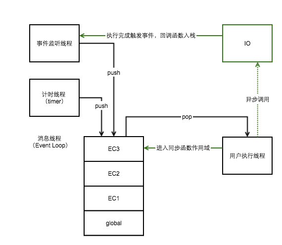
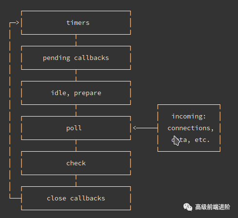
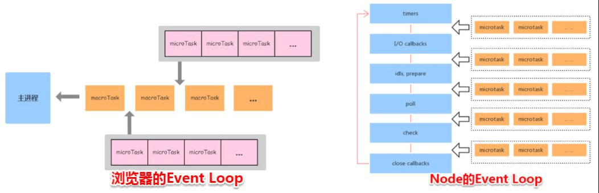
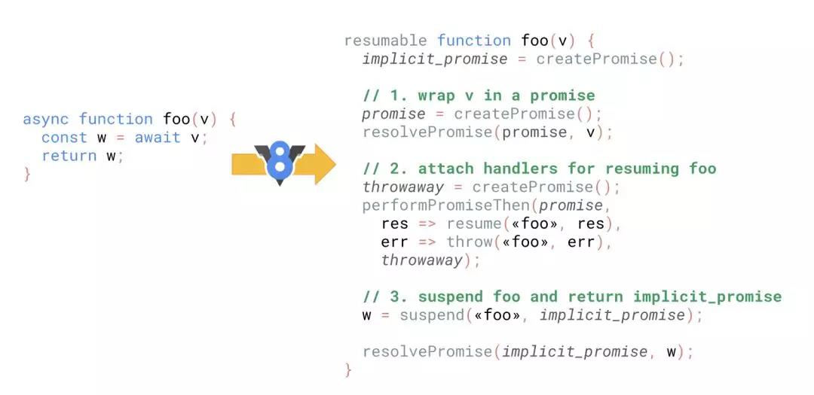

# 浏览器运行机制

## 参考
- https://www.jianshu.com/p/0983e69d58ec
- https://zhuanlan.zhihu.com/p/30744300
- https://juejin.im/entry/59082301a22b9d0065f1a186
- [深入浏览器事件循环](https://zhuanlan.zhihu.com/p/45111890)
- [Tasks, microtasks](https://jakearchibald.com/2015/tasks-microtasks-queues-and-schedules/)
- 

- - -

## 目录
<details>
<summary>展开更多</summary>

* [`javascript并发模型`](#javascript并发模型)
* [`执行上下文和作用域链`](#执行上下文和作用域链)
* [`Event Loop`](#事件循环（Event Loop）)
* [`task`](#任务队列（task）)
* [`await`](#await)
* [`例子`](#交互事件触发)

</details>


## javascript并发模型
- Event Loop - 事件循环
- Call Stack - 调用栈
- Call/task Queue - 回调（又称任务）队列
- Render Step - 渲染节奏
- Web APIs - 宿主环境

- - -

## 执行上下文和作用域链
* 函数被调用
* 创建执行上下文
    * a) 变量、函数和参数
    * b) 作用域链
    * c) this
* 开始执行（在执行上下文上）
    * ...
    * a) 遇到同步函数
    * b) 当前执行上下文入栈
    * c) 重复以上过程
    * ...
* 执行完成，往上一层 执行上下文  返回数据
* 从执行上下文栈pop出一个新的执行上下文执行

### 执行上下文

```js

// 全局
globalContext = {
    VO: [global],
    Scope: [globalContext.VO],
    this: globalContext.VO
}

// 示例方法
var scope = "global scope";
function checkscope(){
    var scope = "local scope";
    function f(){
        return scope;
    }
    return f;
}

var foo = checkscope();
foo();
​
// f
fContext = {
    AO: {
        arguments: {
          length: 0,
        },
    },
    Scope: [AO, checkscopeContext.VO, globalContext.VO],
    this: undefined
}

```

js被解析和执行环境的抽象概念

- 全局执行上下文
- 函数执行上下文
  * 创建对象、函数
  * 作用域链
  * this

### 作用域链
- 作用域在函数定义时就决定了
- 作用域的工作模型，分两种
  1. 词法（静态）作用域（js是这种）
  2. 动态作用域
    * bash脚本

**作用域**

- 全局作用域
- 函数作用域
- 块级作用域

**任务队列**

先进先出

**执行栈**

即js调用栈，具有 LIFO (后进先出) 结构

**作用域链**


- - -

## 回调队列（Call Queue）
- 有序的函数队列
- 异步函数进入调用栈之前，必须通过回调队列

---

## 事件循环（Event Loop）
- 检查调用栈是否空闲，如果是且回调队列里有某个函数，
  则将其从回调队列移入调用栈执行

### 浏览器环境


* 每个线程都有自己的event loop
* 浏览器可以有多个event loop，browsing contexts和web workers就是相互独立的
* 简略循环过程（script -> 清空微任务 -> 宏任务 -> 清空微任务 -> render -> 宏任务 -> 清空微任务 -> render ->...）
  - [示意图](./event_loop.jpeg)
* 完整循环过程
  1. 从macrotask队列选择一个最老的task，如果没有，则执行microtask
  2. 将上面这个task设置为【正在运行的task】
  3. Run: 运行被选择的task
  4. 将【正在运行的task】置为null
  5. 从macrotask队列里移除前边运行的task
  6. 执行microtasks任务检查点
    1. 将microtask checkpoint的flag设为true。
    2. Microtask queue handling: 如果event loop的microtask队列为空，直接跳到第八步（Done）。
    3. 在microtask队列中选择最老的一个任务。
    4. 将上一步选择的任务设为event loop的currently running task。
    5. 运行选择的任务。
    6. 将event loop的currently running task变为null。
    7. 将前面运行的microtask从microtask队列中删除，然后返回到第二步（Microtask queue handling）。
    8. Done: 每一个environment settings object它们的 responsible event loop就是当前的event loop，会给environment settings object发一个 rejected promises 的通知。
    9. 清理IndexedDB的事务。
    10. 将microtask checkpoint的flag设为flase
  7. 更新渲染（Update the rendering）
  8. 如果这是一个worker event loop，但是没有任务在task队列中，并且WorkerGlobalScope对象的closing标识为true，
  则销毁event loop，中止这些步骤，然后进行 run a worker
  9. 返回第一步

### nodeVS浏览器


libuv引擎中的事件循环（宏任务）分为 6 个阶段：
* timers: 执行setTimeout和setInterval中到期的callback。
* I/O callback: 上一轮循环中少数的callback会放在这一阶段执行。
* idle, prepare: 仅在内部使用。
* poll: 最重要的阶段，执行pending callback，在适当的情况下会阻塞在这个阶段。
* check: 执行setImmediate(setImmediate()是将事件插入到事件队列尾部，主线程和事件队列的函数执行完成之后立即执行setImmediate指定的回调函数)的callback。
* close callbacks: 执行close事件的callback，例如socket.on('close'[,fn])或者http.server.on('close, fn)。

#### 执行顺序区别



node10以前
- 执行一个阶段的所有任务
- 执行nextTick队列里面的内容
- 然后执行完微任务队列的内容

node11以后
和浏览器的行为统一了，都是每执行一个宏任务就执行完微任务队列

- - -

## 任务队列（task）
- macrotask(宏任务) `task`，包含：
  * 整体代码script
  * setTimeout（标准4ms），setInterval，setImmediate（node）
  * I/O
  * UI交互事件
  * postMessage（MessageChannel）
- microtask(微任务) `job`，包含：
  * Promise
  * process.nextTick（node）
  * MutaionObserver

- - -

## Web APIs
前端：浏览器、node环境
- setTimeout

- - -

## Render Step
- Structure - 构建 DOM 树的结构
- Layout - 确认每个 DOM 的大致位置（排版）
- Paint - 绘制每个 DOM 具体的内容（绘制）

## 取消动画合并
- 嵌套requestAnimationFrame
- box.offsetWidth // 获取排版样式来打断渲染

## requestAnimationFrame和setTimeout的区别
- setTimeout加入Event Loop，requestAnimationFrame加入渲染队列
- 单位时间，setTimeout会执行多次，requestAnimationFrame严格遵守【执行一次渲染一次】
- setTimeout(callback, 1000 / 60)可以模拟requestAnimationFrame，但不适合


- - -

## 交互事件触发
[参考](https://github.com/Advanced-Frontend/Daily-Interview-Question/issues/7)

### 总结
- 一次事件循环：同步任务 -> 宏任务 -> 微任务 -> render
- 即使是立即resolve/reject，then还是微任务
- 微任务中嵌套的微任务，仍然会在当前事件循环中执行完，
  也即是说，微任务无限嵌套微任务会导致未响应，因为页面一直没有render
- 每个宏任务执行完都会判断，是否有微任务，有就执行，
  也即是说，宏任务无限嵌套宏任务，不会导致未响应，因为会检查微任务&触发render
- await是generator + promise的语法糖，类似Promise执行方式，[参考](../fe-interview/src/common.md#模拟async/await)例
  ```js
  await console.log(1);
  console.log(2);

  // 也就是
  Promise.resolve(console.log(1)).then(() => {
    console.log(2);
  });
  ```


例1：
```js
let button = document.querySelector('#button');

button.addEventListener('click', function CB1() {
  console.log('Listener 1');

  setTimeout(() => console.log('Timeout 1'))

  Promise.resolve().then(() => console.log('Promise 1'))
});

button.addEventListener('click', function CB1() {
  console.log('Listener 2');

  setTimeout(() => console.log('Timeout 2'))

  Promise.resolve().then(() => console.log('Promise 2'))
});

// 手动点击：Listener 1, Promise 1, Listener 2, Promise 2, Timeout 1, Timeout 2
// button.click()：Listener 1, Listener 2, Promise 1,  Promise 2, Timeout 1, Timeout 2
// 解释：手动点击，浏览器不知道下面是否还会有绑定事件，故会先触发事件内的操作，
// 直接用代码click，浏览器的内部实现是把 2 个 listener 都同步执行
```

例2：
```js
/*
script start
script end
先清空microtask
promise1
promise2
setTimeout
*/
console.log('script start');
setTimeout(function() {
  console.log('setTimeout');
}, 0);
Promise.resolve().then(function() {
  console.log('promise1');
}).then(function() {
  console.log('promise2');
});
console.log('script end');
```

例3：
```js
/*
await 将后面对象转为promise
script start
async2 end
Promise
script end
promise1
promise2
async1 end
setTimeout
*/
console.log('script start')

async function async1() {
  await async2()
  console.log('async1 end')
}
async function async2() {
  console.log('async2 end')
}
async1()
setTimeout(function() {
  console.log('setTimeout')
}, 0)

new Promise(resolve => {
  console.log('Promise')
  resolve()
}).then(function() {
  console.log('promise1')
}).then(function() {
  console.log('promise2')
})
console.log('script end')
```

---

## await
通常你会将一个 Promise 传给 await，但实际上你可以 await 任意的 JavaScript 值。
如果 await 之后的表达式的值不是 promise，则将其转换为 promise

```js
async function f() {
  await p
  console.log('ok')
}

// 也表示
function f() {
  return RESOLVE(p).then(() => {
    console.log('ok')
  })
}

```

### 深入理解
- 


