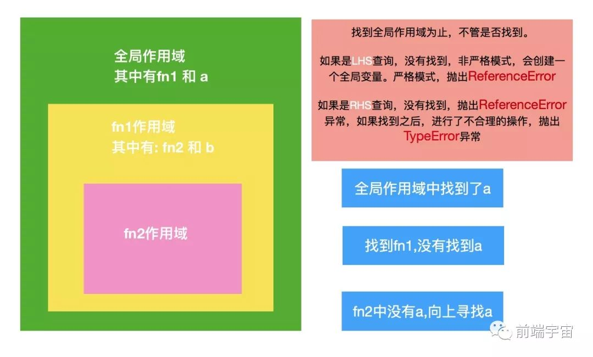

# 浏览器运行机制

## 参考
- https://www.jianshu.com/p/0983e69d58ec
- https://zhuanlan.zhihu.com/p/30744300
- https://juejin.im/entry/59082301a22b9d0065f1a186
- [深入浏览器事件循环](https://zhuanlan.zhihu.com/p/45111890)
- [Tasks, microtasks](https://jakearchibald.com/2015/tasks-microtasks-queues-and-schedules/)
- [通过performance工具了解event loop](https://mp.weixin.qq.com/s/22tS74K5JQr1V98Q4DPqJg)
- [一次搞懂系列](https://mp.weixin.qq.com/s?__biz=MzA5NzkwNDk3MQ==&mid=2650590471&idx=1&sn=eb38606d9fbcf91e443cf5ca063fa89c&chksm=8891dd23bfe654350263cc4c534b775e22f3795581695d220691516b194aef6ee15479c23436&scene=38#wechat_redirect)


- - -

## 目录
<details>
<summary>展开更多</summary>

* [`概念`](#概念)
* [`并发模型`](#javascript并发模型)
* [`执行上下文和作用域链`](#执行上下文和作用域链)
* [`事件循环`](#EventLoop)
* [`事件表`](#EventTable)
* [`任务队列`](#task)
* [`回调队列`](#CallQueue)
* [`await`](#await)
* [`精要`](#宏任务和微任务)
* [`一些题目`](#交互事件触发)

</details>

## 概念
> js线程与GUI线程互斥

---

## javascript并发模型
- Call Stack - 调用栈
- Event Loop - 事件循环
- Event Table - 事件表
- Call/task Queue - 回调（又称任务）队列
- Render Step - 渲染节奏
- Web APIs - 宿主环境

---

## 执行上下文和作用域链
* 函数被调用
* 创建执行上下文
    - a) 词法环境（LexicalEnviroment，以前叫VO）：变量、函数和参数
    - b) 作用域链：Scope
    - c) this
* 开始执行（在执行上下文上）
    - ...
    - a) 遇到同步函数
    - b) 当前执行上下文入栈
    - c) 重复以上过程
    - ...
* 执行完成，往上一层 执行上下文  返回数据
* 从执行上下文栈pop出一个新的执行上下文执行

### 执行上下文

```js

// 全局
globalContext = {
    VO: [global],
    Scope: [globalContext.VO],
    this: globalContext.VO
}

// 示例方法
var scope = "global scope";
function checkscope(){
    var scope = "local scope";
    function f(){
        return scope;
    }
    return f;
}

var foo = checkscope();
foo();

// f
fContext = {
    AO: {
        arguments: {
          length: 0,
        },
    },
    Scope: [AO, checkscopeContext.VO, globalContext.VO],
    this: undefined
}
```

js被解析和执行环境的抽象概念

- 全局执行上下文
- 函数执行上下文
  * 创建对象、函数
  * 作用域链
  * this

### this
- **在代码执行时确定**
- 箭头函数在声明时确定

### 作用域链
>
> 可执行上下文中的词法环境中含有外部词法环境的引用，
>
> 我们可以通过这个引用获取外部词法环境的变量、声明等，
>
> 这些引用串联起来一直指向全局的词法环境，因此形成了作用域链

- **作用域在函数定义时决定**
- 作用域的工作模型，分两种
  1. 词法（静态）作用域（js是这种）
  2. 动态作用域
    * bash脚本

**作用域**

- 全局作用域
- 函数作用域
- 块级作用域

**作用域链**



### 执行执行次序

**EventLoop**

先进先出

**执行栈**

即js调用栈，具有 LIFO (后进先出) 结构

- - -

## CallQueue
- `回调队列`
- 有序的函数队列
- 异步函数进入调用栈之前，必须通过回调队列

---

## EventLoop
- 检查调用栈是否空闲，如果是且`回调队列`里有某个函数，则将其从`回调队列`移入`调用栈`执行

### 浏览器环境


>
> 每个线程都有自己的event loop
>
> 浏览器可以有多个event loop，browsing contexts和web workers就是相互独立的
>

### 简略循环过程

script -> 清空微任务 -> 宏任务 -> 清空微任务 -> render -> 宏任务 -> 清空微任务 -> render -> ...

**简易示意图**


**复杂示意图**


### 完整循环过程
1. 从macrotask队列选择一个最老的task，如果没有，则执行microtask
2. 将上面这个task设置为【正在运行的task】
3. Run: 运行被选择的task
4. 将【正在运行的task】置为null
5. 从macrotask队列里移除前边运行的task
6. 执行microtasks任务检查点
  - 将microtask checkpoint的flag设为true。
  - Microtask queue handling: 如果event loop的microtask队列为空，直接跳到第八步（Done）。
  - 在microtask队列中选择最老的一个任务。
  - 将上一步选择的任务设为event loop的currently running task。
  - 运行选择的任务。
  - 将event loop的currently running task变为null。
  - 将前面运行的microtask从microtask队列中删除，然后返回到第二步（Microtask queue handling）。
  - Done: 每一个environment settings object它们的 responsible event loop就是当前的event loop，会给environment settings object发一个 rejected promises 的通知。
  - 清理IndexedDB的事务。
  - 将microtask checkpoint的flag设为flase
7. 更新渲染（Update the rendering）
8. 如果这是一个worker event loop，但是没有任务在task队列中，并且WorkerGlobalScope对象的closing标识为true，
则销毁event loop，中止这些步骤，然后进行 run a worker
9. 返回第一步

### nodeVS浏览器


> 在nodejs中，底层js引擎用的是v8，易步库是libuv

#### libuv


- libuv提供了一个线程池，可用于运行用户代码并在循环线程中得到通知
- 线程池默认大小为4，可以通过`UV_THREADPOOL_SIZE`设置为任何值（最大128）
- 线程池是全局的，并在所有事件循环中共享
- 导致相对较小的内存开销（128个线程约为1MB），但会增加运行时的线程性能


#### 事件循环阶段

`libuv`引擎中的事件循环（宏任务）分为 6 个阶段：

* `timers`: 执行 setTimeout 和 setInterval 中到期的 callback。
* `I/O callback`: 上一轮循环中少数的 callback 会放在这一阶段执行。
* `idle, prepare`: 仅在内部使用。比如process.nextTick
* `poll`: 最重要的阶段，执行 pending callback，在适当的情况下会阻塞在这个阶段。
* `check`: 执行 setImmediate（`setImmediate`是将事件插入到事件队列尾部，主线程和事件队列的函数执行完成之后立即执行 setImmediate 指定的回调函数）的callback。
* `close callbacks`: 执行close事件的callback，例如socket.on('close'[,fn])或者http.server.on('close, fn)。

#### 执行顺序区别


**node10以前**

- 执行宏任务一个阶段的所有任务
- 执行nextTick队列里面的内容
- 执行微任务队列的内容

**node11以后**

和浏览器的行为统一了，都是每执行一个宏任务就执行完微任务队列

### setImmediate和setTimeout顺序
可以参考[随机顺序探讨](https://segmentfault.com/a/1190000013102056)

`setTimeout`源码可以[参考](https://github.com/nodejs/node/blob/f38bcc2b59ac37554442b84a204ea87e72a132b2/lib/timers.js#L388)，底层的`Timer`对象可以[参考](https://github.com/nodejs/node/blob/master/lib/internal/timers.js#L163)

一共只有两种情况：

1. 进入到timers中，如果时间已到，也就是超时，则会执行回调
2. poll队列为空且代码没有被setImmediate()时，若检测到timers队列中有timer已经超时，则回到timers阶段中，执行超时的timer回调

### 浏览器API支持

- [宏任务 schedule.postTask](https://developer.mozilla.org/en-US/docs/Web/API/Scheduler/postTask)
- [微任务 queueMicrotask](https://developer.mozilla.org/zh-CN/docs/Web/API/queueMicrotask)


---

## EventTable


---

## task

> 任务队列

### macrotask(宏任务) `task`

> 真正的异步

* 整体代码script
* setTimeout（浏览器标准4ms，node标准1ms），setInterval，setImmediate（node）
* I/O
* UI交互事件
* postMessage（MessageChannel）

### microtask(微任务) `job`

> 未来情况的相应行为

* Promise
* process.nextTick（node）
* MutaionObserver

---

## RenderStep

> requestAnimationFrame既不算宏任务也不算微任务

- Structure - 构建 DOM 树的结构
- Layout - 确认每个 DOM 的大致位置（排版）
- Paint - 绘制每个 DOM 具体的内容（绘制）

### requestAnimationFrame

#### 特性
- 由系统来决定回调函数的执行时机，
  比如屏幕刷新率是 75Hz，则间隔就变成 13.3ms，60Hz 对应 16ms
- 屏幕刷新间隔只会执行一次
- 页面处于未激活状态时，requestAnimation 将停止，再次激活，从上次状态恢复

#### 取消动画合并
- 嵌套requestAnimationFrame
- box.offsetWidth // 获取排版样式来打断渲染

#### 和setTimeout的区别
- setTimeout加入Event Loop，requestAnimationFrame加入渲染队列
- 单位时间，setTimeout会执行多次，requestAnimationFrame严格遵守【执行一次渲染一次】
- setTimeout(callback, 1000 / 60)可以模拟requestAnimationFrame，但不适合

---

## 交互事件触发
[参考](https://github.com/Advanced-Frontend/Daily-Interview-Question/issues/7)

### 总结
> 1. `宏任务`是`宏任务` + `微任务`统称，即微任务队列包含在当前宏任务内
>
> 2. 一次事件循环：同步任务 -> 执行一个宏任务 -> 执行所有微任务 -> render
>
> 3. 即使是立即resolve/reject，then还是微任务
>
> 4. 微任务中嵌套的微任务，仍然会在当前事件循环中执行完，
  也即是说，微任务无限嵌套微任务会导致未响应，因为页面一直没有render
>
> 5. 每个宏任务执行完都会判断，是否有微任务，有就执行，
  也即是说，宏任务无限嵌套宏任务，不会导致未响应，因为会检查微任务&触发render
>
> 6. await是generator + promise的语法糖，类似Promise执行方式，[参考](../fe-interview/src/common.md#模拟async/await)

**await就是promise语法糖**

```js
await console.log(1);
console.log(2);

// 也就是
Promise.resolve(console.log(1)).then(() => {
  console.log(2);
});
```

例0：


例1：
```js
let button = document.querySelector('#button');

button.addEventListener('click', function CB1() {
  console.log('Listener 1');
  setTimeout(() => console.log('Timeout 1'))
  Promise.resolve().then(() => console.log('Promise 1'))
});

button.addEventListener('click', function CB1() {
  console.log('Listener 2');
  setTimeout(() => console.log('Timeout 2'))
  Promise.resolve().then(() => console.log('Promise 2'))
});

// 手动点击：Listener 1, Promise 1, Listener 2, Promise 2, Timeout 1, Timeout 2
// button.click()：Listener 1, Listener 2, Promise 1,  Promise 2, Timeout 1, Timeout 2
// 解释：手动点击，浏览器不知道下面是否还会有绑定事件，故会先触发事件内的操作，
// 直接用代码click，浏览器的内部实现是把 2 个 listener 都同步执行
```

例2：
```js
/*
script start
script end
先清空microtask
promise1
promise2
setTimeout
*/
console.log('script start');
setTimeout(function() {
  console.log('setTimeout');
}, 0);
Promise.resolve().then(function() {
  console.log('promise1');
}).then(function() {
  console.log('promise2');
});
console.log('script end');
```

例3：
```js
/*
await 将后面对象转为promise
script start
async2 end
Promise
script end
async1 end
promise1
promise2
setTimeout
*/
console.log('script start')

async function async1() {
  await async2()
  console.log('async1 end')
}
async function async2() {
  console.log('async2 end')
}
async1()
setTimeout(function() {
  console.log('setTimeout')
}, 0)

new Promise(resolve => {
  console.log('Promise')
  resolve()
}).then(function() {
  console.log('promise1')
}).then(function() {
  console.log('promise2')
})
console.log('script end')
```

例4：
```js
console.log(1);
   
setTimeout(() => {
    console.log(2);
}, 0);

process.nextTick(() => {
    console.log(3);
});

setImmediate(() => {
    console.log(4);
});

new Promise((resolve, reject) => {
    console.log(5);
    resolve();
    console.log(6);
}).then(() => {
    console.log(7);
});

Promise.resolve().then(() => {
    console.log(8);

    process.nextTick(() => {
        console.log(9);
    });
});
// 1 5 6 3 7 8 9 2 4
```

---

## await
>
> 通常你会将一个 Promise 传给 await，但实际上你可以 await 任意的 JavaScript 值。
>
> 如果 await 之后的表达式的值不是 promise，则将其转换为 promise
>

```js
async function f() {
  await p
  console.log('ok')
}

// 即为
function f() {
  return RESOLVE(p).then(() => {
    console.log('ok')
  })
}
```

> chrome73之前
> 不判断p是否是promise，会创建3个promise转换

> chrome73（金丝雀）中做了改动
> 如果p已经是promise，则不会再创建Promise包装器

### 深入理解
- 


---

## 宏任务和微任务

[通过performance工具了解event loop](https://mp.weixin.qq.com/s/22tS74K5JQr1V98Q4DPqJg)

> microTask只是Task的一部分


### 宏任务

- requestAnimationFrame（每一帧的**渲染前**触发，一般刷新率在60hz到120hz，所以每次渲染间隔在**8.3~16.7ms**）
- Major GC（垃圾回收）
- requestIdleCallback（每一帧空闲时间触发，优先级较低，可能长时间不被调用，需要设**超时时间**）
- setTimeout（最小间隔4ms，且4ms以下随机触发）
- postMessage（可模拟实现setTimeout(0)的效果）
- MessageChannel
- scheduler.postTask
- Evaluate Script（执行js也是宏任务）

### 微任务

- runAllMicroTasks 部分


### scheduler.postTask

> 真正的调度

[参考](https://medium.com/airbnb-engineering/building-a-faster-web-experience-with-the-posttask-scheduler-276b83454e91)

#### priority

| 优先级        | 描述                                                         | polyfill实现                                  |
| ------------- | ------------------------------------------------------------ | --------------------------------------------- |
| user-blocking | 最高优先级，可能会阻塞用户交互                               | 1. MessageChannel <br />2. setTimeout         |
| user-visible  | 第二优先级，对用户可见，但不会阻塞用户交互。比如：渲染第二屏内容。这是默认优先级 | 同上，加队列控制                              |
| background    | 最低优先级，通常执行不紧急任务，例如记录日志                 | 1. requestIdleCallback <br />2. setTimeout(0) |

**举例**

```js
scheduler.postTask(() => console.log('Hello, postTask'), {
   priority: 'background',
});
```


### MessageChannel

> [react16 scheduler](https://github.com/facebook/react/blob/v16.10.0/packages/scheduler/src/Scheduler.js) 使用 messageChannel 模拟实现了 schedule.postTask。


**举例**

```js
 const schduler = (tasks) => {
     const DEFAULT_RUNTIME = 16;
     const { port1, port2 } = new MessageChannel();
     let sum = 0;

     // 运行器
     const runner = () => {
         const prevTime = performance.now();
         do {
             if (tasks.length === 0) {
                 return;
             }
             const task = tasks.shift();
             const value = task();
             sum += value;
         } while (performance.now() - prevTime < DEFAULT_RUNTIME);
         // 当前分片执行完成后开启下一个分片
         port2.postMessage('');
     };

     port1.onmessage = function () {
         runner();
     };

     port2.postMessage('');
 };
```

