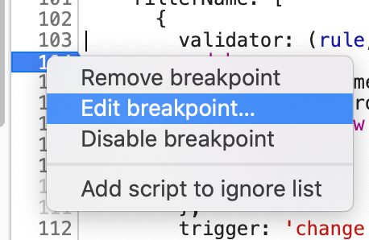

# 开发者模式骚操作

## 参考
- [骚操作](https://juejin.im/post/5ec338436fb9a0432d76e0c4?utm_source=gold_browser_extension)

## 目录

<details>
<summary>展开更多</summary>


* [`开发者菜单`](#开发者菜单)
* [`骚操作`](#骚操作)
* [`chrome调试`](#chrome调试)

## 开发者菜单
```
cmd + shift + p
```

---

## 骚操作

### 元素截图

1. Elements - 选择元素
2. 开发者菜单 - Screenshot Capture node screenshot

### 重发请求

1. Network - 右键一条请求
2. Reply XHR

### designMode

1. 控制台输入
```
document.designMode = 'on';
```
2. 随意修改页面内容

---

## chrome调试

[防止他人恶意调试你的程序](https://juejin.cn/post/7000784414858805256)

### 跳过断点

- 右键断点，编辑断点框中输入false，即可跳过当前断点
- 同样右键，add script ignore list



### 防止他人跳过断点

```js
Function("debugger")();
```

### 快速调试样式

> 设置 style 标签，**style="display: block" contenteditable**

```html
<!DOCTYPE html>
<body>
    <div>来调试我吧~</div>
    <style style="display: block" contenteditable>
        body {
            background-color: rgb(140, 209, 230);
            color: white;
        }
        div {
            background-color: green;
            width: 300px;
            height: 300px;
            line-height: 300px;
            text-align: center;
        }
    </style>
</body>
```

