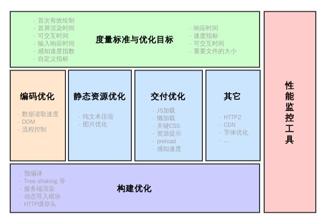
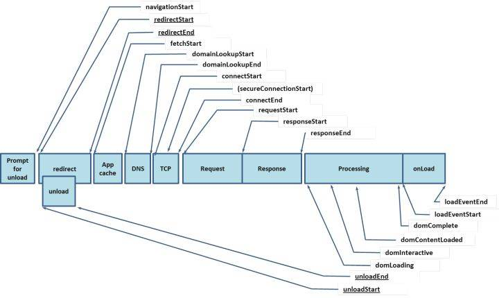

# 性能优化

## 参考
- https://juejin.im/post/5b0b7d74518825158e173a0c
- https://csstriggers.com/
- [web性能优化](https://mp.weixin.qq.com/s?__biz=MzA5NzkwNDk3MQ==&mid=2650587679&idx=1&sn=9698007b09525696896d4cbf135d1ede&scene=21#wechat_redirect)
- [2018性能优化](https://mp.weixin.qq.com/s/Ngj1bVkXRsXx0Ke6EdWkCg)
- [代码体积优化](https://mp.weixin.qq.com/s/1UowJDccbK8FI-VH8S90_Q)
- [2019性能优化](https://github.com/xitu/gold-miner/blob/master/TODO1/front-end-performance-checklist-2019-pdf-pages-1.md)


## 目录
<details>
<summary>展开更多</summary>

* [`职能`](#职能)
* [`思路`](#思路)
* [`硬件加速`](#硬件加速)
* [`优化策略`](#优化策略)
* [`其他`](#其他)
* [`面试回答`](#面试回答)
* [`性能监控统计`](#性能监控统计)

</details>


## 职能
- 布局分层 =》cpu
- 绘制渲染层 =》gpu

## 思路
- 提取需要大量重绘、重排的元素，单独分层

## 硬件加速
- Video元素、WebGL、Canvas、CSS3 3D、CSS滤镜、z-index

## 优化策略
- css读写分离：js不直接操作样式 =》toggleclass或style.cssText
- dom离线更新：display：none或visibility:hidden
- offsetTop =》style.top
- 图片指定宽高

### 资源加载
- 配置超长时间的本地缓存(cach-control/expires) - 节省带宽，提高性能
- 采用内容摘要（文件内容）作为缓存更新依据  - 精确的缓存控制
- 静态资源CDN部署 - 优化网络请求
- 资源发布路径实现非覆盖式发布(aa.ad90j2b.js，aa.bdieojad.js资源多个版本共存) - 平滑升级
- 与首屏无关的样式可设成非阻塞性css
```html
<!-- 设置media="print" -->
<!-- 这样资源的优先级就会变成lowest -->
<link href="xxxx.css" rel="stylesheet" media="print">
```

## chrome performance
- Rendering（重排）
- Painting（重绘）

## 其他
- resize 和 scroll 事件也是至少 16ms 才会触发一次，并且自带节流功能

## 面试回答
[参考](https://github.com/rccoder/blog/issues/34)

- 设置缓存（基于请求头）
  * [参考](./页面过程与浏览器缓存.md#缓存分类)
- DNS Prefetch
  告知浏览器可以提前进行dns解析
  ```html
  <link rel="dns-prefetch" href="//img.alicdn.com">
  ```
- 域名收敛
- 加载合适的图片
  * 图片裁剪
  * webp
  * 不透明图片尽量是jpg（png尺寸较大）
  * 动效图尽量用apng 或者 Lottie 代替
  * 很小的图片用base64，icon
- 不要展示【绝对的Loading/占位】
  * 网速比较快时（比如几百ms以内），则不必要展示loading
- 资源combo
  * xx.com/combo?a.js,b.js,c.js,c.js
- 在线 Shim
  * 服务器根据浏览器特性返回不同js（有/无polyfill）
  * https://polyfill.io/v3/polyfill.min.js?features=Object.assign
- 分离静态资源
  * CDN（不需要cookie）
- 使用requestAnimationFrame实现60FPS动画
- 节流&防抖
- localstorage
- gzip&BBR拥塞控制算法（chrome开发）
  * TCP使用的是基于丢包的拥塞控制算法，BBR会对此做优化
- Service Worker&Web Worker

## 图片参考



---

## 性能监控统计
[前端监控](https://juejin.im/post/5b7a50c0e51d4538af60d995#heading-0)


- 页面加载
  * domComplete
  ```js
  const [{ domComplete }] = performance.getEntriesByType('navigation');
  ```
- 资源加载
  * resource
  ```js
  const [{ startTime, responseEnd }] = performance.getEntriesByType('resource');
  const loadTime = responseEnd - startTime;
  ```

