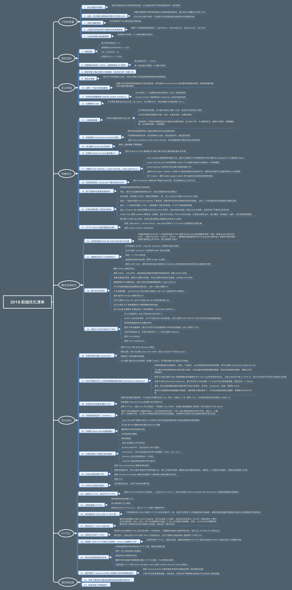

# 性能优化

## 参考
- https://juejin.im/post/5b0b7d74518825158e173a0c
- https://csstriggers.com/
- [web性能优化](https://mp.weixin.qq.com/s?__biz=MzA5NzkwNDk3MQ==&mid=2650587679&idx=1&sn=9698007b09525696896d4cbf135d1ede&scene=21#wechat_redirect)
- [2018性能优化](https://mp.weixin.qq.com/s/Ngj1bVkXRsXx0Ke6EdWkCg)
- [代码体积优化](https://mp.weixin.qq.com/s/1UowJDccbK8FI-VH8S90_Q)
- [2019性能优化](https://github.com/xitu/gold-miner/blob/master/TODO1/front-end-performance-checklist-2019-pdf-pages-1.md)
- [京喜小程序优化指南](https://segmentfault.com/a/1190000022164644)


## 目录
<details>
<summary>展开更多</summary>

* [`职能`](#职能)
* [`思路`](#思路)
* [`硬件加速`](#硬件加速)
* [`优化策略`](#优化策略)
* [`其他`](#其他)
* [`面试回答`](#面试回答)
* [`性能监控统计`](#性能监控统计)
* [`按需处理`](#按需处理)

</details>


## 职能
- 布局分层 =》cpu
- 绘制渲染层 =》gpu

## 思路
- 提取需要大量重绘、重排的元素，单独分层

## 硬件加速
- Video元素、WebGL、Canvas、CSS3 3D、CSS滤镜、z-index

## 优化策略
- css读写分离：js不直接操作样式 =》toggleclass或style.cssText
- dom离线更新：display：none或visibility:hidden
- offsetTop =》style.top
- 图片指定宽高

### 资源加载
- 配置超长时间的本地缓存(cach-control/expires) - 节省带宽，提高性能
- 采用内容摘要（文件内容）作为缓存更新依据  - 精确的缓存控制
- 静态资源CDN部署 - 优化网络请求
- 资源发布路径实现非覆盖式发布(aa.ad90j2b.js，aa.bdieojad.js资源多个版本共存) - 平滑升级
- 与首屏无关的样式可设成非阻塞性css
```html
<!-- 设置media="print" -->
<!-- 这样资源的优先级就会变成lowest -->
<link href="xxxx.css" rel="stylesheet" media="print">
```

---

## chrome performance
- Rendering（重排）
- Painting（重绘）

---

## 其他
- resize 和 scroll 事件也是至少 16ms 才会触发一次，并且自带节流功能

---

## 面试回答
[参考](https://github.com/rccoder/blog/issues/34)

### 加载

#### 首屏绘制
> FP
> 白屏时间 = firstPaint - performance.timing.navigationStart

- loading
- 服务端渲染
- http2
- 浏览器缓存（Cach-Control、Last-modified、Etag）
- [webpack-splitChunk](../webpack/README.md#splitChunks)

#### 首次有意义绘制
> FMP

- 骨架屏
  * [antd-skeleton](https://ant.design/components/skeleton-cn/)
  * [vue-skeleton](https://github.com/lavas-project/vue-skeleton-webpack-plugin)

#### 可交互时间
> TTI
> 可交互时间 = FMP && DOMContentLoader事件触发 && 页面视觉加载85%

- tree shake
  * es6 module
- polyfill
  * 服务商通过识别不同浏览器的浏览器User Agent，使得服务器能够识别客户使用的操作系统及版本、CPU 类型、浏览器及版本、浏览器渲染引擎、浏览器语言、浏览器插件等，然后根据这个信息判断是否需要加载 polyfill
  * vue-cli生成的模板自带的，其他可能需要自己手动注入
  * ```html
    <script src="https://cdn.polyfill.io/v2/polyfill.min.js"></script>
    ```
- 动态加载es6代码
  * 新版本api享受浏览器厂商性能优化红利
  * ```html
    <script type="module">
      // ...
    </script>
    ```
- 路由拆分
  * vue
    ```js
    new Router({
      {
        path: '/',
        component: import('@component/login'),
      }
    })
    ```
  * react
    + react.lazy
    + react loadable
- 组件预加载
- 组件懒加载
  * 触发操作后加载

### 执行
- 设置缓存（基于请求头）
  * [参考](./页面过程与浏览器缓存.md#缓存分类)
- DNS Prefetch
  告知浏览器可以提前进行dns解析
  ```html
  <link rel="dns-prefetch" href="//img.alicdn.com">
  ```
- 域名收敛
- 加载合适的图片
  * 图片裁剪
  * webp
  * 不透明图片尽量是jpg（png尺寸较大）
  * 动效图尽量用apng 或者 Lottie 代替
  * 很小的图片用base64，icon
- 不要展示【绝对的Loading/占位】
  * 网速比较快时（比如几百ms以内），则不必要展示loading
- 资源combo
  * xx.com/combo?a.js,b.js,c.js,c.js
- 在线 Shim
  * 服务器根据浏览器特性返回不同js（有/无polyfill）
  * https://polyfill.io/v3/polyfill.min.js?features=Object.assign
- 分离静态资源
  * CDN（不需要cookie）
- 使用requestAnimationFrame实现60FPS动画
- 节流&防抖
- localstorage
- gzip&BBR拥塞控制算法（chrome开发）
  * TCP使用的是基于丢包的拥塞控制算法，BBR会对此做优化
- Service Worker&Web Worker

---

## 图片参考




---

## 性能监控统计
[前端监控](https://juejin.im/post/5b7a50c0e51d4538af60d995#heading-0)


- 页面加载
  * domComplete
  ```js
  const [{ domComplete }] = performance.getEntriesByType('navigation');
  ```
- 资源加载
  * resource
  ```js
  const [{ startTime, responseEnd }] = performance.getEntriesByType('resource');
  const loadTime = responseEnd - startTime;
  ```

---

## 按需处理

分多种
1. 图表渲染
2. 数据加载
3. 等等

按需处理需要结合各种激活态，详见下图：


### 数据加载
以`vue`为例，可以结合[datapanel](../vue/datapanel/README.md)做，主要思想是对组件做数据请求的代理，请求中也会有各种状态的$emit

### 图表渲染
以`echart`为例，图表初始化以后，默认会做`requestAnimationRequst`，如果页面存在多个图表，即使图不在可视区，轮询动画也不会停止，当然，切换tab后就停止了（这是`requestAnimationRequst`的最大特性）

所以，结合`IntersectionObserverHelper`和页面焦点事件（focus/blur），手动触发`echart`的停止动画，同样以`vue`为例

```js
import { IntersectionObserverHelper } from '/dataPanel';

const {
  watch,
  unwatch,
  isActive,
} = IntersectionObserverHelper;

{
  mounted() {
    this.init();
  },
  beforeDestroy() {
    this.unregister();
  },
  methods: {
    init() {
      window.addEventListener('focus', this.handleFocusEvent);
      window.addEventListener('blur', this.handleBlurEvent);
      watch(this, this.handleFocusEvent, this.handleBlurEvent);
    },
    unregister() {
      window.removeEventListener('focus', this.handleFocusEvent);
      window.removeEventListener('blur', this.handleBlurEvent);
      unwatch(this, this.handleFocusEvent, this.handleBlurEvent);
    },
    handleFocusEvent(activeState) {
      if (this.myChart && (activeState === true || isActive(this.$el))) {
        const { _zr } = this.myChart;
        const { animation } = _zr || {};
        const { _running } = animation || {};
        if (!_running && animation.start) {
          animation.start();
        }
      }
    },
    handleBlurEvent() {
      if (this.myChart) {
        const { _zr } = this.myChart;
        const { animation } = _zr || {};
        const { _running } = animation || {};
        if (_running && animation.stop) {
          animation.stop();
        }
      }
    },
  },
}
```

以上，可以用`mixin`方式，绑定到图表组件上

**由于`IntersectionObserverHelper`尚处于 draft 阶段，万一将来有变，考虑监听滚动事件来 polyfill**
