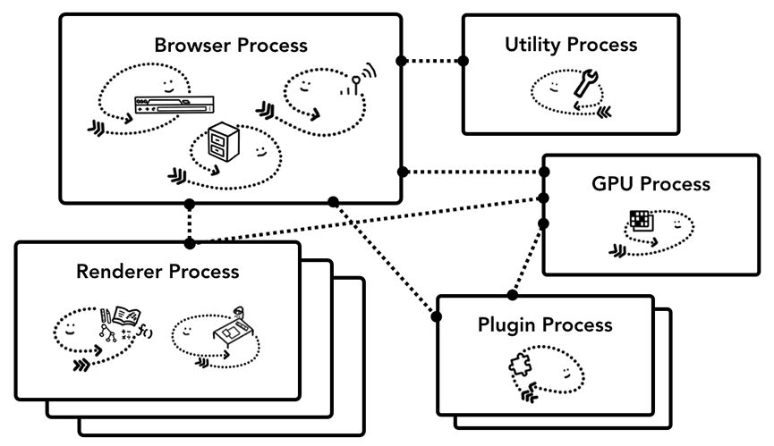

# 现代浏览器

## 参考
- [深入理解现代浏览器](https://mp.weixin.qq.com/s/LkKNjrkx1V32lCjv92Cuuw)

## 方面
- 架构
- 导航
- 渲染
- 交互

## 架构


- 浏览器进程
- GPU
- 渲染
- 插件

### chrome多进程设计
- 一个tab一个进程，低配机器上（达到上限后），一个进程会处理同个站点多个tab
- 站点隔离
  * 每个跨站点iframe都运行一个独立的渲染器进程

---

## 导航

### 浏览器导航步骤

- 处理输入
  * 判断是url或是搜索内容
- 开始导航
  * DNS、TLS连接等
- 读取响应
  * 根据响应的前几个字节，Content-Type判断响应类型，分配给不同进程处理（html -> 渲染进程，zip -> 下载管理器）
- 联系渲染器进程
  * 目前有优化（当确认导航地址后，预备一个渲染器进程，响应就能渲染，除非重定向）
- 提交导航
  * 开始文档加载阶段，更新地址栏信息（安全图标、加载图标），页面入历史栈，历史写入磁盘
- 初始加载完成
  * 完成渲染后，停止tab上的加载图标

### 其他情况
- 加载完又跳转其他url
  * beforeUnload
  * unload
- 缓存处理
  * Service Worker检测（取本地缓存or请求）

---

## 渲染
参考[过程详述](./页面过程与浏览器缓存.md#过程详述)

**创建分层树**

will-change

---

## 交互

### 非快速滚动区
合成器线程会在该区域发生事件时把事件发送给主线程，
如果事件发生在这个区域外，那合成器线程会继续合成新帧而不会等待主线程

document.body的全局事件绑定，导致整个页面被标记成非快速滚动区，无关元素也会导致与主线程不必要的交互

解决办法：passive: true 或 touch-action
```js
document.body.addEventListener('pointermove', evt => {
  if (evt.cancelable) {
    evt.preventDefault(); // 阻止原生滚动
    /*
    * 其他操作
    */
  }
}, { passive: true });
```
或
```css
#area {
  touch-action: pan-x;
}
```

### passive
[参考](https://www.cnblogs.com/ziyunfei/p/5545439.html)

- chrome56后，`addEventListener`第三个参数支持传对象
- 默认值都是false，表示允许`evt.preventDefault()`
- 当`passive: true`时，`evt.preventDefault()`无效 + console.warn

#### 产生原因
>
> 1. 浏览器无法预知一个事件是否被`preventDefault`，直到事件监听被执行
> 2. 事件监听（即使是空函数）有执行耗时，高频触发可能造成页面卡顿（比如touchstart）
> 3. 希望注册监听时，即告知浏览器该事件会不会`preventDefault`
>

#### 例子
```js
addEventListener(type, listener, {
  // 等同于之前useCapture效果
  capture: false,
  // 该监听器是一次性的，执行后自动被removeEventListener
  once: false,
  passive: false,
});
```

#### 移除监听
- 浏览器存储事件监听的 key，由`事件类型`、`监听函数`、`是否捕获`，三部分组成
- `passive`和`once`可用值反复设置无效（和规则相违），总是以第一次设置为准
- 当然，`capture`还是要的

```js
// passive
addEventListener("foo", listener, {passive: true});
addEventListener("foo", listener, {passive: false}); // 这句无效
removeEventListener("foo", listener);

// once
addEventListener("foo", listener, {once: true});
addEventListener("foo", listener, {once: false}); // 这句无效
removeEventListener("foo", listener);

// capture
addEventListener("foo", listener, {capture: true});
removeEventListener("foo", listener, {capture: true});
// 或者这样
removeEventListener("foo", listener, true);

```

#### polyfill
```js
// 特性检测
var supportsPassiveOption = false;
try {
  var opts = Object.defineProperty({}, 'passive', {
    get: function() {
      supportsPassiveOption = true;
    }
  });
  // 如果事件监听不支持第三个为 options，会抛错
  window.addEventListener('test', null, opts);
} catch (e) {}

// 使用
if (supportsPassiveOption) {
  // 支持
} else {
  // 不支持
}
```


