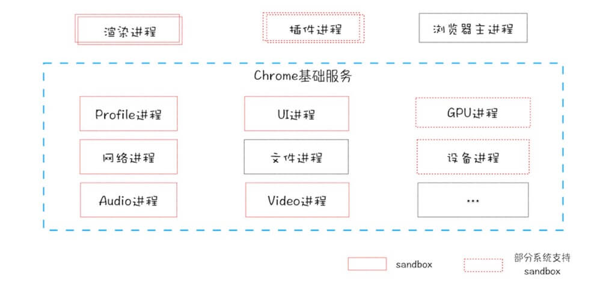

# 现代浏览器

## 参考
- [深入理解现代浏览器](https://mp.weixin.qq.com/s/LkKNjrkx1V32lCjv92Cuuw)
- [chrome94优化了合成层检测逻辑](https://mp.weixin.qq.com/s/lNu6PYZWDUoicQXVwSVF-Q)
- [浏览器运行原理](https://mp.weixin.qq.com/s/PhuhUtQGz0uPxVrtNB4TCA)
- [chrome NetWork骚操作](https://mp.weixin.qq.com/s/UhewqhW6pnUQuAqWYhtcGg)

## 目录

[TOC]


## 进程
> - 浏览器是多进程（如下）
> - 单个Tab算一个进程
> - Tab进程内为多线程
>   - JS引擎主线程（Main thread、worker thread）
>   - GUI渲染线程
>   - 事件触发线程
>   - 定时器线程（setTimeout、setInterval）
>   - 异步请求线程（XMLHttpRequest）
>   - 合成线程（Compositor，将图块转成位图）
>   - IO线程（和其他进程通信）
>   - Raster（光栅）线程
> - HTML，DOM树，CSSOM树，JS解析执行，渲染树等都在主线程。

**包括：**

- 浏览器主进程
- Renderer（UI）
- GPU
- 网络
- 插件
- 存储

## 浏览器工作原理与实践

### 架构

> Q：如何查看chrome进程？
>
> A：更多工具 -> 任务管理器



### 单进程

**不稳定**

任何一个线程故障都会导致浏览器奔溃

**不流畅**

- js脚本一旦出现死循环，渲染线程就无法更新页面
- 内存泄漏也会导致不流畅

**不安全**

进程插件用c++编写，涉及系统层面操作

### 多进程

**稳定**

- 通常来讲，一个tab对一个渲染进程
- 如果几个页面属于**同一站点**（根域名、协议相同），则**复用一个渲染进程**，这是chrome的默认策略**process-per-site-instance**
- GPU、网络、浏览器、插件、扩展进程则被公用

**流畅**

js死循环仅影响当前tab，该卡还是卡

**安全**

各进程使用沙箱模式，而对于系统权限，全都通过浏览器主进程获取，避免单独操作

---

## 导航

### 浏览器导航步骤

- 处理输入
  * 判断是url或是搜索内容
- 开始导航
  * DNS、TLS连接等
- 读取响应
  * 根据响应的前几个字节，Content-Type判断响应类型，分配给不同进程处理（html -> 渲染进程，zip -> 下载管理器）
- 联系渲染器进程
  * 目前有优化（当确认导航地址后，预备一个渲染器进程，响应就能渲染，除非重定向）
- 提交导航
  * 开始文档加载阶段，更新地址栏信息（安全图标、加载图标），页面入历史栈，历史写入磁盘
- 初始加载完成
  * 完成渲染后，停止tab上的加载图标

### 其他情况
- 加载完又跳转其他url
  * beforeUnload
  * unload
- 缓存处理
  * Service Worker检测（取本地缓存or请求），详情[Service Worker: 简介](https://developers.google.com/web/fundamentals/primers/service-workers)

---

## 渲染
参考[过程详述](./页面过程与浏览器缓存.md#过程详述)

**创建分层树**

will-change

---

## 交互

### 非快速滚动区
合成器线程会在该区域发生事件时把事件发送给主线程，
如果事件发生在这个区域外，那合成器线程会继续合成新帧而不会等待主线程

document.body的全局事件绑定，导致整个页面被标记成非快速滚动区，无关元素也会导致与主线程不必要的交互

解决办法：passive: true 或 touch-action
```js
document.body.addEventListener('pointermove', evt => {
  if (evt.cancelable) {
    evt.preventDefault(); // 阻止原生滚动
    /*
    * 其他操作
    */
  }
}, { passive: true });
```
或
```css
#area {
  touch-action: pan-x;
}
```

### passive
[参考](https://www.cnblogs.com/ziyunfei/p/5545439.html)

- chrome56后，`addEventListener`第三个参数支持传对象
- 默认值都是false，表示允许`evt.preventDefault()`
- 当`passive: true`时，`evt.preventDefault()`无效 + console.warn

#### 产生原因
> 1. 浏览器无法预知一个事件是否被`preventDefault`，直到事件监听被执行
> 2. 事件监听（即使是空函数）有执行耗时，高频触发可能造成页面卡顿（比如touchstart）
> 3. 希望注册监听时，即告知浏览器该事件会不会`preventDefault`
>

#### 例子
```js
addEventListener(type, listener, {
  // 等同于之前useCapture效果
  capture: false,
  // 该监听器是一次性的，执行后自动被removeEventListener
  once: false,
  passive: false,
});
```

#### 移除监听
- 浏览器存储事件监听的 key，由`事件类型`、`监听函数`、`是否捕获`，三部分组成
- `passive`和`once`可用值反复设置无效（和规则相违），总是以第一次设置为准
- 当然，`capture`还是要的

```js
// passive
addEventListener("foo", listener, {passive: true});
addEventListener("foo", listener, {passive: false}); // 这句无效
removeEventListener("foo", listener);

// once
addEventListener("foo", listener, {once: true});
addEventListener("foo", listener, {once: false}); // 这句无效
removeEventListener("foo", listener);

// capture
addEventListener("foo", listener, {capture: true});
removeEventListener("foo", listener, {capture: true});
// 或者这样
removeEventListener("foo", listener, true);

```

#### polyfill
```js
// 特性检测
var supportsPassiveOption = false;
try {
  var opts = Object.defineProperty({}, 'passive', {
    get: function() {
      supportsPassiveOption = true;
    }
  });
  // 如果事件监听不支持第三个为 options，会抛错
  window.addEventListener('test', null, opts);
} catch (e) {}

// 使用
if (supportsPassiveOption) {
  // 支持
} else {
  // 不支持
}
```

---

## 开发者工具

- [chrome devtool骚操作](https://mp.weixin.qq.com/s/zwmFoz0bf8O04fwCLjMiLA)

### network 过滤器

- has-response-header：过滤响应包含某个 header 的请求
- method：根据 GET、POST 等请求方式过滤请求
- domain: 根据域名过滤
- status-code：过滤响应码是 xxx 的请求，比如 404、500 等
- larger-than：过滤大小超过多少的请求，比如 100k，1M
- mime-type：过滤某种 mime 类型的请求，比如 png、mp4、json、html 等
- is：过滤某种状态的请求，比如 from cache 从缓存拿的，比如 running 还在运行的
- resource-type：根据请求分类来过滤，比如 document 文档请求，stylesheet 样式请求、fetch 请求，xhr 请求，preflight 预检请求
- cookie-name：过滤带有某个名字的 cookie 的请求


---

## 问题

### Q：如果多个tab页用同一个渲染进程，一个tab下写死循环，结果如何？

用同一个渲染进程，也就是说公用一个主线程，一个tab下死循环，会影响线程中所有页面