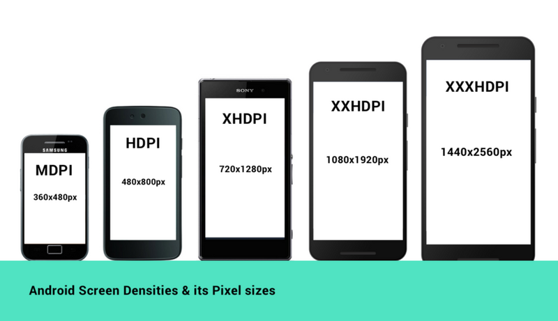
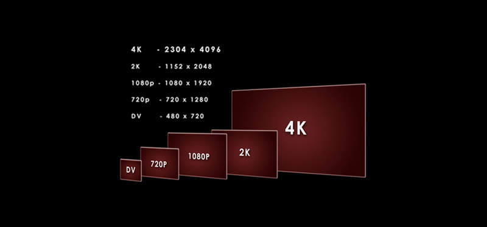
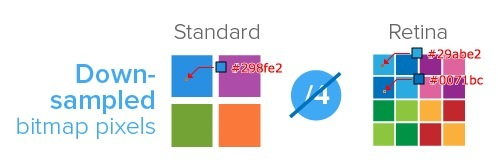

# 移动端适配

## 参考
- [移动端名词+适配](https://segmentfault.com/a/1190000019207842)


## 目录
<details>
<summary>展开更多</summary>

* [`专有名词`](#专有名词)
* [`通用适配方案`](#通用适配方案)
* [`其他适配`](#其他适配)

</details>

## 专有名词

### 英寸
1英寸 = 2.54cm

### 像素
- CSS像素
- 物理像素

```text
例：有一个750 * 1134像素的视觉稿，pc端布局视口通常情况下为980px，
移动端以iphone6为例，分辨率为375 * 667，计算方式如下：

PC端：1 CSS像素 = 物理像素 / 分辨率 = 750 / 980 = 0.76px
移动端：1 CSS像素 = 物理像素 / 分辨率 = 750 / 375 = 2px
```

### 分辨率
- 屏幕
- 图片

例：一张图片分辨率为800 x 400，表示

垂直像素点800，水平像素点400

### PPI
Pixel Per Inch，每英寸包括的像素数

PPI越高，图片质量越高，或屏幕越清晰

**计算方式**

Math.sqrt(Math.pow(水平像素点, 2), Math.pow(垂直像素点, 2)) / 尺寸

### DPI
Dot Per Inch，每英寸包括的点数。

描述图片和屏幕时，DPI应该和PPI是等价的

### DP
device pixel，设备像素

### DIP
设备独立像素

比如Retina屏，两倍的物理像素去渲染

### DPR
device pixel ratio，设备像素比，即物理像素和设备独立像素的比值



### k和p


**p**

屏幕纵向的像素个数，比如1080p表示1920*1080

**k**

屏幕横向含多少1024个像素，比如4k表示4096


### 视口
- 布局视口
- 视觉视口

**布局视口**

浏览器窗口大小（pc）

clientWidth / clientHeight

**视觉视口**

用户通过屏幕真实看到的区域

window.innerWidth / innerHeight

**理想视口**

当页面缩放比例为100%时，CSS像素 = 设备独立像素，理想视口 = 视觉视口

---

## 通用适配方案

### vh、vw方案
- vw(Viewport's width)：1vw等于视觉视口的1%
- vh(Viewport's height) : 1vh 为视觉视口高度的1%
- vmin : vw 和 vh 中的较小值
- vmax : 选取 vw 和 vh 中的较大值

**缺点**

- px转换成vw不一定能完全整除，因此有一定的像素差
- 当容器使用vw，margin采用px时，很容易造成整体宽度超过100vw（可用padding + calc避免）


### sv、lv、dv方案

> chrome108支持

sv：代表小视口（浏览器出现状态栏时）的单位有`sv`前缀。单位为`svw`、`svh`、`svi`、`svb`、`svmin`和`svmax`

lv：代表大视口（浏览器无状态栏时）的单位有`lv`前缀。单位为`lvw`、`lvh`、`lvi`、`lvb`、`lvmin`和`lvmax`

dv：动态视口，出现状态栏时=sv，无状态栏时=lv

---

## 其他适配

### iphonex

#### viewport-fit
* contain: 可视窗口完全包含网页内容
* cover：网页内容完全覆盖可视窗口

#### env、constant
* safe-area-inset-left：安全区域距离左边边界距离
* safe-area-inset-right：安全区域距离右边边界距离
* safe-area-inset-top：安全区域距离顶部边界距离
* safe-area-inset-bottom：安全区域距离底部边界距离

**注**

constant在iOS < 11.2的版本中生效，env在iOS >= 11.2的版本中生效，要同时设置

```css
body {
  padding-bottom: constant(safe-area-inset-bottom);
  padding-bottom: env(safe-area-inset-bottom);
}
```

### 横屏适配

**resize**

```js
window.addEventListener("resize", ()=>{
    if (window.orientation === 180 || window.orientation === 0) { 
      // 正常方向或屏幕旋转180度
        console.log('竖屏');
    };
    if (window.orientation === 90 || window.orientation === -90 ){ 
       // 屏幕顺时钟旋转90度或屏幕逆时针旋转90度
        console.log('横屏');
    }  
});
```

**@media**

```css
@media screen and (orientation: portrait) {
  /*竖屏...*/
} 
@media screen and (orientation: landscape) {
  /*横屏...*/
}
```

### 折叠屏
[折叠屏适配指南](https://mp.weixin.qq.com/s/SxA8E5IG5r9u2LoaNdxArw)

* fold-top
* fold-left
* fold-width: 两个折叠屏间折叠宽度
* fold-height

### 图片模糊适配
1像素对应屏幕上1物理像素，才能达到最佳的显示效果。

**dpr > 1造成图片模糊**



#### 适配方案
- media
  ```css
  .avatar{
      background-image: url(conardLi_1x.png);
  }
  @media only screen and (-webkit-min-device-pixel-ratio:2){
      .avatar{
          background-image: url(conardLi_2x.png);
      }
  }
  @media only screen and (-webkit-min-device-pixel-ratio:3){
      .avatar{
          background-image: url(conardLi_3x.png);
      }
  }
  ```
- image-set
 ```css
  .avatar {
    background-image: -webkit-image-set( "conardLi_1x.png" 1x, "conardLi_2x.png" 2x );
  }
 ```
- srcset
  ```html
  
  ```
- 使用svg
  * 可缩放矢量图（Scalable Vector Graphics）
  * 体积小，放多大都不会失真

