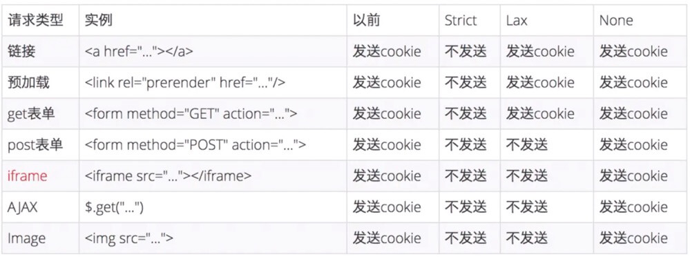

# 网络安全

## 目录

<details>
<summary>展开更多</summary>

* [`CSP`](#CSP)
* [`XSS`](#XSS)
* [`CSRF`](#CSRF)
* [`SQL注入`](#SQL注入)
* [`中间人劫持`](#中间人劫持)
* [`window.opener`](#window.opener)
* [`抓包工具`](#抓包工具)

</details>

## 参考

- https://www.zhihu.com/question/26628342/answer/33572866
- [6 种漏洞](https://mp.weixin.qq.com/s/Umd-HAbUsLBoxEOIrdZ8vg)
- [csrf 防范](https://juejin.im/post/5bc009996fb9a05d0a055192)
- [安全性请求头部](../http/README.md#安全性请求头部)

---

## CSP
> 防御xss等数据注入型攻击

### nonce原理

> 在 HTTP Header 中声明一个随机字符串，在 HTML 中的 JavaScript 标签上带了 nonce 属性，
  nonce 的值和 Header 指定的一致才会执行对应的 JavaScript 代码

### 客户端操作

```html
// .html or template
<script nonce="aaaa" >alert('aaaa')</script>
<script nonce="bbbb" >alert('bbbb')</script>
```

### 服务端操作

```js
// 方式一：koa
// app.js
app.user(async function(ctx) {
  ctx.set('Content-Security-Policy', "script-src 'nonce-aaaa'");
  // ...
});

// 方式二：nginx
// nginx.conf
location / {
  add_header Content-Security-Policy "script-src 'nonce-aaaa'";
}
```

### 安全策略检查

1. 防 xss
2. 协议过渡
3. 非安全资源告警

```html
<!-- 用于预防XSS -->
<meta http-equiv="Content-Security-Policy" content="script-src 'self'; style-src nos.netease.com kaola.com;" />

<!-- 用于站点请求协议升级过渡（http转https） -->
<meta http-equiv="Content-Security-Policy" content="upgrade-insecure-requests">
<!-- 阻止Mixed Content -->
<!-- 混合内容指的是https页面加载http内容 -->
<!-- 浏览器本身就会拦截，脚本（直接报错），视频、音频等资源（报警） -->
<meta http-equiv="Content-Security-Policy" content="block-all-mixed-content" />
```

还有一种 [integrity](#integrity) 策略

### crossorigin

> 如果页面引用的跨域脚本执行出错，页面 window.onerror 捕获的错误只有【Script error.】

**解决方法**

- <script crossorigin src="xxxx"></script>
- js 响应头加上 'Access-Control-Allow-Origin': '*'

### integrity
[参考](https://developer.mozilla.org/zh-CN/docs/Web/Security/%E5%AD%90%E8%B5%84%E6%BA%90%E5%AE%8C%E6%95%B4%E6%80%A7)

> CSP 的一种策略，对资源内容 base64 + sha-384 后，算出的摘要哈希值；浏览器读到这个属性时，在执行脚本（样式）之前，比对文件内容的哈希值是否和期望的哈希值一致，来决定是否执行。
>
> 有类似的[在线工具](https://srihash.org/)


```html
<script src="https://example.com/example-framework.js"
  integrity="sha384-oqVuAfXRKap7fdgcCY5uykM6+R9GqQ8K/uxy9rx7HNQlGYl1kPzQho1wx4JwY8wC"
  crossorigin="anonymous"></script>
```

#### 做法

csp 头部新增`require-sri-for`，表示资源必须有`integrity`值且被验证通过，才能加载

```
// js可以这样加
Content-Security-Policy: require-sri-for script;

// 样式表可以这样加
Content-Security-Policy: require-sri-for style;

// 或两者都加
```

#### csp 头部

[mdn 参考](https://developer.mozilla.org/en-US/docs/Web/HTTP/Headers/Content-Security-Policy)

#### 浏览器处理

1. 当浏览器在`<script>`或者`<link>`标签中遇到 integrity 属性之后，会在执行脚本或者应用样式表之前对比所加载文件的哈希值和期望的哈希值
2. 当脚本或者样式表的哈希值和期望的不一致时，浏览器必须拒绝执行脚本或者应用样式表，并且必须返回一个网络错误说明获得脚本或样式表失败

### 参考

1. https://www.zhihu.com/question/21979782/answer/42920769
2. [xss](http://www.cnblogs.com/TankXiao/archive/2012/03/21/2337194.html)

---

## XSS

> Cross-Site Scripting（跨站脚本攻击）

### 原理

- 攻击者通过在目标网站上注入恶意脚本，使之在用户的浏览器上运行

### 注入方式

* 恶意内容以`<script />`注入 HTML 中内嵌的文本（input）
  - escape
* 标签的 href、src 等属性中，包含 javascript: jAvaScript: 等可执行代码
* onload、onerror、onclick 等事件中，注入不受控制代码
* background-image:url("javascript:..."); （新版本浏览器已经可以防范）
* css-expression （新版本浏览器已经可以防范）

### 分类

|   | 存储型 | 反射型 | DOM 型 |
| - | -: | :-: | :-: |
| 存储区 | 数据库 | URL | 数据库/url/前端存储 |
| 插入点 | HTML | HTML | js |

* 存储型
  - **刷数据库**
  - 输入框中提交恶意代码到数据库，日后访问的话，
    服务端可能会取出恶意代码返回客户端执行
  - 恶意代码会加载外部代码执行更复杂的逻辑
  - 比如坛发帖、商品评论、用户私信等
* 反射型
  - **刷接口**
  - 构造特殊 url（通常是个接口），包含恶意代码，服务端返回给客户端后执行
  - 比如网站搜索、跳转等
* DOM 型
  - **刷页面**
  - 构造特殊 url，客户端接收、执行
  - 和反射型区别：DOM 型是 js 执行，是前端漏洞，其他两种是服务端漏洞

### 防御

- 针对 HTML 属性、HTML 文字内容、HTML 注释、跳转链接、
  内联 JavaScript 字符串、内联 CSS 样式表等，做不同转义
- .textContent、.setAttribute()
- 避免内联事件绑定，改用 addEventListener
- 避免 eval、setTimeout、setInterval 字符串方式调用
- CSP
  - 禁止外联脚本、外域提交
  - 禁止内联脚本、未授权脚本
- 输入内容长度控制
- 验证码（校验人为操作）
- http-only

### 学习

[练习题](http://prompt.ml)
[答案](https://github.com/cure53/XSSChallengeWiki/wiki/prompt.ml)

```js
function escape(input) {
  // warm up
  // script should be executed without user interaction
  return '<input type="text" value="' + input + '">';
}
document.body.innerHTML = escape('"><svg onload=console.log(1)>');
```

### 举例

1. github 如何防止 xss
   在线编辑/查看，文件代码都会通过模板转成不同含义的标签（通过颜色可以看出），
   不是完整的输入输出

---

## CSRF

> 跨站请求伪造（Cross-site request forgery）

### 流程

- 用户在真实网站登录了，拿到登录cookie
- 用户访问了伪造网站
- 伪造网站诱导用户请求真实网站（比如form表单）并携带一些恶意参数等等
- 由于cookie是有效的，则这次请求也会有效，如果有恶意行为，那就...

### 防御

- 同源检测（origin 和 referer）
- 请求携带标识 token，与服务端 session 对比
- cookie 设置 [SameSite](https://www.ruanyifeng.com/blog/2019/09/cookie-samesite.html)

#### 同源检测

- **origin**: 只包含域名信息
- **referer**: 请求来源完整 url

服务器优先判断 origin，再判断 referer

#### token 验证

- 可以放在请求参数中
- 可以放在请求头（封装 XMLHttpRequest 时统一设置），缺点在于都要用这个封装好的请求

#### SameSite

- [sameSite 对未来的影响](https://juejin.im/post/5e97124df265da47b27d97ff?utm_source=gold_browser_extension#heading-16)
- [火狐对sameSite的支持](https://hacks.mozilla.org/2020/08/changes-to-samesite-cookie-behavior/)

**有哪些值？**

- **Strict**: 浏览器完全禁止第三方 cookie
- **Lax**: 如果是从第三方站点打开，或第三方站点用 get 方式请求，会携带 cookie；如果第三方站点用 post 方式，或者用 img、iframe 方式加载 url，不会带 cookie
- **none**: 任何场景都会发送 cookie

**同站？跨站？**

> 两个 URL 的 eTLD（有效顶级域名） + 1 相同即为同站（不考虑协议、端口等等）

顶级域名列表可以[参考](https://publicsuffix.org/list/public_suffix_list.dat)

下面列出几个常见的顶级域名：

- .com
- .co.uk
- .github.io（注意这种，a.github.io和b.github.io是跨站的）

**各属性值对 cookie 的影响**



**示例**

```
set-cookie: 1P_JAR=2019-10-20-06; expires=Tue, 19-Nov-2019 06:36:21 GMT; path=/; domain=.google.com; SameSite=none
```

---

## SQL 注入

### 诱导方式

- 透明 iframe 中的按钮

### 防御

- 服务端新增 X-Frame-Options，阻止嵌入网页渲染
- js 判断域名一致性（top.location.hostname === self.location.hostname），否则不允许操作

---

## 中间人劫持

一般劫持这几种：

- iframe
- script
- link
- img

`iframe`可以通过 [X-Frame-Options](#X-Frame-Options) 解决

`script`和`link`可以通过 [integrity](#integrity) 解决

`img`可以通过监听 `MutationObserver` 解决

### X-Frame-Options

- [mdn](https://developer.mozilla.org/zh-CN/docs/Web/HTTP/X-Frame-Options)
- [rfc标准](https://tools.ietf.org/html/rfc7034)

> 指定一个页面，在以内嵌形式（比如`<frame>`, `<iframe>`, `<embed>` 或者 `<object>`）展示在其他页面中时，是否展示

共 3 个值：

- **deny**: 全不允许展示
- **sameorigin**: 内嵌在相同域名页面 frame 中，可展示
- **allow-from https://example.com**: 内嵌在指定页面，可展示

**如何破解？**

前端处理是无效的（比如：<meta http-equiv="X-Frame-Options" content="deny">）

nginx 处理：

```
add_header X-Frame-Options sameorigin always;
```

apache 处理：

```
Header always set X-Frame-Options "sameorigin"
```

express 处理：

```
const helmet = require('helmet');
const app = express();
app.use(helmet.frameguard({ action: "sameorigin" }));

// 或
const frameguard = require('frameguard')
app.use(frameguard({ action: 'sameorigin' }))
```

---

## window.opener

### 原理

- 当前页面打开一个第三方网页
- 第三方网页可以通过 window.opener.location 改写来源网站 url
- 再次回到来源网站，存在钓鱼风险

### 防御

**noopener** 禁止传递源页面 url

```html
<a href="https://xxxx" rel="noopener noreferrer"> 外链 <a>
```

---

## 抓包工具

whistle run
