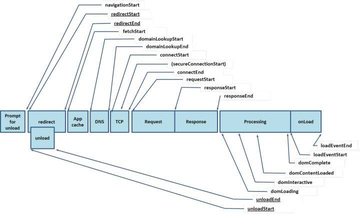

# 页面过程

## 参考

- https://mp.weixin.qq.com/s/LIfvU8j0gBVIFF8AYYtfFg
- http://www.dailichun.com/2018/03/12/whenyouenteraurl.html
- https://juejin.im/post/5b0b7d74518825158e173a0c
- [三次握手](https://mp.weixin.qq.com/s/yH3PzGEFopbpA-jw4MythQ)
- [chromium 渲染过程](https://mp.weixin.qq.com/s/87OYpou4ynpvYlcExEO40w)
- [浏览器缓存全面处理](https://zhuanlan.zhihu.com/p/28113197)
- [chrome 工作原理](https://mp.weixin.qq.com/s/X4yAFZBNLwaDUFYaR0Cn5g)
- [深入理解浏览器的缓存机制](https://www.jianshu.com/p/54cc04190252)
- [cssom](https://imweb.io/topic/56841c864c44bcc56092e3fa)
- [http 相关知识谱](https://juejin.im/post/6857287743966281736?utm_source=gold_browser_extensions)

## 目录

<details>
<summary>展开更多</summary>

* [`基本原则`](#基本原则)
* [`优化策略`](#优化策略)
* [`全过程简述`](#过程简述)
* [`全过程详述`](#过程详述)
* [`请求响应`](#请求响应)
* [`树`](#树)
* [`dns`](#dns)
* [`缓存分类`](#缓存分类)
* [`资源优先级`](#资源优先级)
* [`重定向`](#重定向)
* [`缓存使用流程图`](#缓存机制)
* [`缓存场景`](#缓存场景)
* [`用户场景`](#用户场景)
* [`握手/挥手`](#握手/挥手)
* [`GET vs POST`](#GETvsPOST)
* [`defer vs async`](#deferVSasync)

</details>

## 基本原则

> 任何界面系统，不论采用什么布局器，dom、css 最终都是要算出一个盒子的
>
> 确定（x、y、width、height）值，这样才能驱动图形系统去绘图，
>
> 如果并行不影响这个原则，就可以并行，
>
> 如果有不可预估的影响，就不能并行

### js/css对dom解析渲染的影响

> GUI 渲染线程与 JavaScript 引擎为互斥

| 行为 | 结果 | 原因 |
| :- | :- | :- |
| js 加载/执行 | **阻塞** DOM 树的解析和渲染 | js 会涉及 dom 和 css 的操作 |
|   | **阻塞** js 对 DOM 树的 css 操作 | js 会涉及样式操作，但 css animation 不受影响 |
| css 加载/执行 | **不会阻塞** DOM 树的解析 | 见 webkit 渲染过程中的 [cssom](#CSSOM) |
|   | **不会阻塞** DOM 树解析，但**会阻塞** DOM 树渲染，如果外链 css 之前没有节点，则显示白屏 | 浏览器自身优化机制 |
|   | **阻塞** js 执行 | 渲染使用 GUI 进程，js 执行使用 v8，两者互斥 |

---

## 优化策略

> 确保 CRP（关键渲染路径）尽快完成

- 关键资源的数量：影响首屏渲染的资源数
- 关键路径长度：获取所有关键资源的往返次数和耗时
- 关键字节：关键资源的大小总和

### 优化 dom

- 文件精简
- 利用缓存

### 优化 cssom

- 懒加载非关键（不影响首屏）的 css 元素

### 优化 js

> 浏览器遇到 `<script>` 会阻止解析器执行，直到 CSSOM 构建完成，js 才会执行，并继续完成 DOM 构建

- async/defer
- 当 js 不修改 dom 或 cssom 时，推荐 `async`
- preload/prefetch
- dns-prefetch

---

## 过程简述

> url 规范：scheme://host.domain:port/path/filename
>
> [浏览器工作原理](http://taligarsiel.com/Projects/howbrowserswork1.htm)


1. 输入 URL，卸载当前页的事件、内存等内容（如果不是新开tab话）
2. 检查缓存（正常请求 200、强缓存 200、协商缓存 304）
3. DNS 解析
   - 浏览器缓存
   - 本机缓存
   - hosts
   - 路由缓存
   - ISP（互联网服务提供商）缓存
   - 递归（见下图）
4. TCP3 次握手
5. 构建请求（`GET /index.html HTTP 1.1`）
6. 解析 url，设置请求报文（头、体）
7. 服务器返回 html，响应报文，4 次挥手
8. 浏览器渲染
   - HTML parser -> DOM Tree
   - CSS parser -> CSS Tree
   - DOM + style -> render Tree
9. 布局
10. 绘制

---

## 过程详述

### 1.地址栏输入URL

检查 HSTS（ HTTP Strict Transport Security ） 预加载列表

* 作用是强制客户端（如浏览器）使用 HTTPS 与服务器创建连接
* chrome://net-internals/#hsts
* 307

### 2.查看缓存

- 如果请求资源在缓存中并且新鲜，跳转到 15.转码步骤
- 如果资源未缓存或服务端已更新，发起新请求（请求数据：200）
- 如果已缓存，检验是否足够新鲜，足够新鲜直接提供给客户端（强缓存：200）
- 检验新鲜通常有两个 HTTP 头进行控制 Expires 和 Cache-Control：
  * HTTP1.0 提供 Expires，值为一个绝对时间表示缓存新鲜日期
  * HTTP1.1 增加了`Cache-Control: max-age=,`值为以秒为单位的最大新鲜时间
  * Cache-Control 还支持`stale-while-revalidate`，表示超出新鲜时间后仍能使用缓存的期间，同时会在后台请求新资源
- 如果通过 Expires || Cache-Control，判断已过期，则与服务器进行验证
  * 通过服务端 Last-Modified && Etag 判断服务端是否更新，没更新也走缓存（协商缓存：304）
  * 缓存存放
    * from memory cache（内存）
    * from disc cache（磁盘）
    * from prefech cache（不可缓存时，存在http cache，否则存在memory cache）
  * **有 Etag 才表示存磁盘**

### 3.解析URL获取协议、host、端口、path

### 4.组装一个HTTP（GET）请求报文

### 5.DNS(domain name system)解析


- 如果不是 ip 地址，需要获取主机 ip 地址，ip 地址找 mac 地址
- 如果是 ip 地址，会跳过dns解析
- mac地址，即为物理地址


检查过程如下：

**获取主机 ip 地址**

- 浏览器缓存
  * 缓存时长 `一分钟` 左右，过长会导致 IP 变更不及时
- 系统缓存
- hosts 文件
- 路由器缓存
- ISP DNS 缓存（互联网服务提供商）
- 中心机房 DNS 递归查询（可能存在负载均衡导致每次 IP 不一样）
- 优化点
  * DNS Prefetch（减少 DNS 解析次数或提示浏览器做预解析）
  * chrome://net-internals/#dns

**ip地址找mac地址**

- ARP（地址解析协议）缓存
- 是一种用以解释地址的协议，根据通信方的 IP 地址就可以查出对应方的 MAC 地址
- 先在 AR 缓存中查看，若不存在，才发送 ARP 请求查询

### 6.打开一个socket与目标IP地址，端口建立TCP链接

`三次握手` 如下：

- 客户端发送一个 TCP 的 SYN=1，Seq=X 的包到服务器端口
- 服务器发回 SYN=1，ACK=X+1，Seq=Y 的响应包
- 客户端发送 ACK=Y+1，Seq=X+1

### 7.TCP链接建立后发送HTTP请求

发送请求行、请求头，只发送一次

### 8.服务器接受请求并解析

将请求转发到服务程序，如虚拟主机使用 HTTP Host 头部判断请求的服务程序

### 9.服务器检查 HTTP 请求头是否包含缓存验证信息

如果验证缓存新鲜，返回 304 等对应状态码

### 10.处理程序读取完整请求并准备 HTTP 响应

可能需要查询数据库等操作

### 11.服务器将响应报文通过 TCP 连接发送回浏览器

### 12.浏览器接收 HTTP 响应

根据情况(keep-alive)选择关闭 TCP 连接或者保留重用

`四次挥手` 如下：

- 主动方发送 Fin=1， Ack=Z， Seq= X 报文
- 被动方发送 ACK=X+1， Seq=Z 报文
- 被动方发送 Fin=1， ACK=X， Seq=Y 报文
- 主动方发送 ACK=Y， Seq=X 报文

### 13.浏览器检查响应状态码

比如 1XX，3XX， 4XX， 5XX，这些情况处理与 2XX 不同，
拿 3XX 举例，有个重定向计数器，超过次数也会报错

### 14.如果资源可缓存，进行缓存

### 15.响应解码

例如 gzip 压缩

### 16.根据资源类型决定如何处理

根据`content-type`判断，如果资源为 HTML 文档，该怎么怎么处理

### 17.关键渲染路径

构建 DOM -> 构建 CSSOM -> 布局 -> 绘制 -> 合成 -> 光栅化 -> 显示


**构建 DOM 树**

- bytes
- characters
- Tokenizing：根据 HTML 规范将字符流解析为标记(类似 vue 模板生成方式)
  * StartTag
  * EndTag
  * 边生成 Token 边消耗 Token 来生成节点对象
  * 
- Lexing：词法分析将标记转换为对象并定义属性和规则
- DOM construction：根据 HTML 标记关系将对象组成 DOM 树
- 解析过程中遇到图片、样式表、js 文件，启动下载

**构建CSSOM树**

- Tokenizing：字符流转换为标记流
- Node：根据标记创建节点
- CSSOM：节点创建 CSSOM 树
- 与生成 dom 不同，需要等到 cssdom 构建完成才会进入下一阶段（样式层叠）
- 自动重排（定位各元素在页面的确切位置和尺寸）
- 

**构建布局树**

- 从 DOM 树的根节点遍历所有可见节点，不可见节点包括：
  + script,meta 这样本身不可见的标签。
  + 被 css 隐藏的节点，如 display: none
- 对每一个可见节点，找到恰当的 CSSOM 规则并应用
- 发布可视节点的内容和计算样式

**构建分层树**

- 对布局树进行分层

**绘制列表**

- 为每个图层生成绘制列表，提交到合成线程

**转位图**

- 合成线程将图层分成图块，在光栅化线程池中将图块转为位图

**页面绘制到内存**

- 浏览器进程接收合成线程发来的DrawQuad命令，将页面绘制到内存

**显示**

读取内存，将页面显示在屏幕上

**其他**

- Paint Setup、Paint
- js 解析
  - 浏览器创建 Document 对象并解析 HTML，将解析到的元素和文本节点添加到文档中，此时 document.readystate 为 loading
  - HTML 解析器遇到没有 async 和 defer 的 script 时，将他们添加到文档中，然后执行行内或外部脚本。这些脚本会同步执行，
    并且在脚本下载和执行时解析器会暂停。这样就可以用 document.write()把文本插入到输入流中。同步脚本经常简单定义函数
    和注册事件处理程序，他们可以遍历和操作 script 和他们之前的文档内容
  - 当解析器遇到设置了 async 属性的 script 时，开始下载脚本并继续解析文档。脚本会在它下载完成后尽快执行，
    但是解析器不会停下来等它下载。异步脚本禁止使用 document.write()，它们可以访问自己 script 和之前的文档元素
  - 当文档完成解析，document.readState 变成 interactive
    -所有 defer 脚本会按照在文档出现的顺序执行，延迟脚本能访问完整文档树，禁止使用 document.write()
  - 浏览器在 Document 对象上触发 DOMContentLoaded 事件
  - 此时文档完全解析完成，浏览器可能还在等待如图片等内容加载，等这些内容完成载入并且所有异步脚本完成载入和执行，
    document.readState 变为 complete,window 触发 load 事件

### 18. 显示页面

HTML 解析过程中会逐步卸载上一个页面内容（如果存在），显示当前页面

---

## 请求响应

### http

**请求报文**

- 请求行
  * 请求方法
  * 请求地址
  * http 版本号
  * 例：POST /chapter17/user.html HTTP/1.1
- 请求头(request header)
  * host
  * connection
  * user-agent
- 空行（必须有）
- 请求体(request body)


**响应报文**


### tcp

**请求报文**


### 两者区别
tcp请求报文缺少
- 请求方式
- http版本信息
- 部分http头（charset、user-agent、connection、encoding、language、host）

---

## 树

### DOM

* html 解析生成
* bytes -> characters -> Token -> DOM
* 深度优先
* 会等待 script 标签解析
* 由渲染引擎解析（blink、webkit、Gecko），暴露操作 dom 的 api 给 v8
* 包含节点信息（层次、属性、文本）

### CSSOM


* 类似 DOM，只是针对 css 解析生成
* 字节数据 -> 字符流 -> Token -> Node -> CSSOM
* 由渲染引擎解析
* 解析会暂停 js 执行，阻止页面渲染
* 生成的是 css 规则树，对 dom tree 进行填充
* 样式的继承特性，会从外层到内层，计算样式

#### css-ast

1. 正则匹配 selectors（id、class、tag、伪类、attr）
2. 解析出 declarations

```
-- ruleSet
      |
      -- selectors
        |
        -- p/#id/.class/[attr]
      |
      -- declaration
        |
        -- margin 3px
```

### render tree

* 只包含部分有必要渲染的节点
* `DOM tree` + `CSSOM tree` = `render tree`
* 

---

## dns

> DNS 域名系统，是应用层协议，运行 `UDP` 协议之上，使用端口 **53**

### 结构

#### 域名结构

> 又叫命名空间，是一个树状结构，有树就得有根，这个根是一个点'.'
>
> 比如 www.example.com，完整域名是形式是 www.example.com.
>
> 最后的.root（根域），浏览器/系统解析器会自动补全
>
> 可以用 `dig` 命令看当前的根域列表(13 台)


#### 树形结构


### 流程简述

> . => com. => .example.com. => www.example.com. => IP adress

- 根名称服务器(.)（[为什么只有 13 台根 root](https://www.zhihu.com/question/22587247/answer/66417484)）
- 顶级名称服务器(.com)
  + 域名由两组或两组以上的 ASCII 或各国语言字符构成，各组字符间由点号分隔开，
    最右边的字符组称为一级域名
- 二级名称服务器(.baidu.com)
- 权威名称服务器(www.baidu.com)

注: **www 是主机名，不算三级域名**

### 根服务器

[如果美国断开对中国的根服务器会怎么样？](https://www.zhihu.com/question/21423228/answer/1411986340?from=timeline&utm_content=pu&utm_medium=social&utm_oi=39806616731648&utm_source=wechat_session&s_r=0)，这篇很有意思

**为什么只有 13 台根 root？**

- DNS 报文被要求控制在 `512字节` 之内
- 每个根 root 都要在报文占一定字节，剩余字节要留给包装 DNS 报头和其他协议参数
- 13 台是比较合适的数量

**真的只有 13 台？**

不是，13 台只是个概念，背后有多台真正的物理服务器在工作（截止 2020 年 8 月 12 日，共 1097 台）

### 查询协议

> udp，因为 udp 连接最少可以只有两个包，而 tcp 至少 9 个包（三次握手，一次查询包，一次响应包，四次挥手）

### 查询方式

> 分两种：
>
> 1. 递归查询（发送一次请求即可）
> 2. 迭代查询（需要发送多次请求）
>
> 本地 dns 查询是递归查询

#### DNS 递归查找

> 默认使用此方式查找
>
> 1. 客户端只发一次请求，之后由服务器自行找寻结果（域名服务器向下一级域名服务器请求，递归执行），最终返回结果
> 2. 查找过程中，客户端一直处于等待状态


```
客户端 -> 本地dns服务器查缓存 -> 根域名服务器查缓存 -> 一级域名服务器查缓存 -> 二级域名服务器查缓存

客户端 <- 本地dns服务器 <- 根域名服务器 <- 一级域名服务器 <- 二级域名服务器查询到结果
```

#### DNS 迭代查找

> 也叫【反复查找】
>
> 客户端发送请求，服务器有两种返回结果：
>
> 1. 找寻到的 ip
> 2. 其他能提供查询的服务器列表
>
> 客户端再次对服务器列表发送请求，直至找到 ip


```
客户端 -> 本地dns服务器查缓存 -> 根域名查缓存

                               <- 没查到，返回一级域名服务器地址

                               -> 一级域名查缓存

                               <- 没查到，返回二级域名服务器地址

                               -> 二级域名查缓存

客户端 <-     本地dns服务器      <- 查到缓存，查询结果返回
```

#### 通用做法

递归查找 + 迭代查找

- 下级域名采用 `递归查找`
- 根域名服务器或流量较大的域名服务器，一般都 `禁止` 递归查找，毕竟会导致服务器（等待）过载

### 术语

**TTL**

> Time To Live
> 表示 DNS 记录在 DNS 服务器上缓存时间

### 移动端 dns 解析

统计的耗时


**移动端默认使用运营商的 `localDNS` 解析服务，会存在以下问题**

- dns 调度不准确（比如联调自己没有 dns 服务器，去调电信的）
- dns 缓存不准确（ip 缓存更新不及时、不确定）
- dns 劫持
- 耗时严重
- 运营商可能会修改 TTL，导致 dns 延时生效

`httpDNS` 是 `localDNS` 的改进版，目前**阿里云**等服务商提供收费服务

---

## 缓存分类

- 强缓存：expires、cach-control
- 协商缓存：last-modified、etag

### 强缓存

**Expires**

* HTTP/1.0
* 不会请求 server
* Expires=max-age + 请求时间
* 和 Cache-Control 结合使用
* 本机时间修改会影响 expires

> 注：由于强缓存不会与服务端交互，无法感知资源文件的变更，所以就需要静态资源加 hash 后缀

**Cach-control**

* HTTP/1.1
* [参考](../http/README.md#http1.1)

```js
res.setHeader('Cache-Control', 'public, max-age=xxx');
```

### 协商缓存

**Last-Modified**

* 和 `If-Modified-Since` 结合使用
* 会请求 server
* 如果没有变化，服务器返回 304 和空的响应体
* 如果有变化，返回 200 和新资源
* 仅精确到 `秒`，多服务器之间生成的 last-modified 也会有误差

**If-Modified-Since**

> 例：If-Modified-Since: Wed, 21 Oct 2015 07:28:00 GMT

**Etag**

* 资源文件唯一标识
* 会将上次的 Etag 放在 If-None-Match
* 如果 ETag 一致，返回 304
* 精确度高，文件变更即不同

**etag 计算方式**

nginx

- 文件最后修改时间 16 进制-文件长度 16 进制，例 59e72c84-2404

express

- 文件大小 + 修改时间
- 文件内容 hash + 内容长度

**Etag 和 Last-Modified**

* 精确度上，`Last-Modified` 仅精确到 `秒`，多服务器之间生成的 last-modified 也会有误差
  精确度高，文件变更即产生不同 Etag
* 性能上，`Last-Modified` 仅需生成时间，所以较高，`Etag` 是服务端算出的 hash
* 优先级上，express 使用 [fresh](https://github.com/jshttp/fresh) 判断，
  优先判断 `Etag`，后判断 `last-modified`
* etag 适合体积小的资源，express 适合不重要但体积大的资源

```js
res.setHeader('Cache-Control', 'public, max-age=0');
res.setHeader('Last-Modified', xxx);
res.setHeader('ETag', xxx);
```

### 兜底缓存

> 当 `Cach-Control` 值为 `private` 时，走浏览器自己的缓存策略，
>
> 一般取响应头中的 `Date` 减去 `Last-Modified` 值的 10% 作为兜底缓存时间

---

## 资源优先级

[资源优先级](./资源优先级.png)

---

## 重定向

### 301
> 永久重定向

- 请求可缓存（from cache）
- nginx + rewrite + permenent
- 搜索引擎在抓取新的内容的同时也将旧的网址替换为了重定向之后的网址

### 302
> 临时重定向

- nginx + rewrite
- 搜索引擎会抓取新的内容而保留旧的地址

---

## 缓存机制


### 缓存字段


### 缓存位置

* Service Worker
* Memory Cache
* Disk Cache
* Push Cache

#### Service Worker

* 必须是 https（涉及请求）
* 可自定义缓存文件
* 未命中本地缓存文件，则判断从 Memory Cach 或网络请求中获取数据
* 缓存可控性最高
* 数据即使是从网络读取的，显示出来也是从 Service Worker 读取

#### Memory Cache

* 高效，量少
* 基于 tab，关闭即释放
* 不判断 HTTP 缓存头
* 缓存小文件或内存使用率低时，优先 Memory Cach
* 比较重要一块就是<link rel="prefetch" />

#### Disk Cache

* 低效，量大
* 判断 HTTP 缓存头
* 缓存大文件（比如大的 js、css）或系统内存使用率高时，优先 Disk Cache

**浏览器缓存命中内存&磁盘的标准**

- 内存使用率高时，优先磁盘
- 大文件优先磁盘

#### Push Cache

* HTTP/2.0
* 缓存时间短，chrome 上只有 5 分钟
* 优先级较以上三者，最低
* 所有的资源都能被推送，并且能够被缓存, 但是 Edge 和 Safari 浏览器支持相对比较差
* 可以推送 no-cache 和 no-store 的资源
* 一旦连接被关闭，Push Cache 就被释放
* 多个页面可以使用同一个 HTTP/2 的连接，也就可以使用同一个 Push Cache。这主要还是依赖浏览器的实现而定，出于对性能的考虑，有的浏览器会对相同域名但不同的 tab 标签使用同一个 HTTP 连接
* Push Cache 中的缓存只能被使用一次
* 浏览器可以拒绝接受已经存在的资源推送
* 你可以给其他域名推送资源

### cach-control


### 网络请求阶段



### 浏览器缓存


### webkit 渲染过程


### gecko 渲染过程


---

## 握手/挥手

### 三次握手


#### 握手目的

为了防止已失效的连接请求报文段突然又传送到了服务端，因而产生错误

#### 概念

- syns queue（半连接队列）
- accept queue（全连接队列）
- tcp_abort_on_overflow （tcp 全连接队列溢出数）0/1
  - 0：第三次全连接队列满了那么 server 扔掉 client 发过来的 ack
  - 1：第三次全连接队列满了那么 server 发送 reset 包给 client

#### 过程

1. client 发送 syn 到 server 发起握手

- 此时连接信息会放到半连接队列，回复 syn+ack
- 案例-syn floods 攻击：只建立 syn 连接，收到 syn+ack 后故意扔掉，导致半连接队列满，其他请求进不来

2. server 收到 syn 后回复 syn+ack 给 client
3. client 收到 syn+ack 后，回复 server 一个 ack 表示收到了 server 的 syn+ack

- 如果全连接队列没满，那么从半连接队列拿出这个连接的信息放入到全连接队列中
- 如果全连接队列满了，如果 tcp_abort_on_overflow=0，server 过段时间会重发 syn+ack 给 client，
  相当于重做第二步，如果 client 超时时间比较短，那就会异常

### 四次挥手


#### 过程

- TCP 客户端发送一个 FIN，用来关闭客户到服务器的数据传送（报文段 4）。
- 服务器收到这个 FIN，它发回一个 ACK，确认序号为收到的序号加 1（报文段 5）。和 SYN 一样，一个 FIN 将占用一个序号。
- 服务器关闭客户端的连接，发送一个 FIN 给客户端（报文段 6）。
- 客户段发回 ACK 报文确认，并将确认序号设置为收到序号加 1（报文段 7）。

### Performance API


### chromium 渲染过程


### 字节处理

#### html

> Bytes（字节）=> Characters（字符）=> Token（标记）=> Node（）=> DOM（）

---

## 缓存场景

**频繁变动的资源**

Cache-Control: no-cache

* no-cache 转为协商缓存判断

**不常变化的资源**

Cache-Control: max-age=31536000

* 强制命中强缓存

---

## 用户场景

|   | Expires/Cach-Control | Last-Modified/Etag |
| - | :-: | :-: |
| 地址栏回车 | √ | √ |
| 页面链接跳转 | √ | √ |
| 新开窗口 | √ | √ |
| 前进后退 | √ | √ |
| F5 | ✘ | √ |
| Ctrl+F5 | ✘ | ✘ |

---

## GETvsPOST

| 对比项 | GET | POST |
| - | :- | :- |
| 后退/刷新 | 无关 | 数据被重新提交 |
| 能否收藏为书签 | √ | x |
| 能否缓存 | √ | x |
| 编码类型 | x-www-form-urlencoded | 1. x-www-form-urlencoded<br />2. multipart<br />3. form-data<br />4. json |
| 参数是否保存到浏览器历史 | √ | x |
| 参数携带方式 | 请求行 + 请求头 + 空行 | 请求行 + 请求头 + 空行 + 请求体 |
| 响应数据格式 | 响应行 + 响应头 + 响应体 | 响应行 + 响应头 + 响应体 |
| 数据类型限制 | ASCII | 无限制 |
| 请求参数长度 | 无限制 | 无限制 |

### GET

1. 浏览器请求 tcp 连接（第一次握手）
2. 服务器答应进行 tcp 连接（第二次握手）
3. 浏览器确认，并发送 get 请求头和数据（第三次握手）
4. 服务器返回 200 ok 响应

### POST

1. 浏览器请求 tcp 连接（第一次握手）
2. 服务器答应进行 tcp 连接（第二次握手）
3. 浏览器确认，并发送 post 请求头（method、uri 等）（第三次握手，这个报文比较小，
   所以 http 会在此时进行第一次数据发送）
4. 服务器返回 100-continue 响应（非必要）
   - 出现该步骤需满足条件之一：
     1. 请求体数据超过 **1k**
     2. 请求头携带了 `Expect: 100 continue`
5. 浏览器开始发送数据（body）
6. 服务器返回 200 ok 响应

**POST 不支持管道化传输**

把需要发送到服务器上的所有请求放到输出队列中，在第一个请求
发送出去后，不等到收到服务器的应答，第二个请求紧接着就发送出去

### 长度限制

> HTTP 协议下的 GET 和 POST 的请求参数**没有**长度限制，但是**浏览器**对请求参数有长度限制，
>
> 超出长度会报 **414** 错误

**IE 和 Safari**

限制 2k

**Opera**

限制 4k

**Firefox**

限制 8k（非常老的版本 256byte）

**chrome**

限制 8k

---

## deferVSasync


### <script defer>

- 优先级转 low
- 异步加载，延迟（html 标签解析完成之后）执行
- 加载不阻塞 html-parse，执行会阻塞
- 有序加载
- **DOMContentLoaded** 之前执行（也就是说会阻塞DomContentLoaded）

### <script async>

- 优先级转 low
- 异步加载，加载完执行
- 加载不阻塞 html-parse，执行会阻塞
- 无序加载
- 可能在 DOMContentLoaded 之前或之后执行，但一定在 onload 之前

**注：同时使用 async 和 defer 是一种 badcase ，因为 async 的优先级要比 defer 更高一点**

